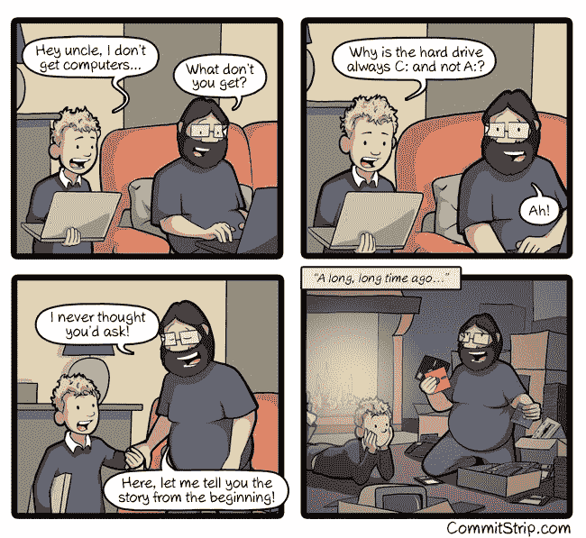
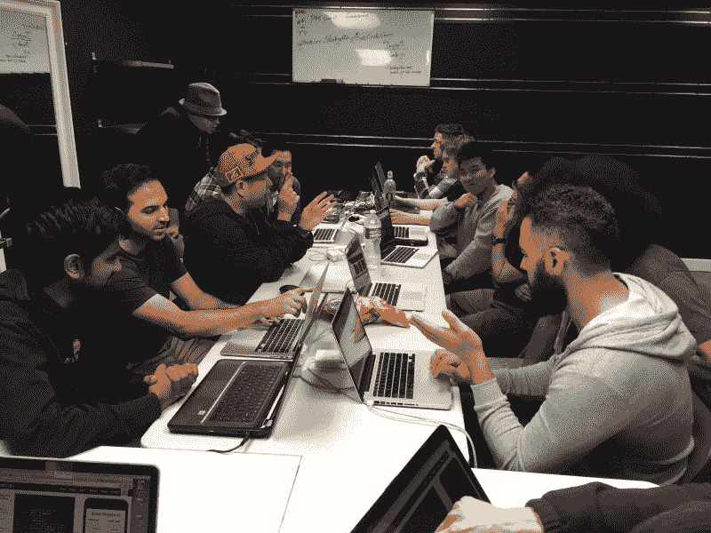

# 从诺克斯维尔的攀岩馆到旧金山的网络安全公司

> 原文：<https://www.freecodecamp.org/news/from-a-rock-climbing-gym-in-knoxville-to-a-cybersecurity-firm-in-san-francisco-aa5a9d4983a0/>

### 这里有三个值得你花时间的链接:

1.  肖恩是如何通过 12 个月的密集自学( [8 分钟阅读](https://fcc.im/2p32CxF))从在诺克斯维尔攀岩馆工作到在旧金山网络安全初创公司担任软件工程师的
2.  这里有 438 门免费的在线编程和计算机科学课程，你可以在五月份开始学习
3.  如何防止您的分析数据被广告拦截器拦截( [6 分钟阅读](https://fcc.im/2pQ3AlK))

额外收获:从今天开始，所有 freeCodeCamp 的 t 恤和帽衫现在都是成本价销售(零利润率)。我们这样做是为了让你得到一些很酷的线程，尽可能便宜地代表我们的开源社区( [1 分钟浏览](https://fcc.im/2pVjYRS))

### 想到这一天:

> "计算机擅长执行指令，但不擅长读你的思想."—唐纳德·克努特

### 今日趣事:

网络漫画作者 [CommitStrip](https://fcc.im/2qvmA67)

### 今日学习小组:

[橘郡自由营](https://fcc.im/2qpoFU8)

编码快乐！

–昆西·拉森，自由代码营的老师

如果你从这些邮件中获得了价值，请考虑[支持我们的非营利组织](http://bit.ly/donate-to-fcc)。