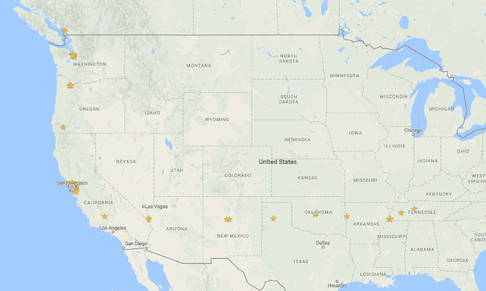
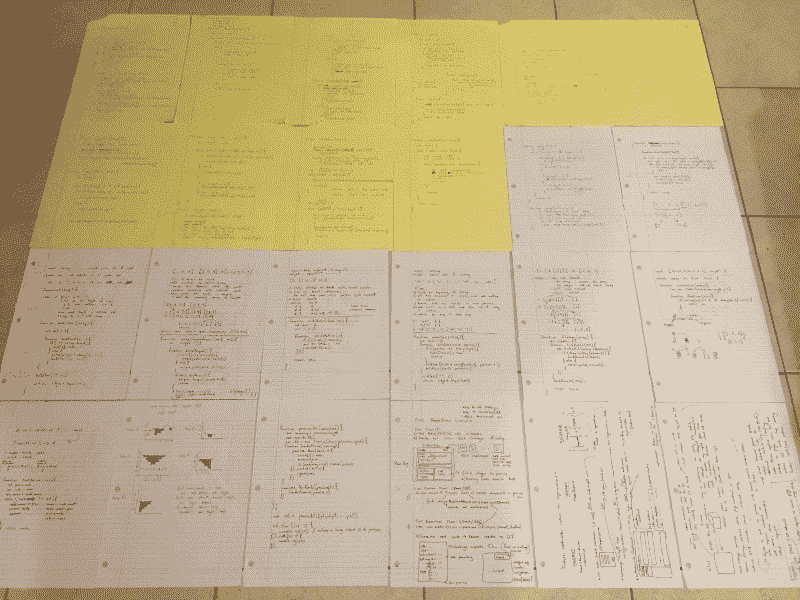
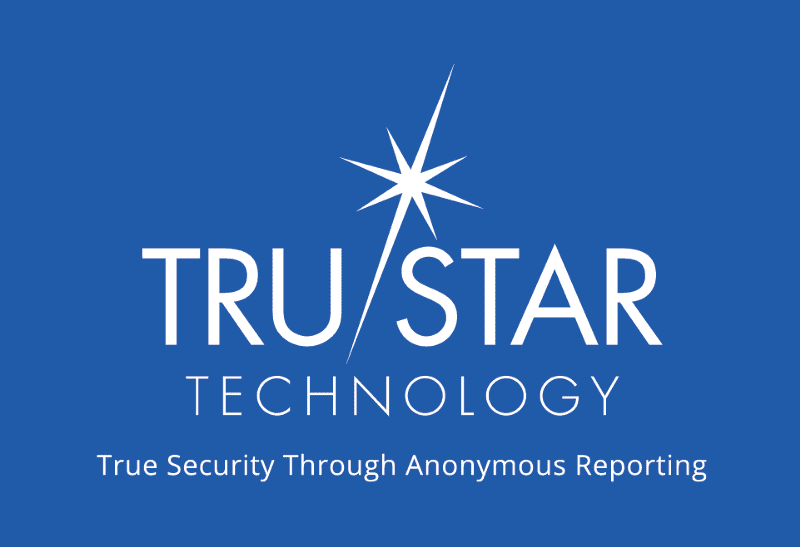

# 我如何在 12 个月内从零到旧金山软件工程师

> 原文：<https://www.freecodecamp.org/news/how-i-learned-to-code-and-earned-a-job-in-silicon-valley-changing-my-life-along-the-way-a3af854855fa/>

作者:肖恩·史密斯

# 我如何在 12 个月内从零到旧金山软件工程师

A photo I took of San Francisco, my new home.

一年前，我在田纳西州的一家攀岩馆兼职做路线设定员。如今，我是旧金山一家网络安全初创公司的软件工程师。

到目前为止，我的旅程令人难忘，也改变了我的生活。然而，尽管一切都充满挑战，我认为任何有足够动力的人都可以做同样的事情。

知识已经变得大众化。要在你的领域达到有竞争力的水平，你需要的只是时间和奉献。对于软件工程领域来说尤其如此。

### 2016 年，我的生活分崩离析

当我在 2016 年开始学习编码时，我猜你可以说我的生活正在崩溃。

我上大学时是医学预科生，获得了生物化学和人类学学位。但我很快对科学和医学不再抱有幻想，离开大学时没有明确的道路。

我开始在攀岩馆做了将近两年的排班员，但是事情并不顺利。我知道我需要一个大的改变。

我已经推迟学习编码很长时间了，但我知道这是我想做的。终于，在 2016 年我生日的时候，我致力于学习编码。我没有回头。

此时，我对过去几年中变得无处不在的编码训练营有点熟悉。幸运的是，我很快发现了 [freeCodeCamp](https://www.freecodecamp.com/) 。当我意识到完成他们的课程需要为非营利组织编写软件时，我立即加入并决定在考虑训练营之前完成 freeCodeCamp 的开源课程。

freeCodeCamp 迅速成为我教育的核心。我补充了许多其他资源，比如播客、教程、开放式课件、适量的文档以及需要时的堆栈溢出。

典型的日子包括我通过 freeCodeCamp 挑战和项目工作，这让我逐步提高我的技能。

当坐着写代码变得没有效率时，我会通过其他渠道吸收材料:音频、视频等等。我在不同的学习方法之间来回切换，这对于保持高度的参与和专注非常有用。这基本上是我的过程，它让我可以花很多时间学习。

这里是通过数字(粗略估计):

*   总学习时间:少于 12 个月
*   总时数:约 2500 小时
*   完成的项目总数:70+个
*   观看的计算机科学课程总数:~10
*   GitHub 提交总数:1，500 以上
*   编写的 JavaScript 代码总行数:20，000 多行

这种学习大部分发生在田纳西州的诺克斯维尔，我当时就住在那里。我非常渴望搬到一个主要的科技城市，所以有一天我醒来，很自然地决定是时候开车去旧金山了。事情大概就是这样发生的。

那天晚上我离开了，大约 3 个星期后我到达了湾区。在路上有足够的时间听播客。

Somewhere in midwest USA.

### 抵达旧金山，开始我第一次真正的求职

在到达旧金山并完成了 freeCodeCamp 的核心课程(前端、数据可视化和后端认证)后，我简单地看了一下工作申请。大概 65 左右。完全没有反应。

记得吗，我刚刚从全国各地开车来到海湾地区。我不知道竞争会有多激烈，也不知道我的技能对当前水平的雇主有多大价值。freeCodeCamp 真的符合现场编码训练营的教育吗？

这些试探性的应用让我清楚地认识到:我必须做得更多。市场竞争非常激烈。因此，我迅速修改了我的计划，延长了我的时间范围，并联系 freeCodeCamp 开始了一个非营利项目，因为我现在有资格开始一个项目。

与此同时，我开始尽可能多地在这座城市建立关系网。网络很容易建立，因为 freeCodeCamp 在世界各地的城市都有很多自己组织的露营地。

我从 freeCodeCamp 的团队那里得到了关于[非营利项目](https://medium.freecodecamp.com/how-i-made-my-first-million-dollars-in-pro-bono-code-86f911040484)的快速回复。我的一些 React 项目引起了[昆西·拉森](https://www.freecodecamp.org/news/how-i-learned-to-code-and-earned-a-job-in-silicon-valley-changing-my-life-along-the-way-a3af854855fa/undefined)的注意，他问我是否有兴趣帮助编写他们的 React 课程。(freeCodeCamp 本身是非盈利组织。)我还帮助为针对女性犯罪的[会议](http://www.conferencecaw.org/)开发了一个会议管理工具。

我很高兴有机会回馈这个了不起的社区，所以我很快接受了挑战。我的 React 和 Redux 挑战将被整合到他们新扩展的课程中，[现在是 beta 版，在这里直播](http://beta.freecodecamp.com/en/)。

另外，我选择把时间线提前到 2017 年。在再次申请工作之前，我会在 2016 年剩下的时间里继续自学。我离开旧金山，驱车向北穿过波特兰和西雅图，来到华盛顿州的贝灵汉。

正是在太平洋西北部的这几周，我马不停蹄地完成了 React 和 Redux 挑战。我与另一位来自纽约的 freeCodeCamp 贡献者 [Peter Weinberg](https://github.com/no-stack-dub-sack) 合作，总共建立了大约 80 个编码挑战。

这可能是让我的简历与众不同的关键举措之一，因为它代表了一个服务于现实世界组织需求的重大项目。

12 月下旬，我们完成了挑战的初稿，并将它们转移到官方 alpha 版本中，该版本仍在从社区中收集反馈。

### 我胜利返回旧金山

Going to California.

回到旧金山，我几乎准备好再次投入工作申请。我已经决定加入软件工程师面试准备速成班。我一直非常反对花钱参加编码训练营(部分原因是我没有钱)，但我选择加入 Outco，因为在我看来，他们正试图为不同的目的服务。Outco 专门针对软件工程师的面试过程，这一过程会给许多人，甚至是经验丰富和熟练的工程师带来摩擦。

尽管此时我可以很好地编写 JavaScript，但我绝对没有准备好在白板上解决任意的算法问题。这是 Outco 试图让学生做好准备的关键领域之一，因为不管是好是坏，白板仍然是科技公司最喜欢的面试策略。此外，我可以在找到工作后再向 Outco 付款。

事实是:几个月来，我一直以每周大约 50 多个小时的高节奏进行编码和学习，现在我几乎是在拿自己的能力冒险，想在美国最昂贵、竞争最激烈的城市之一找到一份工作。

我已经真心实意地向公司申请过了，结果惨败！在这一点上，压力和紧张向我袭来。

我知道成功在很大程度上取决于我接下来几个月的表现。我加入 Outco 是因为我期望他们结构化的项目和支持在我旅程的最后几英里中是不可或缺的，事实也确实如此。

Writing code on paper to prepare for interviews, classic.

2017 年到了，我开始 Outco。我开始比以前更加努力地工作。大量的算法和数据结构练习、白板问题、技术问题、结对编程、模拟电话屏幕、系统设计问题——你能想到的，还有很多。更不用说再次申请工作了，而且比我第一次申请的时候多了很多。

当然，一旦你开始得到公司的回复，马上开始应付所有这些面试就变得非常耗时(更不用说压力很大了)。

每天为面试练习已经够难的了。在真正的面试中，当他们问你关于二叉树的问题时，站在白板前要困难得多(是的，面试官问我关于二叉树的问题)。

同样，数字更能说明问题:

*   申请总数:192 份(包括 2016 年的 65 份)
*   电话采访总数:17
*   总带回家的代码挑战:6
*   技术屏幕总数:5
*   现场总数:3
*   总报价:1
*   提供服务的总时间:6 周
*   成功率:0.52%

其中一个邀请来自 TruSTAR Technology，我很高兴能加入他们的团队！TruSTAR 正在建立一个平台，允许公司共享网络情报数据，以防止和减轻网络攻击。

我在他们应用程序的前端工作，并运用我通过 freeCodeCamp 获得的 JavaScript 技能。到目前为止，这种体验是不可思议的，老实说，我对自己已经准备好开始为他们的代码库做出有意义的贡献感到惊讶。

### 过去 12 个月我学到的经验教训

现在，最后，我想给那些想做类似事情的人一些建议:

*   你需要现实世界的技能，你必须学习很多东西。这意味着很多小时的工作，这是无可避免的。激情有帮助。
*   构建项目是一种很好的学习方式，一旦你了解足够多，找到开源项目或其他高影响力项目并不困难。
*   JavaScript 和 React 非常好学，需求量很大！但是学习你感兴趣的东西。
*   培养一个由学习编程或从事工程师工作的人组成的社区是至关重要的。你所在城市的网络。网络在线。寻找合作项目。求助。
*   如果你能负担得起，试着有点耐心。这是我最纠结的。

现在你知道了——这段旅程让我穿越美国，开始了软件工程师的职业生涯！我相信每个人的道路看起来都不一样，这是乐趣的一部分。

找到自己的路，如果你对自己的观点足够坚定，不要害怕忽视别人的观点。这包括我的观点。

科技行业的机会是真实的，如果你非常想要，你可以找到一条出路。

作为一名工程师，你的工作将是解决问题，而如果你是自学的，你必须解决的第一个问题是你如何自学？

干杯大家，编码快乐！

P.S.“大声喊出来，感谢整个 freeCodeCamp 社区和我在这篇文章中提到的每一个人(还有其他几个人:Archie，Christian，Susan，Beemer Girl 和我所有在家的朋友)。在帮助我实现这个目标的过程中，你们都证明了自己的宝贵价值。