# 如何使用 Apache 的预测 IO 机器学习服务器构建推荐引擎

> 原文：<https://www.freecodecamp.org/news/building-an-recommendation-engine-with-apache-prediction-io-ml-server-aed0319e0d8/>

作者:瓦格万·奥贾

# 如何使用 Apache 的预测 IO 机器学习服务器构建推荐引擎

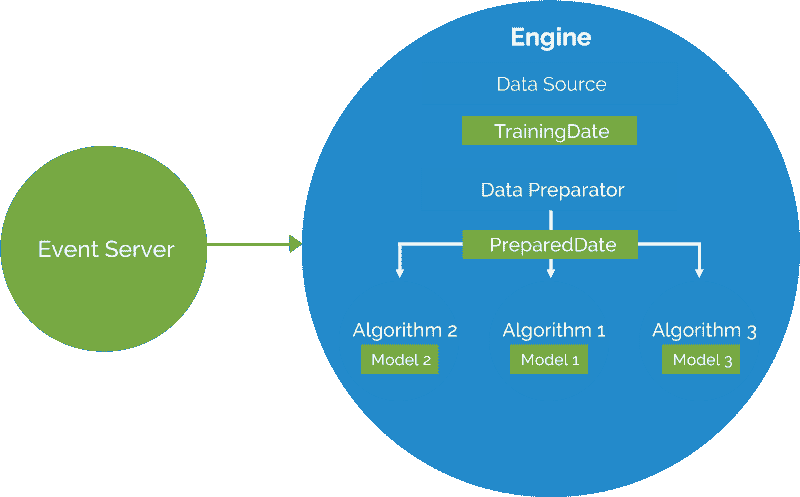

Image Source: [Prediction IO slideshare : slide 17](https://www.slideshare.net/predictionio/sf-scala-dase2015-44112226)

这篇文章将指导你安装 Apache 预测 IO 机器学习服务器。我们将使用它的一个名为“推荐”的模板来构建一个有效的推荐引擎。成品将能够根据给定用户的购买行为推荐定制产品。

### **问题**

你有一堆数据，你需要准确地预测一些东西，这样你就可以帮助你的企业增加销售、增加客户、增加利润、增加转化率，或者任何业务需要。

推荐系统可能是每个人应用数据科学和机器学习的第一步。推荐引擎使用数据作为输入，并在其上运行算法。然后，他们输出模型，我们可以从中预测用户真正打算购买什么，或者用户可能喜欢或不喜欢什么。

### **输入预测 IO**

> “Apache PredictionIO(孵化)是一个**开源机器学习服务器**，构建在最先进的开源堆栈之上，为开发人员和数据科学家创建任何机器学习任务的预测引擎。”— [阿帕奇预测 IO 文档](https://predictionio.incubator.apache.org/)

第一眼看到文档就让我感觉很好，因为它让我接触到了解决机器学习问题的强大技术栈。更有趣的是，预测 IO 提供了许多模板，有助于解决实际问题。

[模板库](https://predictionio.incubator.apache.org/gallery/template-gallery)包含许多用于推荐、分类、回归、自然语言处理等的模板。它利用 Apache Hadoop、Apache spark、ElasticSearch 和 Apache Hbase 等技术，使机器学习服务器可扩展且高效。我不打算谈论太多关于预测木卫一本身，因为你可以自己做这个[这里](https://predictionio.incubator.apache.org/start/)。

回到问题:我有一堆来自用户购买历史的数据，包括 user_id、product_id 和 purchased_date。利用这些，我需要给用户做一个定制的预测/推荐。考虑到这个问题，我们将使用带有预测 IO 机器学习服务器的推荐模板。我们将利用预测 IO 事件服务器以及批量数据导入。

所以让我们继续前进。**(注:本指南假设您使用 Ubuntu 系统进行安装)**

### 步骤 1:下载 Apache 预测 IO

转到当前用户的主目录，下载最新的 0.10.0 Prediction IO apache 孵化器。我假设你在下面的目录中

```
git clone git@github.com:apache/incubator-predictionio.git
```

现在转到目录` *incubator-predictionio`* ,在那里我们克隆了预测 IO repo。如果您已经在不同的目录中克隆了它，请确保在您的终端中位于该目录中。

现在让我们来看看预测 IO 的当前稳定版本 0.10.0

```
cd incubator-predictionio # or any dir where you have cloned pio.git checkout release/0.10.0
```

### 第二步:让我们做一个预测 IO 的分布

```
./make-distribution.sh
```

如果一切正常，您将在控制台中看到如下消息:

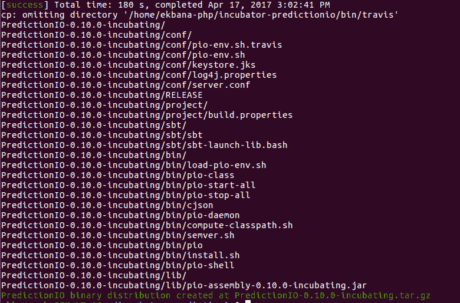

Successful distribution process of Prediction IO.

但是，如果您遇到类似这样的情况:

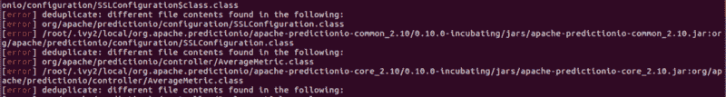

Error while creating Prediction IO distribution.

然后你必须删除主目录中的`*.ivy2*` *目录*，默认情况下这个文件夹是隐藏的。您需要完全删除它，然后再次运行`*./make-distribution.sh*`来成功地生成一个分发文件。

就我个人而言，我已经多次面对这个问题，但我不确定这是解决这个问题的有效方法。但是删除`*.ivy2*`文件夹并再次运行 make-distribution 命令是有效的。

### 步骤# 3:提取分发文件

在成功构建之后，在我们构建预测 IO 的目录中，我们将有一个名为 PredictionIO-0.10.0-incubating.tar.gz 的文件名。现在让我们将它提取到一个名为 pio 的目录中。

```
mkdir ~/piotar zxvf PredictionIO-0.10.0-incubating.tar.gz -C ~/pio
```

确保 tar.gz 文件名与原始 predictionIo 目录中的分发文件相匹配。如果你忘记检查 0.10.0 版本的预测 IO，你肯定会得到一个不同的文件名，因为默认情况下，该版本将是最新的。

### 步骤#4:准备下载依赖项

```
cd ~/pio
```

```
#Let’s make a vendors folder inside ~/pio/PredictionIO-0.10.0-incubating where we will save hadoop, elasticsearch and hbase.
```

```
mkdir ~/pio/PredictionIO-0.10.0-incubating/vendors
```

### 步骤 5:下载并设置 Spark

```
wget http://d3kbcqa49mib13.cloudfront.net/spark-1.5.1-bin-hadoop2.6.tgz
```

如果您当前的目录是`~/pio`，该命令将下载 pio 目录中的 spark。现在让我们提取它。根据您下载它的位置，您可能需要更改下面的命令。

```
tar zxvfC spark-1.5.1-bin-hadoop2.6.tgz PredictionIO-0.10.0-incubating/vendors
```

```
# This will extract the spark setup that we downloaded and put it inside the vendors folder of our fresh pio installation. 
```

确保你之前做了`*mkdir PredictionIO-0.10.0-incubating/vendors*`。

### 第 6 步:下载并设置 ElasticSearch

```
wget https://download.elasticsearch.org/elasticsearch/elasticsearch/elasticsearch-1.4.4.tar.gz
```

```
#Let’s extract elastic search inside vendors folder.
```

```
tar zxvfC elasticsearch-1.4.4.tar.gz PredictionIO-0.10.0-incubating/vendors
```

### 步骤 7:下载并设置 Hbase

```
wget http://archive.apache.org/dist/hbase/hbase-1.0.0/hbase-1.0.0-bin.tar.gz
```

```
#Let’s extract it.
```

```
tar zxvfC hbase-1.0.0-bin.tar.gz PredictionIO-0.10.0-incubating/vendors
```

现在让我们编辑`*hbase-site.xml*`来将 hbase 配置指向正确的目录。考虑到你在`*~/pio*`目录中，你可以点击这个命令并编辑 hbase conf。

```
nano PredictionIO-0.10.0-incubating/vendors/hbase-1.0.0/conf/hbase-site.xml
```

用以下配置替换配置块。

```
<configuration>  <property>    <name>hbase.rootdir</name>    <value>file:///home/you/pio/PredictionIO-0.10.0-incubating/vendors/hbase-1.0.0/data</value>  </property>  <property>    <name>hbase.zookeeper.property.dataDir</name>    <value>/home/you/pio/PredictionIO-0.10.0-incubating/vendors/hbase-1.0.0/zookeeper</value>  </property></configuration>
```

这里" ***"你"*** 对你的用户 dir 表示，例如，如果你作为用户" tom "做这一切，那么它将是类似于 file::///home/tom/…

确保正确的文件在那里。

现在让我们在 hbase-env.sh 中设置 JAVA_HOME。

```
nano PredictionIO-0.10.0-incubating/vendors/hbase-1.0.0/conf/hbase-env.sh
```

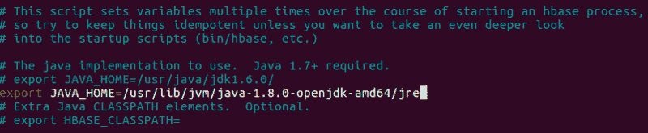

export java home in hbase-env.sh file.

如果您不确定您当前使用的是哪个版本的 JDK，请按照以下步骤操作，并根据需要进行必要的更改。

我们需要 Java SE Development Kit 7 或更高版本，预测 IO 才能工作。现在，让我们通过运行以下命令来确保我们使用的是正确的版本:

```
sudo update-alternatives — config java
```

默认情况下，我使用:

```
java -version
```

```
openjdk version “1.8.0_121”
```

```
OpenJDK Runtime Environment (build 1.8.0_121–8u121-b13–0ubuntu1.16.04.2-b13)
```

```
OpenJDK 64-Bit Server VM (build 25.121-b13, mixed mode)
```

如果您使用的是低于 1.7 的版本，那么您应该更改 java 配置以使用等于 1.7 或更高版本的 java。您可以使用上面给出的 update-alternatives 命令来更改它。在我的例子中，命令`sudo update-alternatives -config java`输出如下:

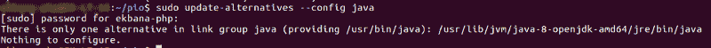

如果你在设置时有任何问题，你可以点击[这个链接](https://askubuntu.com/questions/272187/setting-jdk-7-as-default)。

现在让我们导出`/home/you/pio.`内的`.bashrc`文件中的 JAVA_HOME 路径

考虑到你在`~/pio`目录下，你可以这样做:`nano .bashrc`

在`.bashrc`中设置好 java home 之后，不要忘记做`source .bashrc` 。

### 步骤 8:配置预测 IO 环境

现在，让我们配置 pio.env.sh，对我们的预测 io 机器学习服务器安装进行最后的润色。

```
nano PredictionIO-0.10.0-incubating/conf/pio-env.sh
```

我们的事件服务器没有使用 ProsgesSQl 或 MySql，所以让我们注释掉该部分，生成一个 pio-env.sh，如下所示:

```
#!/usr/bin/env bash## Copy this file as pio-env.sh and edit it for your site's configuration.## Licensed to the Apache Software Foundation (ASF) under one or more# contributor license agreements.  See the NOTICE file distributed with# this work for additional information regarding copyright ownership.# The ASF licenses this file to You under the Apache License, Version 2.0# (the "License"); you may not use this file except in compliance with# the License.  You may obtain a copy of the License at##    http://www.apache.org/licenses/LICENSE-2.0## Unless required by applicable law or agreed to in writing, software# distributed under the License is distributed on an "AS IS" BASIS,# WITHOUT WARRANTIES OR CONDITIONS OF ANY KIND, either express or implied.# See the License for the specific language governing permissions and# limitations under the License.#
```

```
# PredictionIO Main Configuration## This section controls core behavior of PredictionIO. It is very likely that# you need to change these to fit your site.
```

```
# SPARK_HOME: Apache Spark is a hard dependency and must be configured.SPARK_HOME=$PIO_HOME/vendors/spark-1.5.1-bin-hadoop2.6
```

```
POSTGRES_JDBC_DRIVER=$PIO_HOME/lib/postgresql-9.4-1204.jdbc41.jarMYSQL_JDBC_DRIVER=$PIO_HOME/lib/mysql-connector-java-5.1.37.jar
```

```
# ES_CONF_DIR: You must configure this if you have advanced configuration for#              your Elasticsearch setup. ES_CONF_DIR=$PIO_HOME/vendors/elasticsearch-1.4.4/conf
```

```
# HADOOP_CONF_DIR: You must configure this if you intend to run PredictionIO# with Hadoop 2\. HADOOP_CONF_DIR=$PIO_HOME/vendors/spark-1.5.1-bin-hadoop2.6/conf
```

```
# HBASE_CONF_DIR: You must configure this if you intend to run PredictionIO# with HBase on a remote cluster. HBASE_CONF_DIR=$PIO_HOME/vendors/hbase-1.0.0/conf
```

```
# Filesystem paths where PredictionIO uses as block storage.PIO_FS_BASEDIR=$HOME/.pio_storePIO_FS_ENGINESDIR=$PIO_FS_BASEDIR/enginesPIO_FS_TMPDIR=$PIO_FS_BASEDIR/tmp
```

```
# PredictionIO Storage Configuration## This section controls programs that make use of PredictionIO's built-in# storage facilities. Default values are shown below.## For more information on storage configuration please refer to# http://predictionio.incubator.apache.org/system/anotherdatastore/
```

```
# Storage Repositories
```

```
# Default is to use PostgreSQLPIO_STORAGE_REPOSITORIES_METADATA_NAME=pio_metaPIO_STORAGE_REPOSITORIES_METADATA_SOURCE=ELASTICSEARCH
```

```
PIO_STORAGE_REPOSITORIES_EVENTDATA_NAME=pio_eventPIO_STORAGE_REPOSITORIES_EVENTDATA_SOURCE=HBASE
```

```
PIO_STORAGE_REPOSITORIES_MODELDATA_NAME=pio_modelPIO_STORAGE_REPOSITORIES_MODELDATA_SOURCE=LOCALFS
```

```
# Storage Data Sources
```

```
# PostgreSQL Default Settings# Please change "pio" to your database name in PIO_STORAGE_SOURCES_PGSQL_URL# Please change PIO_STORAGE_SOURCES_PGSQL_USERNAME and# PIO_STORAGE_SOURCES_PGSQL_PASSWORD accordingly# PIO_STORAGE_SOURCES_PGSQL_TYPE=jdbc# PIO_STORAGE_SOURCES_PGSQL_URL=jdbc:postgresql://localhost/pio# PIO_STORAGE_SOURCES_PGSQL_USERNAME=pio# PIO_STORAGE_SOURCES_PGSQL_PASSWORD=root
```

```
# MySQL Example# PIO_STORAGE_SOURCES_MYSQL_TYPE=jdbc# PIO_STORAGE_SOURCES_MYSQL_URL=jdbc:mysql://localhost/pio# PIO_STORAGE_SOURCES_MYSQL_USERNAME=root# PIO_STORAGE_SOURCES_MYSQL_PASSWORD=root
```

```
# Elasticsearch Example PIO_STORAGE_SOURCES_ELASTICSEARCH_TYPE=elasticsearch PIO_STORAGE_SOURCES_ELASTICSEARCH_CLUSTERNAME=firstcluster PIO_STORAGE_SOURCES_ELASTICSEARCH_HOSTS=localhost PIO_STORAGE_SOURCES_ELASTICSEARCH_PORTS=9300 PIO_STORAGE_SOURCES_ELASTICSEARCH_HOME=$PIO_HOME/vendors/elasticsearch-1.4.4
```

```
# ocal File System ExamplePIO_STORAGE_SOURCES_LOCALFS_TYPE=localfsPIO_STORAGE_SOURCES_LOCALFS_PATH=$PIO_FS_BASEDIR/models
```

```
# HBase ExamplePIO_STORAGE_SOURCES_HBASE_TYPE=hbasePIO_STORAGE_SOURCES_HBASE_HOME=$PIO_HOME/vendors/hbase-1.0.0
```

### 步骤 9:在 ElasticSearch 配置中配置集群名称

因为这条线`PIO_STORAGE_SOURCES_ELASTICSEARCH_CLUSTERNAME=firstcluster`指向我们在 ElasticSearch 配置中的集群名称，所以让我们替换 ElasticSearch 配置中的一个默认集群名称。

```
nano PredictionIO-0.10.0-incubating/vendors/elasticsearch-1.4.4/config/elasticsearch.yml
```

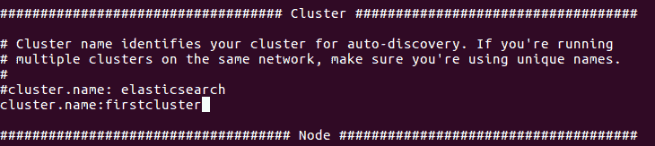

Added cluster name in the elastic search config.

### 步骤#10:导出预测 IO 路径

现在让我们导出预测 IO 路径，这样我们就可以自由地使用 pio 命令，而不必每次都指向它的 bin。在您的终端中运行以下命令:

`PATH=$PATH:/home/you/pio/PredictionIO-0.10.0-incubating/bin; export PATH`

### **步骤#11:允许**预测 IO **安装**

```
sudo chmod -R 775 ~/pio
```

这是至关重要的，因为如果我们不允许访问 pio 文件夹，预测 io 进程将无法写入日志文件。

### **步骤#12:启动预测 IO 服务器**

现在我们准备好了，让我们启动我们的预测 IO 服务器。在运行这个命令之前，请确保您已经导出了上述的 pio 路径。

```
pio-start-all
```

```
#if you forgot to export the pio path, it won't work and you manually have to point the pio bin path. 
```

如果到目前为止一切正常，您将会看到类似这样的输出。

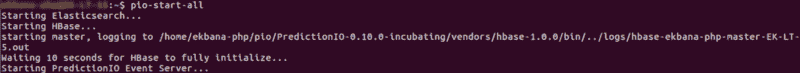

pio start all services.

> 注意:如果你忘了给许可，将会有写日志的问题，如果你的 JAVA_HOME 路径不正确，HBASE 将不能正常启动，它会给你错误。

### **步骤#13:验证流程**

现在让我们用`pio status`来验证我们的安装，如果一切正常，您将得到如下输出:

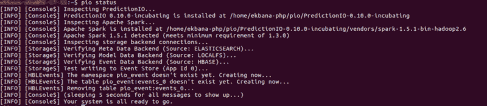

pio status results when everything is ok.

如果您在 Hbase 或任何其他后端存储中遇到错误，请确保一切都已正确启动。

我们的预测 IO 服务器现在已经准备好实施模板。

### **实现[推荐引擎](https://predictionio.incubator.apache.org/templates/recommendation/quickstart/)**

推荐引擎模板是一个预测 IO 引擎模板，它使用协同过滤向用户进行个性化推荐。它可以用在电子商务网站、新闻网站或任何收集用户历史事件的应用程序中，给用户一个个性化的体验。

我们将用少量的电子商务用户数据在预测 IO 中实现这个模板，只是为了用预测 IO 机器学习服务器做一个样本实验。

现在让我们回到我们的家园

### 步骤#14: **下载推荐模板**

```
pio template get apache/incubator-predictionio-template-recommender MyRecommendation
```

它将询问公司名称和作者姓名，随后输入，现在我们的主目录中有一个 MyRecommendation 模板。提醒一下:你可以把模板放在任何你想放的地方。

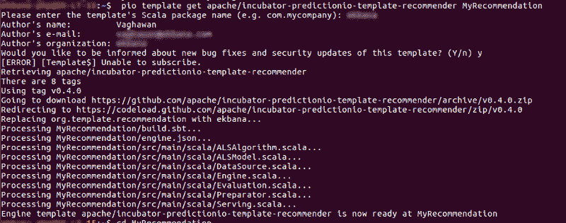

installing template in pio.

### #15.**创建我们的第一个预测 IO 应用**

现在让我们进入 MyRecommendation 目录`cd MyRecommendation`

进入模板目录后，让我们创建第一个名为`ourrecommendation`的预测 IO 应用程序。

你会得到这样的输出。请记住，您可以为您的应用程序取任何名称，但在这个例子中，我将使用应用程序名称`ourrecommendation`。

```
pio app new ourrecommendation
```

该命令将输出如下内容:

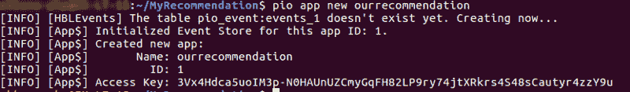

pio app created.

让我们使用以下命令来验证我们的新应用程序是否存在:

```
pio app list
```

现在我们的 app 应该在列表里了。

### 步骤#16:导入一些样本数据

让我们从 gist 下载[示例数据，并将其放在 MyRecommendation 文件夹中的 importdata 文件夹中。](https://gist.github.com/vaghawan/0a5fb8ddb85e03631dd500d7c8f0677d#file-data-sample-json)

```
mkdir importdata
```

将刚刚创建的 sample-data.json 文件复制到 importdata 文件夹中。

最后，让我们将数据导入我们的推荐应用程序。考虑到您在`MyRecommendation dir`中，您可以这样批量导入事件。

```
pio import — appid 1 — input importdata/data-sample.json
```

**(注意:确保我们推荐的 appid 与您刚才提供的 appid 相同)**

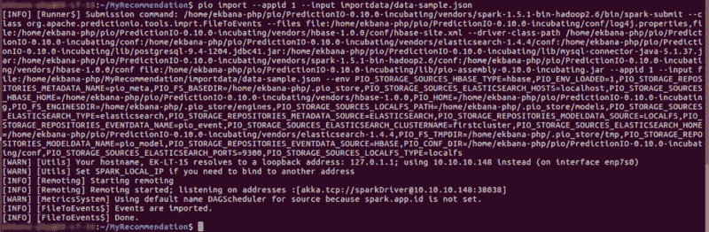

event import in pio.

### 步骤#17:构建应用程序

在构建应用程序之前，让我们编辑 MyRecommendation 目录中的 engine.json 文件，以在其中复制我们的应用程序名称。它应该是这样的:

**注意:不要复制这个，只要把你的 engine.json 里面的“appName”改一下就可以了**

```
{  "id": "default",  "description": "Default settings",  "engineFactory": "orgname.RecommendationEngine",  "datasource": {    "params" : {      "appName": "ourrecommendation"    }  },  "algorithms": [    {      "name": "als",      "params": {        "rank": 10,        "numIterations": 5,        "lambda": 0.01,        "seed": 3      }    }  ]}
```

**注意:“engineFactory”将在您在我们的步骤 14 中提取模板时自动生成，因此您不必更改它。在我的例子中，它是我的 orgname，我在安装模板时把它放在终端提示符中。在你的 engine.json 中，你只需要修改 appName，请不要修改其他任何东西。**

在 MyRecommendation 引擎模板所在的同一个目录中，让我们运行这个 pio 命令来构建我们的应用程序。

```
pio build
```

(注意:如果你想在构建过程中看到所有的消息，你可以运行这个`pio build — verbose`)

有时可能需要建立我们的应用程序，因为这是第一次。从下一次开始，它需要更少的时间。您应该得到这样的输出:

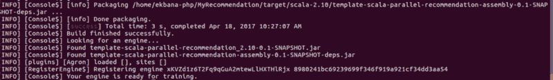

pio build success message.

我们的引擎现在可以训练我们的数据了。

### 步骤#18: **训练数据集**

```
pio train
```

如果您在训练过程中遇到类似下面这样的错误，那么您可能需要更改 engine.json 中的迭代次数，并重新构建应用程序。

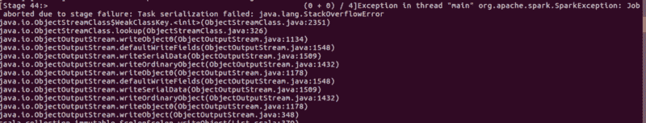

Java StackOverflowError during pio train.

让我们将 engine.json 中默认为 20 的`numItirations`改为 5:

```
“numIterations”: 5,
```

现在让我们用`pio build`构建应用程序，再次使用`pio train`。培训应该成功完成。完成培训后，您将收到如下消息:

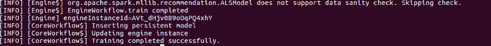

training success console.

请注意，本培训仅适用于小数据，但是如果您想尝试大数据集，那么我们必须设置一个独立的 spark worker 来完成培训。(我将在以后的帖子中写这方面的内容。)

### 步骤#19: **部署和服务预测**

```
pio deploy#by default it will take 8000 port.
```

我们现在将运行我们的预测 io 服务器。

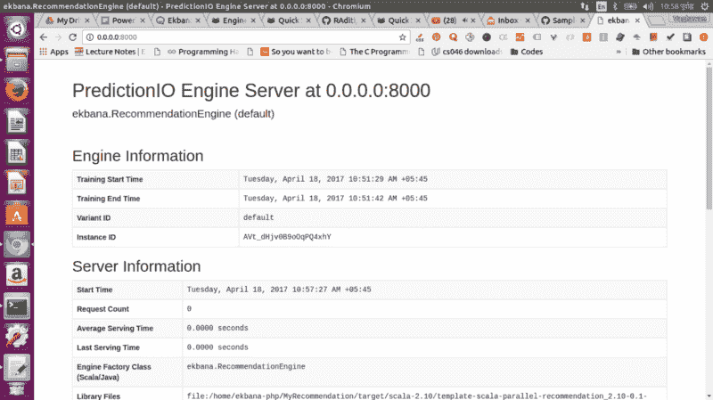

running prediction io server in 8000 port

> **注意:**为了简单起见，我不会在这篇文章中讨论事件服务器，因为它可能会变得更长，因此我们将重点放在预测 IO 的简单用例上。

现在让我们用旋度来预测。

打开一个新的终端，点击:

```
curl -H “Content-Type: application/json” \-d ‘{ “user”: “user1”, “num”: 4 }’ http://localhost:8000/queries.json
```

在上面的查询中，用户表示事件数据中的 user_id，num 表示我们想要获得多少推荐。

现在你会得到这样的结果:

```
{"itemScores":[{"item":"product5","score":3.9993937903501093},{"item":"product101","score":3.9989989282500904},{"item":"product30","score":3.994934059438341},{"item":"product98","score":3.1035806376677866}]}
```

就是这样！干得好。我们完了。但是等等，下一步是什么？

*   接下来，我们将使用 spark standalone cluster 来训练大型数据集(相信我，这很容易，如果您想现在就做，您可以遵循预测 IO 中的[文档)](https://predictionio.incubator.apache.org/resources/faq/)
*   我们将使用来自 Action ML 的[通用推荐器来构建一个推荐引擎。](http://actionml.com/universal-recommender)

**重要提示:**

*   我们使用的模板使用带有显式反馈的 [ALS 算法](https://spark.apache.org/docs/latest/mllib-collaborative-filtering.html)，但是您可以根据需要轻松切换到隐式。
*   如果你对预测木卫一感到好奇并想了解更多，你可以在[预测木卫一官方网站](https://predictionio.incubator.apache.org/)上这样做。
*   如果你的 Java 版本不适合预测 IO 规范，那么你肯定会遇到问题。因此，请确保首先进行配置。
*   除非得到许可，否则不要用`sudo`运行上面描述的任何命令。否则你会遇到问题。
*   确保您的 java 路径是正确的，并确保导出预测 IO 路径。您可能希望将预测 IO 路径添加到您的。bashrc 或 profile 也取决于您的需要。

#### *更新 2017/07/14:使用 Spark 训练真实数据集*

我们将 spark 安装在我们的供应商文件夹中，对于我们当前的安装，我们的 spark bin 在下面的目录中。

```
~/pio/PredictionIO-0.10.0-incubating/vendors/spark-1.5.1-bin-hadoop2.6/sbin
```

从那里，我们必须设置一个 spark 主服务器和一个副本来执行我们的模型训练，以便更快地完成它。如果您的训练似乎停滞不前，我们可以使用 spark 选项来完成训练任务。

#### #启动火花初级

```
~/pio/PredictionIO-0.10.0-incubating/vendors/spark-1.5.1-bin-hadoop2.6/sbin/start-master.sh
```

这将启动火花初级。现在让我们通过在浏览器中进入 [http://localhost:8080/](http://localhost:8080/) 来浏览 spark primary 的 web UI。

现在让我们复制主 url 来启动复制工作器。在我们的例子中，主要的 spark URL 是这样的:

spark://your-machine:7077(您的机器表示您的机器名)

```
~/pio/PredictionIO-0.10.0-incubating/vendors/spark-1.5.1-bin-hadoop2.6/sbin/start-slave.sh spark://your-machine:7077
```

工人将开始。刷新网络界面，你会看到这次注册的工人。现在让我们再次运行训练。

```
pio train -- --master spark://localhost:7077 --driver-memory 4G --executor-memory 6G
```

**太好了！**

**特别鸣谢:来自 [Action ML](http://actionml.com/) &的 Pat Ferrel Marius Rabenarivo**