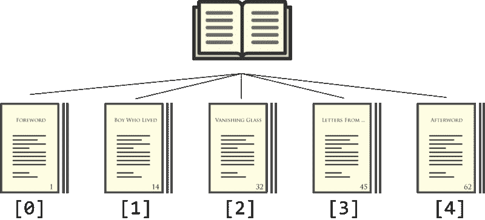

# JavaScript 数组和对象就像书籍和报纸一样

> 原文：<https://www.freecodecamp.org/news/javascript-arrays-and-objects-are-just-like-books-and-newspapers-6e1cbd8a1746/>

凯文·科诺年科


# JavaScript 数组和对象就像书籍和报纸一样

#### 如果你读过书和报纸，那么你就能理解 JavaScript 中数组和对象的区别。

当您刚刚开始使用 JavaScript 时，很容易对组织和存储数据的最佳方式感到困惑。

一方面，您可能通过学习“for”循环而熟悉数组。但是，一旦您开始将尽可能多的数据塞入数组，您将创建一个不可扩展的混乱局面，当您审查您的代码时将无法理解。

当您可以快速确定每个结构的用途时，在对象和数组之间进行选择会变得容易得多。数组非常适合书籍存储信息的方式。对象符合报纸存储信息的方式。

让我们投入进去吧！

#### 数组:数据的顺序是最重要的

这里是一个超级短的书的部分，以数组的形式。

好吧，我承认，这是《哈利·波特》第一部的前三章。这是数组的可视化形式。



当**顺序是组织信息**的最重要因素时，您希望使用数组。没有人(我希望)会看着哈利波特的章节标题说，“嗯，那看起来很有趣，让我跳到那个吧！”章节的顺序告诉你接下来该读哪一章。

当从数组中检索信息时，使用每个元素的索引。数组是 [0 索引的](https://en.wikipedia.org/wiki/Zero-based_numbering)，这意味着它们从 0 而不是 1 开始计数。

这意味着如果您想访问 books 数组的索引 0，您应该使用:

```
books[0]
```

你会得到:

```
‘foreword’
```

如果你想知道这本书第三部分的名字，你可以用:

```
books[2]
```

你根据书中的顺序，而不是根据章节的标题，来选择接下来要读的章节。

#### 对象:数据标签最重要

这是报纸可能的样子，以实物的形式。

以下是相同数据的可视化形式。


当你想根据数据标签来组织时，对象是最好的。当你阅读一份报纸时，你可能不会一页一页地从头到尾阅读。您可以根据某个部分的名称翻到该部分。无论该部分位于报纸的哪个位置，您都可以立即翻到该部分，并获得相应的上下文。这不像一本书，章节的顺序很重要。

对象通过**键/值对**组织这些信息。看起来是这样的:

```
key: value
```

如果你想进入这份报纸的商业版，你可以像这样使用**键**:

```
newspaper[‘business’]
```

或者:

```
newspaper.business
```

这将返回**值***【GE 股票再次下跌】*。因此，当基于标签(T4 键)访问数据最容易时，您希望将它存储在一个对象中。

#### 组合对象和数组

到目前为止，我们只是在数组和对象中存储了字符串。您还可以存储其他基本数据类型，如数字和布尔值，以及:

1.  对象内的数组
2.  数组中的对象。
3.  数组中的数组
4.  对象中的对象

这就是事情开始变得复杂的地方。但是，您几乎总是需要将这两者结合起来，以可伸缩的方式存储数据。您希望在一周后需要重新访问代码时理解它。

我们再来看一下书本上的例子。如果我们还想存储每一章的页数呢？现在最好用对象填充我们的数组。像这样:

```
var book =[  [‘foreword’, 14],  [‘boywholived’, 18]]
```

我们保持了章节的顺序，现在我们有能力命名每一章的特定属性。因此，如果我们想知道第二部分的页数，我们可以使用:

```
book[1][‘pageCount’]
```

这将给出为 18 的**值**。

现在让我们假设你想看当地报纸每个版块的顶级作家排名，基于资历。你可以用报纸对象中的数组来表达，就像这样:

数组非常适合存储写入程序，因为顺序很重要。您知道，在每个数组中，较早的写入者比较晚的写入者排名更高。索引为 0 的编写器是排名最高的编写器。

您可以通过在报纸对象中创建对象来优化这个对象。例如， *sports* 对象带有标题和作者列表。但是我会让你试试的！

#### 给你一些快速挑战

1.  假设您的 web 应用程序有一个测验部分，用户填写一些问题，然后在最后得到一个分数。您希望存储用户对每个问题的回答，然后在最后高效地检查它们。在检查之前，您会使用哪种结构来存储所有用户的答案？为什么？
2.  假设您允许用户在您的网站上创建一个新的个人资料，包括名字、姓氏、电子邮件和密码。您希望在将数据发送到后端之前存储它。你会用哪种结构来存储所有新用户的信息？为什么？
3.  假设您正在构建一个论坛网站，您需要根据投票数对评论进行排名。当您需要跟踪评论本身的文本和投票数时，哪种结构可能最有意义？提示:两者的某种结合。

如果你喜欢这篇文章，你可能也会喜欢我对挑战 CSS、JavaScript 和 SQL 主题的其他解释，比如定位、模型-视图-控制器和回调。

如果你认为这可能会帮助和你处境相同的人，那就给它一颗“心”吧！

这篇文章最初出现在 CodeAnalogies 博客上。