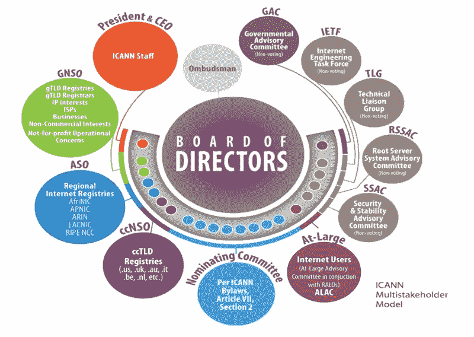
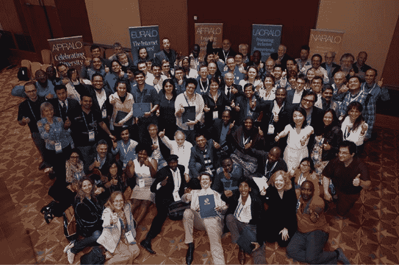

# 域名系统(DNS)是互联网的主干。这就是它的工作原理。

> 原文：<https://www.freecodecamp.org/news/the-domain-name-system-dns-is-the-backbone-of-the-internet-heres-how-it-all-works-5706d0afa0fa/>

尼古拉斯·安东内尔

# 域名系统(DNS)是如何工作的，以及如何让它变得更好。

Image credit: bitcoin.com

域名系统(DNS)通常被称为互联网的主干。它由许多工程师和他们的组织运营，它最终塑造了互联网的未来。

我最近在哥本哈根参加了 ICANN58。这是一个关于互联网未来的圆桌讨论的惊人的一周。它包括:

*   DNS 政策制定研讨会
*   关于互联网架构如何运作的研讨会
*   互联网最大的弱点在哪里

这很有趣，我从中获益匪浅。

简单回顾一下，我对领域世界和互联网架构的内部工作相对来说还是新手。自从作为一名开发者加入这个领域，我不得不学习很多东西。在浏览器的表面下有一个巨大的迷宫。所以我写了这篇指南，带你了解隐藏在我们日常使用的域名和数字背后的一些基础设施。

### 互联网是如何工作的？

> “这是一个非常常见的面试问题:当你去 Google.com，输入一个查询，然后按 enter 键，会发生什么？”昆西·拉森

所以你打开浏览器，进入[freecodecamp.com](http://freecodecamp.com)，这个令人敬畏的网站眨眼之间就出现在你面前。您已经知道这个站点是由位于某个服务器上的一系列编译文件呈现的。但是你的浏览器是如何在无限膨胀的互联网中找到那些文件的呢？你可能会开始想…

刚刚到底发生了什么？

你第一次去 freecodecamp.com 时，你的浏览器不知道 freecodecamp.com 的 IP 地址是什么，所以它不能连接和检索这些文件。就此而言，它也不知道托管这些文件的实际服务器在哪里。因此，它不知道从哪里获取这些文件来开始呈现页面。

事情是这样的:(提示图形！)

> [DNS 聊天](https://imgur.com/a/xj0fP)

### **好的，让我详细说明一下**

1.  用户要求他们的浏览器访问 freecodecamp.com
2.  浏览器查询 DNS 解析器(通常是他们的 ISP)“freecodecamp . com 在哪里？”
3.  DNS 解析器查询根服务器(根服务器有一个保存此信息的重要列表)“where is。COM？”用 Verisign 回复。
4.  DNS 解析器然后询问 Verisign——“freecodecamp . com 在哪里？”Verisign 回复域名服务器 ns1.cloudflare.com 和 IP 地址 192.168.178.1
5.  使用 IP 地址查询主机服务器。"请给我 IP 地址为 192.168.178.1 的文件"
6.  网站文件被传送并呈现在页面上，因此用户可以学习编码…或他们正在做的任何事情。

我从 Verisign 抓取了这个截屏，这是目前世界上最大的注册中心。com。网。抄送。它以一种很好的方式向您展示了协议如何通过 DNS 结构的顺序查询和响应来工作的过程。

不要太担心试图阅读所有文本，但只要观察交流和信息流，以重申我们上面讨论的内容(这是一个循环，所以将重新开始)。

> [DNS 聊天](https://imgur.com/a/MnXeU)

### 谁让它工作？

总之 IANA，在长 ICANN，(我会解释这些组织在一会儿，所有这一切将更有意义，我保证！)

解释它如何工作的原因是为了揭示是谁让它工作的——这是本文的真正问题和目的。很容易认为事情就是这样。当然，这不是偶然的，互联网工作的原因是因为协议和政策已经被创建并获得足够的共识，成为普遍的规范，但谁同意这些，如何同意？

简而言之，具体到如何映射域名和 IP 地址，该职能属于 IANA(互联网数字地址分配机构)的权限范围。他们的任务是确保正确的技术程序到位，以拥有一个安全稳定的域名系统。这就把我们带到了 ICANN(互联网名称与数字地址分配机构)。没有 ICANN 就谈不到 IANA:

> 除了提供重要 DNS 资源的技术运营，ICANN 还定义了互联网“名称和号码”应该如何运行的政策。这项工作以一种我们称之为“自下而上、共识驱动、多利益相关方模式”的方式向前推进——ICANN.COM

自 1998 年以来一直由 ICANN 管理的 IANA 职能部门在 2015 年 9 月从与美国商务部签订的合同永久性地转变为 ICANN 的自主控制\o/ ICANN 有一个董事会，作为一个机构，它被划分为多个独立的成员团体，让我们来探索一下多利益主体模式:

> *“ICANN 的包容性方法将公共部门、私营部门和技术专家视为同行。在 ICANN 社区中，您会发现注册管理机构、注册服务商、互联网服务提供商(ISP)、知识产权倡导者、商业和企业利益、非商业和非营利利益、来自 100 多个政府的代表以及全球范围内的个人互联网用户。所有的观点都根据其自身的价值得到考虑。ICANN 的基本信念是，互联网的所有用户都有权对互联网的运行方式发表意见。—ICANN.COM*

*ICANN Multi stakeholder Model — image credit ICANN.com*

虽然可以公平地说所有这些群体都有“代表”，但我认为所有群体都没有得到平等的代表。人们很自然地会认为，那些拥有更多金融股权和资金的人会试图将对话引向某个方向。例如，像美国电话电报公司、康卡斯特、查特、威瑞森、沃达丰、T-Mobile、Orange 这样的电信公司。

可以说，他们将把我们拉向一个倒退的方向，在那里他们可以像对有线电视频道那样包装网站，并将其出售给最终用户，对他们控制的电缆流量收费，并通常在更封闭的互联网上进行三次浸泡，以便他们可以获得更多利润。

一些政府也将试图朝着他们自己的国家利益的方向施加影响，而另一些政府将试图成为更加全球化的公民。知识产权倡导者(通常由知识产权律师组成的组织)希望事情更多地与知识产权和品牌安全有关，这样他们就可以保护他们高收入客户的利润丰厚的权利。

谷歌和脸书等商业领域的服务提供商在这一系列中显而易见，它们倾向于主张——至少在一定程度上——用户的隐私，同时保持自己在网络上的主导地位。

像 Verisign 这样的注册管理机构有兴趣设计他们必须遵守的有利政策结果。

iCANN is like this, but way less adorable…

以我的经验来看，有趣的是注册商——你可以在那里注册域名(比如[iwantmyname](https://iwantmyname.com))——在争论中提供了理性的声音。他们必须平衡他们对 ICANN 和注册管理机构的义务和他们客户的义务。因此，他们经常不得不反击各种成员或利益集团，有时甚至是 ICANN 理事会本身。

### 让我们谈谈最终用户

嘿！那是我们！

在这一过程中，终端用户的参与明显不足。嗯，如果互联网的最终用户开始更加关注，我们都会更好。

请记住，全球有 37 亿互联网用户，但只有少数人拥有电信、注册或网络平台的股份。仅 freeCodeCamp 社区就有超过 100 万用户，我们一起分享了如此多的利害攸关的内容。

也就是说，目前参与这一讨论的人数非常少，可能只有几千人。老实说，我认为我们越来越需要更多的开发人员在对话中发出更积极的声音。

毕竟，这是我们的生计。这是我们花费时间的地方。这个空间消耗了我们大部分的注意力、精力和热情。除了是互联网的高悟性和重度用户，我们还对自己的受众有独特的见解。我们可以用同情的声音说话，与更大的最终用户群产生共鸣。

### 你能做什么？

你可以坐在桌旁(或地板上)。有几种方法可以让你参与进来，这取决于你希望你的参与有多正式。您可以加入[网络普通用户](https://atlarge.icann.org)。

Image by [At-Large](https://atlarge.icann.org/news/announcement-12-2014-08-07-en)

[网络普通用户](https://atlarge.icann.org)是 ICANN 多利益主体模式的最终用户队伍的一部分。它分为地区性网络普通用户外展组织(RALOs)。以下是完整的名单:纳拉罗(北美)、欧拉罗(欧洲)、安普罗(亚太)、拉克拉罗(拉丁美洲和加勒比海群岛)和阿弗拉罗(非洲国家)。

这些不同的 RALOs 将他们的意见反馈给网络普通用户咨询委员会(ALAC…缩写不是很有趣吗！)然后由他们向 ICANN 报告。

在这些最终用户代表机构中，有一些较小的组织，您可以成为大学或城市级别的组织的一部分。

另一种参与方式是成为非附属会员，也就是说在网络普通用户组织之外，直接加入您所在地区的网络普通用户组织。(请注意，目前只有北美、欧洲和亚太地区的 RALOs 允许此类会员— [您可以在这里了解更多信息并申请](https://atlarge.icann.org/get-involved/individual-member)。)

还有一种方法，那就是作为一个集体申请成为 ALS。这确实需要你付出一些努力。你需要组织起来，并领导加入你的团队的人。但是回报是一个会议桌的席位和所有你的 ALS 代表的的[声音。](https://atlarge.icann.org/get-involved/about-als)

另外，我想听听您的意见，您是否认为 freeCodeCamp 社区本身应该考虑申请成为网络普通用户组织。这将为其所有成员提供一条进入 ICANN 最终用户群的途径。

在网络普通用户组织之外，您还有一种参与方式。当 ICANN 公开主题以征询公众意见时，您可以参与其中。这里是找到它们的地方。

你也可以像我一样参加 ICANN 会议。ICANN 每年召开三次会议——每次都在世界的不同地方举行。我参加了在哥本哈根举行的 ICANN58。下一个是约翰内斯堡的[ICANN 59](https://meetings.icann.org/en/johannesburg59)。

参加这种为期一周的活动是一种非常充实的体验。它们免费向公众开放。你只需要注册和申请。如果你需要帮助，他们还会提供奖学金来帮助你参加。

你可以通过许多方式表达你的观点，帮助塑造我们自由开放的互联网的未来。

> "互联网的所有用户都应该对互联网的运行方式有发言权。"

> ——ICANN

所以我在此邀请你订婚并入席。

> $USER 我们做到了\o/这需要接受和处理很多东西

> 回应:你们人类用你们的小 CPU，LOL:)