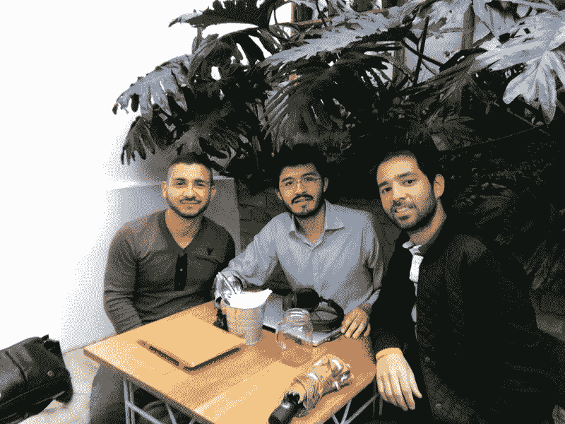

# 维基百科的创始人正在建立一个社区运营的新闻网站

> 原文：<https://www.freecodecamp.org/news/the-founder-of-wikipedia-is-building-a-community-run-news-website-eaeb90de742/>

早在 2001 年，吉米·多纳尔·威尔士就与人共同创立了维基百科，其使命是“授权并吸引世界各地的人们在免费许可或公共领域下收集和开发教育内容。”

今天，他宣布他正在创建一个名为 WikiTribune 的新闻网站。该网站称:“我们希望确保你阅读的是基于事实的文章，这些文章对当地和全球事件都有真正的影响。而且故事很容易被验证和改进。”

维基百科是一个“活的、会呼吸的工具，它会用真实的证据展示准确的信息，这样你就可以自信地做出自己的决定。”

该网站非常强调同行社区的作用，而不是传统的记者和读者之间的分离。“文章由专业记者和社区成员以平等的身份并肩工作，进行创作、事实核查和验证，主要不是由广告商支持，而是由关心好新闻以至于成为每月支持者的读者支持。”

在接下来的 30 天里，WikiTribune 将努力筹集足够的捐款来雇佣其最初的 10 名全职记者团队。你可以查看他们的完整 WikiTribune 网站，并在这里投稿。

以下是其他三个值得你花时间去做的链接:

1.  海量开放在线课程曾经是 100%免费的。但他们并没有就此止步( [5 分钟阅读](https://fcc.im/2pwEMiw))
2.  JavaScript 中的 CSS:基于组件的样式的未来
3.  使用 GitHub 和 Cloudflare 建立网站的图解指南( [8 分钟阅读](https://fcc.im/2p1sSLU))

额外收获:游戏开发者乔纳森·布洛做了一个关于“让游戏编程不那么可怕”( [1 小时观看](https://www.youtube.com/watch?v=gWv_vUgbmug&t=64s))的精彩演讲

### 想到这一天:

> “测试必须是开发软件不可分割的一部分，而不是一个独立的阶段。当采用这种方法时，产品质量由团队中的每个人负责。这说起来容易，但很难付诸实践，因为长期以来的先入为主的观念认为开发人员和测试人员最好分开。”—詹姆斯·西瓦克

### 今日趣事:

网络漫画作者 [XKCD](https://fcc.im/2qbEo5j) 。

### 今日学习小组:

[波哥大自由代码营](https://fcc.im/2oJ0jAC)

编码快乐！

–昆西·拉森，自由代码营的老师

如果你从这些邮件中获得了价值，请考虑[支持我们的非营利组织](http://bit.ly/donate-to-fcc)。