# 使用 Github & Cloudflare 设置网站的图解指南

> 原文：<https://www.freecodecamp.org/news/an-illustrated-guide-for-setting-up-your-website-using-github-cloudflare-5a7a11ca9465/>

作者卡兰·塔卡尔

# 使用 GitHub 和 Cloudflare 设置网站的图解指南

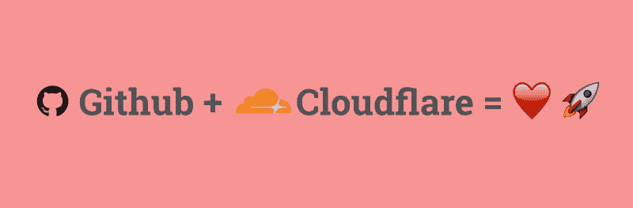

你应该读读这个，如果…

1.  您想免费设置自定义重定向或其他服务器配置
2.  **你想在 HTTPS 建立自己的网站，但不知道从哪里开始**
3.  **你被大量的选择淹没了(比如[网络生活](https://www.netlify.com)、[激增](https://surge.sh)、[比特气球](https://www.bitballoon.com/)、[现在](https://zeit.co/now))**

### ****为什么选择 Github？****

1.  **Github 页面易于设置和开始使用**
2.  **即时部署推送新代码**

### ****为什么是 Cloudflare？****

1.  **它是免费的**
2.  **它提供了对 SSL (HTTPS)的现成支持。([这就是为什么 HTTPS 如此重要。)](https://developers.google.com/web/fundamentals/security/encrypt-in-transit/why-https)**
3.  **超级简单的 DNS 管理**
4.  **能够为资产设置[浏览器缓存到期](https://developer.mozilla.org/en-US/docs/Web/HTTP/Headers/Cache-Control)**
5.  **自动缩小您的静态资产**
6.  **自定义页面规则设置重定向，总是 HTTPS 等。**
7.  **支持的浏览器的 [HTTP2](https://hpbn.co/http2/) / [SPDY](http://googlecode.blogspot.in/2012/01/making-web-speedier-and-safer-with-spdy.html)**
8.  **允许设置 [HSTS](https://www.owasp.org/index.php/HTTP_Strict_Transport_Security_Cheat_Sheet) (HTTP 严格传输安全)**

### **在我们开始之前，你需要一些东西:**

1.  **一个 [Github 账户](https://github.com/join)**
2.  **一个 [Cloudflare 帐户](https://www.cloudflare.com/a/sign-up)**
3.  **对自定义域的访问。你可以从任何一个域名注册商那里买到，比如: [Namecheap](https://www.namecheap.com/) ， [GoDaddy](http://www.godaddy.com) ， [BigRock](https://www.bigrock.in) 等。**

**如果这一切激起了你的兴趣，那么让我们开始吧！**

### ****步骤 1** :用你的代码创建 Github repo**

**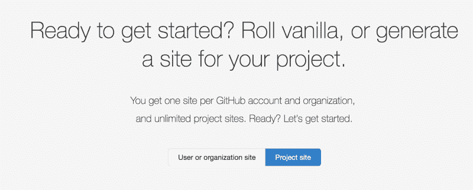

Select the option **Project Site** to get started** 

*   **前往[https://pages.github.com](https://pages.github.com/)**
*   **选择选项**项目站点**找到如何从头开始创建一个基本页面或自定义主题的说明**

### **第二步。为存储库设置 Github 页面**

**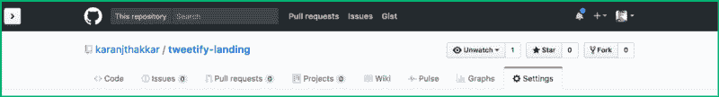

Go to **Settings** for your repository** **

Choose to serve your website from the **master** branch** 

**转到存储库的**设置**。在 **Github 页面**部分，选择**主**分支来服务你的网站。一旦你做到了这一点，你就可以去[**https://*<yourgithubuserna*me>。吉斯*u*b.io/repo**](https://<yourgithubusername>.github.io/repository)**s**我想看看你的网站，如下图所示。**

**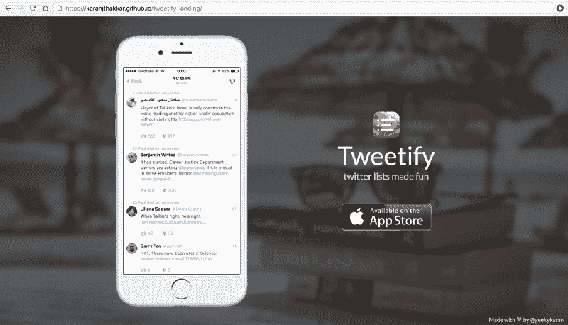**

### **第三步。添加自定义域**

**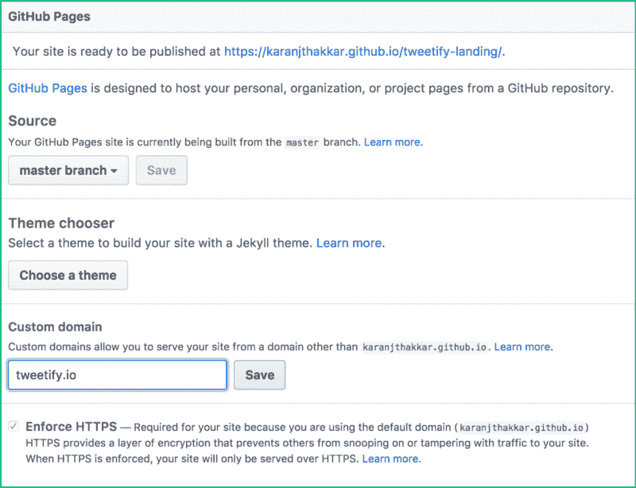

Add a custom domain for your website** 

**添加您购买的自定义域名并保存。您的网站现在已经准备好拥有自己的自定义域名了吗？WOOT！✨**

**Github 上的一切都准备好了。我们将从设置 [Cloudflare](https://www.cloudflare.com) 开始，用我在本文开始时提到的所有强大功能为您的网站增添活力。**

### **步骤 4:在 Cloudflare 上设置您的域**

**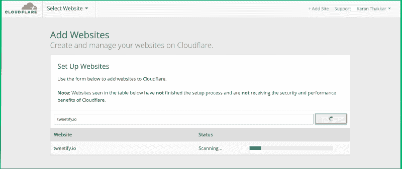**

**登录 [Cloudflare](https://www.cloudflare.com) 。如果您是第一次使用它，您应该会看到如上图所示的屏幕。如果你以前用过，可以点击右上方导航栏中的**添加站点**选项，添加一个新域。进入你想要管理的域名，点击**开始扫描**。**

### **步骤 5:为您的域设置 DNS 记录**

**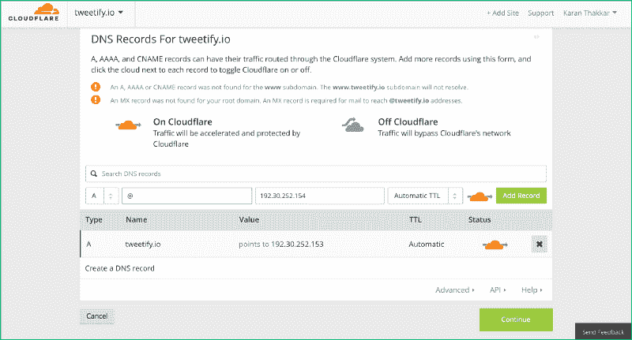****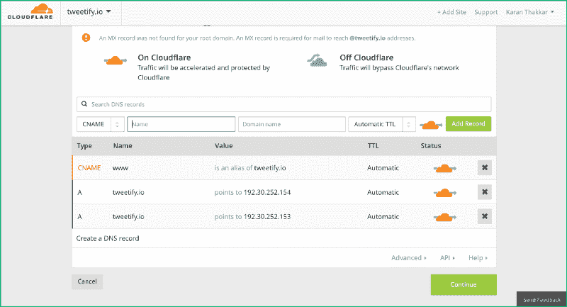

**Left**: Setup DNS records for apex domain. It is denoted by @. **Right**: Final DNS record list** 

**在这一步，我们通知 Cloudflare 使用两个 **A 记录** DNS 条目:
1 将我们的域指向 [Github Pages 服务器](https://help.github.com/articles/setting-up-an-apex-domain/#configuring-a-records-with-your-dns-provider)。192.30.252.153
2。192.30.252.154**

**设置完成后，所有发送到您的自定义域名(即*yourcustomdomain.com*)的请求都将被路由到您在 Github 上的网站 [**第三步**](#3b17) 。**

**在我们进入下一阶段之前，还有一个步骤。通常，你会希望为你的网站使用类似于 **www** 的子域，即【www.yourcustomdomain.com】T2 为此，你需要添加一个 **CNAME 记录** DNS 条目，它会将你的子域(www)指向你的 apex 域(@)。**

**一旦你设置好了，所有的请求都会发送到你的自定义子域，比如 www。*yourcustomdomain.com*将在 [**第三步**](#3b17) 被路由到您在 Github 上的网站。**

****注意:不要试图马上访问您的自定义域名。没用的。我们只完成了 Cloudflare 到 Github 的设置。我们仍然需要做 DNS 注册- > Cloudflare 设置。这将在第 7 页的页**中出现。**

**点击**继续**进入下一步。**

### **步骤 6:选择免费的 Cloudflare 计划**

**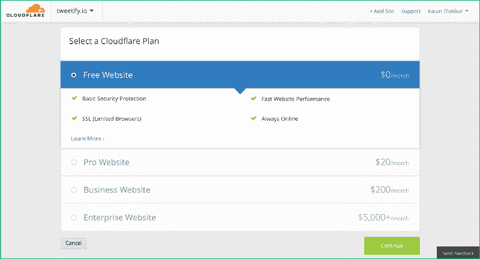**

**Cloudflare 的免费计划提供了许多复杂的选项，详见[为什么选择 Cloudflare？](#2847)章节开头。**

**点击**继续**进入下一步。**

### **步骤 7:更新 DNS 注册商的域名服务器**

**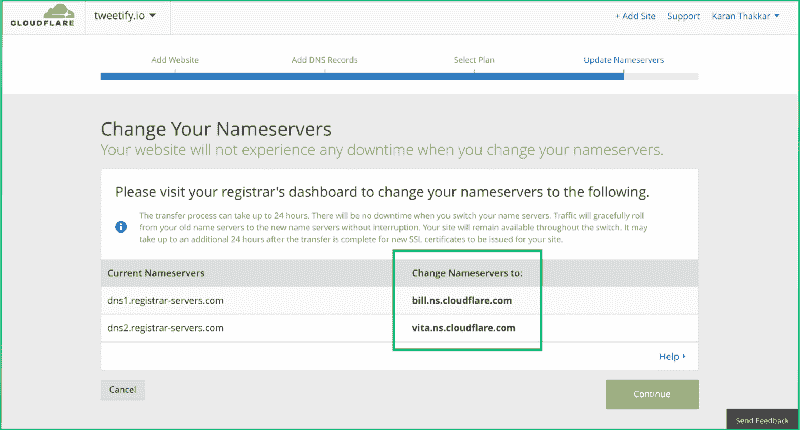

Copy these two highlighted nameservers to your DNS registrar’s name server settings** 

**一旦你进入这个页面，保持它在一个标签中打开，在另一个标签中打开你的 DNS 注册商(你购买域名的地方)的站点。如果您正在使用以下注册商之一，那么了解如何更改名称服务器的链接是:**

1.  **大岩石**
2.  **[命名便宜](https://www.namecheap.com/support/knowledgebase/article.aspx/767/10/how-can-i-change-the-nameservers-for-my-domain)**
3.  **[GoDaddy](https://godaddy.com/help/set-custom-nameservers-for-domains-registered-with-godaddy-12317)**

**您需要将域设置中的现有名称服务器替换为在其他选项卡中打开的 Cloudflare 页面上的名称服务器。**

**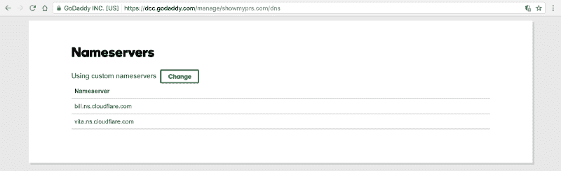****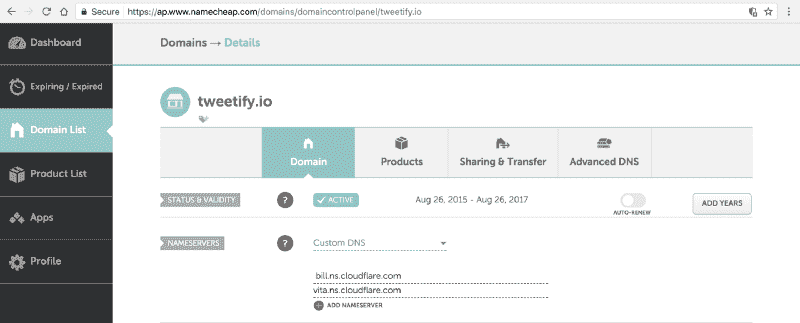

An example of how it would look like after you’ve updated your Nameserver settings in your DNS registrar** 

**亚斯。您已成功设置您的自定义域，将 Cloudflare 用作 DNS 提供商。你可以转到顶部的**概述**选项，你会发现它仍然在等待你的名称服务器变更被处理。**

**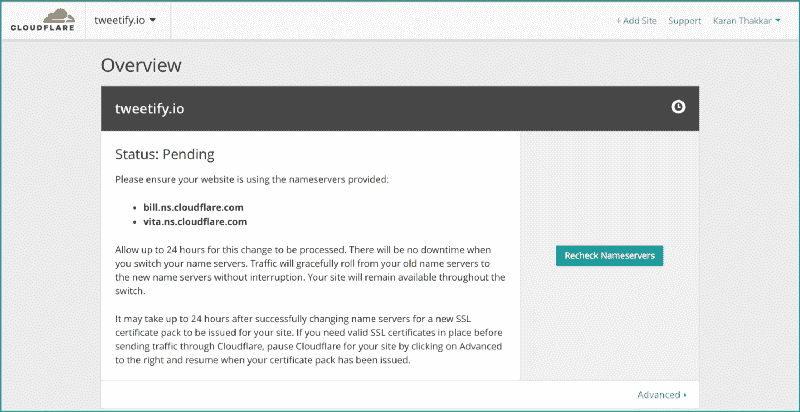****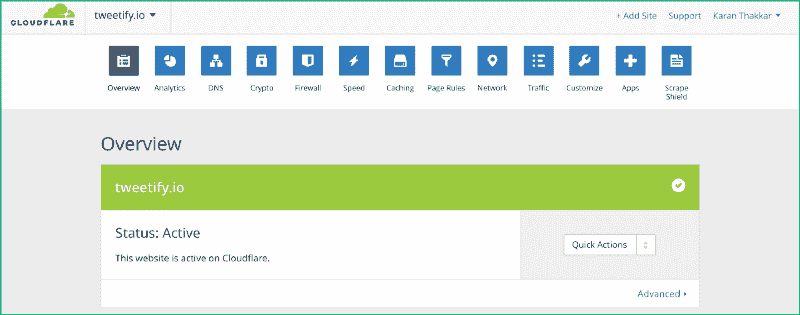

**Left**: Nameserver change is still being processed. **Right**: Nameserver change is processed!!** 

**一旦**总览**标签显示**状态:活动**、**、**你现在可以尝试使用你的自定义域名**访问你的网站，它应该就可以工作了**！？？**

### **步骤 8:配置缩小**

**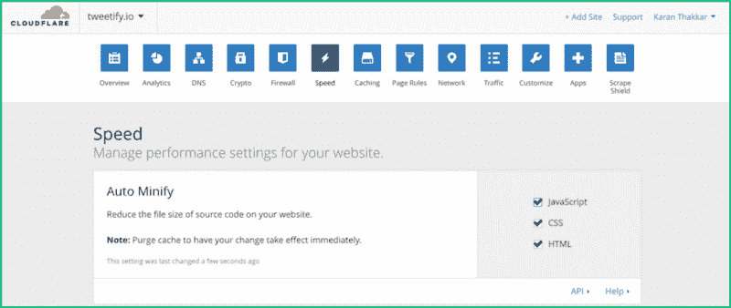**

**在**速度**设置中，在**自动缩小**部分，选择自动缩小所有内容的选项:Javascript、CSS、HTML。这将由 Cloudflare 动态完成一次，然后进行缓存。每当您的任何资产发生变化，Cloudflare 都会为您再次执行此操作。**

**缩小的好处是，由于去掉了不需要的空格和注释，所以发送到浏览器的文件要小得多。**

### **步骤 9:配置浏览器缓存过期时间**

**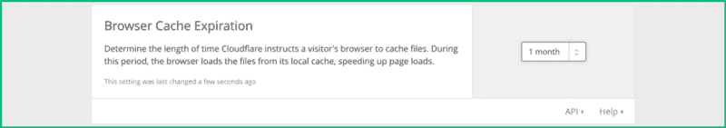

Cache Expiration set to 1 month** 

**如果你在与**自动缩小**相同的页面向下滚动，你会发现**浏览器缓存到期**部分。理想情况下，应该设置为 30 天/1 个月，这样[网页测试](https://www.webpagetest.org)就不会给你警告。这个时间表明，一旦您的站点被加载到任何浏览器中，浏览器将不会再次请求任何资产，直到这些资产的浏览器缓存时间段到期。**

**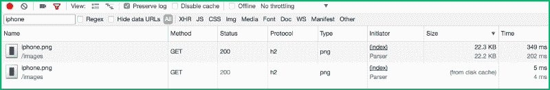

Example: The **iphone.png** image loads from your server for the first time (22.3KB in 349ms) All subsequent requests to fetch that resource are served from disk cache which means it is [almost](http://www.softwaretestingclub.com/forum/topics/what-is-the-difference-between-disk-cache-memory-cache-browser?commentId=751045%3AComment%3A304464) [instantaneously](https://www.reddit.com/r/explainlikeimfive/comments/3660ig/eli5what_is_the_difference_between_disk_caching/crb1c3i/) available (in 5ms)** 

**在我们进入下一步之前，请检查 Cloudflare 上的**加密**设置。在 **SSL** 部分应该写着**活动证书**。(*注意:尝试重新加载页面。有时候不更新*。在接下来的两步中，我们将使您的网站始终通过 HTTPS *提供服务。*为使其顺利运行，您必须拥有 Cloudflare 上的有效证书，这一点非常重要。**

**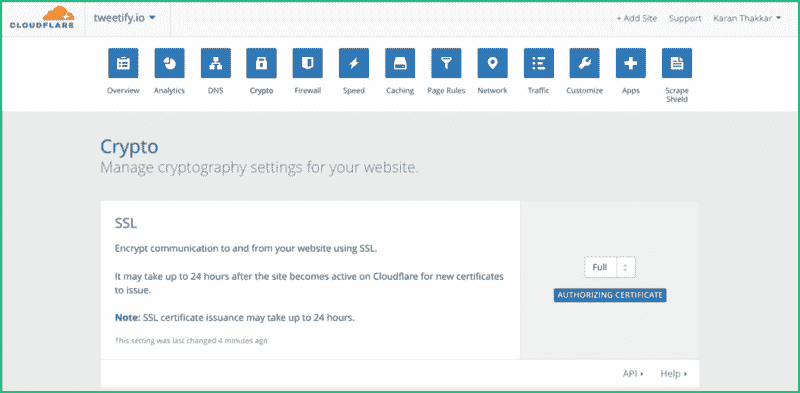****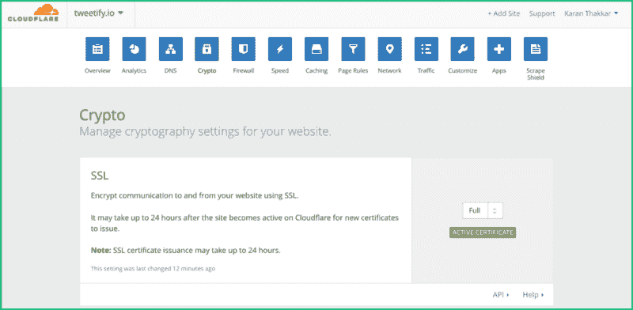

The SSL section shows **Authorizing Certificate** after your Nameserver changes have been processed. Once an SSL certificate for you has been issued, this message will change to **Active Certificate**.** 

### **步骤 10:配置页面规则**

**在这一步中，我们将做两件事:**

1.  **将对 www.yourcustomdomain.com 的所有请求重定向到 yourcustomdomain.com 的 T2**
2.  **将对 http://yourcustomdomain.com 的所有请求重定向到 https://yourcustomdomain.com 的 T2**

**转到**页面规则**设置，点击**创建页面规则。****

**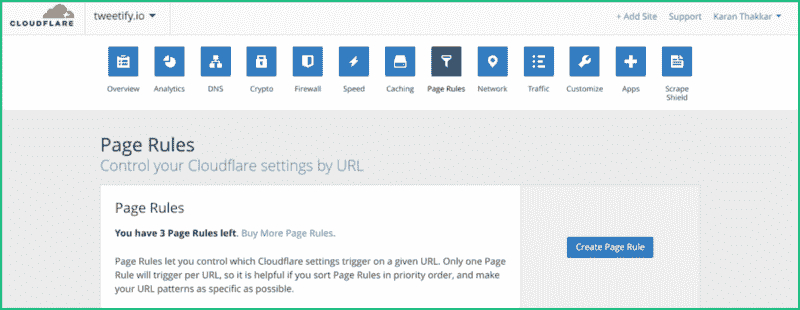**

**为了处理**[【www.yourcustomdomain.com】](http://www.yourcustomdomain.com)**到**的重定向，将 **tweetify.io** 替换为**yourcustomdomain.com**名称。点击**保存并部署**。****

****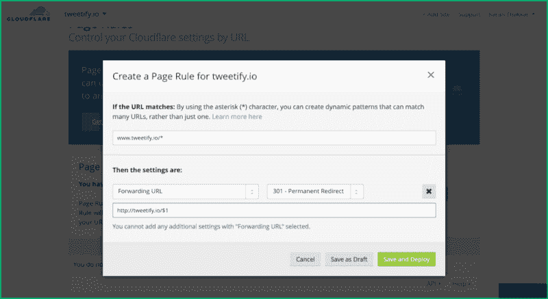****

****为了处理**[【http://yourcustomdomain.com】](http://yourcustomdomain.com)**到**的重定向，将 **tweetify.io** 替换为**yourcustomdomain.com**名称。点击**保存并部署**。******

****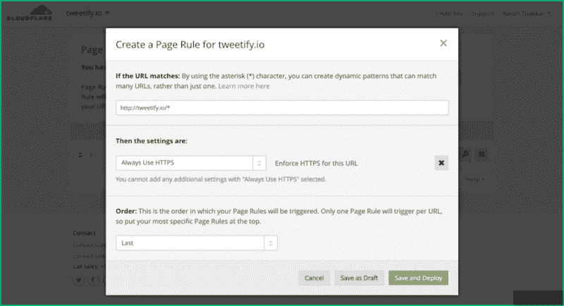****

### ****步骤 11:配置 [HSTS](https://www.owasp.org/index.php/HTTP_Strict_Transport_Security_Cheat_Sheet)****

****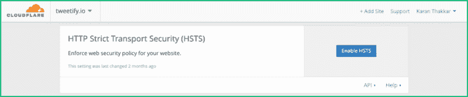****

****转到**加密**设置，向下滚动到 **HTTP 严格传输安全(HSTS)** 部分。点击**启用 HSTS** 。这将要求你承认你知道你在做什么。在您选择**我理解**之前，让我告诉您为什么我们需要启用此设置:****

> ****如果用户过去曾打开过您的网站，从那时起，无论用户何时试图访问您的网站，他们都将被带到您网站的 HTTPS 版本。这使得您的网站在后续访问中加载速度稍快，因为 HTTP 到 HTTPS 的重定向发生在客户端，而不是通过我们在[步骤 10](#8841) 中添加的 Cloudflare 页面规则。****

****进入下一步后，您应该启用所有设置，如下所示。你可以在这里和这里阅读关于这些选项[的更多细节](https://tools.ietf.org/html/rfc6797#section-6.1.1)****

****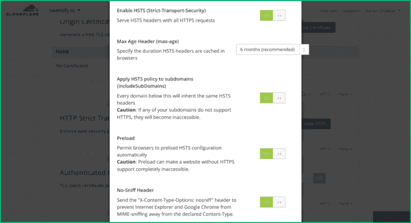

Screenshot of HSTS settings in Cloudflare**** ****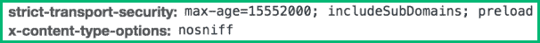

Headers that are added by Cloudflare to requests for your domain after you setup HSTS [as shown above](#a96c)**** 

****就是这样。你已经准备好向全世界展示你的网站了！？？如果你觉得这很有用，请❤️并分享它。****

********

****[Karan Thakkar](https://twitter.com/geekykaran) 是 [Crowdfire](https://www.freecodecamp.org/news/an-illustrated-guide-for-setting-up-your-website-using-github-cloudflare-5a7a11ca9465/undefined) - *你超级聪明的营销伙伴*的前端领导。他的[文章](https://bit.ly/hackingtwitter)之前已经在[赫芬顿邮报](https://www.freecodecamp.org/news/an-illustrated-guide-for-setting-up-your-website-using-github-cloudflare-5a7a11ca9465/undefined)上[专题报道过](https://bit.ly/geekyonhuffpo)。他喜欢在业余时间尝试新技术，已经建立了 [Tweetify](https://karanjthakkar.com/projects/tweetify) (使用 React Native)和 [Show My PR 的](https://showmyprs.com)(使用 Golang)。****

****他写的其他文章:****

****[**我是如何在短短 3 周内从 300 名粉丝增长到 5000 名粉丝的**](https://blog.markgrowth.com/how-i-grew-from-300-to-5k-followers-in-just-3-weeks-2436528da845)
[*# growth hacking 我在@Crowdfire Twitter 英超联赛的 Twitter 账户*blog.markgrowth.com](https://blog.markgrowth.com/how-i-grew-from-300-to-5k-followers-in-just-3-weeks-2436528da845)[**使用 Let's Encrypt Certbot 在您的亚马逊 EC2 NGINX box 上获得 HTTPS**](https://medium.freecodecamp.com/going-https-on-amazon-ec2-ubuntu-14-04-with-lets-encrypt-certbot-on-nginx-696770649e76)
[*Let ' s Encrypt 是一个新的认证机构，它提供免费的 SSL 证书(每周有一定的限额)。它…*medium.freecodecamp.com](https://medium.freecodecamp.com/going-https-on-amazon-ec2-ubuntu-14-04-with-lets-encrypt-certbot-on-nginx-696770649e76)****