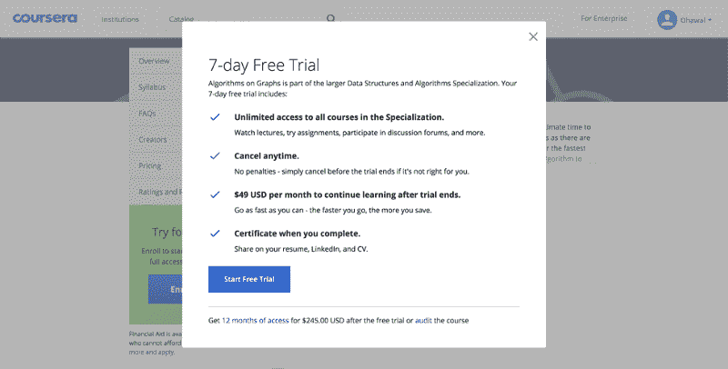
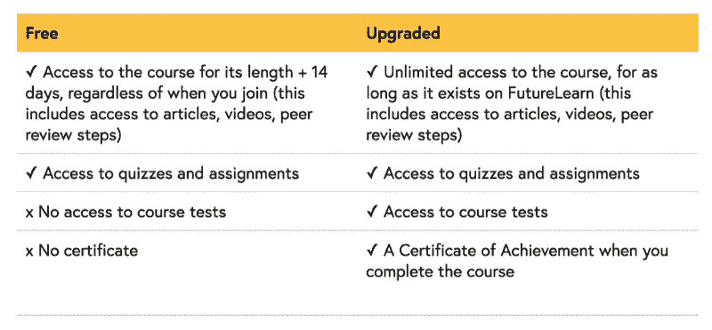

# 海量开放在线课程曾经是 100%免费的。但他们并没有就此止步。

> 原文：<https://www.freecodecamp.org/news/massive-open-online-courses-started-out-completely-free-but-where-are-they-now-1dd1020f59/>

2011 年，我参加了第一批大规模开放在线课程(MOOCs)中的一门。那时，一切都是 100%免费的:视频、作业和证书。但在 2017 年，你再也找不到这种免费的学习体验了。

随着 MOOC 提供商专注于寻找商业模式，他们开始将体验的某些方面置于付费墙之后，希望让更多人付费。MOOCs 从“免费”变成了“免费审计”。

免费证书是第一批从免费转向付费的项目。然后，分级作业被放在付费墙后面。现在，所有主要的 MOOC 提供商都在制作完全付费的课程，甚至连视频讲座都被锁在付费墙后面。

这种向免费增值模式的转变——有越来越多的机会进行追加销售——似乎对提供商有利。去年，排名前三的服务收入总和超过 1 亿美元。

每个提供商都有不同的模型，这可能会让学生感到困惑。因此，这里总结一下“免费”对四大 MOOC 玩家的实际意义。

### EdX

由哈佛大学和麻省理工学院联合创办的 edX 是唯一一家仍然免费提供分级作业的大型 MOOC 提供商。它也是最后一个废除免费证书的主要提供商(一直坚持到 2015 年底)。

edX 也提供某些完全不免费的课程，他们称之为专业教育。这些通常要花费数百美元。

但除此之外，所有的 edX 课程都是完全免费的，学生只要想获得证书就需要付费。

### Coursera

Coursera 积极调整其盈利模式，这可能会导致其课程工作方式的不断变化。不同的课程有不同的政策——这有时取决于它们何时推出以及当时的政策是什么。

很难涵盖每一种情况，所以让我们专注于适用于大多数课程的政策，这也反映了 Coursera 希望进入其中的方向。

Coursera 上的大部分新课程都是专业课程的一部分，是一系列引领“微型课程”的短期课程。

去年，Coursera [为他们的专业引进了订阅服务](https://www.edsurge.com/news/2017-01-27-coursera-s-new-strategy-takes-inspiration-from-netflix-and-linkedin)。只要学生想学习课程的高级部分，他们就可以按月付费，而不是按课程付费。在这种模式下，视频是免费观看的，但学生必须注册订阅才能获得证书和获得分级作业。

最近，Coursera 推出了 7 天免费订阅试用。对于想要免费访问课程视频的学生，他们需要点击右下方微小的“审核”链接，如上图截图所示。许多学生可能没有注意到这个链接是一个选项——如果他们一开始就知道“审计”是什么意思的话。

少数不属于任何专业的课程有时可以选择注册“审核模式”在这种情况下，即使是分级作业也是免费的(尽管你不能要求证书)。

很长一段时间，Coursera 有一个自由的财政援助政策。嗯，他们最近[取缔了它](https://www.class-central.com/report/coursera-free-trial-financial-aid/)。现在他们至少需要 15 天来回复经济资助申请。

### **未来电工**

FutureLearn 是英国开放大学全资拥有的 MOOC 提供商。它拥有近 600 万名学生，是全球五大 MOOC 提供商之一。

FutureLearn 从一开始就没有提供免费证书。但是最近，FutureLearn 引入了一种新的定价模式，一旦课程结束，就会限制对课程内容的访问。

在新的定价模式下，考试坐在付费墙后面(类似于 Coursera 的运作方式)。课程内容仍然可以免费访问，但只在课程期间以及课程结束后的两周内有效。

为了无限制地访问课程(注意:只要它存在于 FutureLearn 上)，学习者需要升级。这大约需要 30 到 90 美元。

2016 年底，FutureLearn [宣布](https://www.class-central.com/report/futurelearn-2016-review/)将与迪肯大学合作提供六个完全在线的研究生学位。为该学位开设的大部分课程都不是免费的。

### Udacity

与上面列出的其他 MOOC 提供商不同，Udacity 不与大学合作。相反，它更喜欢与科技公司合作。Udacity 还创建了自己的课程，这些课程有时由这些合作伙伴科技公司的人教授。

早在 2014 年 5 月，Udacity 就是第一家停止提供免费证书的 MOOC 提供商。它也不颁发个别课程的证书。相反，Udacity 提供了自己的专有微型证书，名为 Nanodegrees。纳米学位可能需要几个月才能完成，通常包括在线课程、人工评分项目和一些指导。

纳米学位的课程通常是免费的(尽管获得证书需要付费)。它们还包含一些基本的测验和交互式编码作业(大部分是 Python 语言)。

Udacity 最近[收购了 Terminal.com](https://www.class-central.com/report/udacity-acquires-terminal-com/)，并将把 Terminal.com 的交互式编码环境整合到它的 Nanodegrees 中。它可能不会成为免费课程的一部分。

MOOCs 免费的事实引发了人们对它们的广泛兴趣。学生们很兴奋，因为他们可以免费向世界上最好的老师学习。

事实上，这是我建立 [Class Central](https://www.class-central.com/) 的灵感所在——这样我就可以亲自跟踪所有这些新课程。

然后媒体变得非常兴奋，因为他们可以写一些关于大学即将消亡的标题。

但是，一旦炒作平息下来，MOOC 提供商试图赚钱，他们发现不收费很难做到这一点。

FutureLearn 的首席产品官马特·沃尔顿(Matt Walton)在谈到他们最近的价格变化时说:“我们进行的研究表明，证书本身并不能提供足够的价值，有些人不想要或不需要证书。”

所以 MOOC 付费墙不得不扩展到包括部分内容。

每一个 MOOC 提供商都扩大了他们的产品线，瞄准多个价格点，从几十美元到几万美元。MOOCs 里免费的东西一直在不断缩水。

没有真正的定价创新，MOOCs 将很难触及最大受益者。

我的帖子最初出现在[T2 的博客上。注册](https://www.edsurge.com/news/2017-04-20-moocs-started-out-completely-free-where-are-they-now) [**EdSurge 的每周高等教育时事通讯**](http://r20.rs6.net/tn.jsp?f=001QnAAFk9GXNYG6wUwEBvhawcJ9PWjgoRvTugatSggDmmXMyCYYvDe5ZZhck7i_OPHS_0su_OWbgBGBIEAoJ2tME2L_Ky556TqkGRruIVIWt4xr7HbuyzUOst18-jcG9woZBgftjXPsfnReMs0LP4hybKvFc4OhABTAHPUdOD4MWfhpQ4MuwPb5g==&c=cT408gOlo05c75Ma_PEMARJeva4OOCp8x7Xa4TQf6wjLrn4go9OuHQ==&ch=6uXc_T1AAphp6d1BWuSfFwR_NfuSoolineK9R2_PIgSEzdnDGP-K3A==) ，了解每周关于教育技术和教育未来的新闻更新、采访和辩论。