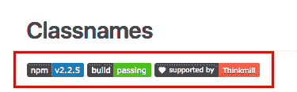
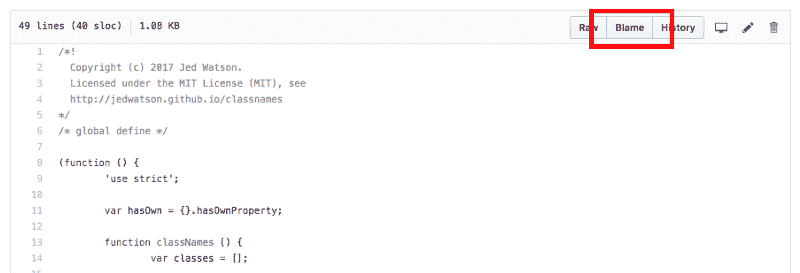
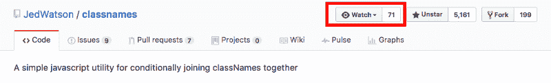

# 深思熟虑的实践:我从阅读类名代码库中学到了什么

> 原文：<https://www.freecodecamp.org/news/deliberate-practice-what-i-learned-from-reading-classnames-f9b89cb785e4/>

作者安东尼·吴

# 深思熟虑的实践:我从阅读类名代码库中学到了什么

Becoming an Open Sourcerer

这是我作为一名开发人员刻意练习提高的计划的一部分。请看一下[这篇文章](https://medium.com/@newyork.anthonyng/deliberate-practice-becoming-an-open-sourcerer-27a4f7640940)了解更多信息。

在本文中，我们将查看一个名为`classNames`的库(这里是 [GitHub 库](https://github.com/JedWatson/classnames))。`classNames`提供了一个简单的 API 来构造 React 中的类名。我们将看看它做了什么，以及我通过查看他们的回购学到了什么。

### 怎么用？

这个 API 非常简单。他们的 README.md 中有很好的例子。

您可以像这样传递字符串参数:

`classNames`也接受对象作为自变量。如果键的值是 falsy (false、null、undefined、0、NaN、空字符串)，`classNames`省略该值。

`classNames`也接受数组作为参数。使用上述规则递归地展平和处理数组参数。您可以混合和匹配不同类型的参数(字符串、数组、对象)。

### 与 React 一起使用

这个包的主要用例是使 React 的类名更容易使用。

如果没有`classNames`，您可能会使用字符串操作来创建 React 的类名。

现在有了`classNames`包，它看起来像这样:

### 常见错误:“未定义的”类名

我在工作中看到的使用`classNames`最常见的错误是`undefined`类名。

记住，falsy 值在`classNames`包中被忽略。

了解了这一点，我们可以将我们的`classNames`示例更新为:

### 您可以选择的不同版本:重复数据删除

你可能会遇到两个问题。你看到他们了吗？

幸运的是，`classNames`提供了一个可选版本的库供我们使用，名为`dedupe`。

这还差不多。注意`dedupe`比默认的`classNames`包大约慢 5 倍。仅在需要时使用。

### 您可以选择的不同版本:Bind

`bind`是`classNames`的另一个选择加入版本。这是为了帮助我们在 React 中使用 CSS 模块。但是我发现默认的`classNames`包很适合 CSS 模块。

查看 [README.md](https://github.com/JedWatson/classnames#alternate-bind-version-for-css-modules) 了解更多信息。

### Object.create(空)

迭代对象的键时，最好使用`hasOwnProperty`。您可以检查该键是属于对象的，还是继承的。

我们将使用`hasOwnProperty`来获取属于我们创建的对象的属性。

不使用`hasOwnProperty`，我们可以创建一个不继承任何东西的新对象！

但这也意味着对象继承的方法，比如 [toString](https://developer.mozilla.org/en-US/docs/Web/JavaScript/Reference/Global_Objects/Object/toString) 将不会存在于这个新对象上。

### 令人敬畏的文档和伟大的测试

来看看`classNames`的源代码。它充满了惊人的评论和文档。

出色的文档并不是开源项目的专利。

你有没有发现一个很棒的代码片段，用在你的个人项目中？你是否花了数小时寻找完美的 StackOverflow 答案？将这些链接作为注释包含在您的代码中！这将节省其他开发人员(以及未来的您)弄清楚发生了什么的时间。

README.md 上有令人惊奇的文档，它有丰富的例子来展示这个包能做的一切。

文档和评论都很棒。然而，它们可能会腐烂，变得与代码实际做的事情不同步。但是测试不会说谎！写得好的测试会告诉你这个包应该能做什么和不能做什么。如果你是一个图书馆的新手，可以看看他们的测试来更好地了解这个图书馆。

### 申请/致电

知道如何使用 JavaScript 的`apply`和`call`是很棒的面试问题。但是我很少在现实世界中使用它们。在`classNames`包装中看到它是一个很好的复习。

`apply`和`call`基本上做的是同一件事。它设置调用函数的`this`。

举个例子，

当您想要将参数传入调用函数时，就会有所不同。让我们来看一个接受参数的函数。

请注意这里的细微差别。`apply`在一个数组中接受它的参数(我记得它是通过记住`apply`和`array`都以`a`开始)。`call`接受单独提供的参数，就像普通函数一样。

`classNames`使用`apply`来处理传递给它的数组参数。

### 不要相信任何东西

看看下面的代码片段。

为什么我们要将`hasOwnProperty`函数保存到一个变量中？这是因为我们必须对给出的论点进行辩护。我们从`Object.prototype`中抓取`hasOwnProperty`。我们来看看为什么。

有道理。但是如果有人递给我们一个这样的物体呢:

使用`Object.prototype`中的`hasOwnProperty`功能是更安全的选择。

但是请注意，即使这样也不是万无一失的。下面还是有可能的。

### HTML 实体

我总是忘记 HTML 实体。我总是寻找漂亮的图像，但是使用 HTML 实体得到了很好的支持，并且可以为您节省对图像的 HTTP 请求。

在你开始搜索谷歌图片寻找资产之前，看看这张[图](https://dev.w3.org/html5/html-author/charref)，看看它是否有你需要的。

### 基准性能

你不需要再和你的同事争论`for-loops`对`for-each loops`！您可以通过使用基准测试工具(如 [jsPerf](https://jsperf.com/) )查看它的表现来解决所有争议。

许多人下载并使用，性能是最受关注的问题。在接受任何“拉”请求之前，会检查性能差异。

您的个人项目可能与性能无关。但是记住性能是有好处的。花几分钟时间使用 [jsPerf](https://jsperf.com/) 并设置您自己的测试。

### 特拉维斯. yml

Fancy badges from `classNames README.md`

有兴趣在您的自述文件中添加精美徽章吗？看看 Kent C. Dodds 关于开始你自己的开源项目的这个伟大的[理论家教程](https://egghead.io/lessons/javascript-how-to-write-a-javascript-library-introduction)。它涵盖了经常被忽略的主题，比如设置持续集成、使用语义发布、发布到 npm 等等。

### 谴责、追随、历史

你有没有碰到过某一行代码，并对它是如何产生的感到好奇？使用 Github 网站上的`git blame`功能。它会告诉你它是什么时候写的，谁写的，以及它是从哪里提交的。

git blame

您还可以通过使用位于`git blame`旁边的`git history`，查看文件的历史并了解它是如何发展的。查看所有提交向您展示了某个文件是如何随着时间的推移而发展的。

我建议你找到一个你喜欢并使用的开源项目，并开始为它做出贡献。您可以`watch`一个存储库，并在有任何更新时获得通知。您可能还没有准备好推动代码更改。但是更新文档或帮助他人解决问题也是很有价值的。

watch

感谢你阅读这篇文章，我希望你学到了新的东西。