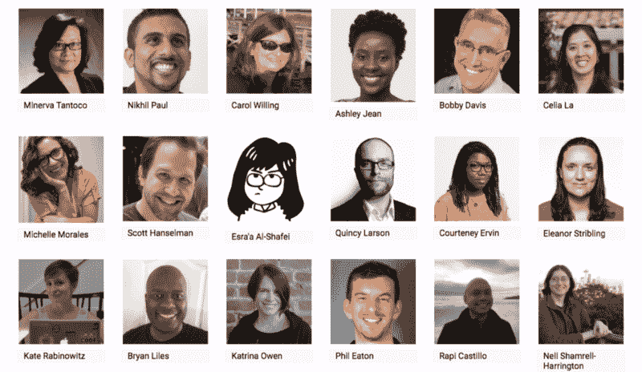
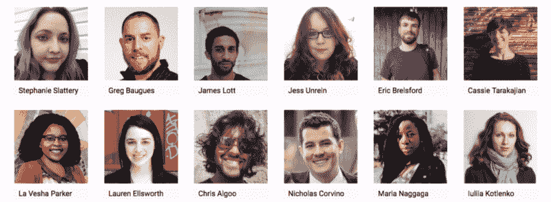
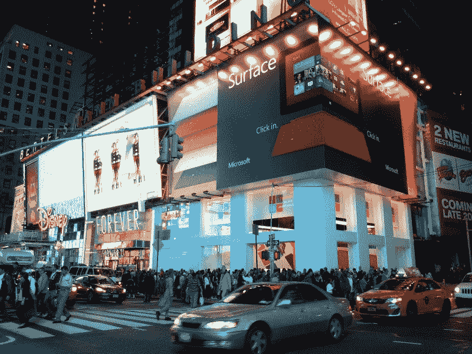

# Codeland 内部——迄今为止最具包容性的开发者大会

> 原文：<https://www.freecodecamp.org/news/inside-codeland-the-most-inclusive-supportive-developer-conference-yet-5f01cadf0a42/>

我刚从纽约回来，在那里我经历了一种新的开发者大会——一种强调包容和鼓励高于一切的大会。

Codeland 是一个开发者——Saron Yitbarek——的愿景，并通过几十名志愿者和贡献者的辛勤工作得以实现。

萨隆运营着 [CodeNewbie 社区](http://www.codenewbie.org/)并主持每周 [CodeNewbie 播客](http://www.codenewbie.org/podcast)。多年来，她帮助非传统的学习者进入编码领域，然后在他们向软件开发过渡的过程中保持动力。

但是组织一个为期两天的会议，有几十个演讲者、小组成员和研讨会负责人参加，这是一个完全不同的挑战。

以下是她是如何做到的。

### 建立代码区

Saron 第一次向我提到 Codeland 是在 2016 年 10 月。此时，她已经在计划这个活动了。她选择了日期和地点:微软时代广场园区。

Saron 将 Codeland 描述为“来自所有技能水平和背景的程序员的两天演示、会谈、小组讨论和研讨会。”

在接下来的几个月里，出现了一批演讲者，其中包括纽约市的首席技术官 Minerva Tantoco。

萨隆还召集了一批热情的志愿者，包括她不知疲倦的丈夫和 CodeNewbie 制作人罗布。

萨隆不遗余力地亲自确保会谈和研讨会尽可能高质量。在 Codeland 之前的几个月里，她与每位演讲者进行了一系列一对一的视频通话。

我参加了几十个科技会议，并在几个会议上做了演示，但我从未经历过任何相关人员的这种水平的个人辅导——更不用说活动组织者本人了。

这是一个单一轨道的会议，所以每 15 分钟的报告必须引人注目和简洁。

Saron 帮助我决定了一个最适合我的专业领域的主题。然后，她指导我把所有东西浓缩到最基本的东西。我给她讲了几次，每次她都能找到新的方法来改进。

周四早上，我登上了飞往纽约的飞机，兴奋地看到萨隆为我和其他 300 名与会者准备的一切。

### 进入科普兰

Microsoft’s Times Square office ([photo credit](https://www.flickr.com/photos/squirrel02/8126292822))

当我走进去的时候，志愿者们向我打招呼，并给了我一本螺旋形的小册子，里面有日程表、演讲人的传记和一份全面的行为准则。

有一件事变得很明显，那就是有多少女性参加了。尽管这个活动是针对所有人的，但女性的数量远远超过了男性——这是我在科技会议上从未经历过的。

Codeland 的门票相对便宜，因此它吸引了比典型的技术会议更广泛的社会经济层面的开发人员和学习编码的人。参加者也可以选择支付稍微多一点的钱来资助奖学金。

其中一位奖学金获得者是查克·菲普斯，他最近写了一篇关于[在 60 多岁学习编程是什么感觉的文章](https://medium.com/startup-grind/i-am-enter-your-age-here-is-that-too-late-to-become-a-developer-58e926799af4)。

这些奖学金甚至涵盖了儿童保育，以便家长能够参加。

会场展示了各种互动艺术。

喝了点咖啡和早餐后，大约 300 名与会者聚集在一个房间里，这个房间太宽了，需要三台投影仪。萨隆欢迎每一个人，并以她典型的精力充沛的方式，为即将到来的事情定下了基调。

会谈涉及了广泛的话题——从如何为开源做出贡献到如何向导师寻求帮助。开发者分享他们建立的项目和组织。

在谈话间隙，与会者并没有尴尬的伸手去拿手机。相反，他们求助于他们的邻居。每个和我有眼神接触的人都会立刻和我打招呼。然后我们开始讲述我们自己的编码之旅，以及我们的近期目标。

每天快结束时，活动的司仪 Nikhil Paul 会教大家一些宝莱坞舞蹈动作。房间里的每个人都会随着宝莱坞圣歌即兴起舞。

[Scott Hanselman](https://www.freecodecamp.org/news/inside-codeland-the-most-inclusive-supportive-developer-conference-yet-5f01cadf0a42/undefined) 发表了关于虚拟服务器和云的 50 分钟主题演讲。如果我们是在夜总会，你会很容易把他的讲话误认为单口相声。

斯科特的演讲在他使用虚拟机模拟运行 Windows 3.1 的旧电脑时达到高潮——在他母亲地下室的 3D 虚拟现实代表中。

我在 Codeland 最痛苦的时刻之一是在第一天结束时，当我们走出微软办公室的时候。在去电梯的路上，迎接我们的是 Codeland 志愿者。他们为我们鼓掌欢呼！

第二天从 3 小时的分组研讨会开始，主题包括 Docker、聊天机器人和编码虚拟现实游戏。然后是关于工作与生活平衡等主题的小组，以及由谷歌和 Genius 等公司的招聘人员领导的雇主小组。

萨隆感谢了所有的发言人和志愿者，结束了大会。她做了一个强有力的演讲，使每个人都站了起来。

> "科德兰是我写给你们所有人的情书."— [萨隆·伊特巴雷克](https://www.freecodecamp.org/news/inside-codeland-the-most-inclusive-supportive-developer-conference-yet-5f01cadf0a42/undefined)

我参加过很多科技会议，但从来没有像这样的。

我从这些新开发人员身上学到了很多——关于他们的抱负、他们面临的挑战以及他们进入这个领域的意愿。

我还交了新朋友，在未来的几年里，我会和他们保持联系。

我也对自己了解了很多。

我期待着回到那个神奇的地方，那就是科德兰。在那之前，爱每一个参与的人。

我只写编程和技术。如果你在推特上关注我，我不会浪费你的时间。？