# 硬件基础:微控制器到底是什么？

> 原文：<https://www.freecodecamp.org/news/hardware-fundamentals-what-exactly-is-a-microcontroller-8a502a3650dc/>

作者 Taron Foxworth

# 硬件基础:微控制器到底是什么？

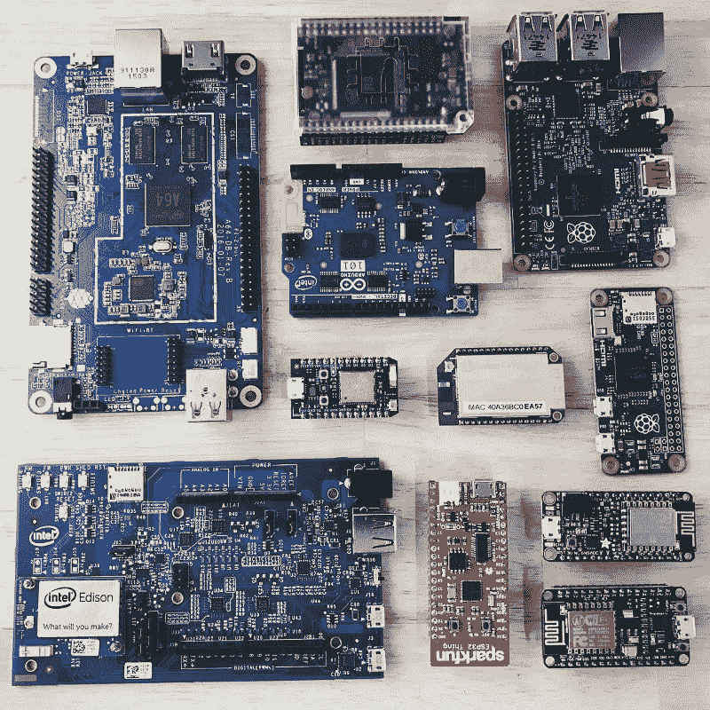

从根本上来说，微控制器就是一台微型计算机。

然而，作为一台“微型计算机”并不能真正告诉我们太多。所以我们再深入一点。许多人将微控制器与 Arduino 联系在一起。但是需要指出的是 **Arduino 不是微控制器**。Arduino 是一个跨越软件和硬件的完整平台。

Arduino 制造类似于 Arduino Uno 的设备:

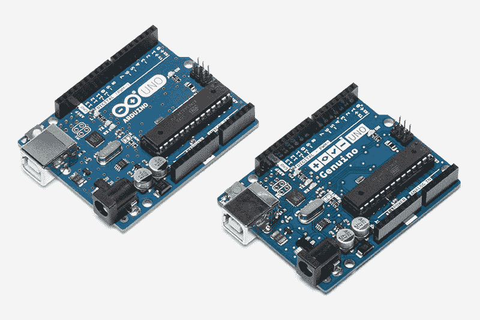

Arduino Uno

Arduino Uno 也不是微控制器。这是一个基于 Atmel ATmega328P 微控制器的分线板。

以下是 Atmel 微控制器的外观:

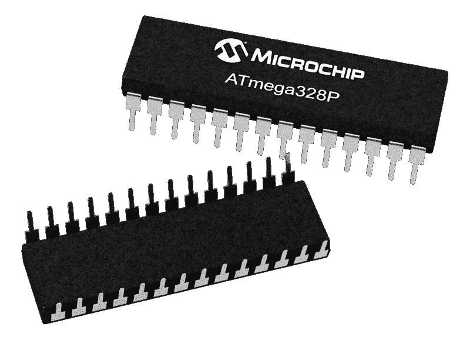

如果你手头只有 Atmel 微控制器，作为一个初学者，它不会很有用。这就是分线板的用武之地。

分线板将微控制器上的引脚“分割”成一个更大的设备(如 Arduino Uno)。这个更大的器件使微控制器更容易使用。

对于 Arduino Uno，分线板让您能够插入 USB 线，给它供电，对设备进行编程，等等。

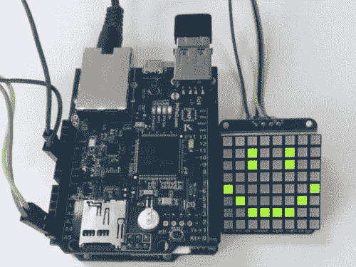

[Image credit](https://www.hackster.io/hmkim/remote-controlled-8x8-led-matrix-e2b79a?ref=part&ref_id=8233&offset=18)

如果没有分线板，对于初学者来说，这将是一项艰巨的任务。这个问题正是 Arduino 存在的原因——让你学习硬件变得超级容易。

### 啊，就像覆盆子酱？

嗯，不完全是。Arduino 和 Raspberry Pi 在定义上仍然是计算机。但是树莓派被认为是[单板机](http://maxembedded.com/2013/07/introduction-to-single-board-computing/)。单板计算机是[建立在一块电路板上的全计算机](https://en.wikipedia.org/wiki/Single-board_computer)。

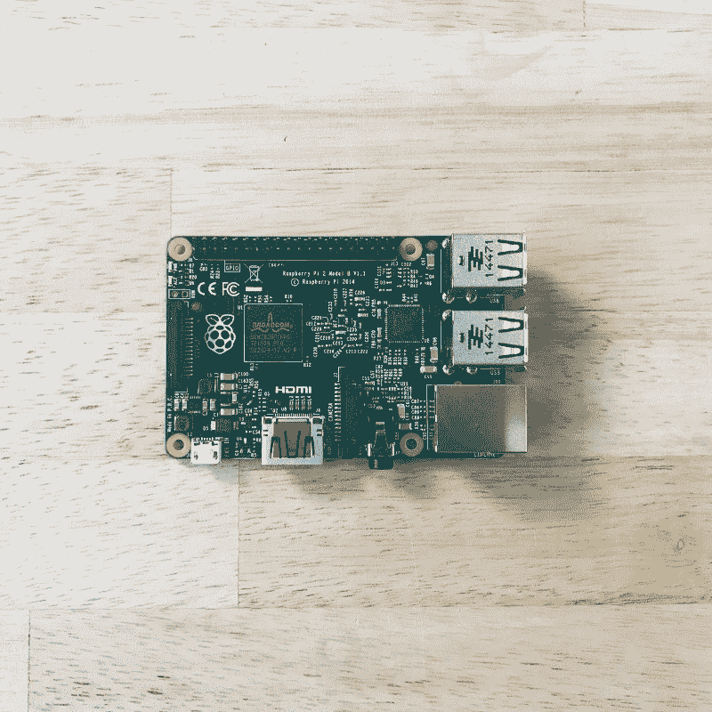

A Raspberry Pi

从技术上讲，你的笔记本电脑也是一台单板电脑——只是功能强大而已。Raspberry Pi 是笔记本电脑中相同硬件的简单版本。就像你的笔记本电脑运行操作系统(Windows、Mac 或 Linux)一样，Raspberry Pi 运行 Linux 操作系统。

现在，回到微控制器。微控制器不能运行操作系统。微控制器也没有大多数单板计算机那样的计算能力或资源。

一个微控制器只会重复运行一个程序，而不是一个完整的操作系统。我们可以在 Arduino 程序中看到这一点，因为它们只需要两个函数:`Setup`和`loop`。`Setup`将运行一次，`loop`将无限期运行。

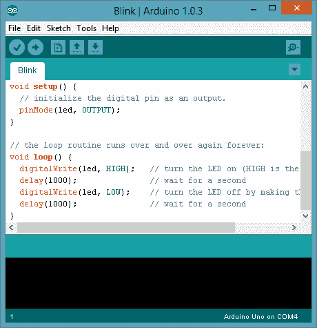

Setup and Loop

### 那么，什么是微控制器呢？

微控制器是一种带有低内存和可编程输入/输出外设的小型计算机。

#### 输入/输出

你可能知道，计算机的一切最终都是以二进制(0 或 1)开始的。

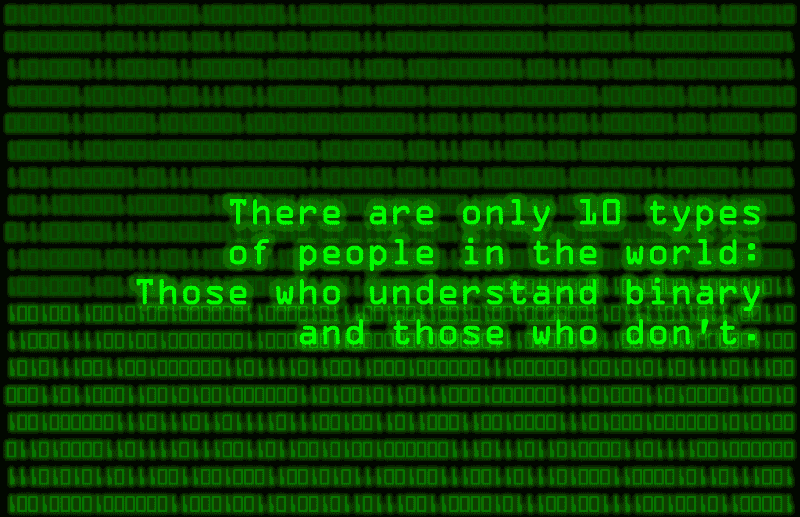

输入意味着微控制器将读取二进制。输入的一个例子是传感器。

输出意味着微控制器将发送二进制。输出的一个例子是控制电机或 LED。

### 为什么我们需要微控制器？

嗯，在我们有了今天你所知道的计算机的概念之前，这些是“计算机”。微控制器之所以停滞不前，是因为一些计算任务极其琐碎，需要简单的逻辑。例如，扳动开关或控制小组件(如 LED 灯)不需要我们发送电子邮件等日常任务所需的资源。

我们今天使用它们是因为它们的低功耗和低内存使它们成本低廉。微控制器是今天[物联网](https://en.wikipedia.org/wiki/Internet_of_things)成为可能并取得成功的部分原因。

### 我如何得到一个？

你想要哪个微控制器取决于你想要解决哪个问题。如果你正在做一些简单的事情——开关东西，或者读取传感器——几乎任何微控制器都可以。

如果你想玩游戏或有更复杂的想法，你将需要更多的计算能力，所以你需要升级到单板计算机，如树莓 Pi。

阿达果和 [Sparkfun](https://www.sparkfun.com/) 都有大量令人惊叹的装备和硬件。你也可以利用他们的教程。

Losant 也有一些很酷的[套装](https://docs.losant.com/getting-started/losant-iot-dev-kits/builder-kit/)可供选择。你可以制作自己的[门传感器](https://docs.losant.com/getting-started/losant-iot-dev-kits/door-sensor-kit/)——当门开得太久时会收到通知。

如果你没有想要解决的具体问题，就随便拿些硬件玩玩吧。

以下是您可以购买的一些物品:

#### 1.一块叫做 [NodeMCU](http://amzn.to/2oyalUf) 的板。

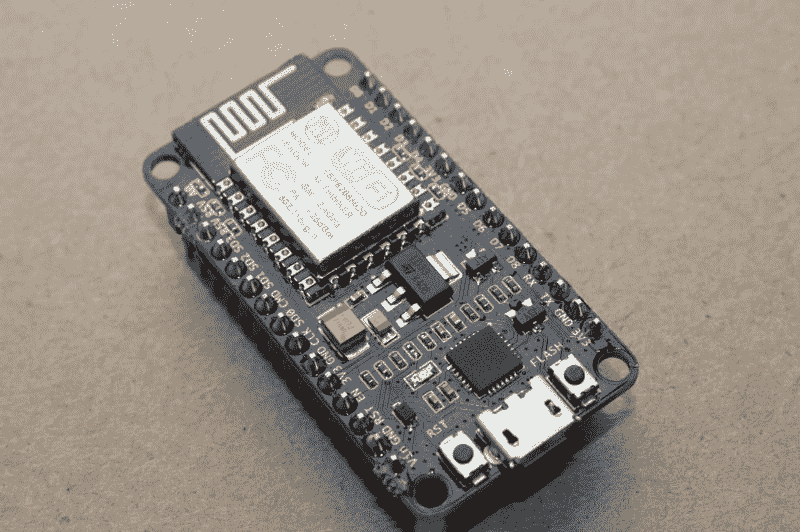

Node MCU

[NodeMCU](http://amzn.to/2p3YDEu) 是基于 ESP8266 微控制器的电路板。这款主板很特别，因为它很便宜，而且支持 WiFi。它在亚马逊上只卖 8.79 美元，在易趣上更便宜。

并非所有微控制器都支持 WiFi。事实上，这款产品为您利用这款设备构建大量项目打开了大门。例如，您可以收集数据并将其发送到云☁️.

#### 2.你需要一些[传感器](http://amzn.to/2ocLN7O)

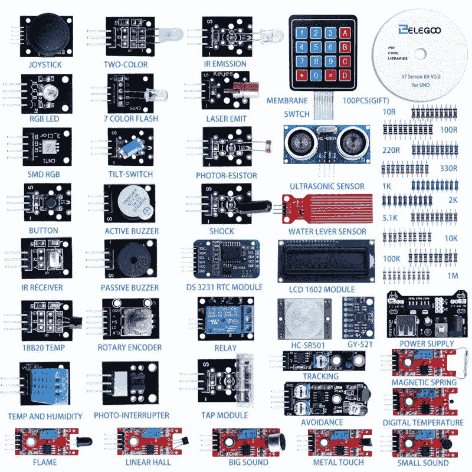

Bread Board

没有传感器就没有硬件。传感器赋予你探测周围环境和世界的能力。它们也是学习的好工具。

#### 3.你需要一个[试验板](http://amzn.to/2oul4zW) & [跳线](http://amzn.to/2p0stYM):

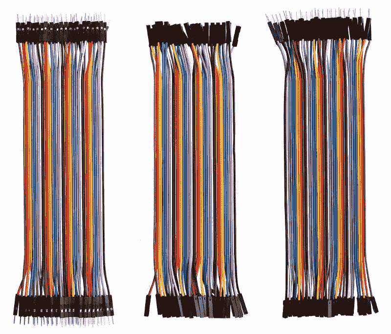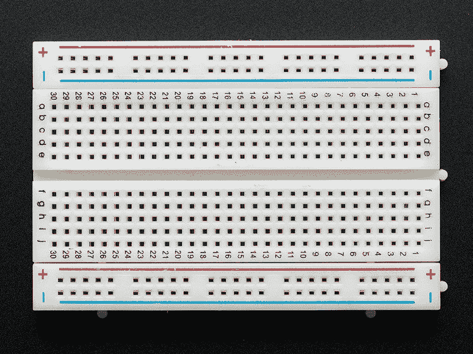

要将传感器和微控制器连接在一起，您必须将它们插入试验板，并使用跳线连接它们。

记住:在易贝的和全球速卖通的[的](https://www.aliexpress.com/)什么都便宜。你只需要等几个星期就可以发货了

### 我应该建立什么？

再说一次——我怎么强调都不为过——在头脑中有一个项目更容易开始。既然你已经了解了什么是微控制器以及如何得到一个微控制器，那就换个角度看看你周围的世界吧。你能控制什么？你能自动化什么？一旦你开始回答这些问题，你就会找到一个项目。

在考虑项目时， [Hackster](https://www.hackster.io/) 是你最好的朋友。Hackster 有很多 [ESP8266 项目](https://www.hackster.io/esp)和一些很酷的 Arduino 项目:

例如，你可以实现儿时的梦想。

你甚至可以制造机器人。

关键是，你只需要一个想法。

有时候给真实世界编程比给虚拟世界编程更有趣。

### 下一步是什么？

微控制器只是开始。你有一个硬件的世界要探索。快乐黑客？？

#### 延伸阅读:

Arduino 的绝对初学者指南
[*圣诞假期，我想学点新东西。我关注 Arduino 已经有一段时间了，而且…* forefront.io](http://forefront.io/a/beginners-guide-to-arduino/)

[*Taron fox worth*](https://twitter.com/anaptfox)*是硬件黑客，也是 [Losant](https://www.losant.com) 的开发者布道者。他的目标是翻译技术，让人们学习、喜爱和受到启发。*