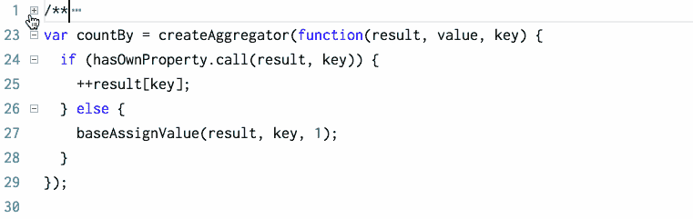

# 在代码中加入注释:好的、坏的和丑陋的。

> 原文：<https://www.freecodecamp.org/news/code-comments-the-good-the-bad-and-the-ugly-be9cc65fbf83/>

如果你以前听过这个，请阻止我…

> "好的代码是自文档化的."

在 20 多年以写代码为生的经历中，这是我听到最多的一句话。

这是陈词滥调。

像许多陈词滥调一样，它有一个真理的内核。但是这个真理被如此滥用，以至于大多数说出这句话的人都不知道它真正的意思。

是真的吗？**是**。

这是否意味着你永远不应该注释你的代码？**否**。

在这篇文章中，我们将看看在评论你的代码时好的、坏的和不好的地方。

首先，实际上有两种不同类型的代码注释。我把它们叫做**文档评论**和**澄清评论**。

### 文档注释

文档注释是为那些可能会使用你的源代码，但不太可能通读它的人准备的。如果您正在构建其他开发人员将使用的库或框架，您需要某种形式的 API 文档。

API 文档离源代码越远，随着时间的推移就越有可能变得过时或不准确。减轻这种情况的一个好策略是将文档直接嵌入到代码中，然后使用工具提取它。

这里有一个来自一个叫做 [Lodash](https://lodash.com) 的流行 JavaScript 库的文档注释的例子。

如果你[将这些评论与他们的在线文档](https://lodash.com/docs/#countBy)进行比较，你会发现它们完全一致。

如果你写文档注释，你应该确保它们遵循一个一致的标准，并且很容易与你想要添加的任何内联澄清注释区分开来。一些流行且受到良好支持的标准和工具包括用于 JavaScript 的 [JSDoc](http://usejsdoc.org) ，用于 dotNet 的 [DocFx](https://github.com/dotnet/docfx) ，以及用于 Java 的 [JavaDoc](http://www.oracle.com/technetwork/java/javase/documentation/index-jsp-135444.html) 。

这种注释的缺点是，它们会使您的代码非常“嘈杂”,对于任何积极参与维护它的人来说都难以阅读。好消息是，大多数代码编辑器支持“代码折叠”,这允许我们折叠注释，以便我们可以专注于代码。



Collapsing comments with code folding in Visual Studio Code.

### 澄清意见

澄清注释适用于任何可能需要维护、重构或扩展代码的人(包括未来的自己)。

通常，澄清注释是一种代码味道。它告诉你你的代码太复杂了。您应该努力删除澄清注释并简化代码，因为“好的代码是自文档化的”

这里有一个[不好的例子](http://stackoverflow.com/a/766363)——虽然很有趣——澄清评论。

```
/*  * Replaces with spaces  * the braces in cases  * where braces in places  * cause stasis.**/ $str = str_replace(array("\{","\}")," ",$str);
```

与其用一个巧妙的押韵来修饰一个有点混乱的陈述——在 *amphibrach dimeter* 中也是如此——作者还不如把时间花在一个让代码本身更容易阅读和理解的函数上。也许一个名为`removeCurlyBraces`的函数调用了另一个名为`sanitizeInput`的函数？

不要误解我的意思，有些时候——尤其是当你在繁重的工作中苦苦挣扎的时候——注入一点幽默对灵魂有好处。但是当你写一个滑稽的注释来弥补糟糕的代码时，它实际上使人们不太可能在以后重构和修复代码。

你真的想成为那个负责抢夺所有未来编码者阅读那首聪明的小诗的快乐的人吗？大多数编码人员会笑着继续工作，忽略代码的味道。

也有一些时候，你会遇到一个多余的评论。如果代码已经简单明了，就没有必要添加注释。

比如，不要做这种无聊的事情:

```
/*set the value of the age integer to 32*/int age = 32;
```

尽管如此，有时无论你对代码本身做什么，澄清注释仍然是必要的。

通常，当您需要向非直观的解决方案添加一些上下文时，就会出现这种情况。

这是洛达什的一个好例子:

```
function addSetEntry(set, value) {     /*    Don't return `set.add` because it's not chainable in IE 11\.  */    set.add(value);      return set;  }
```

也有很多时候——经过大量的思考和实验——看似幼稚的解决问题的方法实际上是最好的。在这种情况下，几乎不可避免的是，其他一些编码人员会认为他们比你聪明得多，并开始篡改代码，结果却发现你的方式一直是最好的方式。

有时候，另一个编码者就是你未来的自己。

在这种情况下，最好给大家省点时间和尴尬，留下评论。

模拟注释后面的[完美地捕捉到了这个场景:](http://stackoverflow.com/a/482129)

```
/**Dear maintainer: Once you are done trying to 'optimize' this routine,and have realized what a terrible mistake that was,please increment the following counter as a warningto the next guy: total_hours_wasted_here = 42**/
```

再说一遍，上面说的更多的是有趣，而不是有用。但是你应该留下评论，警告其他人不要追求一些看似明显的“更好的解决方案”，如果你已经尝试并拒绝了它。当你这样做的时候，评论应该详细说明你尝试了什么解决方案，以及你为什么决定不采用它。

这里有一个简单的 JavaScript 例子:

```
/* don't use the global isFinite() because it returns true for null values*/Number.isFinite(value)
```

### 丑陋的

所以，我们已经看到了好的和坏的，但是丑陋的呢？

不幸的是，在任何工作中，你都会有沮丧的时候，当你以写代码为生时，在代码注释中发泄这种沮丧是很有诱惑力的。

用足够多的代码库工作，你会遇到从愤世嫉俗和沮丧到黑暗和卑鄙的评论。

像[这样看似无害的东西](http://stackoverflow.com/a/185550) …

```
/*This code sucks, you know it and I know it.  Move on and call me an idiot later.*/
```

…对着[彻头彻尾的意思是](http://stackoverflow.com/a/184673)

```
/* Class used to workaround Richard being a f***ing idiot*/
```

这些事情可能看起来很有趣，或者可能有助于释放一点挫折，但是当它们成为生产代码时，它们最终会使编写它们的编码人员和他们的雇主看起来不专业和刻薄。

不要这样。

如果你喜欢这篇文章，请多次点击掌声图标来帮助传播。如果你想阅读更多类似的东西，请注册下面我的每周开发掌握时事通讯。