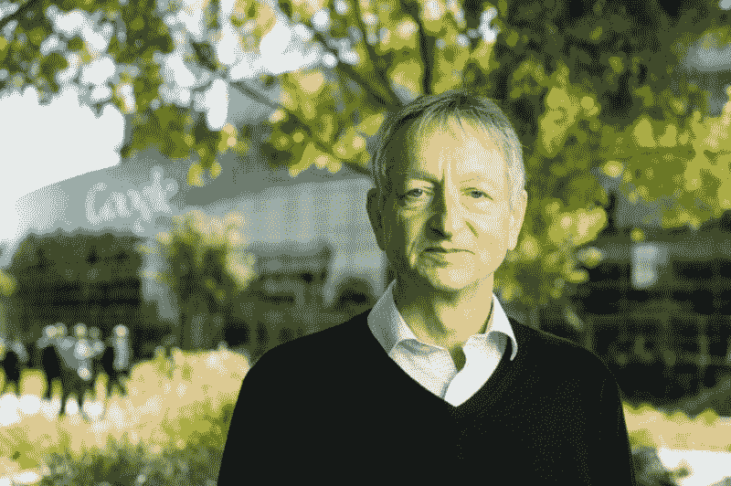
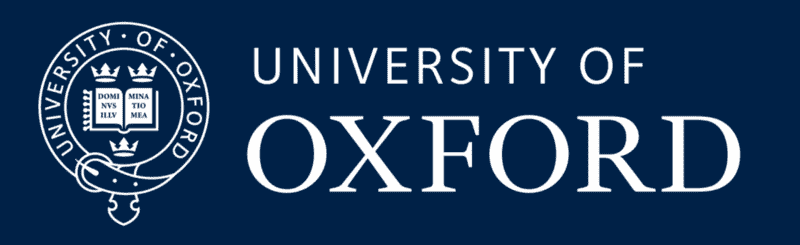
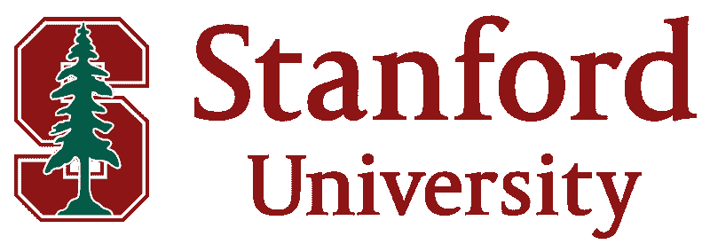
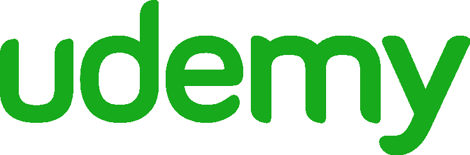

# 通过 15 门免费在线课程深入学习

> 原文：<https://www.freecodecamp.org/news/dive-into-deep-learning-with-these-23-online-courses-bf247d289cc0/>

大卫·文丘里

# 通过 15 门免费在线课程深入学习

[Inceptionism: Going deeper into Neural Networks](https://photos.google.com/share/AF1QipPX0SCl7OzWilt9LnuQliattX4OUCj_8EP65_cTVnBmS1jnYgsGQAieQUc1VQWdgQ?key=aVBxWjhwSzg2RjJWLWRuVFBBZEN1d205bUdEMnhB) by Mike Tyka

每天都有关于深度学习如何改变我们周围世界的新头条。几个例子:

*   [深度学习算法诊断皮肤癌以及经验丰富的皮肤科医生](https://www.extremetech.com/extreme/243352-deep-learning-algorithm-diagnoses-skin-cancer-seasoned-dermatologists)
*   [Amazon Go:深度学习和人工智能将如何改变零售业](https://www.geospatialworld.net/amazon-go-deep-learning-ai-retailing/)
*   [深度学习让无人驾驶汽车更好地识别行人](http://spectrum.ieee.org/cars-that-think/transportation/advanced-cars/deep-learning-makes-driverless-cars-better-at-spotting-pedestrians)

想看看大惊小怪是怎么回事吗？希望掌握技术内容以推进您的职业生涯或创办自己的公司？我探索了开源项目 [Class Central](https://www.class-central.com/) ，发现了 31 门在线课程(其中 15 门完全免费)，涵盖了从深度学习的基础到当今最前沿的研究。

Class Central’s [homepage](https://www.class-central.com/).

在我们开始之前，你可能会问自己:“深度学习到底是什么？”这里有一个简洁的描述:

> “深度学习是机器学习的一个子领域，涉及受大脑结构和功能启发的算法，称为人工神经网络。”

> ——来自[机器学习大师](http://machinelearningmastery.com/what-is-deep-learning/)的杰森·布朗利

事不宜迟…

### 在线深度学习课程

[**深度学习与 TensorFlow 的创意应用**](https://www.class-central.com/mooc/6679/kadenze-creative-applications-of-deep-learning-with-tensorflow)
*via kaden ze*
★★★★([14 评分](https://www.class-central.com/mooc/6679/kadenze-creative-applications-of-deep-learning-with-tensorflow#reviews))

我们涵盖了深度学习的基本组件，它意味着什么，它是如何工作的，并开发了构建各种算法所需的代码，如深度卷积网络，变分自动编码器，生成对抗网络和递归神经网络。本课程的重点不仅在于理解如何构建这些算法的必要组成部分，还在于如何应用它们来探索创造性的应用。有免费和付费两种选择。

著名评论(作者: [Christopher Kelly](https://www.class-central.com/mooc/6679/kadenze-creative-applications-of-deep-learning-with-tensorflow#review-18930) ): *“我有计算机科学的本科学位……我在可汗学院和 Coursera 上花了很多时间，我被这门课程内容的质量和专业性深深打动了。强烈推荐！”*

[**用于机器学习的神经网络**](https://www.class-central.com/mooc/398/coursera-neural-networks-for-machine-learning)
*多伦多大学 via Coursera*
★★★★([18 评级](https://www.class-central.com/mooc/398/coursera-neural-networks-for-machine-learning#reviews))

了解人工神经网络以及它们如何用于机器学习，如应用于语音和对象识别、图像分割、建模语言和人类运动等。我们将强调基本算法和让它们正常工作所需的实用技巧。有免费和付费两种选择。

著名评论(Bobby Brady):*这是你一生中向伟大球员学习的机会之一。Geoffrey Hinton 是 20 世纪 80 年代从事人工智能和神经网络工作的最重要和最有影响力的研究人员之一。目前，他正在与谷歌合作开展人工智能/深度学习计划。”*

*Geoffrey Hinton, the “godfather of deep learning,” who teaches [Neural Networks for Machine Learning](https://www.class-central.com/mooc/398/coursera-neural-networks-for-machine-learning)*

[**程序员实用深度学习，Part 1**](https://www.class-central.com/mooc/7887/practical-deep-learning-for-coders-part-1)
*fast . ai*
★★★☆([3 评分](https://www.class-central.com/mooc/7887/practical-deep-learning-for-coders-part-1#reviews))

这个为期 7 周的课程是为任何至少有一年编程经验，并对高中数学有一些记忆的人设计的。你将从第一步开始——学习如何让 GPU 服务器在线适合深度学习——并一直到为计算机视觉、自然语言处理和推荐系统创建最先进、高度实用的模型。免费。

杰出评论(匿名作者: ): *“这真的是一颗隐藏在快速增长领域的宝石。杰瑞米·霍华德做了出色的工作，既走过的基础，并提出了国家的艺术成果。我一次又一次感到惊讶，他不仅展示了去年开发的材料，甚至在课程开始的一周内…你通过 Kaggle 竞赛在真实生活数据上练习。我强烈建议任何希望从零真实世界经验走向与该领域专家竞争的人学习这门课程。”*

[**6。S191:深度学习入门**](https://www.class-central.com/mooc/8083/6-s191-introduction-to-deep-learning)
*麻省理工学院*
★★★☆([1 评分](https://www.class-central.com/mooc/8083/6-s191-introduction-to-deep-learning#reviews))

为期一周的深度学习方法介绍，包括机器翻译、图像识别、游戏、图像生成等应用。这是一门协作课程，包含 TensorFlow 中的实验室、同行集思广益以及讲座。免费。

[**6。S094:自动驾驶汽车深度学习**](https://www.class-central.com/mooc/8132/6-s094-deep-learning-for-self-driving-cars)
*麻省理工学院*
★★★☆([1 评分](https://www.class-central.com/mooc/8132/6-s094-deep-learning-for-self-driving-cars#reviews))

本课程通过构建自动驾驶汽车的应用主题，介绍深度学习的实践。它对初学者开放，是为那些机器学习新手设计的，但它也可以让该领域的高级研究人员受益，他们正在寻找深度学习方法及其应用的实用概述。免费。

[**深度学习**](https://www.class-central.com/mooc/5681/udacity-deep-learning)
*Google via uda city*
★★☆☆([20 收视率](https://www.class-central.com/mooc/5681/udacity-deep-learning#reviews))

在本课程中，您将对深度学习的动机有一个清晰的理解，并设计从复杂和/或大规模数据集学习的智能系统。你将学会解决曾经被认为极具挑战性的新问题，并在使用深度学习方法毫不费力地解决这些问题时，更好地理解人类智能的复杂本质。免费。

[**自然语言处理深度学习**](https://www.class-central.com/mooc/8097/deep-learning-for-natural-language-processing)
*牛津大学*

这是一门应用课程，着重于使用递归神经网络分析和生成语音和文本的最新进展。介绍了相关机器学习模型的数学定义，并推导了相应的优化算法。

这门课程是免费的，由菲尔·布兰森领导，与 T2 的 DeepMind 自然语言研究小组合作完成。

The University of Oxford is one of the world’s leading academic institutions and one of the oldest. They teach [Deep Learning for Natural Language Processing](https://www.class-central.com/mooc/8097/deep-learning-for-natural-language-processing).

[**CS224n:深度学习的自然语言处理**](http://web.stanford.edu/class/cs224n/)
*斯坦福大学*

该课程全面介绍了应用于 NLP 的深度学习的前沿研究。在模型方面，我们将涵盖单词向量表示、基于窗口的神经网络、递归神经网络、长短期记忆模型、递归神经网络、卷积神经网络以及一些涉及记忆成分的最新模型。通过[讲座](https://www.youtube.com/playlist?list=PL3FW7Lu3i5Jsnh1rnUwq_TcylNr7EkRe6) ( *注:2017 年冬季视频现已发布*)和编程作业，学生们将学习必要的工程技巧，让神经网络解决实际问题。免费。

[**CS231n:视觉识别卷积神经网络**](http://cs231n.stanford.edu/)
*斯坦福大学*

本课程深入探讨深度学习架构的细节，重点是学习这些任务的端到端模型，尤其是图像分类。在为期 10 周的课程中，学生将学习实现、训练和调试自己的神经网络，并详细了解计算机视觉的前沿研究。期末作业将涉及训练一个数百万参数的卷积神经网络，并将其应用于最大的图像分类数据集(ImageNet)。我们将重点教授如何建立图像识别问题、学习算法(例如反向传播)、用于训练和微调网络的实际工程技巧，并通过动手作业和期末课程项目指导学生。免费。

Stanford University hosts [CS224n](http://web.stanford.edu/class/cs224n/) and [CS231n](http://cs231n.stanford.edu/), two popular deep learning courses.

[**机器学习**](https://www.cs.ox.ac.uk/teaching/courses/2014-2015/ml/index.html)
*南多·德·弗雷塔斯/不列颠哥伦比亚大学*

本课程主要关注深度学习这一激动人心的领域。通过从神经科学和统计学中汲取灵感，它介绍了神经网络，反向传播，玻尔兹曼机器，自动编码器，卷积神经网络和递归神经网络的基本背景。它说明了深度学习如何影响我们对智能的理解，并有助于智能机器的实际设计。免费。

[**深度学习暑期学校 2015**](https://sites.google.com/site/deeplearningsummerschool/home) **和 [2016](https://www.class-central.com/mooc/8481/deep-learning-summer-school)**
*各主办方(包括 Yoshua Bengio 和 Yann LeCun) via 独立*

深度学习暑期学校(Deep Learning Summer School)面向已经具备一些机器学习(可能但不一定是深度学习)基础知识，并希望更多了解这个快速增长的研究领域的研究生和工业工程师及研究人员。

它不像传统的在线课程那样组织，但它的组织者(包括 Bengio 和 LeCun 等深度学习名人)和他们吸引的讲师使这个系列成为深度学习内容的金矿。它是免费的。

[**神经网络在线课程**](http://info.usherbrooke.ca/hlarochelle/neural_networks/description.html)
*雨果·拉罗歇尔/舍布鲁克大学*

“欢迎来到我的神经网络在线课程！我在谢布鲁克大学教授课堂版本的时候把这门课程整合在一起。这是一门研究生水平的课程，涵盖了基本的神经网络以及更高级的主题。”免费。

[**学张量流和深度学习，没有博士**](https://www.class-central.com/mooc/8480/learn-tensorflow-and-deep-learning-without-a-ph-d)
*Google*

这个三小时的课程(视频和幻灯片)为开发人员提供了深度学习基础知识的快速介绍，还提供了一些 TensorFlow。免费。

[**深度学习 101**](https://bigdatauniversity.com/courses/introduction-deep-learning/)
*大数据大学*

一个人在海洋中潜得越深，对这个领域就会变得越陌生。深度学习在表面上看起来可能有相似之处。这个课程的目的是让你在保持学校团结的同时，对网络和程序员着迷。免费。

Big Data University teaches both [Deep Learning 101](https://bigdatauniversity.com/courses/introduction-deep-learning/) and [Deep Learning with TensorFlow](https://bigdatauniversity.com/courses/deep-learning-tensorflow/).

[**深度学习用 TensorFlow**](https://bigdatauniversity.com/courses/deep-learning-tensorflow/)
*大数据大学*

世界上的大多数数据都是未标记和非结构化的。浅层神经网络不容易捕捉相关结构，例如图像、声音和文本数据。深度网络能够发现这类数据中隐藏的结构。在这个 TensorFlow 课程中，您将使用谷歌的库将深度学习应用于不同的数据类型，以解决现实世界的问题。免费。

[**深度学习中的 Python**](https://www.datacamp.com/courses/deep-learning-in-python?tap_a=5644-dce66f&tap_s=93618-a68c98)
*data camp*

在本课程中，您将通过 Keras 2.0 获得如何使用神经网络和深度学习的实践知识，Keras 2.0 是 Python 深度学习的最新版本。部分免费。

以下课程，按评分排序，都在 Udemy 上。价格因 Udemy 折扣而异，折扣频繁。你通常只需花 10 美元就能买到使用权。

请注意，懒惰程序员公司提供的课程在课程描述中按照“有用的课程排序”指南提供了建议的顺序。

[**深度学习 A-Z:动手操作的人工神经网络**](https://click.linksynergy.com/fs-bin/click?id=SAyYsTvLiGQ&subid=&offerid=323058.1&type=10&tmpid=14538&RD_PARM1=https%3A%2F%2Fwww.udemy.com%2Fdeeplearning%2F%26u1%3Dmedium_deep_learning)
*基里尔·叶列缅科和 SuperDataScience 团队通过 Udemy*
4.7 星(388 评级)

向两位机器学习和数据科学专家学习用 Python 创建深度学习算法。包括模板。本课程由教授我的[数据科学入门课程](https://medium.freecodecamp.com/i-ranked-all-the-best-data-science-intro-courses-based-on-thousands-of-data-points-db5dc7e3eb8e)的最佳推荐的同一位教师授课。

[**我根据数千个数据点**](https://medium.freecodecamp.com/i-ranked-all-the-best-data-science-intro-courses-based-on-thousands-of-data-points-db5dc7e3eb8e)
[【medium.freecodecamp.com】](https://medium.freecodecamp.com/i-ranked-all-the-best-data-science-intro-courses-based-on-thousands-of-data-points-db5dc7e3eb8e)对互联网上的每一个数据科学导论课程进行了排名

[**零到深度学习:掌握 Keras**](https://click.linksynergy.com/fs-bin/click?id=SAyYsTvLiGQ&subid=&offerid=323058.1&type=10&u1=medium_deep_learning&tmpid=14538&RD_PARM1=https%3A%2F%2Fwww.udemy.com%2Fzero-to-deep-learning%2F)
*数据周末，何塞·波尔蒂利亚、弗朗切斯科·莫斯科尼*
4.8 星(23 评级)

使用 Python 和 Keras 理解并构建图像、文本、声音等深度学习模型。

[**深度学习先决条件:Python 中的 Numpy 栈**](http://click.linksynergy.com/fs-bin/click?id=SAyYsTvLiGQ&subid=&offerid=323058.1&type=10&tmpid=14538&RD_PARM1=https%3A%2F%2Fwww.udemy.com%2Fdeep-learning-prerequisites-the-numpy-stack-in-python%2F%26u1%3Dmedium_deep_learning)
*懒人程序员公司 via Udemy*
4.6 星(1551 评级)

Numpy、Scipy、Pandas 和 Matplotlib 堆栈:为深度学习、机器学习和人工智能做准备。免费。

[**数据科学:Python 中的深度学习**](http://click.linksynergy.com/fs-bin/click?id=SAyYsTvLiGQ&subid=&offerid=323058.1&type=10&tmpid=14538&RD_PARM1=https%3A%2F%2Fwww.udemy.com%2Fdata-science-deep-learning-in-python%2F%26u1%3Dmedium_deep_learning)
*懒人程序员公司 via Udemy*
4.6 星(1381 评分)

用 Python 和 Numpy 编写自己的神经网络的指南，以及如何在 Google 的 TensorFlow 中实现。

[**深度学习先决条件:Python 中的线性回归**](http://click.linksynergy.com/fs-bin/click?id=SAyYsTvLiGQ&subid=&offerid=323058.1&type=10&tmpid=14538&RD_PARM1=https%3A%2F%2Fwww.udemy.com%2Fdata-science-linear-regression-in-python%2F%26u1%3Dmedium_deep_learning)
*懒程序员 Inc. via Udemy*
4.6 星(751 评级)

从头开始学习线性回归，用 Python 构建自己的数据分析工作程序。

[**深度学习先决条件:Python 中的逻辑回归**](http://click.linksynergy.com/fs-bin/click?id=SAyYsTvLiGQ&subid=&offerid=323058.1&type=10&tmpid=14538&RD_PARM1=https%3A%2F%2Fwww.udemy.com%2Fdata-science-logistic-regression-in-python%2F%26u1%3Dmedium_deep_learning)
*懒人程序员公司 via Udemy*
4.6 星(624 评级)

面向专业人士和学生的数据科学技术—了解逻辑回归背后的理论和 Python 代码。

[**深度学习:Python 中的卷积神经网络**](http://click.linksynergy.com/fs-bin/click?id=SAyYsTvLiGQ&subid=&offerid=323058.1&type=10&tmpid=14538&RD_PARM1=https%3A%2F%2Fwww.udemy.com%2Fdeep-learning-convolutional-neural-networks-theano-tensorflow%2F%26u1%3Dmedium_deep_learning)
*懒人程序员公司 via Udemy*
4.6 星(304 评级)

这门课程是关于如何使用卷积神经网络将深度学习用于计算机视觉。当谈到图像分类时，这些是最先进的，它们在像 MNIST 这样的任务中击败了普通的深度网络。

[**数据科学:实用深度学习在 the ano+tensor flow**](http://click.linksynergy.com/fs-bin/click?id=SAyYsTvLiGQ&subid=&offerid=323058.1&type=10&tmpid=14538&RD_PARM1=https%3A%2F%2Fwww.udemy.com%2Fdata-science-deep-learning-in-theano-tensorflow%2F%26u1%3Dmedium_deep_learning)
*懒人程序员公司 via Udemy*
4.6 星(293 评分)

通过 SGD、内斯特罗夫 momentum、RMSprop、Theano、TensorFlow 和在 AWS 上使用 GPU，将深度学习提升到一个新的水平。

[**深度学习:Python 中的递归神经网络**](http://click.linksynergy.com/fs-bin/click?id=SAyYsTvLiGQ&subid=&offerid=323058.1&type=10&tmpid=14538&RD_PARM1=https%3A%2F%2Fwww.udemy.com%2Fdeep-learning-recurrent-neural-networks-in-python%2F%26u1%3Dmedium_deep_learning)
*Lazy Programmer Inc . via Udemy*
4.6 星(248 评级)

GRU，LSTM，以及更现代的深度学习，机器学习和序列数据科学。

[**Python 中深度学习的自然语言处理**](http://click.linksynergy.com/fs-bin/click?id=SAyYsTvLiGQ&subid=&offerid=323058.1&type=10&tmpid=14538&RD_PARM1=https%3A%2F%2Fwww.udemy.com%2Fnatural-language-processing-with-deep-learning-in-python%2F%26u1%3Dmedium_deep_learning)
*懒人程序员公司 via Udemy*
4.6 星(194 评级)

使用递归网络推导和实现 word2vec、GLoVe、单词嵌入和情感分析的完整指南。

[**Python 中的无监督深度学习**](http://click.linksynergy.com/fs-bin/click?id=SAyYsTvLiGQ&subid=&offerid=323058.1&type=10&tmpid=14538&RD_PARM1=https%3A%2F%2Fwww.udemy.com%2Funsupervised-deep-learning-in-python%2F%26u1%3Dmedium_deep_learning)
*懒人程序员公司 via Udemy*
4.6 星(153 评级)

用于深度神经网络的自动编码器和受限玻尔兹曼机，在 t-SNE 和 PCA 中。

[**释放深度学习:从咖啡和数字开始视觉化**](http://click.linksynergy.com/fs-bin/click?id=SAyYsTvLiGQ&subid=&offerid=323058.1&type=10&tmpid=14538&RD_PARM1=https%3A%2F%2Fwww.udemy.com%2Funleash-deep-learning-begin-visually-with-caffe-and-digits%2F%26u1%3Dmedium_deep_learning)
*Raz van pisto lea via Udemy*
4.5 星(36 个评级)

使用 Caffe 和 DIGITS 的深度学习工具介绍，您可以在其中创建自己的深度学习模型。

[**深度学习用 tensor flow**](http://click.linksynergy.com/fs-bin/click?id=SAyYsTvLiGQ&subid=&offerid=323058.1&type=10&tmpid=14538&RD_PARM1=https%3A%2F%2Fwww.udemy.com%2Fdeep-learning-with-tensorflow%2F%26u1%3Dmedium_deep_learning)
*Packt 发布 via Udemy*
3.9 星(96 评级)

使用 Google 的 TensorFlow 引导深度学习的力量！

[**深度学习用 Python**](https://click.linksynergy.com/fs-bin/click?id=SAyYsTvLiGQ&subid=&offerid=323058.1&type=10&tmpid=14538&RD_PARM1=https%3A%2F%2Fwww.udemy.com%2Fdeep-learning-with-python%2F%26u1%3Dmedium_deep_learning)
*Packt 发布 via Udemy*
3.4 星(31 评级)

探索数据科学的未来，并使用 Python 的深度学习实现智能系统。

虽然它更像是一个项目，而不是一门单一的在线课程，但下面你会发现一个针对深度学习基础的 Udacity 纳米学位。

发布时，当前注册期已结束，但您可以注册，以便在下一个注册期开始时收到通知。

[**深度学习基础纳米学位**](https://www.udacity.com/course/deep-learning-nanodegree-foundation--nd101)
*Siraj Raval via uda city*

人工智能正在以戏剧性和有益的方式改变我们的世界，深度学习正在推动这一进程。Udacity 与 Siraj Raval 一起，为这一令人惊叹的领域提供了动态介绍，使用每周视频、独家项目以及专家反馈和评论来教你这一未来塑造技术的基础。

如果你喜欢读这篇文章，可以看看其他关于 [Class Central](https://www.class-central.com/) 数据集的探索:

*   这里有 250 门常青藤联盟的课程，你现在可以在网上免费选修
*   [我根据数千个数据点对互联网上的每一门数据科学导论课程进行了排名](https://medium.freecodecamp.com/i-ranked-all-the-best-data-science-intro-courses-based-on-thousands-of-data-points-db5dc7e3eb8e#.csoh72njf)
*   [如果你想学习数据科学，就从这些编程课程开始](https://medium.freecodecamp.com/if-you-want-to-learn-data-science-start-with-one-of-these-programming-classes-fb694ffe780c#.5m0f7un1z)
*   [如果你想学习数据科学，就去上几堂统计课](https://medium.freecodecamp.com/if-you-want-to-learn-data-science-take-a-few-of-these-statistics-classes-9bbabab098b9#.2s3dc4mda)
*   学习新的世界语言的最佳免费在线大学课程
*   [根据数据统计的 50 门最佳免费在线大学课程](https://medium.freecodecamp.com/the-data-dont-lie-here-are-the-50-best-free-online-university-courses-of-all-time-b2d9a64edfac#.dgigjj33w)

如果你知道任何我可能错过的课程，请在回复中告诉我！

如果您觉得这很有帮助，请单击？所以更多的人会在媒体上看到它。

*原载于[班中央](https://www.class-central.com/report/deep-learning-online-courses/)。*