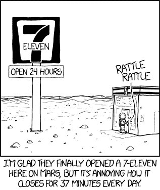
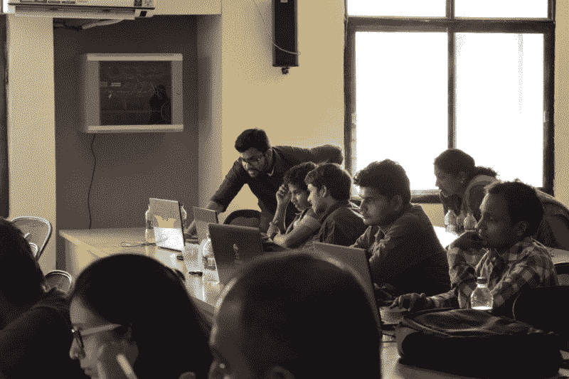

# 一个捷克开发者制造了这个可以在你的浏览器中运行的语音合成器

> 原文：<https://www.freecodecamp.org/news/a-czech-developer-built-this-speech-synthesizer-that-runs-right-in-your-browser-69ec5b09879a/>

这里有三个值得你花时间的链接:

1.  一个捷克开发者制作了这个可以在你的浏览器中运行的嘴部合成器。一定要打开你的声音。( [1 分钟手表+互动 app](http://bit.ly/2pxVKtA) )
2.  前微软首席执行官史蒂夫·鲍尔默花费了数年时间和 1000 万美元建立了一个关于美国政府支出的大规模开放数据集，他于今天早上发布了这个数据集
3.  从“什么是区块链？”要在不到一个小时内建造一座区块链( [7 分钟读作](http://bit.ly/2pydh54))

### 想到这一天:

> “我非常确信，如果你想让一个团队跑得更快，动力感比紧迫感更重要。”伊丽莎白·亨德里克森

### 今日趣事:

[XKCD 的网络漫画](http://bit.ly/2pOWQ3v)

(火星日是 24 小时 37 分钟)

### 今日学习小组:

[海德拉巴自由代码营](http://bit.ly/2oQLZce)

编码快乐！

–昆西·拉森，自由代码营的老师

如果你从这些邮件中获得了价值，请考虑[支持我们的非营利组织](http://bit.ly/donate-to-fcc)。