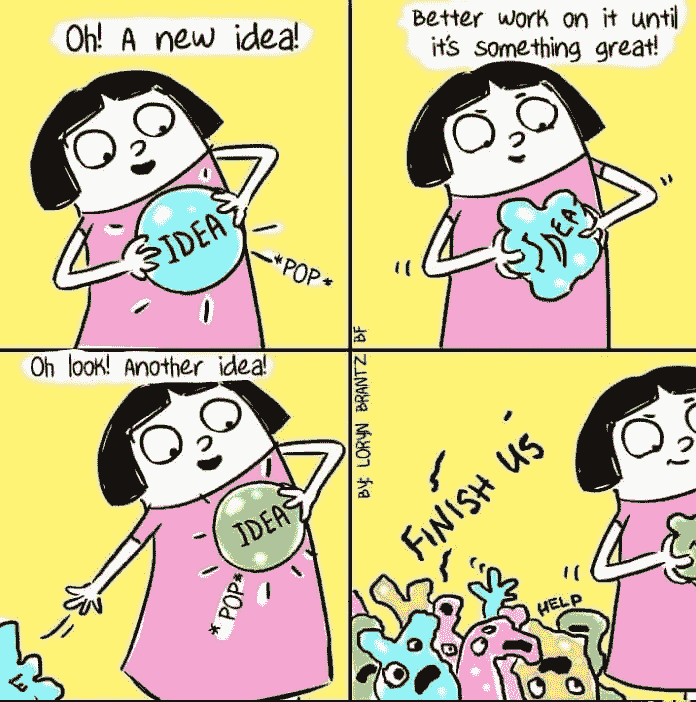
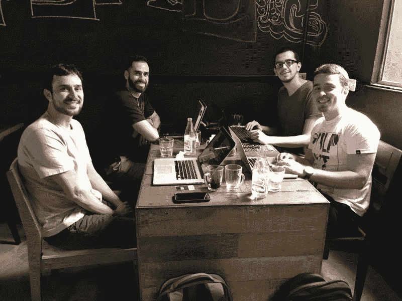

# 这里有 9 个合法的硕士学位，你现在可以完全在线获得

> 原文：<https://www.freecodecamp.org/news/here-are-9-legit-masters-degrees-you-can-now-earn-completely-online-7ebfb4372ab4/>

这里有三个值得你花时间的链接:

1.  这里有 9 个合法的硕士学位，你现在可以完全在线获得
2.  开发人员面试指南，或如何面试一家公司( [17 分钟阅读](http://bit.ly/2oilhWt)
3.  如何用人工智能让寻宝游戏更有趣( [6 分钟阅读](http://bit.ly/2pJXOOy))

额外收获:苹果 MacPad Pro 实际上会是什么样子？( [11 分钟读数](http://bit.ly/2pJX9g0)

### 想到这一天:

> "用 C 或 C++写就像运行一个没有安全防护的链锯."—鲍勃·格雷

### 每日一图:

洛林·布兰茨的网络漫画

### 今日学习小组:

[伊瓜苏自由代码营](http://bit.ly/2oPDWMD)

编码快乐！

–昆西·拉森，自由代码营的老师

如果你从这些邮件中获得了价值，请考虑[支持我们的非营利组织](http://bit.ly/donate-to-fcc)。