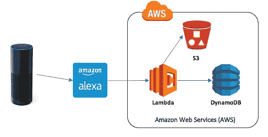
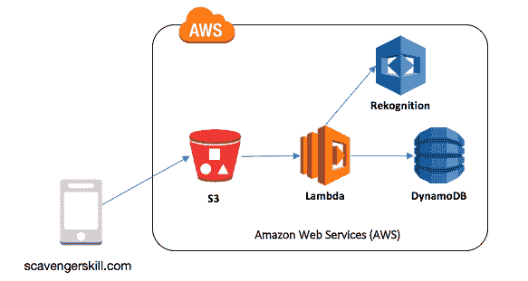

# 如何用人工智能让寻宝游戏变得更有趣

> 原文：<https://www.freecodecamp.org/news/how-to-make-scavenger-hunts-more-fun-with-artificial-intelligence-74a184f3db33/>

特伦·彼得森

# 如何用人工智能让寻宝游戏变得更有趣


寻宝游戏已经存在好几代了。传统的游戏是这样的:

*   一个领导者在一张小纸片上写下一系列物品。
*   然后，团队花一下午的时间在周围地区搜寻这些物体，无论是在室外还是室内。
*   当他们找到条目时，就把它们从列表中划掉，然后继续直到列表完成。

简单的规则。但是很有趣。

#### 用人工智能使游戏现代化

我为亚马逊的 Alexa 平台写了一个应用程序，让寻宝游戏现代化。它利用了最新的可用技术，包括图像和语音识别等人工智能工具。

这个游戏的前提没有改变:在一个小时内找到十个位于你家或者你家附近的随机物品。只不过是 Alexa 为游戏的进行提供了便利。

如果你是拥有亚马逊 Alexa 的数百万人中的一员，我的应用是免费启用的。下面的文章描述了如何利用每个人工智能工具，包括新的 AWS 服务——Rekognition 和 Polly。这个技能叫做[寻宝游戏](https://www.amazon.com/Drawrz-com-Scavenger-Hunt/dp/B06ZZ6F91T/)。下面是它如何工作的预览:

### 人工智能# 1——Alexa

启动游戏从调用 Alexa 技能开始。任何拥有设备的人都会提出以下请求。

> Alexa，请寻宝游戏开始新游戏。

数百万 Alexa 用户中的任何一个都可以用他们的声音提出这个请求。语言是微妙的。当不同的性别、年龄组、种族和社会人口统计数据产生这种意图时，单词选择是不同的。正是人工智能的力量将这些单词选择和方言的细微差异解读为开始游戏的简单请求。

#### 游戏是如何运作的？

游戏从你的 Alexa 执行各种不同的技术开始。下面是所使用的各种服务和接口的架构:



Alexa 平台处理语言处理，将语音意图翻译成 tex。[λ服务](https://aws.amazon.com/lambda/)承载处理逻辑，代码写在 NodeJS 中。在平台上追踪游戏是通过一个独特的，四位数字的游戏代码反馈给用户。该技能识别要发现的项目，并将其存储在 DynamoDB 表的记录中。

Lambda 中的逻辑还记录了游戏开始时的时间戳。这就像一个虚拟的秒表，为游戏倒计时 60 分钟。在任何时候，用户都可以返回并向 Alexa 请求分数更新。Alexa 回复了剩余的时间，以及正在寻找的物品的当前分类帐。

### 人工智能# 2——波利

我喜欢在我的 Alexa 应用程序中构建出色的语音用户体验。现在，在这个不断发展的平台上，质量是游戏的差异化因素。这是至关重要的，因为现在有超过 10k 的 Alexa 技能可供选择。

开发优秀的语音用户界面就像制作一个广播节目。一个伟大的声音比使用单一的声音更令人兴奋。它包括叮当声和模拟动作的声音。编写这些应用程序需要编写代码和有趣的故事叙述。

好故事不是独白。这种方法需要高级编码来包含多个字符。这是我使用 [Polly 服务](https://aws.amazon.com/polly/)的地方，补充了标准的 Alexa 语音。这是介绍性信息的“脚本”的样子。这在开始一个新游戏时播放，并显示组件如何相互作用。


引入音乐需要录制包含声音和叮当声的 Mp3 短片。我在我的桌面上录制音乐，然后上传到一个 S3 桶里。接下来是如何在技能中有很多声音，就像 Alexa 有一个一样。为了创造这种音频体验，这是一种技术的混合。波利能够用 24 种不同的语言发出 47 种不同的声音。很好用，一小段录音需要几分钟。首先进入控制台，调出 Polly 服务。


英语中有许多语音可供选择。我在下拉列表中选择了 English，UK，并单击了一个名为 Amy 的女声的单选按钮。接下来，我在文本框中键入我的脚本，波利将它转换成语音。右下角的选项将录音保存到 Mp3 文件中。我把文件放入一个 S3 桶中，在那里它可以被 Alexa 技能访问。

#### 使用 SSML 整合声音

前一节描述了如何为脚本创建单独的部分。现在是时候把他们拉到一起了。Alexa 平台要求每个技能都有一个符合标准消息模型的 API。在这个模型中，不同的属性代表了用户交互的特征。响应对象的 audioOutput 属性是 Alexa 读回给用户的内容。

要创建包含所有四个部分的属性，您需要创建如下所示的标记:

```
<speak>
  <audio src=\"https://s3.amazonaws.com/.../introClip.mp3\" />
  <audio src=\"https://s3.amazonaws.com/.../pollyVoice.mp3\" />
  Using natural Alexa voice requires no markup
  <audio src=\"https://s3.amazonaws.com/.../closingClip.mp3\" />
</speak>
```

该标记指向存放在互联网上公开位置的每个 mp3 文件。这也是浏览器如何使用 HTML 将图像和文本组装到单一窗格中的方式。Alexa 使用 SSML 进行相同的音频组装。

### 人工智能# 3——认知

游戏需要记分员，所以另一个服务扮演这个角色。我们现代官员背后的大脑是 AWS 识别服务。这扫描图像，识别所有可见的项目，并为游戏跟踪它。以下是支持技术的细节。

#### 事件驱动的图像处理

图像通过 scavengerskill.com 网站上传到 S3 桶。bucket 被设置为为添加的每个新对象触发一个事件。这个事件执行一个 Lambda 函数，调用 Rekognition API 来扫描图像。API 调用的响应包含检测到的项目。该函数将细节写入 DynamoDB 表，使其可用于 Alexa 技能。



例如，下面是一张来自游戏的照片和来自 Rekognition API 的相应响应。


```
{
 “captureDt”: “2017–04–16”,
 “captureTm”: “21:45:40”,
 “gameId”: “9180”,
 “imageId”: “9180/upload_13277b04a3c001948f3e570580f377c4.JPG”,
 “labels”: [
   { “Confidence”: 98.8132629395, “Name”: “Couch” },
   { “Confidence”: 98.8132629395, “Name”: “Furniture” },
   { “Confidence”: 85.2093963623, “Name”: “Lamp” },
   { “Confidence”: 85.2093963623, “Name”: “Table Lamp” },
   { “Confidence”: 83.6216506958, “Name”: “Coffee Table" },
   { “Confidence”: 83.6216506958, “Name”: “Table" },
   { “Confidence”: 66.3723068237, “Name”: “Dining Table” },
   { “Confidence”: 54.6450958252, “Name”: “Hardwood” },
   { “Confidence”: 54.6450958252, “Name”: “Wood” },
   { “Confidence”: 52.6244163513, “Name”: “Beverage” },
   { “Confidence”: 52.6244163513, “Name”: “Drink” },
   { “Confidence”: 52.0414428711, “Name”: “Lampshade” },
   { “Confidence”: 50.595413208, “Name”: “Dining Room” },
   { “Confidence”: 50.595413208, “Name”: “Indoors” },
   { “Confidence”: 50.595413208, “Name”: “Room” }
 ]
}
```

响应包含一组适用于照片的标签，以及每个标签的置信区间。在这个游戏中，我在寻找一个“灯”,服务以 85%的确定性识别出它在照片中。记分员称赞我找到了它！

#### 亚马逊商品图像处理

Rekognition 服务的价值在于它的简单性。亚马逊已经训练了机器学习模型来识别许多物体。要使用该服务，我需要做的就是用我想要扫描的对象的地址调用 API。这使得一个非常强大的服务变得简单而廉价。如果我扫描 1000 张图片，我要花 1 美元。这使我能够专注于创造用户体验，包括令人兴奋的游戏。

### 结论

我喜欢和家人一起玩这个现代版的寻宝游戏。在院子里跑来跑去，给房子和邻居的东西拍照，然后和 Alexa 一起检查它匹配的物品，这很有趣。请尝试一下，让我知道你的想法！

> “哦，你要去的地方！有好玩的事要做！有分数要记。有比赛要赢。
> 你可以用那个球做的神奇的事情
> 会让你成为最大赢家。”
> 
> ——**，**哦，你要去的地方！****