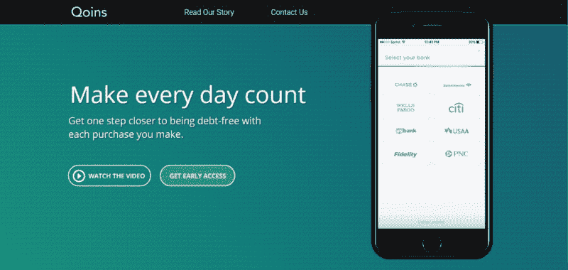
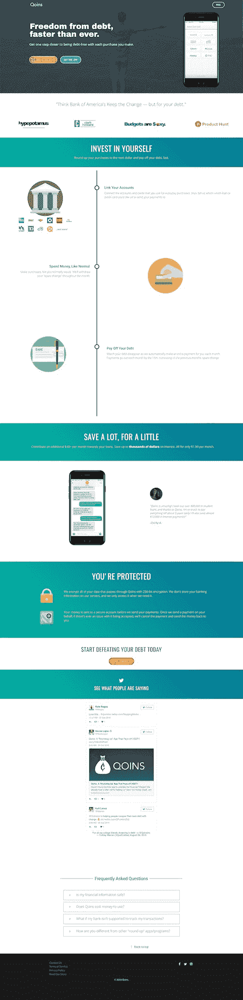
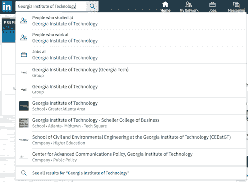
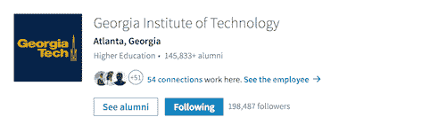
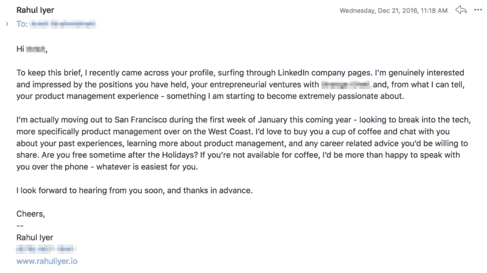
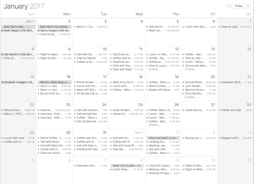
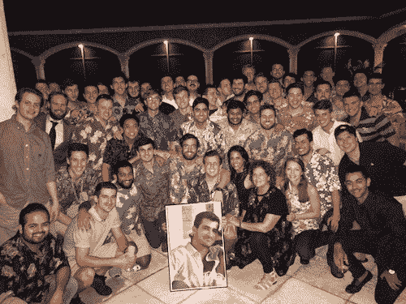
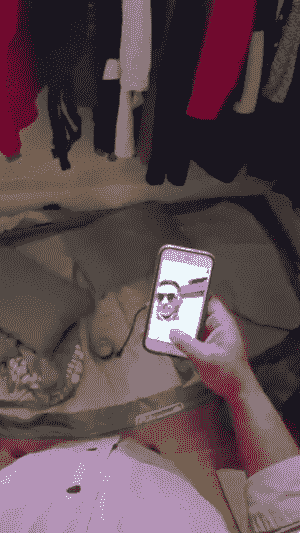
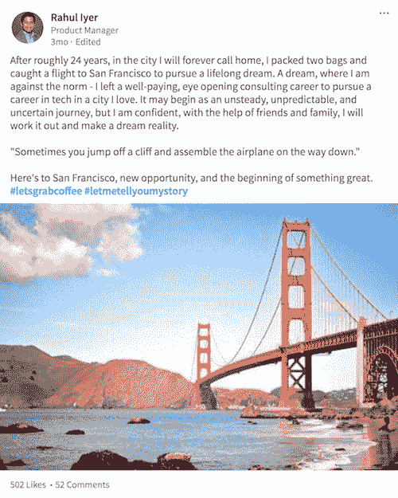
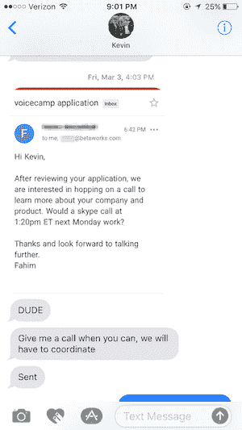

# 我是如何放弃我的咨询职业，进入科技行业的

> 原文：<https://www.freecodecamp.org/news/how-i-left-my-consulting-career-behind-and-broke-into-tech-36ea0c1a0407/>

作者 Rahul Iyer

# 我是如何放弃我的咨询职业，进入科技行业的

Photo courtesy of Pexels

三个月前，我搬到了旧金山——世界上最昂贵的城市之一——没有工作，没有住房，几乎没有钱。

很多人认为这很疯狂。五个月前，他们认为我离开一个繁荣的咨询行业是疯了，现在他们真的认为我疯了。

但是我在这里。今天，我在一家初创公司担任产品经理，与我爱的人一起开发移动应用程序，这是我梦寐以求的角色。那我是怎么来到这里的呢？更重要的是，你为什么在乎？

这不是一篇如何操作的文章，而是我过去几个月经历的所有事情的知识点滴，以及我从这些经历中学到的一切。

永远记住，世界是千变万化的。不要让自己落后。

### 这是我的故事

那是 2016 年 9 月 27 日。在考虑了几个月后，我打电话给我的朋友普拉蒂克。我在寻求指导，因为大约一年前他也做过类似的举动。我告诉他，我打算尝试进入 Hack Reactor 或 App Academy 这样的编码训练营，磨练我的技术技能，这样我最终会更适合产品管理的角色。

然后他让我和他的朋友阿图尔联系，不久之后我和他约了一次电话。[阿图尔](https://www.freecodecamp.org/news/how-i-left-my-consulting-career-behind-and-broke-into-tech-36ea0c1a0407/undefined)参加 Hack Reactor 后，从投资银行转型到软件工程。

我对阿图尔说了和对普拉蒂克说的一样的话。他接下来说的话敲定了这笔交易，我下定了决心。

> “老兄，你没必要这么做。如果你愿意花这笔钱，为什么不直接去旧金山，安排面试，同时找工作呢？在别处获得你需要的初始体验。”

我在转述他的话，但你明白了。[阿图尔](https://www.freecodecamp.org/news/how-i-left-my-consulting-career-behind-and-broke-into-tech-36ea0c1a0407/undefined)开启了对我来说将成为地狱般的旅程，以及[阿图尔](https://www.freecodecamp.org/news/how-i-left-my-consulting-career-behind-and-broke-into-tech-36ea0c1a0407/undefined)、他的双胞胎兄弟[帖木儿](https://www.freecodecamp.org/news/how-i-left-my-consulting-career-behind-and-broke-into-tech-36ea0c1a0407/undefined)和[鲁本](https://www.freecodecamp.org/news/how-i-left-my-consulting-career-behind-and-broke-into-tech-36ea0c1a0407/undefined)——闯入初创公司团队的[之间的友谊。](http://breakingintostartups.com)

几天后，我和佐治亚理工学院的一位教授一起喝咖啡，我在大学里上过他的课。从那以后，他一直是我的导师，所以我想他可以提供一些见解。

伙计，我是对的。事实证明，他也搬到了加州，几乎没有钱，也没有更多的钱。他不断提到这是他一生中最好的决定之一。

当我喝完最后一口卡布奇诺时，他主动向我介绍他在 LinkedIn 上的任何我觉得能引起共鸣的关系。我的教授激发了一种未被发现的热情，这种热情将改变我的生活——建立关系。

教授——我想在这里花点时间谢谢你。我欠你一次。

现在是十月中旬，在与阿图尔和我的大学教授交谈后，我知道获得更多的产品管理经验是至关重要的。我是一名顾问——擅长我的工作。我甚至在大学里经营过自己的创业公司，但都与科技领域的产品角色没有直接关联。

灯泡。

我的朋友克里斯蒂安·齐默曼(Christian Zimmerman)是 [Qoins](https://qoins.io/) 的创始人，他刚刚开始启动他的创业公司。它们基本上是债务的橡子——一个我可以得到的产品，而且绝对是获得一些经验的好机会。

我找到他，向他推销，让我作为他们的产品经理“提供咨询并签订合同”。我免费工作，他们帮我付停车费。

这是我帮助他们做的一些工作的片段。

我们采用他们的旧网站，真正深入了解用户想要的信息，如何让用户注册，以及如何让他们回来(增长率和保留率，对我的产品人员来说)。

通过重新设计和推出 iOS 应用程序，我们将用户跳出率降低了 10%，总注册量增加了约 31%，活跃用户减少了约 69%。老实说，我仍然在考虑我们是否为活跃用户选择了正确的定义——但是这个话题是另一天的话题。

对他们来说太便宜了，对吧？只需 15 美元的停车费。嗯，对他们来说可能是便宜，但我不能更感激了。我把我的大部分采访和咖啡会议归功于这次经历，但更多的是在后面。

经验是一个重要的因素，而且总是有更多的空间。没有的话，想办法即兴发挥一下。它可能不是通过一份工作，而是一个副业，廉价的合同角色，甚至只是帮助一个朋友。它最终会被证明是有价值的。小赢。

11 月 4 日是我在亚特兰大做顾问的最后一天。我在这个我称之为家的城市呆了两个多月，然后我会搬到旧金山去。做好预算后，我有大约六个月的现金可以花。现在已经没有回头路了。

一周过去了。

*神圣的。见鬼了。*

它开始适应了。

我做了正确的决定吗？

我开始紧张起来。辞职带来的肾上腺素激增已经消退。对未知的恐惧开始滋生。

*暂停。*

让我们花点时间来谈谈“对未知的恐惧”

这是人类最原始和最主要的情感之一。不确定性引起人们的不安。但是我们如何克服这一点呢？嗯，答案是主观的，但我是这么做的。

1.  隔离源头。是什么让我感到紧张？我意识到我每天早上醒来都没有真正的结构或一天的常规——没有工作或职责。我一生都是运动员，然后又是顾问，这对我来说简直是陌生的。
2.  最坏能发生什么？大多数时候，最糟糕的事情其实并没有那么糟糕。对我最不利？回到亚特兰大我父母的家，住在那里，直到我想出办法。不要误解我。我 24 岁了，不想住在父母的地下室里。但是，嘿，再说一次，*并没有那么糟糕。*
3.  为不久的将来做计划。陷入不确定之中，我经常发现自己在想象每一个可能发生的场景。重要的是要明白赢得小加起来。每天为小事情做计划，为更大的目标做准备。不要担心你无法控制的事情。这对你没有好处。
4.  好好享受吧。久而久之，对未知的恐惧变成了兴奋。我学会了欣赏变化和有时随之而来的回报。

哇哦。一个月的失业时间过去了，此时，我愿意接受任何听起来很酷的事情，并试图从那里横向进入产品经理的角色。

*傻吧？只有一个月，我已经愿意放弃我的梦想了。*

我采访了优步、Workday、DoorDash 和其他多家初创公司。他们中的大多数都进入了决赛。有两次我放弃了这个过程。其余的都以断然拒绝而告终——在某些情况下，来自我非常确定自己在面试中已经被击垮的公司。

在征求反馈时，这是我收到的反馈和我的一些即时想法——迁就我一下:

> “你是一个很好的候选人，但是没有我们想要的经验。”

> 什么？走吧。谁会有 5 年以上的工作经验去应聘一个你正在招聘的大学毕业生的职位呢？

> ***“我们决定在这个时候继续寻找其他更符合我们需求的候选人。我们希望您在未来再次考虑我们的雇佣关系。”***

> 未来？我现在想被雇用。

> ***“我们觉得你不太适合这个职位。也就是说，我们正在快速发展，我们的需求也在不断变化，所以请随时关注我们的职业页面，申请任何您感兴趣的职位。”***

> 好吧。我可能搞砸了这次采访，但真的吗？连续几个小时完成一个带回家的练习，却收到这个回应——灵魂粉碎。很戏剧化，我知道。

> ***【沉默】***

> ***【蟋蟀】***

> ***【更沉默】***

> 是啊，那是在三封跟进邮件之后。为什么是我？

在这一点上，你可以说我感到非常痛苦。

我到底做错了什么，以至于我可以参加大多数的最终面试，但却让工作机会从我手中溜走？

我的闭幕词很烂吗？我在这些采访中说错了什么吗？

虽然我确实在情感上作出了回应，但我认为有必要指出，每个人都有这样的想法。拒绝是艰难的。它会引起情绪反应。但是，没关系——我们只是人类。

请继续阅读。我会向你解释我做了什么来对抗这种情况，以及它对我后来的影响有多小，因为相信我，拒绝绝对没有停下来关心我的感受。

还是在亚特兰大，我问我以前的大学顾问，她是否愿意和我一起喝咖啡(这里有一个主题)。在整个大学期间，她给了我不少建议——我想现在为什么不呢？

尽管如此，和她见面是“快乐工作”生活方式中的一个关键时刻，我开始害怕地变得更加适应。

她给了我两条建议:

**LinkedIn 的校友页面功能:**

搜索你就读/毕业的大学。

去“见校友”

现在你可以对不同城市、公司、工作角色等的校友进行排序。这是找到校友联系的最简单的工具之一——这是我如何建立更多关系的一个巨大贡献因素。

> “一份好的求职是一大串“不”和“是”。只需要一个。”

这是唯一的一条建议，它让我在每次被拒绝时都能坚持下去。我可以得到一个“是”右边的是的。

又过了几天。我决定提高一个档次。与我的大学导师交谈让我意识到我需要面对面地尽可能多地接触更多的人。冲动的决定——但是我立刻订了去旧金山的机票。

我知道…冒险。我还指望真的能有这些会面。但有时，知道你会失去一切就是你需要的全部动力。

我的目标是每天向我认为可以学习的人发送 50 封冷冰冰的电子邮件/LinkedIn 信息。

*如此雄心勃勃。*

是啊，很快就降到了每天 25 条。我注意到在 50 岁时，我的电子邮件质量变得很差。我事先没有对我发邮件的人做足够的研究，基本上是使用一个千篇一律的邮件模板。因此，我的回复率很低。*真的很低。*

调整后，从周一到周五直到 1 月 6 日，我每天发 25 条消息。

15 天，365 条信息。

在 365 条信息中，我以 75 次咖啡会议和电话结束。

这相当于咖啡会议/电话通话转化率的 21%。

My calendar was scary — a lot of meetings which I didn’t even note down, because they happened literally hours after I had scheduled them. Flexibility is key.

我的回复率急剧上升。如果表达的兴趣是真诚的，你会惊讶于人们是多么愿意帮助你。

在这一切发生的过程中——新年前两天，我收到消息，我最好的朋友之一、前联合创始人亚历克斯·普林齐(Alex Prinzi)去世了。

听着，有些事情是你无法预料的。

这是一个旋风般的一天，我在这里辩论写这样一个个人经历。但是 Alex 和他的双胞胎兄弟 Leo 在我的生活中扮演了如此重要的角色，从我们一起分享的创业经历(经营我们的初创公司 Wazo，并临时申请专利 [Cheer Straps](https://www.youtube.com/watch?v=9BStuuIW-CQ) )，到我对这两个人的真诚友谊、无意的指导和友情。

每个人都应该找到激励自己做得比昨天更好的东西。对我来说，一部分原因是亚历克斯——他把生活过得很充实。如果不提他，这将是一个不完整的故事。没有他我不会有今天的成就。想念你，伙计——这是给你的。

In loving memory of the legend, Alexander Joseph Prinzi.

在我本该飞往旧金山的前一个星期五，我一时冲动决定和一个朋友一起开车去休斯顿过夜，呆上一个周末，然后在接下来的星期一离开那里。它更便宜。我在努力省钱。

这与故事相关吗？没有。但并不是所有找工作都是为了找工作。我还有自己的生活。

那是诺曼底登陆日。我登上了飞机。它开始起飞，它像一堵墙一样击中了我。我将离开高薪、优秀的员工和 24 年的工作经验，回到亚特兰大。

我实际上正在这么做。

我计划的一切现在都在全力进行。是时候向自己和其他人证明我是否真的能做到了。我正在现场做——现在不回头。

在飞行中，我意识到在旧金山没有人认识我。我需要一种方法，让我的脸迅速传达给成千上万的人。

但是怎么做呢？

LinkedIn。

我打了一个帖子，可能花了我一整趟飞机才想出来，尽管如此，写得还是相当糟糕。但是管它呢，我决定登陆后把它贴出来，看看它会去哪里。

我们一落地，我就立刻叫了一辆优步去我朋友普拉蒂克的住处。他很大方地允许我睡在他的衣柜里。

不，说真的。我在壁橱里住了一个月。

Ignore the picture of a picture. I was using Snap Spectacles to show what I was actually living in.

画一幅画——它非常适合一个双人充气床垫和我的两个行李箱。就是这样。哦，我不得不穿过浴室去拿。这是一个有趣的地方呆一个月，但我尽我所能保持尽可能低的成本。

谢谢普拉蒂克。说真的。

就在第二天，咖啡会议、电话和采访的日常工作开始了。

当我遇到这些人时，我该说些什么？每次会议的最终目标是什么？我如何确保他们说到做到？

与你从未谋面的人交谈可能会非常令人生畏，更不用说那些可能远比你更有经验的人了。一些帮助我准备这些会议的东西(有时需要相当长的学习曲线)，我将在下面列出。

> 在网上找到你要见的人的所有信息并阅读！ *我查看了他们的 LinkedIn，他们过去的职位，被出售的公司，他们的兴趣，他们曾经居住过的地方——我甚至通过某人 2014 年在 Twitter 上发布的一张照片找到了一个电子邮件地址。是的，我觉得很毛骨悚然，但了解他们做了什么只会让你在对话中有更多的联系点。人们喜欢谈论自己。利用这一点。*

> ***感谢他们，遇到他们就表示欣赏。*** *几乎每次，我做的第一件事就是告诉他们我在乎他们出来和我说话。*

> 谢谢[姓名]，感谢您抽出时间来和我交谈。这意义重大。

> ***人们对问题的反应各不相同。了解他们想要什么。*** *我遇到的一些人喜欢开放式问题，他们会持续 30 分钟谈论自己。其他人喜欢尖锐的问题，因为他们可以很快回答(想想连珠炮)。老实说，我见机行事，向他们每人扔了一两个，看看他们的立场。*

> 好吧。这一切都很好，但我如何从中获得一些东西呢？

> ***学会讨厌网络。建立关系。*** *我怎么强调这一点都不为过。在找工作的时候与人见面不一定是事务性的。和这个人建立关系，将来会有所收获。每个人都有需求，你会惊讶于你能多快找到合适的。*

> 你与之建立真诚关系的人越多，就会有越多的人涌向你。我称之为 10x 效应(从几个朋友那里偷来的一句话的一部分)。这是一个花时间与你遇到的每个人建立基础的问题。最终，它变成了第二天性。

> ***目标是获得另一次见面(无论是和他们还是别人)。*** *每次会议结束时，我都会问同样的问题。*

> 你觉得我还应该联系谁吗？你问这个问题的方式很重要。

> 如果你问他们是否能给你介绍一个人，那会增加不必要的压力。很有可能他们心中确实有某个人，但是他们想要感觉好像他们能控制自己的行为。给他们控制权。当你说“你很乐意联系他们可能认识的人”时，他们通常会说以下两种情况之一:

> 1.我认为[姓名]很适合与你聊天，我会亲自把你介绍给他们。

> 很好。你现在有了一些要跟进的事情和潜在的下一次会议安排。

> 2.嗯…我现在不太确定。我想不出任何人。

> 不要烦恼。这可能是一件合法的事情。很难一下子就记住这些名字。这种情况很容易应对。

> 不急。为了让你更容易，我很乐意在 LinkedIn 上与你联系，如果有我认为值得学习的人，我会给你发电子邮件。

> 好的，当然——我们去吧。

> 现在，你有理由追踪一两个你可能感兴趣的人的名字。再次强调，这一点怎么强调都不为过——尽量不要把它变成交易。维持关系是十倍的回报。一个主要的例子在我的故事的后面展开。

还记得我在 LinkedIn 上写的那篇文章吗？下面是它的截图。

没什么特别的——只是一篇俗气的文章，上面有一张漂亮的金门大桥的照片。

**52 条评论。**

**502 赞。**

**~20 万浏览量。**

掐我一下。

成功了。真的管用。

因为这个帖子，我收到了无数招聘人员的电话，数百人主动提供帮助，还有无数人鼓励我继续努力——这些都来自我在飞往旧金山的飞机上写的一个愚蠢的帖子。我甚至有一个人给我提供住处。

在 LinkedIn 上保持活跃是至关重要的——无论是在你找工作期间，还是一旦你找到了工作。我只能想象，如果我在整个职业生涯中(而不仅仅是当我在看的时候)继续在 LinkedIn 上建立自己的形象，这篇文章会吸引多少人。

再次强调——我只是想指出 LinkedIn 实际上是如何未被充分利用的。使用它。

在西海岸生活了三周后，我遇到了尤斯登。大约两周前，我曾通过一封冷冰冰的电子邮件联系过他。他在 Pinterest 和 Hulu 有着坚实的项目经理背景——认为我或许能从他的头脑中学到一两件事。

我们在 [Bravado](https://www.google.com/maps/place/Bravado/@37.7787583,-122.3913512,15z/data=!4m2!3m1!1s0x0:0xbb31ff58a7d02c94?sa=X&ved=0ahUKEwizgbGDs4nTAhVJ62MKHfnsBJEQ_BIIiQEwDw) 见了面，那是一家咖啡馆，就在& T 公园的街对面。我们进行了一次正常的谈话，没有什么太令人兴奋的。[尤斯登](https://www.freecodecamp.org/news/how-i-left-my-consulting-career-behind-and-broke-into-tech-36ea0c1a0407/undefined)和他聊天很愉快，并答应给他的几个朋友做一些介绍。

太棒了——这正是我想要的。

时光飞逝，我已经快失业三个月了。我快成功了——或者说，我是这么想的。如前所述，整个一月，我约有 75 次咖啡会议和电话。我总共参加了 9 次面试和 6 次最终面试。

地狱是啊。我要杀了它。

我像个疯子一样为那些面试做准备。接下来的几周是时候去粉碎他们了。

又过了几天。我刚刚和尤斯登通完电话。他给了我一份合同，让我在他建议的初创公司工作。

*什么？那是随机的。*

我该接受吗？值得吗？

是的——我拿了。这是一份丰厚的时薪，我当然可以用这笔钱来维持我的储蓄。

此外，我们之间的相互理解是简单的。

1.  我尽可能地工作，因为我同时也在寻找一份全职工作。
2.  如果我们不喜欢和彼此一起工作，我们就会分道扬镳——没有恶意。

真的，这是我最好的处境，但是我当时太天真了，没有意识到。

6 次最终面试，对吗？

我还不如脸上有鸡蛋呢。

*拒绝。*

*拒绝。*

*拒绝。*

*拒绝。*

拒绝了报价。

我是个白痴。

*拒绝。*

在两天的时间里，我收到了 5 次拒绝，并放弃了一份工作。

*加油！我到底做错了什么？*

先说一下[冒名顶替综合征](https://en.wikipedia.org/wiki/Impostor_syndrome)。

在这一点上，我觉得我是一个骗子。我已经想出了一百万种方法来获得这些采访(建立我自己的产品，帮助 Qoins，等等)。)，所有这些都是合法的——但每次我都没能得到一份工作。我开始相信我在假装努力工作。

我大错特错了。

事后看来，我做的一切都是对的。当然，我搞砸了一个面试，但是另外四个呢？嗯，事实是有太多你无法控制的外部因素——试图证明它是正确的会让你发疯。

相反，寻求反馈并继续前进。

此外，改变你对这些事件的看法会极大地改变你进行/处理下一次面试的方式。例如，这些拒绝帮助我认识到硅谷的公司在 PM 中寻找什么。我开始挑选在志同道合的公司里奏效的不同策略。它最终为我在未来淘出。

回到我注定要失败的想法——我慌了。

我现在该做什么？我怎样才能表达出我不仅优秀，而且很棒？

建造。

我的好朋友凯文(我们都称他为古伯斯)和我已经考虑了一段时间亚马逊 Alexa 约会应用的想法。

好吧，机会来了。他在周日晚上给我打电话，说服我应该申请参加语音夏令营。申请截止日期是 28 日。

**Facepalm**

> 古伯斯，我们实际上只有一个晚上来完成这件事

他不知何故说服了我。那天晚上我们熬到很晚，开发出了一款 Alexa 约会应用，我们给它取名为 [Vocado](http://getvocado.com) 。这是一个非常糟糕的，非常没有功能的原型——为此我们拍摄了一个蹩脚的自制视频。

*提交。*

从现在开始就是等待的游戏，但是我们对第一次面试不抱任何期望。

那是三月初。我在工作(我的合同演出)，我打开手机收到了 5 个未接电话和 3 条来自 Goobs 的未接短信。

那很不寻常——他为什么这么想和我说话？

绝不可能。

我当时正忙着出去。我马上给他打了电话。我们通过了最初的筛选，被要求安排一次面试。我们简直不敢相信。

我们粉碎了它，对吗？

*LOL。*

我就开门见山了。几个问题之后，很明显我们无法进入下一轮。我们没有商业模式，没有真正的工作原型可供下载或在应用商店展示——看在上帝的份上，我们在一个晚上就完成了这个。

但是，没关系。它教会了我们一些事情。

我们斗志昂扬，一夜之间就做了一些东西，引起了愿意投资我们产品的人的注意。谈谈产品验证。

古伯斯和我合作得很好。我们还能做什么？

但最重要的是，我现在有了另一个可以在采访和交谈中展示的产品。该死的，这是一个赢家。能够把这一点写在我的简历上，几乎总能在面试中引发话题。

*你给 Alexa 建了个交友 app？*

是的——在一天之内(请听奥斯汀·鲍尔斯的《邪恶博士》中的声音)。

就在那一刻，我明白了**做**的价值。

你想成为一名软件工程师？为某事写代码。

你想成为增长黑客？增长削弱了一些东西。

你想当产品经理？运送东西。

去做吧。

到三月中旬，事情进展顺利。我从自己的经历和错误中吸取了教训，最终又想出了 4 次最终面试。

到目前为止，我已经从最后三次面试中得到了答案:

1 拒绝

2 个报价

下下周是最后一次面试。

*终于。*

事情开始好转。

哦，你记得[尤斯登](https://www.freecodecamp.org/news/how-i-left-my-consulting-career-behind-and-broke-into-tech-36ea0c1a0407/undefined)吗？是的，有趣的事情发生了。

同一个星期五，尤斯登给了我一个弧线球。他在我签约的那家初创公司给了我一个全职项目经理的职位。

我通过一封冷冰冰的电子邮件联系的那个人，和我一起喝了杯咖啡，然后签约了他所建议的初创公司，他刚刚给了我一份全职工作。

唉，该死——我该接受吗？

一段时间以来，我第一次有了一个好问题。

3 月 29 日对我来说是光荣的一天。感觉上千斤的压力从我肩上卸下来了。我拒绝了两个邀请，离开了最后一次面试，接受了尤斯登的邀请。

我非常高兴。

你不会相信的。

> “一下雨，就是倾盆大雨。”

在我接受邀请的第二天，脸书和另外两家初创公司主动联系我，提供面试机会并希望与我聊天。

很好。现在怎么办？

没什么。我与那些主动联系并继续前进的招聘人员建立了关系。我很开心。我热爱这家初创公司，热爱和我一起工作的人，拥有我想要的角色，最重要的是，我终于可以说我喜欢我正在做的事情。我没有理由退出。我知道我做了正确的决定。

快到愚人节了，我开始质疑现实。但是当我开始工作的第一周的第一天，我生活的新篇章开始了。感觉棒极了。

我喜欢这一天。我沉浸在其中。

### 我今天继续做的事情

1.  每天和人们一起喝咖啡。即使你有工作，结识新朋友和建立关系也是关键。关键是你认识谁。
2.  **找个导师。**我仍在研究这个项目，但在我看来，找到一个导师是最快的成长方式之一。
3.  给我的箭囊添上箭。我不断挑战自己，跃入未知领域，保持警觉，学习新事物。

### 宝石又名资源和知识下降

非常规举措需要非常规策略。这些绝不是唯一有用的工具、技巧、文章和人，但它肯定能帮助你快速起步。尽你所能使用它们。

#### 咖啡店

咖啡店有多种用途。认识人。费力地完成一些工作。看书。这里有一些我喜欢并经常使用的。我只能代表亚特兰大和旧金山，因为这是我唯一生活过的两个城市，但是你可以在评论中添加你最喜欢的城市。

**亚特兰大:**T2 1。[开关站](https://www.google.com/maps/place/Switchyards+Downtown+Club/@33.7586677,-84.3900462,15z/data=!4m2!3m1!1s0x0:0xd43c7aca6e53197e?sa=X&ved=0ahUKEwjA9qGUpfjSAhVqqVQKHVIQBhkQ_BIIfjAL)(市区)
2。[跳舞的山羊](https://www.google.com/maps/place/Dancing+Goats/@33.7713648,-84.3695884,17z/data=!3m1!4b1!4m5!3m4!1s0x88f50411001ea81b:0x8e73719e3b49d9c2!8m2!3d33.7713604!4d-84.3673997)(庞塞城市场)
3。查塔胡奇咖啡公司。[酒吧](https://www.google.com/maps/place/Taproom+Coffee/@33.7515713,-84.3409392,14z/data=!4m8!1m2!2m1!1staproom!3m4!1s0x88f5013272147b7f:0xddfac620195d452a!8m2!3d33.7515713!4d-84.3234297)(东亚特兰大)

**顺丰湾区:**
1。[蓝瓶](https://www.google.com/maps/place/Blue+Bottle+Coffee/@37.7824796,-122.4099865,17z/data=!3m1!4b1!4m5!3m4!1s0x808580842e3505e1:0x919a0502d0d2eee6!8m2!3d37.7824754!4d-122.4077978)(薄荷广场)
2。[十字路口咖啡馆](https://www.google.com/maps/place/Crossroads+Cafe/@37.7831518,-122.3890398,15z/data=!4m2!3m1!1s0x0:0xa591cf34d8738ba4?sa=X&ved=0ahUKEwjNpJngpfjSAhWJjFQKHdmVDZMQ_BIIfDAK)(南海滩)
3。[苏醒咖啡馆](https://www.google.com/maps/place/Awaken+Cafe/@37.8051481,-122.2708725,15z/data=!4m2!3m1!1s0x0:0xfea43e05bbe50fb6?sa=X&ved=0ahUKEwi7trTmpfjSAhVEylQKHZQFCVoQ_BIIfzAL)(奥克兰)
4。 [Covo](https://www.google.com/maps/place/Covo/@37.78121,-122.4081349,15z/data=!4m2!3m1!1s0x0:0x3c5d64ff5e32284d?sa=X&ved=0ahUKEwicw-jxpfjSAhUji1QKHRGZDFYQ_BIIdjAK) (SOMA)

#### 有用的博客文章和书籍

读书很好。下面是一些伟大人物的伟大文章——主题从产品管理、工资谈判到日常生活。

1.  [建筑产品](https://medium.com/the-year-of-the-looking-glass/building-products-91aa93bea4bb#.e0apw9mon) ( [朱莉卓](https://www.freecodecamp.org/news/how-i-left-my-consulting-career-behind-and-broke-into-tech-36ea0c1a0407/undefined))
2.  [如何不轰炸你的报价谈判](https://medium.freecodecamp.com/how-not-to-bomb-your-offer-negotiation-c46bb9bc7dea) ( [哈齐布·库雷希](https://www.freecodecamp.org/news/how-i-left-my-consulting-career-behind-and-broke-into-tech-36ea0c1a0407/undefined))
3.  谈判工作机会的十条规则
4.  我刚在 Snapchat 找到一份开发人员的工作。以下是我学到的，以及它如何能帮助你找工作。 ( [乔恩·邓](https://www.freecodecamp.org/news/how-i-left-my-consulting-career-behind-and-broke-into-tech-36ea0c1a0407/undefined))

#### 脸书集团

社区是关键——找到一群试图做和你一样的事情或者已经做了你想做的事情的人是必须的。为你的生活写一个新的篇章是令人畏惧的，所以找一个社区来问“愚蠢的问题”，建立关系，或者请求推荐。在这个过程中，有几个 FB 团体/社区给了我很大的帮助。

1.  [进入创业公司](https://www.facebook.com/groups/BreakingIntoStartups/)——在创业公司的世界里站稳脚跟并不容易，但名字就说明了一切……试试看。
2.  想找一个有推荐人好处的面试机会吗？HireClub 为希望被其他人推荐的人提供高质量的列表。唯一的问题是你必须被某人邀请才能加入。
3.  艾伯特的工作列表&推荐 —另一个工作发布/推荐脸书小组，有高质量的列表和真正渴望帮助的人。

#### 播客剧集/有声书籍/电子书

1.  Haseeb Qureshi (闯入创业公司)——我承认，这个人给生活带来了风暴。[哈苏布](https://www.freecodecamp.org/news/how-i-left-my-consulting-career-behind-and-broke-into-tech-36ea0c1a0407/undefined)扼杀了谈判游戏，并提出了一些我认为有价值的建议。
2.  [李凯文](http://breakingintostartups.com/kevin-lee-product-manager-hq/)(进入创业公司)——对于那些不知道从哪里开始做项目经理的人来说，从这里开始吧。[凯文](https://www.freecodecamp.org/news/how-i-left-my-consulting-career-behind-and-broke-into-tech-36ea0c1a0407/undefined)建立了一个很好的社区来培养早期职业项目经理。
3.  现代浪漫(阿齐兹·安萨里)——太搞笑了。你偶尔需要休息一下。为什么不和阿齐兹一起？(这个你得拿到音频版。值了。)
4.  [破解 PM 面试](https://www.amazon.com/Cracking-PM-Interview-Product-Technology-ebook/dp/B00ISYMUR6/ref=sr_1_1?s=digital-text&ie=UTF8&qid=1491891571&sr=1-1&keywords=cracking+the+pm+interview) ( [盖尔·拉克曼·麦克道尔](https://www.freecodecamp.org/news/how-i-left-my-consulting-career-behind-and-broke-into-tech-36ea0c1a0407/undefined) & [杰基·巴瓦罗](https://www.freecodecamp.org/news/how-i-left-my-consulting-career-behind-and-broke-into-tech-36ea0c1a0407/undefined))——如果你是一个正在面试的 PM，我强烈推荐这本书。它很好地分解了一个总理可能经历的不同类型的面试，以及更多。
5.  [混沌猴子](https://www.amazon.com/Chaos-Monkeys-Obscene-Fortune-Failure-ebook/dp/B019MMUAAQ) ( [安东尼奥·加西亚·马丁内斯](https://www.freecodecamp.org/news/how-i-left-my-consulting-career-behind-and-broke-into-tech-36ea0c1a0407/undefined))——这是对硅谷的一个有趣而搞笑的描述，也是对随机失败的反思。与大多数阅读相比，这可能是一个不错的改变。
6.  受到启发(Marty Cagan)——Cagan 在解释如何创造顾客喜爱的产品方面做得很好。我相信所有人都能从阅读中受益，不仅仅是产品经理。

#### 聚会和休闲频道

1.  [产品经理 HQ](https://www.productmanagerhq.com/join-the-community/)——[凯文](https://www.freecodecamp.org/news/how-i-left-my-consulting-career-behind-and-broke-into-tech-36ea0c1a0407/undefined)也有很大的松弛渠道。我在那给 PMs 发了冷短信要喝咖啡。
2.  [周三的产品学校](https://www.productschool.com/product-management-events/) —每周三，产品学校都会举办一场来自大公司的 PM。通常这些 pm 有很多经验可以分享。挑他们的脑子，认识一些志同道合的人，建立关系。
3.  一旦你加入了 FB 小组，就要留意他们的活动。他们很棒，到处都是想认识新朋友的人。

#### 人

如果你还没有注意到，我很擅长建立关系——除了他们的时间和经验，什么都不要求。这里有一些关键人物，他们真的让我变得与众不同。请随意联系他们。它们不咬人。

1.  尤斯登·盛(Eusden Shing)——给我一次机会的人。开始是一封冷冰冰的邮件，然后是一杯咖啡，然后是一个合同角色，最后是一份全职工作。我只希望用同样的方式回报别人。
2.  阿图尔·梅斯特，[帖木儿·梅斯特](https://www.linkedin.com/in/timurmeyster/)，& [鲁本·哈里斯](https://www.linkedin.com/in/rubenharris/)——让播客看起来简单的兄弟们。这三个人肯定对 10 倍的东西产生了影响。他们就是真相。
3.  Prateek Kumar——第一个月让我住在他衣柜里的朋友。是的，我确实住在浴室后面的壁橱里。
4.  乔恩·邓(Jon Deng)——我在一个聚会上遇到的家伙。[乔恩](https://www.freecodecamp.org/news/how-i-left-my-consulting-career-behind-and-broke-into-tech-36ea0c1a0407/undefined)求职失败，最终在 Snap 做了一名开发人员。
5.  莱斯利·波特曼(les lie Poortman)——通过 LinkedIn 向我伸出援手的女人。她把我介绍给朋友，开车送我去聚会。这些好心人是存在的，我保证。
6.  莱尔·麦肯尼(Lyle mckenny)——尽管他自己也在找工作，但还是帮助了我。他告诉我，向前付出并不总是发生在你“成功”之后。
7.  菲利普·克鲁格曼(Phillip Klugman)——这个长胡子的男人通过关系帮我获得了三次不同的面试机会。他真心喜欢帮助别人。
8.  克里斯汀·齐默曼 & [内特·华盛顿](https://www.linkedin.com/in/nwashjr/)——他们俩在 Qoins 雇佣了我做承包商。可以说他们给了我一个很好的开端。
9.  卡尔·汤姆森——即使在毫无理由表现个性的时候，他也有真正的个性。他是那种你希望与之建立真正友谊的人。
10.  凯文·古博特(Kevin Guebert)——我的好朋友和软件工程师，和我一起建立了[Vocado](http://www.getvocado.com)——谈论一个话题引导者。
11.  莎拉·林恩·鲍文(Sarah Lynn Bowen)——这个女孩和我一样多次阅读这篇该死的帖子，只是为了确保它读得清楚。不客气

对于那些一路上帮助过我的人，因为有很多你们——知道我没有忘记你们。我感谢每一个停下来花时间听我讲话的人。真心感谢。

#### 其他方便的东西

以下是我在搜索过程中遇到的一些其他事情——与上面的其他事情一样重要。找到适合你的方法。

1.  产品经理 HQ —如果你想成为一名项目经理，请看这里。李凯文有一个坚实的框架在等着你。
2.  在我看来，下班时间是互联网上最好的事情之一。你可以和那些你可能永远没有机会见面的人安排时间。我和“产品搜寻”的一位联合创始人聊过——非常棒。
3.  当有人向我推荐这款产品时，我认为这是一个笑话。但是，我试了一下——救命恩人。当我在找工作的时候，它帮助我保持清醒的头脑，保持专注。

如果你一路走到这里——谢谢你的阅读！我希望这对你有所帮助，请随时关注我这里的和/或通过社交媒体([推特](https://twitter.com/rahuldotiyer)、 [LinkedIn](https://www.linkedin.com/in/rahuldotiyer) 、 [Instagram](http://instagram.com/rahuldotiyer) )联系我。我是一本打开的书。干杯！

**Rahul Iyer** 是一名产品经理和企业家，对产品和技术充满热情。人是他的第一要务。技术是他的媒介。欢迎访问 [www.rahuliyer.io](http://rahuliyer.io/) ，了解更多关于拉胡尔的信息。