# 用 React 构建特斯拉电池续航里程计算器(第 3 部分:CSS 动画)

> 原文：<https://www.freecodecamp.org/news/building-teslas-battery-range-calculator-with-react-part-3-css-animation-797476dc1b37/>

马修·崔

# 用 React 构建特斯拉电池续航里程计算器(第 3 部分:CSS 动画)


这是用 React 系列构建特斯拉电池续航里程计算器的第三部分。

在第 1 部分中，我们创建了只有 React 核心的应用程序，在第 2 部分中，我们通过引入状态管理解决方案 Redux 对应用程序进行了改造。

第 1 部分主要关注 React，[在这里](https://medium.freecodecamp.com/building-teslas-battery-range-calculator-with-react-part-1-2cb7abd8c1ee):

[**用 React 构建特斯拉的电池续航里程计算器(第一部分)**](https://medium.freecodecamp.com/building-teslas-battery-range-calculator-with-react-part-1-2cb7abd8c1ee)
[*在这一系列文章中，我将带你了解用 React 构建特斯拉的电池续航里程计算器的过程……*medium.freecodecamp.com](https://medium.freecodecamp.com/building-teslas-battery-range-calculator-with-react-part-1-2cb7abd8c1ee)

第 2 部分，重点是 Redux，[在这里](https://medium.freecodecamp.com/building-teslas-battery-range-calculator-with-react-part-2-redux-version-2ffe29018eec):

[**用 React 构建特斯拉的电池续航里程计算器(第二部分:Redux 版)**](https://medium.freecodecamp.com/building-teslas-battery-range-calculator-with-react-part-2-redux-version-2ffe29018eec)
[*本教程是用 React 构建特斯拉的电池续航里程计算器的第二部分。*medium.freecodecamp.com](https://medium.freecodecamp.com/building-teslas-battery-range-calculator-with-react-part-2-redux-version-2ffe29018eec)

如果你看看我们到目前为止构建的应用程序，它有点平淡乏味。如果我们能赋予它动感的汽车展厅感觉，它会看起来更酷。

当应用程序加载时，如果我们令人惊叹的特斯拉汽车图像是动态的就好了。有点变形金刚的感觉。特斯拉头也显示为淡入效果，其余的组件应该看起来更好一点。

甚至当用户事件发生在加载之后，表现出明显的视觉效果会比仅仅改变数值更有冲击力。

就像这样:

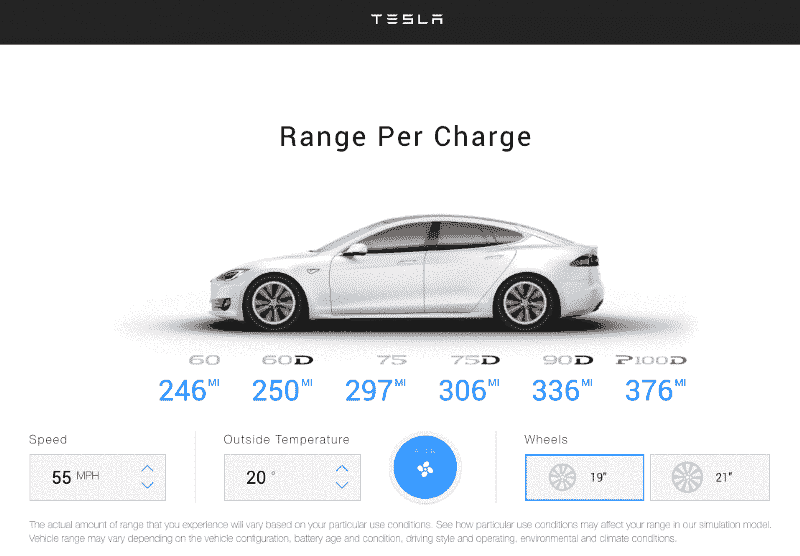

可以去看看[现场演示](http://animation-tesla-calculator.surge.sh/)。

这里是完整的源代码。

在**第三部分**中，我们将一步一步地看看使用 **CSS 动画**让我们完成的应用程序更时尚的过程。

### 1.预热

让我们从开始前的热身开始。

### 1–1.CSS 动画的基本示例

CSS 动画让一个元素逐渐从一种风格变成另一种风格。

CSS 动画由两部分组成:

*   描述 CSS 动画的样式
*   一组关键帧，指示动画样式的开始和结束状态

这里有一个简单的例子。在本例中，一个元素的背景颜色在 5 秒内逐渐从红色变为黄色。

要创建 CSS 动画，需要两个步骤:

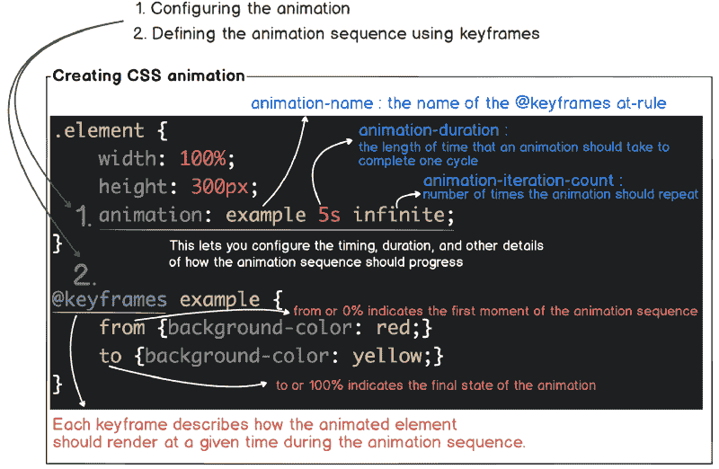

> 使用 CSS 动画查看[了解更多细节](https://developer.mozilla.org/en-US/docs/Web/CSS/CSS_Animations/Using_CSS_animations)

### 1–2.另一个 CSS 动画的例子

我们从这里开始。它有一个特斯拉标题，一些标题和一个漂亮的特斯拉汽车图像。

### 1–3 使其反弹

这里有三个元素放置得很好。让我们看到这三个元素慢慢出现在白色的屏幕上，就像一两个演员在白色背景上什么也没有的舞台上跳舞。

首先，使用关键帧定义动画序列。然后应用 animate-pop-in 类，并为 div 和 h1 元素定义动画属性。

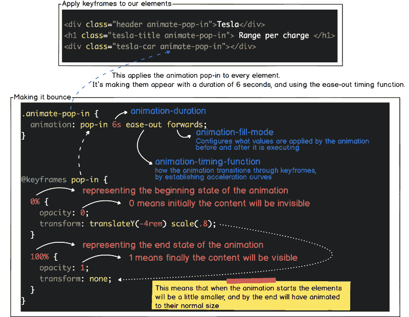

现在你可以看到这三个元素在 6 秒钟内慢慢变大。

### 1–4 立方贝塞尔曲线

在我们的例子中，我们使用了带有动画计时功能的缓出。缓动函数指定参数随时间的变化率。我们可以使用四种预定义的计时功能，它们是缓进、缓出、缓进和线性。

*   **缓和** —在中间时稍微加速，然后在接近终点时减速
*   **缓入** —缓慢开始，加速至结束
*   **减速** —快速启动，减速到底
*   **缓入缓出** —缓慢开始，加速至中间，然后减速至终点
*   **线性** —始终保持恒定的动画速度

重要的是，它们本质上是基于**贝塞尔曲线**。

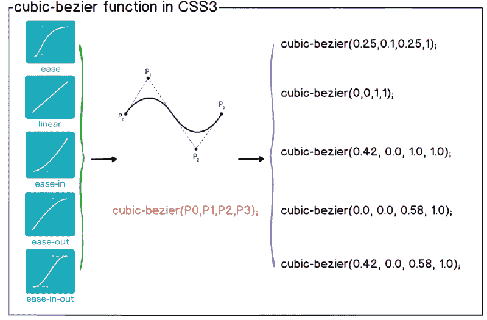

### 1–5 创建自定义速度

正如在我们的现实生活中，并不是所有的物体都以恒定的速度运动，将这些可变的速度赋予屏幕上的元素将会产生更真实的运动。使用**三次贝塞尔**函数，我们能够创建自定义速度。

然而，用三次贝塞尔函数格式定义动画速度并不直观。

这里有一个神奇的[工具](http://cubic-bezier.com/)来可视化三次贝塞尔曲线是如何工作的。

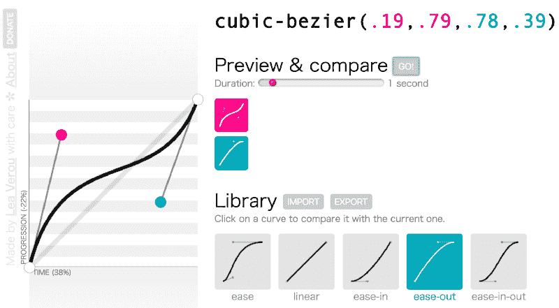

这是一个应用自定速度而不是缓出的示例。

热身结束了，我们开始吧。

### 2.加大尺寸

正如我们在演示中看到的，我们将在应用程序中的两点应用动画:

*   当加载应用程序时
*   当用户动作发生时

### 2.1 加载应用程序时

让我们看看我们的应用程序的整个布局。我们在第 1 部分、第 2 部分中创建的应用程序的组件结构没有任何变化。只需要在相应的 CSS 文件中定义动画属性和@keyframes 即可。要修改的 CSS 文件用绿色标记。

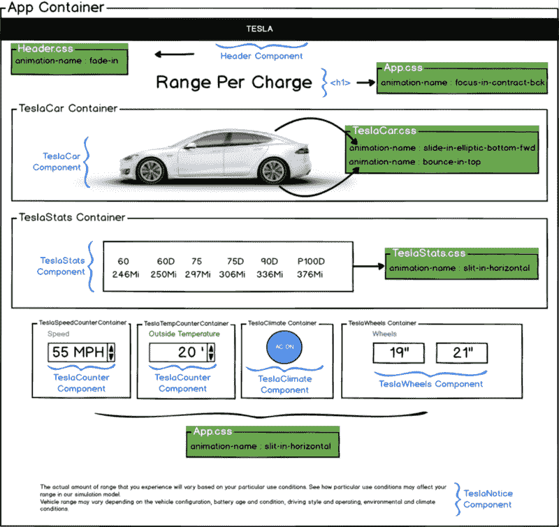

### 2.1.1 介绍 Animista

如果有一个工具能让我们在应用动画之前看到可能的效果，那不是很好吗？一旦你应用了它们，效果会是怎样的？如何在一个地方组合多个动画属性？这正好有一个工具:Animista。

有了这个工具，我们可以随意触摸和测试动画效果。一旦你找到你喜欢的动画，点击生成代码按钮，复制动画属性值，并将其应用到我们的应用程序中相应的 CSS。

不要忘记单击添加到收藏夹按钮，并从下载页面获取关键帧代码。

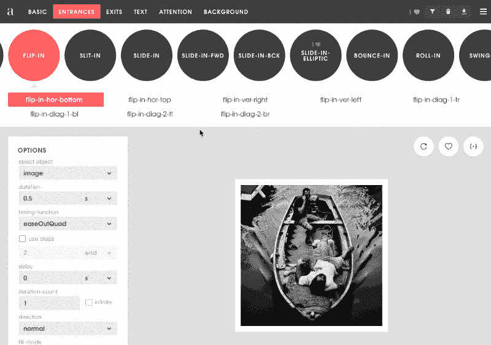

### 2.1.2 建立第二部分项目代码库

如果您想直接阅读第 3 部分而不看第 2 部分，您需要首先通过克隆第 2 部分的代码来构建代码库。

*   git clone[https://github . com/gy ver 98/redux-Tesla-battery-range-calculator-tutorial](https://github.com/gyver98/redux-tesla-battery-range-calculator-tutorial)
*   npm 安装
*   npm 开始

在 npm 启动后，让我们确保应用程序正常工作。

### 特斯拉割台

Tesla Header 组件应该有逐渐显示徽标的淡入效果。

首先，打开 **Header.css** 文件，粘贴从 Animista 复制的动画属性和关键帧值。然后在 **Header.js** 文件中修改它来引用这个类。

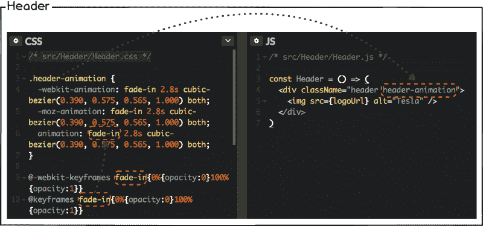

*   查看 [Header.css](https://gist.github.com/gyver98/6f13ec5d1fbf5aa5659b50b3a8d88c09#file-header-css)
*   查看 [Header.js](https://gist.github.com/gyver98/d1d4eb07a86f61a46b09ff83982c6cf2#file-header-js)

### 2.1.4

# title

**焦点在合同中-bck** 效应很可能对特斯拉标题起作用。给动画效果和你在 Tesla Header 里做的一样。

注意，title

# 元素是在 App.js / App.css 中定义的。

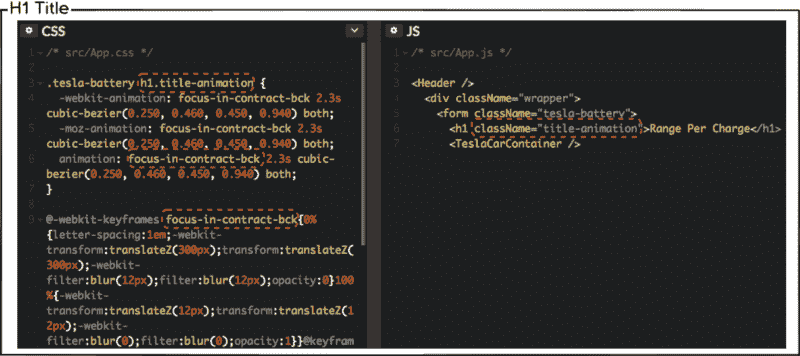

*   查看 [App.js](https://github.com/gyver98/part3-animation-tesla-battery-range-calculator-tutorial/blob/master/src/App.js)
*   查看 [App.css](https://github.com/gyver98/part3-animation-tesla-battery-range-calculator-tutorial/blob/master/src/App.css)

### 特斯拉汽车

对于具有最多动态效果的 TeslaCar 组件，让我们应用以下两个效果。

*   特斯拉汽车:**滑入椭圆形底部前进**
*   特斯拉车轮:**顶部反弹**

/src/Components/Tesla car/Tesla car . CSS

```
.tesla-car-animation {  -webkit-animation: slide-in-elliptic-bottom-fwd 0.7s cubic-bezier(0.250, 0.460, 0.450, 0.940) both;	-moz-animation: slide-in-elliptic-bottom-fwd 0.7s cubic-bezier(0.250, 0.460, 0.450, 0.940) both;	animation: slide-in-elliptic-bottom-fwd 0.7s cubic-bezier(0.250, 0.460, 0.450, 0.940) both;  } 
```

```
.tesla-wheels-animation {  -webkit-animation: bounce-in-top 2.3s both;  -moz-animation: bounce-in-top 2.3s both;  animation: bounce-in-top 2.3s both;}
```

```
@-webkit-keyframes slide-in-elliptic-bottom-fwd{0%{-webkit-transform:translateY(600px) rotateX(30deg) scale(0);transform:translateY(600px) rotateX(30deg) scale(0);-webkit-transform-origin:50% 100%;transform-origin:50% 100%;opacity:0}100%{-webkit-transform:translateY(0) rotateX(0) scale(1);transform:translateY(0) rotateX(0) scale(1);-webkit-transform-origin:50% -1400px;transform-origin:50% -1400px;opacity:1}}@keyframes slide-in-elliptic-bottom-fwd{0%{-webkit-transform:translateY(600px) rotateX(30deg) scale(0);transform:translateY(600px) rotateX(30deg) scale(0);-webkit-transform-origin:50% 100%;transform-origin:50% 100%;opacity:0}100%{-webkit-transform:translateY(0) rotateX(0) scale(1);transform:translateY(0) rotateX(0) scale(1);-webkit-transform-origin:50% -1400px;transform-origin:50% -1400px;opacity:1}}
```

```
@-webkit-keyframes bounce-in-top{0%{-webkit-transform:translateY(-500px);transform:translateY(-500px);-webkit-animation-timing-function:ease-in;animation-timing-function:ease-in;opacity:0}38%{-webkit-transform:translateY(0);transform:translateY(0);-webkit-animation-timing-function:ease-out;animation-timing-function:ease-out;opacity:1}55%{-webkit-transform:translateY(-65px);transform:translateY(-65px);-webkit-animation-timing-function:ease-in;animation-timing-function:ease-in}72%{-webkit-transform:translateY(0);transform:translateY(0);-webkit-animation-timing-function:ease-out;animation-timing-function:ease-out}81%{-webkit-transform:translateY(-28px);transform:translateY(-28px);-webkit-animation-timing-function:ease-in}90%{-webkit-transform:translateY(0);transform:translateY(0);-webkit-animation-timing-function:ease-out;animation-timing-function:ease-out}95%{-webkit-transform:translateY(-8px);transform:translateY(-8px);-webkit-animation-timing-function:ease-in;animation-timing-function:ease-in}100%{-webkit-transform:translateY(0);transform:translateY(0);-webkit-animation-timing-function:ease-out;animation-timing-function:ease-out}}
```

```
@keyframes bounce-in-top{0%{-webkit-transform:translateY(-500px);transform:translateY(-500px);-webkit-animation-timing-function:ease-in;animation-timing-function:ease-in;opacity:0}38%{-webkit-transform:translateY(0);transform:translateY(0);-webkit-animation-timing-function:ease-out;animation-timing-function:ease-out;opacity:1}55%{-webkit-transform:translateY(-65px);transform:translateY(-65px);-webkit-animation-timing-function:ease-in;animation-timing-function:ease-in}72%{-webkit-transform:translateY(0);transform:translateY(0);-webkit-animation-timing-function:ease-out;animation-timing-function:ease-out}81%{-webkit-transform:translateY(-28px);transform:translateY(-28px);-webkit-animation-timing-function:ease-in}90%{-webkit-transform:translateY(0);transform:translateY(0);-webkit-animation-timing-function:ease-out;animation-timing-function:ease-out}95%{-webkit-transform:translateY(-8px);transform:translateY(-8px);-webkit-animation-timing-function:ease-in;animation-timing-function:ease-in}100%{-webkit-transform:translateY(0);transform:translateY(0);-webkit-animation-timing-function:ease-out;animation-timing-function:ease-out}}
```

/src/Components/tes lacar/tes lacar . js

```
const TeslaCar = (props) => (  <div className="tesla-car tesla-car-animation">    <div className="tesla-wheels tesla-wheels-animation">          <;/div>  </div>);
```

*   查看 [TeslaCar.js](https://gist.github.com/gyver98/fedfe9ab47e7a16abeac94308a7ca68b#file-teslacar-part3-js)
*   查看 [TeslaCar.css](https://gist.github.com/gyver98/7e6bef3e05c1f3bce1d0a9a2381c5426#file-teslacar-part3-csshttps://github.com/gyver98/part3-animation-tesla-battery-range-calculator-tutorial/blob/master/src/components/TeslaCar/TeslaCar.css)

此时，您应该会看到:

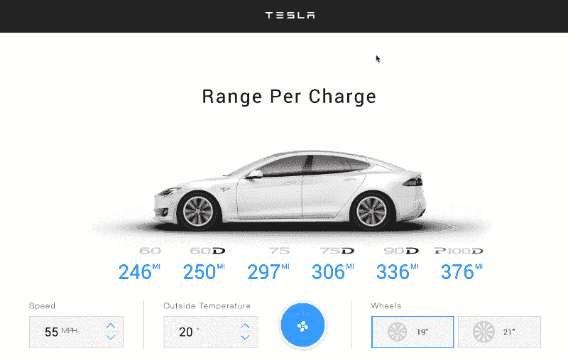

### TeslaStats

这一次，让我们给 TeslaStats 组件一个**横向狭缝**动画效果。在 TeslaCar 动画运行后，延迟 2 秒钟开始。

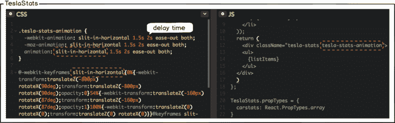

*   查看 [TeslaStats.css](https://github.com/gyver98/part3-animation-tesla-battery-range-calculator-tutorial/blob/master/src/components/TeslaStats/TeslaStats.css)
*   查看 [TeslaStats.js](https://github.com/gyver98/part3-animation-tesla-battery-range-calculator-tutorial/blob/master/src/components/TeslaStats/TeslaStats.js)

### 特斯拉控制装置

速度计数器、温度计数器、气候和车轮组件被包装在 **tesla-controls** 类中，因此我们可以简单地如下修改 App.css 和 App.js，而不需要修改每个组件的 css。

提供与应用于 TeslaStats 组件相同的动画效果。在 TeslaStats 动画运行后，延迟 2.5 秒开始。

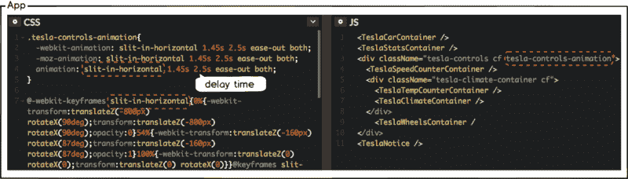

*   查看 [App.css](https://github.com/gyver98/part3-animation-tesla-battery-range-calculator-tutorial/blob/master/src/App.css)
*   查看 [App.js](https://github.com/gyver98/part3-animation-tesla-battery-range-calculator-tutorial/blob/master/src/App.js)

以下是您应该看到的内容:

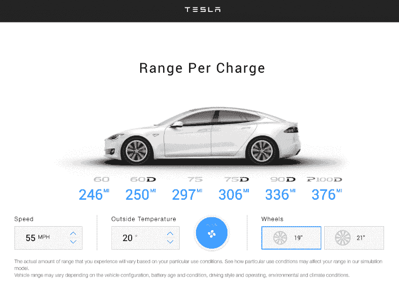

我们已经在应用程序加载时实现了所有的动画。现在让我们实现用户动作发生时的动画。

### 2.2 当用户动作发生时

当用户点击速度、温度计数器和滚轮时，我们将给出以下动画效果。

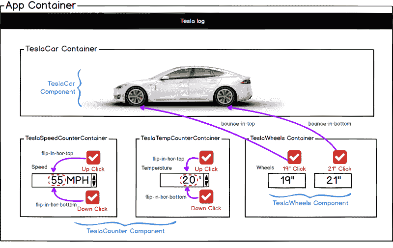

### 速度计数器

首先，考虑一下当你点击加速时会发生什么。

我们将 **mapStateToProps** 和 **mapDispatchToProps** 定义为在第 2 部分中创建 TeslaSpeedCounter 容器并与 Redux 存储通信的一种方式。然后，我们通过**连接**引用 TeslaCounter 组件中的状态，当动作发生时，我们将它分派到 Redux Store 以更新新状态并呈现视图。

下图很好地展示了这种流动。


那么，当一个加速点击事件呈现一个新的状态时，如何制作动画呢？在 TeslaCounter.css 中定义动画后，是否要添加要应用的 flip-in-hor-top 类，如下所示？

```
<div className="flip-in-hor-top">  <p className="tesla-counter__number ">    { currentValue }    <span>{ initValues.unit }<;/span>  </p></div>
```

这不会有任何影响。因为只重新呈现事件发生时更新的 currentValue。此外，我们正在尝试对 up 和 down 事件应用不同的方向。如果是这样，我们需要知道动画和事件的方向，然后确保相应的类被应用和重新呈现。

### 2.2.2 特斯拉线圈. css

首先，让我们定义我们想要在复制后通过 Animista 应用到 CSS 文件的动画代码。添加以下动画类和关键帧。

*   翻转底部
*   翻转式水平陀螺
*   关键帧水平翻转
*   关键帧水平翻转

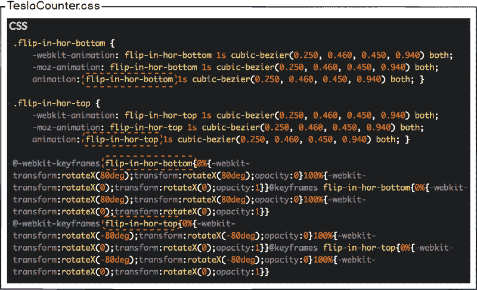

*   查看 [TeslaCounter.css](https://github.com/gyver98/part3-animation-tesla-battery-range-calculator-tutorial/blob/master/src/components/TeslaCounter/TeslaCounter.css)

### 2.2.3 电子邮件客户. js

为了根据加速/减速事件应用不同的动画效果，我们需要知道事件的类型，用 reducer 在 Redux 存储中更新它，并通过 props 将新的状态值传递给 TeslaCounter。让我们以管理 TeslaCounter 的**本地状态**的方式实现它，而不是将这个事件类型添加到 Redux 存储中。由于需要本地状态，将当前的**功能组件** TeslaCounter 修改为**类组件**。

这里我们还需要更新生命周期方法**componentWillReceiveProps()**。当 props 被传递给 TeslaCounter 组件时，调用此方法。TeslaCounter 组件有两个向上/向下按钮，允许用户通过单击它来更改计数器值。该按钮被绑定到 onClick 事件，并通过调度一个动作来设置 Redux 存储上的状态。然后，新的状态值通过 TeslaCounter 容器中的 connect()作为 prop 传递给 TeslaCounter 组件。

只要用户单击向上/向下按钮，就会开始更新 TeslaCounter 组件。组件上调用的第一个方法是**componentWillReceiveProps(nextProps)**传递新的属性值。这使我们能够将即将到来的道具与我们当前的道具进行比较，并根据价值做出合理的决策。我们可以通过调用 **this.props** 来获得当前的道具，新的值是传递给该方法的 **nextProps** 参数。

那么我们为什么需要 componentWillReceiveProps 呢？这是一个钩子，它允许我们查看即将到来的**更新**。如果我们有一个计算道具的状态，我们可以安全地应用这里的逻辑，并使用 **this.setState()** 存储结果。

这里我们需要一个**方向**状态，也就是动画方向，可以通过比较当前值和更新值得到。

你可以通过下图看到整个流程。

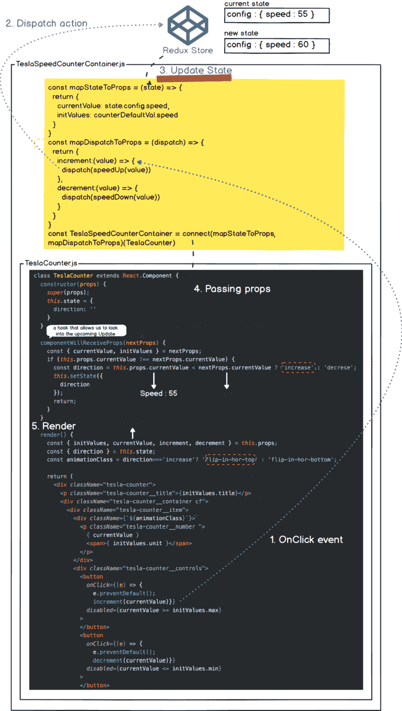

*   查看 [TeslaCoutner.js](https://gist.github.com/gyver98/aba50231c963adfd7d072314d6a8e3f9#file-teslacounter-part3-js)

现在，单击速度和温度计数器，确认动画已被应用。但是有一个问题。如果交替单击向上/向下按钮，它们会正常工作。如果您连续单击同一个按钮，将不会应用动画。这是因为只有当事件类型改变时，动画类才会改变。

为了解决这个问题，将 **animationEffect** 添加到本地状态，并设置 Timeout 以在 0.5 秒后初始化应用的动画类。

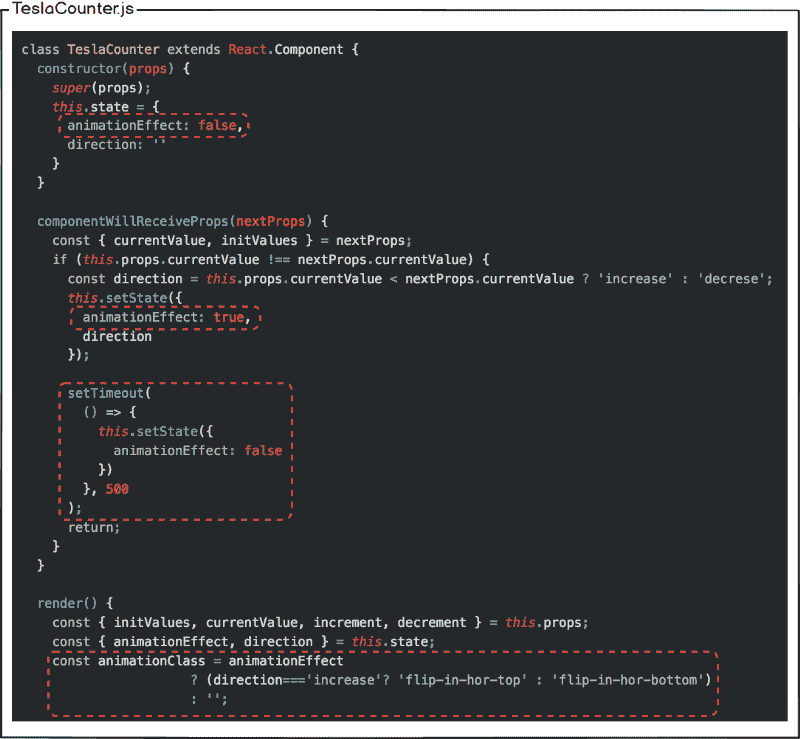

现在您可以看到，即使您连续单击同一个按钮，它也能正常工作。

*   查看 [TeslaCounter.js](https://gist.github.com/gyver98/7431b3df5576de6a408121646588d578#file-final-teslacounter-part3-js)

### 2.2.4 特斯拉高跟鞋动画

最后，让我们应用点击滚轮时的动画效果。

首先，**顶部反弹**已经在 TeslaCar.css 中定义，所以让我们定义额外的**底部反弹**动画。然后打开 TeslaCar.js 文件，用**Tesla-wheel-animation-$ { props . wheel size }**替换 2.1.5 TeslaCar 部分已经应用的 tesla-car-animation。

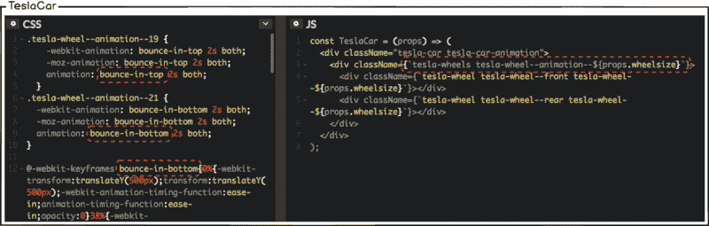

*   查看 [TeslaCar.css](https://github.com/gyver98/part3-animation-tesla-battery-range-calculator-tutorial/blob/master/src/components/TeslaCar/TeslaCar.css)
*   查看 [TeslaCar.js](https://github.com/gyver98/part3-animation-tesla-battery-range-calculator-tutorial/blob/master/src/components/TeslaCar/TeslaCar.js)

你应该有一个带动画的特斯拉里程计算器:

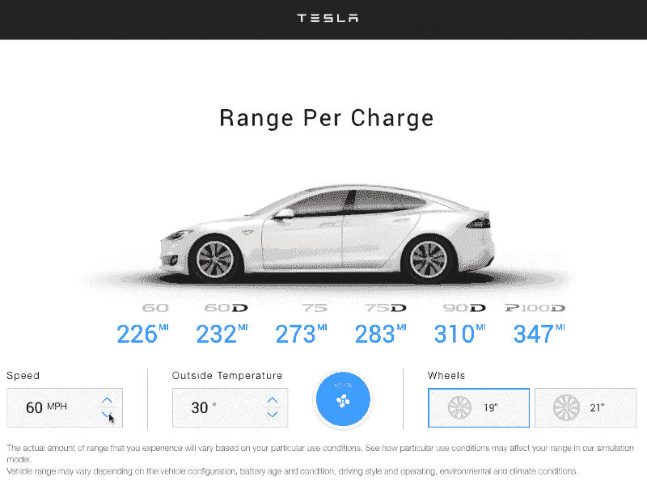

*   查看[完整源代码](https://github.com/gyver98/part3-animation-tesla-battery-range-calculator-tutorial)