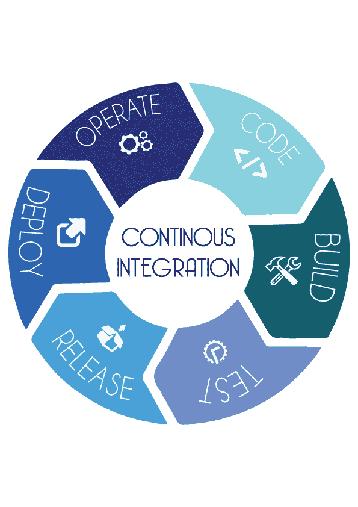
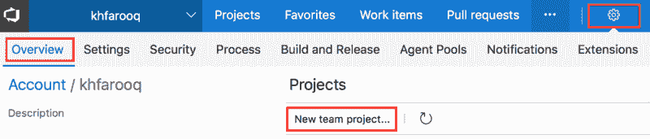
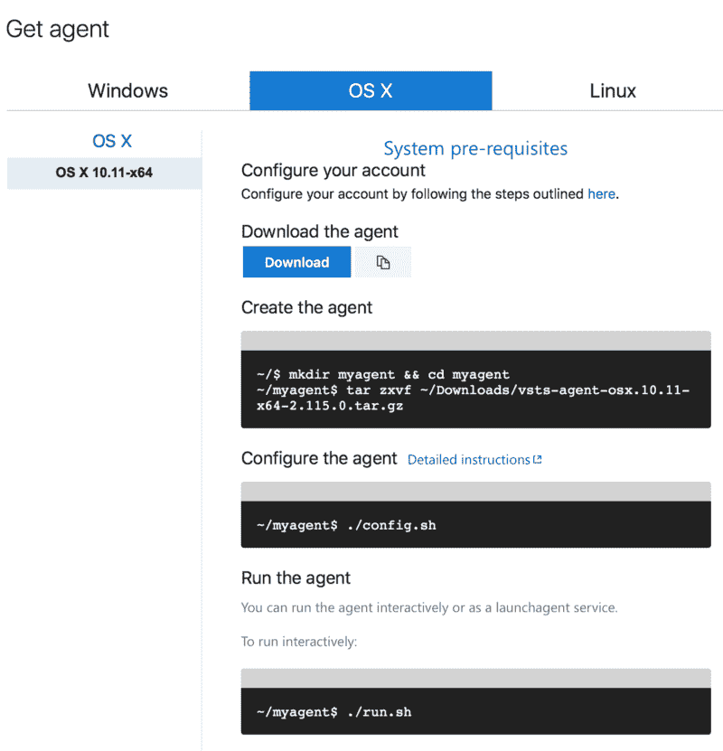
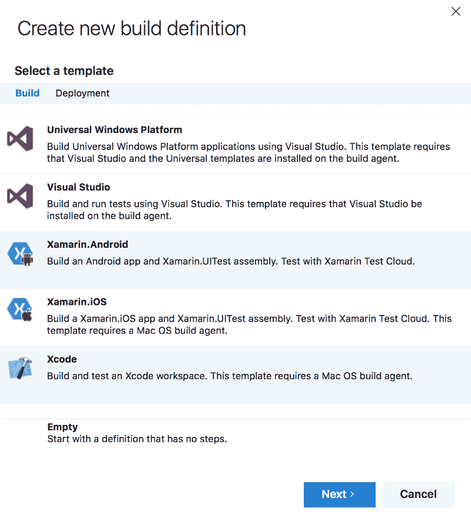
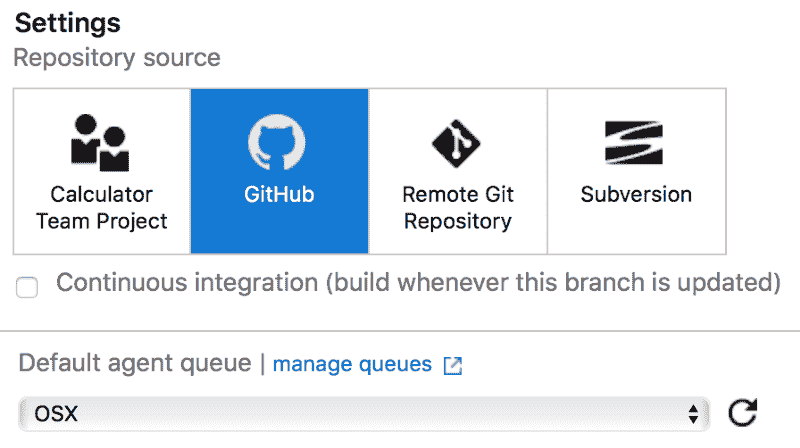
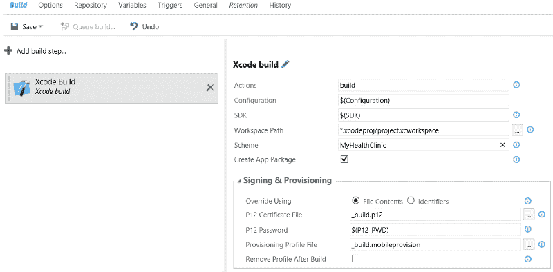
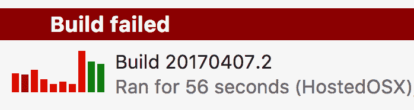
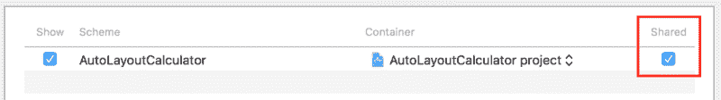
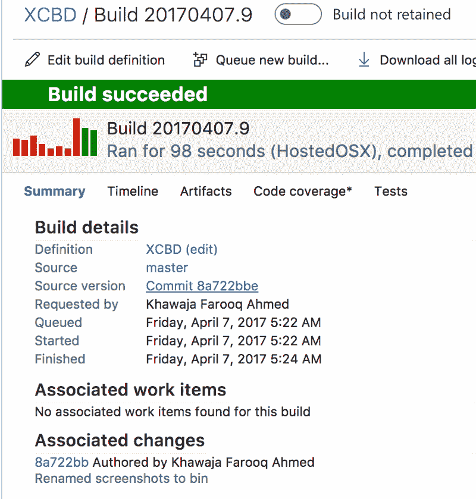

# 如何为 iOS 本机应用程序使用 Visual Studio Team Services

> 原文：<https://www.freecodecamp.org/news/devops-for-ios-native-apps-with-visual-studio-team-services-1d792ae997f1/>

作者:Khawaja Farooq

# 如何为 iOS 本机应用程序使用 Visual Studio Team Services



Visual Studio Team Services(VSTS)提供了一种共享代码、自动化构建、运行单元测试和交付软件的简单方法。来自各种平台的开发人员都依赖它。它促进持续集成，这可以加速从概念到交付的过程。

微软已经做了大量的工作来改进移动和其他平台的 DevOps。然而，没有 iOS 原生平台的具体信息。这里有一个关于如何为 iOS 项目设置 VSTS 的指南，这样你就可以利用它的持续集成能力。

下面是开始的先决条件:

1.  GitHub / TFS 上可构建的 Xcode 项目
2.  VSTS 账户

### 创建一个 VSTS 项目

创建新团队项目→ *设置>概述>新团队项目*



下一步是导入现有的存储库。目前，我们使用 GitHub。点击*导入存储库*。


现在您有了自己的存储库副本，您应该能够看到了！

### 安装 iOS 构建代理

VSTS 没有任何用于构建 Xcode 项目的预装代理。这部分很关键。

幸运的是，该配置由 Xamarin iOS 的 [James Montemagno 负责。为了方便起见，我在这里引用一些步骤。](https://blog.xamarin.com/continuous-integration-for-ios-apps-with-visual-studio-team-services/)

您需要安装以下项目来准备您的 Mac:

1.  [Homebrew OS X](https://brew.sh/)
2.  [。网络核心](https://www.microsoft.com/net/core#macos)
3.  使用命令安装 NPM:**brew 安装 npm**
4.  创建一个[个人访问令牌](https://www.visualstudio.com/en-us/docs/setup-admin/team-services/use-personal-access-tokens-to-authenticate) (PAT)并用于作用域:*代理池(读取、管理)*

#### 代理队列

1.  创建新的代理队列“OSX”→*设置>代理队列*用户
2.  下载并配置 OS X 的构建代理。



配置完成后，使用以下命令运行构建代理:

```
./run.sh
```

干得好！您有一个正在运行的内部构建代理。

### 创建 Xcode 构建定义

一旦安装了构建代理，就该创建构建定义了。这些步骤将为 Xcode iOS 而不是 Xamarin 创建一个构建定义。进入→ *构建&发布>新定义>Xcode*



不要忘记选择您刚刚创建的代理池。



Xcode 构建定义可能如下所示:



*工作空间路径*随着您使用的是 Xcode 工作空间还是项目而变化。

如果您使用 Xcode 工作空间:

```
*.xcodeproj/project.xcworkspace
```

对于 Xcode 项目:

```
*.xcodeproj
```

您还可以使用一些实用程序来[复制和发布您的构建工件](https://www.visualstudio.com/en-us/docs/build/steps/utility/copy-and-publish-build-artifacts)。

接下来，保存构建定义并对新的构建进行排队…



您应该会得到一个构建错误。我们需要对 Xcode 项目配置做一个更改。

### 配置 Xcode 项目/工作空间

为了建设这个项目，VSTS 需要一个共享的项目方案。请确保启用它。 *Xcode* → *产品>方案>管理 s* 方案



现在将更改推送到您的源代码控制并重新构建。



### 部署到霍克亚普

HockeyApp 帮助测试人员进行 beta 应用测试。从市场上安装[VSTS 扩展](https://marketplace.visualstudio.com/items?itemName=ms.hockeyapp)很容易。这使得应用程序能够在成功构建后上传。


[***下载&导入样本构建定义***](https://github.com/khawajafarooq/XcodeBuildDefinition)

Visual Studio Team Services 为 iOS 开发人员提供了持续集成。通过自动化许多重复的任务，它节省了你的时间。

另一个选择是 [MacinCloud](http://www.macincloud.com/) ，一个构建 iOS 原生应用的云解决方案。目前，我们已经审查了内部构建功能，因为 *Azure* 不为 Mac OS X 提供虚拟机支持。给 VSTS 一个尝试，并在评论中留下任何反馈或在 twitter [@khfarooq](https://twitter.com/khfarooq) 上取得联系，这是我前进的动力。感谢阅读！？