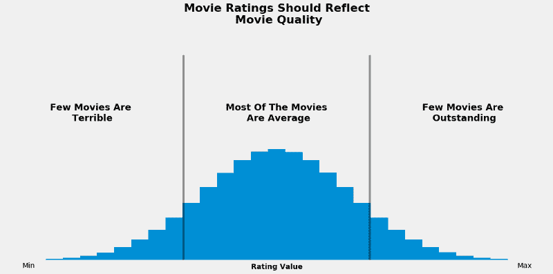
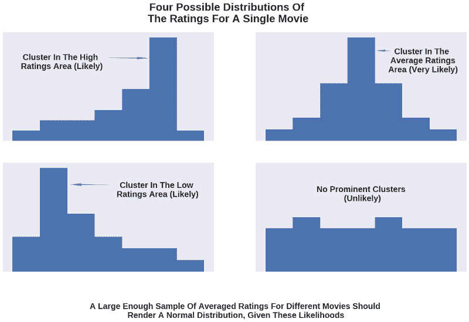
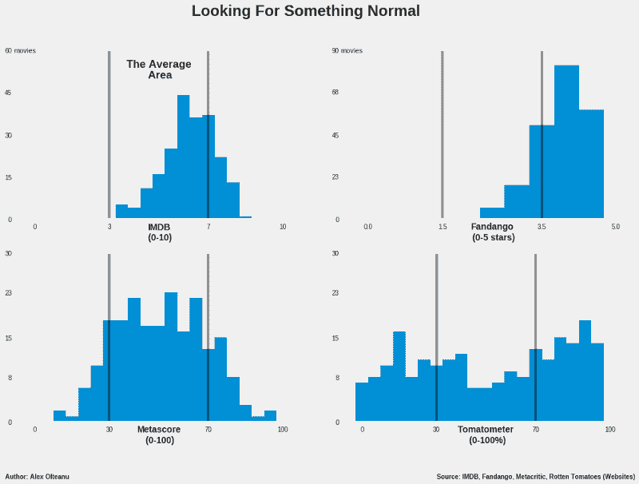
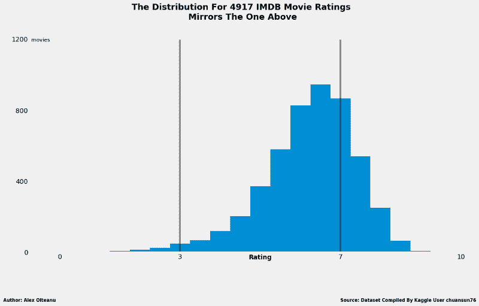
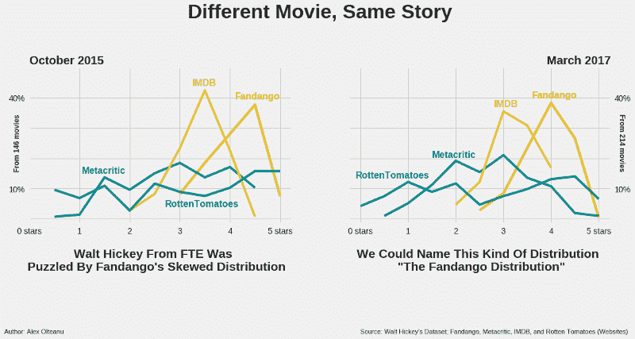
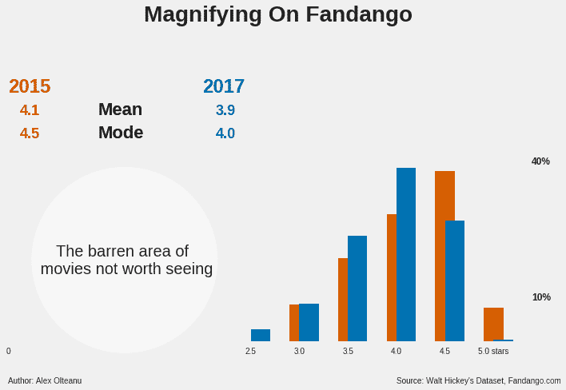
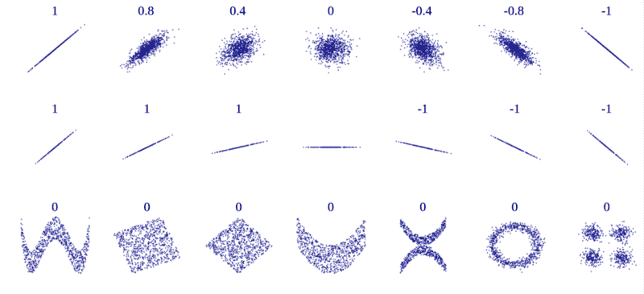

# 你应该相信谁的评级？IMDB、烂番茄、Metacritic 还是 Fandango？

> 原文：<https://www.freecodecamp.org/news/whose-reviews-should-you-trust-imdb-rotten-tomatoes-metacritic-or-fandango-7d1010c6cf19/>

亚历克斯·奥尔特亚努

# 你应该相信谁的评级？IMDB、烂番茄、Metacritic 还是 Fandango？

#### 一位数据科学家研究

该不该看电影？嗯，有很多因素要考虑，比如导演，演员，还有电影的预算。我们大多数人的决定都是基于一篇评论，一个简短的预告片，或者仅仅是通过检查电影的评级。

有几个很好的理由可以让你避免阅读评论或观看预告片，尽管它们带来的信息要比评级多得多。

首先，你可能想完全避免剧透，不管有多小。我明白！

第二，你可能想要一种不受影响的观看电影的体验。这通常只适用于影评，影评上点缀着框框，像“这是一部关于宇宙复杂性的电影”或者“这部电影真的不是关于爱情的”。一旦这些画面在你的短期记忆中被编码，就很难阻止它们干扰你自己的电影体验。

另一个很好的理由是，如果你累了或赶时间，你可能不想看评论，更不用说看 2 分钟的预告片了。

因此，对于相当多的人来说，在相当多的情况下，数字电影评级似乎是一个很好的解决方案。

这篇文章旨在推荐**一个网站**来快速获得准确的电影评级，并为此提供了一个强大的、数据驱动的论证。

### “最好”的标准

提出这样的建议很像说“这是寻找电影评级的最佳地方”，这是一个评价性的陈述，基于一些用于确定什么更好、什么更差或最差以及什么最好的标准。对于我的推荐，我将使用一个单一的标准:正态分布。

寻找电影评级的最佳位置是查看谁的评级分布在一个**模式**中，该模式与正态分布的模式最相似或相同，这是这样的:给定一组位于某个区间的值，它们中的大部分在该区间的中间，少数在该区间的极端。通常，正态(也称为高斯)分布看起来是这样的:

A normal (or Gaussian) distribution of movie ratings means that there are a few low ratings, a lot of average ones, and a few high ones. An ideal normal distribution means the best in this context.

这个标准背后的基本原理是什么？好吧，根据我自己几百部电影的经验，我可以说我看过:

*   几部我看过好几遍的优秀作品
*   一对夫妇真的很可怕，让我后悔花时间看他们
*   还有一大堆普通的，其中大部分我都不记得情节了。

我相信大多数人——无论是评论家、电影爱好者，还是普通的电影观众——都有类似的经历。

如果电影评级确实表达了电影质量，那么我们应该看到两者的相同模式。

鉴于我们大多数人认为大部分电影质量一般，我们在分析电影评级时也应该看到同样的模式。类似的逻辑也适用于电影的好坏。

Every bar is thought here to correspond to a rating (it can also correspond to a rating interval). The taller the bar, the greater the number of movies with that rating.

如果你还不相信这两种模式之间应该有这样的对应关系，想想一部电影的收视率分布。正如许多人对这部电影的评价一样，假设大多数情况下会有许多人有类似的偏好并不是一种信仰的飞跃。他们通常会认为这部电影要么很差，要么一般，要么很好(我稍后会量化这些定性值)。此外，还有一些人用另外两个定性值中的一个来评估电影。

如果我们可视化单个电影的所有评级的分布，我们很可能会看到在对应于低、中或高评级的区域之一中形成单个聚类。

假设大多数电影被认为是平均的，则平均区域周围的群集出现的可能性最大，而其他两个群集出现的可能性较小(但仍然显著)。(注意，原则上所有这些可能性都可以量化，但这需要大量数据，并且有可能将这篇文章写成一本书。)

最不可能的是没有聚类的均匀分布，人们的偏好在三个定性值中几乎平均分配。

给定这些可能性，对于足够大的电影样本的评级分布应该是在平均区域中具有钝的集群，以递减高度(频率)的条为边界，类似于正态分布。

如果你觉得这一切很难理解，考虑这个例子:

Please notice the distinction between “likely” and “very likely”.

### IMDB、烂番茄、Fandango 还是 Metacritic？

现在我们有了一个标准，让我们开始研究数据。

有很多网站都有自己的电影评级。我只选择了四个，主要是根据它们的受欢迎程度，这样我就可以用可接受的票数来获得电影的评级。快乐的赢家是 [IMDB](http://www.imdb.com/) 、[范丹戈](http://www.fandango.com/)、[烂番茄](https://rottentomatoes.com/)和 [Metacritic](http://www.metacritic.com/) 。

对于最后两个，我只关注它们的标志性评级类型，即**自动评级器**和 **metascore** — ，主要是因为这些在每个网站上都更容易被用户看到(这意味着找到它们更快)。这些也在其他两个网站上共享(metascore 在 IMDB 上共享，tomatometer 在 Fandango 上共享)。除了这些标志性的评级，这两个网站还有一个不太突出的评级类型，只有用户才能做出贡献。

我收集了 2016 年和 2017 年一些投票和评论最多的电影的评级。清理后的数据集有 214 部电影的评分，可以从 [this Github repo](https://github.com/mircealex/Movie_ratings_2016_17) 下载。

我没有收集 2016 年之前上映的电影的评级，只是因为在沃尔特·希基的分析之后不久，Fandango 的评级系统发生了轻微的变化，我将在本文后面提到这一点。

我知道用一个小样本工作是有风险的，但至少这可以通过获得收视率分布的最新快照得到补偿。

在绘制和解释分布之前，让我量化一下我之前使用的定性值:在 0 到 10 的范围内，一部**差的**电影在 0 到 3 之间，一部**一般的**在 3 到 7 之间，一部**好的**在 7 到 10 之间。

请注意质量和数量的区别。为了在下文中保持可识别性，我将把等级(数量)称为低、中或高。和以前一样，电影质量被表示为差、一般或好。如果您担心“平均”术语是相同的，不要担心，因为我会注意避免任何歧义。

现在让我们来看看分布情况:

Each rating has its peculiarities. For IMDB and Fandango, each bar corresponds to a 0.5 range, and for the other two, the range of a bar has a value of 5.

简单地看一下，可以注意到 metascore 的[直方图](http://www.datavizcatalogue.com/methods/histogram.html)(这种图形的名称)非常类似于正态分布。它在平均区域有一个由不规则高度的条组成的厚簇，使得顶部既不钝也不尖。

然而，它们比其他两个区域的酒吧数量更多，也更高，这两个区域的酒吧高度逐渐向极端降低。所有这些都清楚地表明，大多数元得分都有一个平均值，这正是我们想要的。

在 IMDB 的情况下，大部分分布也在平均区域内，但是明显偏向最高平均值。高评级区域看起来类似于直方图的那部分中的正态分布**的预期情况。然而，显著的特点是代表低电影评分的区域完全是空的，这就提出了一个大大的问号。**

最初，我把责任归咎于小样本，认为大样本会对 IMDB 更公平。幸运的是，我能够在 Kaggle 上找到一个现成的数据集，包含 4917 部不同电影的 IMDB 评级。令我非常惊讶的是，分布是这样的:

This similarity raises the confidence with regard to the representativity of the smaller sample.

分布的形状看起来与具有 214 部电影的样本几乎相同，除了低评级区域，在这种情况下，低评级区域微弱地填充有 46 部电影(总共 4917 部)。大部分值仍然在平均区域，这使得 IMDB 评级值得进一步考虑推荐，尽管很明显很难与 metascore 竞争，具有这种偏斜。

无论如何，这个结果真正伟大的是，它可以作为一个强有力的论据来支持 214 部电影样本对整个人口具有相当大的代表性的论点。换句话说，现在有了更大的信心，这种分析的结果将与分析所有四个网站的所有电影评级所得到的结果相同，或者至少相似。

随着这种信心的增加，让我们继续检查 Fandango 的评级分布，自 Hickey 的分析以来，它似乎没有发生太大变化。这种倾斜仍然明显倾向于电影分级谱的较高部分，那里是大多数分级的所在地。平均评分下半部分的区域完全是空的，就像低评分的区域一样。很容易得出结论，这种分布与我的标准相差甚远。因此，我不会进一步考虑可能的建议。

(我保证向上滚动的煎熬很快就会结束。如果将它们一个挨着一个放置，比将它们分散在文章中要容易得多。)

最后，tomatometer 的分布出乎意料地均匀，并且在不同的宁滨策略下看起来甚至更平坦(宁滨策略由条形的总数及其范围定义；您可以在生成直方图时使用这两个参数)。

这种分布在上下文中并不容易解释，因为这不是一个经典的评级，而是代表了对一部电影给予积极评价的评论家的百分比。这使得它不适合坏-一般-好的定性框架，因为它使电影要么好，要么坏。无论如何，我想它仍然应该归结为相同的正态分布，大多数电影的正面和负面评论数量之间有适度的差异(呈现许多 30% — 70%的正面评论)，少数电影在这种或那种方式下有明显更大的差异。

考虑到最后一个因素和分布的形状，自动测量计不符合我的标准。可能更大的样本会更公正，但即便如此，如果我要推荐它，我也会有所保留，因为模糊的正面或负面评级系统。

在分析的这一点上，我可以说，通过查看发行版，我推荐 metascore。

然而，IMDB 的分布似乎也值得考虑，特别是如果您稍微调整一下三个定性类别的评级区间(我自己定义的区间，或多或少是任意的)。从这个角度来看，主要通过目测来推荐 metascore 显然是不够的。

所以，我将尝试用一种**定量**的方法在这两者之间划界。

想法是使用 Fandango 变量作为负参考，然后从 IMDB 评级和 metascore 中确定哪个变量与其相关性最小(我调用这些变量是因为它们可以取不同的值，例如，metascore 是一个变量，因为它根据电影取不同的值)。

我将简单地计算一些相关系数，具有最小值的变量将是我的建议(然后我将解释这些相关系数是如何工作的)。但在此之前，让我简单地证明选择 Fandango 变量作为负参考值的合理性。

### Fandango 的用户太爱电影了

做出这一选择的一个原因是，Fandango 的电影评级分布与正常分布相差最远，明显偏向电影评级光谱的较高部分。

另一个原因是 Walt Hickey 的分析给 Fandango 留下的疑云。2015 年 10 月，他也对类似的分布感到困惑，并发现在 Fandango 的网站上，数字评级总是四舍五入到下一个最高的半星，而不是最接近的半星(例如，一部电影的平均评级 4.1 将被四舍五入到 4.5 星，而不是 4.0)。

Fandango 团队修复了有偏见的评级系统，并告诉 Hickey，评级逻辑是他们网站上的一个“软件故障”，指向他们移动应用程序上的一个无偏见的系统。(关于这一点的更多信息，请参见 [Hickey 的文章](https://fivethirtyeight.com/features/fandango-movies-ratings/)。)调整确实使一些统计参数变得更好，但不足以说服我不要将 Fandango 变量作为负面参考。

这就是变化的样子:

I have normalized all the other rating types to match Fandango’s — I converted them to a 0–5 rating system and then rounded the converted values to the nearest 0.5\. The acronym “FTE” stands for FiveThirtyEight, the online publication Hickey writes for.

现在，让我们放大一下 Fandango:

The blue bars represent the year 2017, and the red ones 2015.

### 在 metascore 和 IMDB 评级之间，哪个与 Fandango 评级的相关性最小？

与 Fandango 评级最不相关的是 metascore。相对于 Fandango，Pearson 的 r 值为 0.38，而 IMDB 的评级值为 0.63。

现在让我来解释这一切。

当两个变量变化时，取不同的值，如果有一个模式对应于这两个变化，它们就是相关的。衡量[相关性](http://www.mathsisfun.com/data/correlation.html)简单来说就是衡量这种模式存在的程度。

执行此测量的方法之一是计算皮尔逊 r。如果该值为+1.0，则表示存在完美的正相关，如果为-1.0，则表示存在完美的负相关。

变量的相关程度随着 Pearson’s r 接近 0 而降低，无论是从负面还是正面。

让我们更好地想象一下:

Ratings can be plotted on a graph. Each of the small points that together make up the shapes above could describe the ratings of two variables (say, Fandango and IMDB) for a specific movie. Image credit: Denis Boigelot (source: [Wikipedia](https://en.wikipedia.org/wiki/Correlation_and_dependence#/media/File:Correlation_examples2.svg)).

现在，将上面的抽象放到上下文中，如果我们比较两种评级类型的值如何变化——比如 Fandango 和 IMDB 我们可以确定两种变化对应的模式的程度。

给定刚才提到的相关系数，Fandango 和 IMDB 之间的模式比 Fandango 和 metascore 之间的模式更大。两个系数都是正的，因此，这种相关性被称为是正的，这意味着随着 Fandango 的评级上升，IMDB 的评级也会上升，比 metascores 的评级更高。

换句话说，对于 Fandango 上任何给定的电影评级，metascore 比 IMDB 评级更有可能与之不同。

### 结论:使用 Metacritic 的 metascore

总而言之，我建议你在寻找电影评级时，随时查看 metascore。这是它的工作原理，以及它的缺点。

简而言之，metascore 是来自知名评论家的许多评论的加权平均值。Metacritic 团队阅读这些评论，并给每个评论分配一个 0-100 分的分数，然后根据评论的质量和来源进行加权。你可以在这里找到更多关于他们评级系统的信息。

现在，我只想指出 metascore 的一些缺点:

*   权重系数是保密的，所以你不会看到每篇评论在 metascore 中所占的比重。
*   您将很难找到 1999 年(Metacritic 创建的那一年)之前出现的鲜为人知的电影的 metascores。
*   最近一些主要语言不是英语的电影甚至没有列在 Metacritic 上。比如罗马尼亚电影[两张彩票(2016)](http://www.imdb.com/title/tt5700224/?ref_=nv_sr_1) 和[东方商业(2016)](http://www.imdb.com/title/tt5610362/?ref_=nv_sr_2) 没有在 Metacritic 上列出，而在 IMDB 上，有评级。

### 再多说几句

总之，在这篇文章中，我对在哪里寻找电影评级提出了一个建议。我推荐 metascore 是基于两个理由:它的分布最接近正态分布，它与 Fandango 评级的相关性最小。

文章的所有定量和视觉元素都可以用 Python 再现，正如这里的[所示](https://nbviewer.jupyter.org/github/mircealex/Movie_ratings_2016_17/blob/master/Mv_ratings_project.ipynb)。

感谢阅读！看电影愉快！