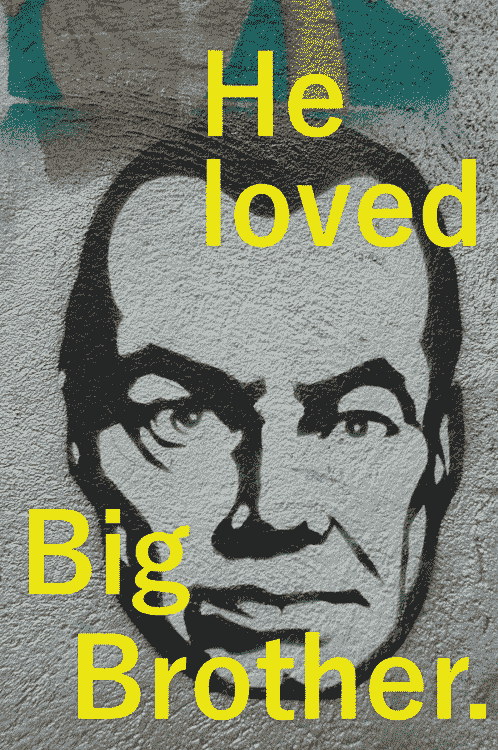
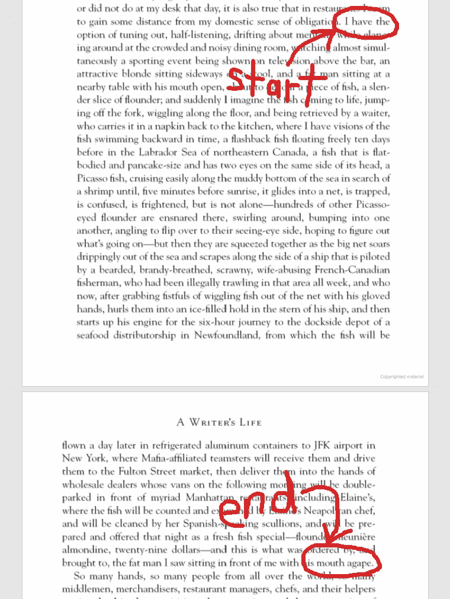
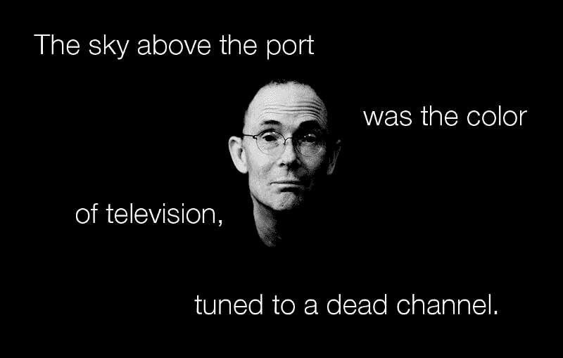

# 我如何建立一个展示伟大小说的第一句和最后一句的应用程序

> 原文：<https://www.freecodecamp.org/news/write-better-sentences-and-do-javascript-crud-with-mean-while-mostly-avoiding-acronyms-fe17905bcec5/>

我知道句子。在我做印刷记者的十年里，我已经为几十家出版物写了几百篇文章。我判的刑期比朱迪法官还多。但我没有学过写作，也没有学过新闻，至少没有正式学过。

我的学位是电气工程。我通过学习和模仿专业作家的句子来学习写作。作家通常在他们的第一句和最后一句处于最佳状态。

> “任何文章中最重要的一句话都是第一句。

> 你应该像选择第一句话一样，仔细考虑选择最后一句话。"

> — *论写得好*，威廉·津瑟

感受如何构建好句子的一个方法是，在大声朗读时，把你欣赏的作家的散文打出来。亨特·S·汤普森[复制了整部小说](http://menwithpens.ca/hunter-thompson/)，把*的《了不起的盖茨比》*和*的《永别了，武器》*打在他的打字机上，让菲茨杰拉德和海明威进入他的手指。

我没有做过那么极端的事情，但是多年来，我把我读过的每本书的第一句和最后一句都打了出来，这导致了一个不断增长的列表，我希望这也提高了我自己的写作水平。

但是在我每天挣钱和睡觉之间的几个小时里，我只能读这么多的书，写这么多的句子。孩子要养，地毯要打扫，陌生的东西要狂欢——你知道，生活。

我经常想，如果在网上有一个地方，任何人都可以贡献他们正在阅读的书籍的第一句和最后一句，那该多好啊。我们可以一起建立一个句子的宝库。对于像我一样喜欢通过模仿来学习的人来说，这将是一个很好的资源。

嗯，碰巧我最近痴迷于学习用 JavaScript 编程。因此，我开始用我有限的知识，用 JavaScript 框架 MongoDB、Express、Angular 2 和 node . js——统称为 MEAN stack——自己创建这个地方。我把这个(非常简单的)web 应用程序称为第一个[和最后一个](http://www.first-and-last.com/)。

> “有些人欣赏美术；其他人欣赏美酒。我欣赏好句子。”

> ——如何写一个句子和如何读一个句子，斯坦利·费什

这篇文章的其余部分将在描述我关于如何写出更好的句子的更多想法的部分和解释我在编写第一个和最后一个时学到的一些编程知识的部分之间交替。

如果你只对写作感兴趣，可以跳过编程部分。如果你只对编程感兴趣，你可以跳过写作部分。如果你只对在跳伞或爬山时熨内裤感兴趣，请转到[这里](https://en.wikipedia.org/wiki/Extreme_ironing)。


Last sentence of Where the Wild Things Are by Maurice Sendak (image credit: [geraldbrazel](https://www.flickr.com/photos/geraldbrazell/6389453857))

### 阅读一切

如果你渴望成为文学明星——下一个乔纳森·弗兰岑或査蒂·史密斯——那么坚持阅读高雅文学。向大师们学习。但是大多数想提高写作水平的人都有更适中的目标。

> 你拿起的每本书都有它自己的一课或几课，而且通常坏书比好书能教给你更多的东西

> —论写作，斯蒂芬·金

也许你想为自由代码营开一个博客或者写一篇[中型文章。也许你想通过写更好的报告来打动你的老板。](https://medium.freecodecamp.com/how-to-get-published-in-the-freecodecamp-medium-publication-9b342a22400e)

在我所在的城市——安大略省渥太华——大约有 15 万人为加拿大联邦政府工作。数以千计的人受雇于这个城市。我认为，这里最常见的写作是政府文件:备忘录、简报、规章、新闻稿、政策、公共咨询、指南等等。

这些文档大部分写得好吗？啊，只能说还有[提升的空间](http://rogercollier.com/portfolio/gobbledygook/)。很大的空间。加拿大尺寸的房间。


I arrange my books by color. Pretty. But bad for book-hunting. Hmm, I think Dune has a beige cover…

那些只想写得更清楚、更简洁的人可能会发现，在文学虚构领域之外研究句子会有更大的好处。阅读流行的非小说作品。看童书。见鬼，看看麦片盒子。

在类型小说家的作品中，有一个很好的地方可以找到坚定、熟练的句子，这些作家笔下有贫穷的侦探、被抛弃的情人、聪明的律师和爱做梦的吸血鬼。

是的，这些书经常充斥着陈词滥调。但它们从来不会让人困惑。像詹姆斯·帕特森、林伍德·巴克利和哈兰·科本这样的作家是让句子变得简单的专家。我从研究他们的写作中学到了很多东西——我不是书呆子——你会在开头和结尾找到他们的一些句子。

> “如果听起来像写作，我就重写。”

> —写作的十大法则，埃尔莫·伦纳德

商业小说中的句子简洁明了。它们包含很少的华丽词藻，没有呼朋唤友。人们带这些书去海滩度假是有原因的。你可以在半醉的时候读它们，不会错过任何东西。

另一方面，在你的第五个巴哈马妈妈之后处理尤利西斯是不明智的。

### 信息不足

我制作《第一个和最后一个》的主要技术目标很简单:从浏览器中获取数据，将其放入数据库，然后将其返回浏览器进行显示。差不多就是这样。我想了解信息如何在前端(Angular)和后端(Node 和 MongoDB)之间移动。

换句话说，我想做一个执行四个基本数据库操作的应用程序——创建、读取、更新和删除(CRUD)。我不喜欢首字母缩写，但我必须承认，我喜欢 CRUD 和 MEAN。这是对这个乖戾的悲观主义者的甜言蜜语。

#### 步骤 1:获取用户输入


#### 第二步:存储在 MongoDB 中


#### 步骤 3:从数据库中提取并在浏览器中显示


就像我说的，很简单。没有花哨的算法。没有数据可视化。只是来回移动信息，主要是文本。不过，我做了一个愚蠢的假设，给我带来了一些麻烦。

为了在浏览器中显示我存储的句子，我首先必须从数据库中获取它们。当我向 MongoDB 请求三个随机条目时，它返回一个包含三个对象的数组。在 Angular 中，我将获取的数据分配给一个名为“句子”的本地数组，我将它声明为包含对象。

```
export class DisplayallComponent implements OnInit {  
  sentences: [Object]; 
```

那很好。后来，我决定允许用户“喜欢”和评论句子。所以我必须在后端更新数据模式，告诉 MongoDB 存储什么类型的信息。我声明了一个 like 计数器，它是一个数字和一个名为“likedBy”的字符串数组，其中放入了喜欢某一对句子的用户的用户名。

```
const SentenceSchema = mongoose.Schema({  
  likes: {  
    type: Number, default: 0 
  }, 
  likedBy: {  
    type: [String] 
  }
```

还是那句话，没问题。最后，我补充一下评论。每个评论对象包含一个用户名和评论的主体。我将一个对象数组添加到我的数据模式中，声明它的方式与我在 Angular 中对“句子”数组所做的一样。

```
const SentenceSchema = mongoose.Schema({  
  likes: {  
    type: Number, default: 0 
  }, 
  likedBy: {  
    type: [String] 
  },
  comments: {
    type: [Object]
  } 
```

然而，当我测试评论时，它不起作用。前端没有明显的错误，Chrome DevTools 的控制台里也没有红色的文字对着我尖叫。然而，当我查看数据库时，我在浏览器中提交的评论却无处可寻。

经过一段时间的试这试那和一些深夜的安静诅咒，我找到了问题所在。事实证明，MongoDB 希望我比 Angular 更具体。我必须告诉它我的“comments”数组中 comment 对象的每个元素的数据类型。仅仅声明数组包含对象是不够的。

```
comments: [{
       username: String,
       body: String
 }],
```

看起来，程序员和《五十度灰》的作者至少有一个共同点。有时候说得更直白会有好处。

### 保持简短



Last sentence of 1984 by George Orwell (image credit: [m.a.r.c.](https://www.flickr.com/photos/mabi/307544850))

我喜欢长句子，真的。加里森·凯勒尔以《草原旅伴》出名，他写的句子优美、有趣、杂乱，只有在墨迹未干时才结束。小说家 E.L .多克托罗以一个 131 字的句子开始*比利·巴斯盖特*，以一个 [277 字的弥天大谎结束](http://www.first-and-last.com/search/billy%20bathgate)。在*作家的一生*中，非小说类传奇人物盖伊·特立斯有一句话是**四百一十九**字长。



A looooooooong sentence. Do not attempt at home.

但是不要搞错——这些作家是在炫耀。他们擅长自己的工作，并希望你知道这一点。我没意见。因为在一个伟大作家的手里，任何一句话，哪怕是比沙奎尔·奥尼尔的汉堡王收条还长的一句话，都会在掌控之中。

我不是盖伊·特立斯。你也不是。走久了，就会走错路。相信我。我编辑自由记者和学者的文章，当条款开始堆积时，问题也开始堆积。悬空修饰符。代词不匹配。不雅的重复。多余的话。时髦的连词。

总之， [blerg](https://www.youtube.com/watch?v=4DuKPHXRLjA) 。

最好改变你的句子长度——这样更好听——但是要控制住。短句和中长句的混合是你最安全的选择。



First sentence of Neuromancer by William Gibson (image credit: [Frédéric Poirot](https://www.flickr.com/photos/fredarmitage/1057613629))

### 信息太多

我将要分享更多的代码，事情会变得很糟糕。抱歉，我对这个不熟悉。如果你想在评论中嘲笑我，请随意。

记者脸皮厚。我们需要它。例如，本周早些时候，我收到了以下电子邮件——来自一个在布达佩斯租豪华公寓的家伙——是关于我在 2013 年写的一篇关于间歇性禁食的文章。


I apologize. What is autophagy?

无论如何，这是 Angular 中调用的函数，当用户点击 First 和 Last 中条目下的大拇指图标时，正如我最初编写的那样。

```
if(this.authService.loggedIn()) {
  const isInArray = sentence.likedBy.includes(this.username); 
  if(!isInArray) {
    sentence.likedBy.push(this.username); 
    this.authService.incrementLikes(sentence).subscribe(data => {
      this.sentences[index] = data;
```

只有当用户已经登录并且还没有“喜欢”那个条目时，他们才能“喜欢”一对句子。当这些条件满足时，喜欢那对句子的用户的本地数组被更新。

然后调用更新数据库中的 like 计数器和“likedBy”数组。整个句子对象被发送到后端，当更新的句子对象被返回时，浏览器中显示的 like 计数器加 1。

可悲的是，在我后端的数据模型中，我有这个。

```
module.exports.incrementLikes = function(sentence, callback) {
  const query = {_id:sentence._id};
  sentence.likes++;
  const likesPlus = sentence.likes;
  const likesUserArray = sentence.likedBy;
  const newLikeUser = likesUserArray[likesUserArray.length - 1];
  Sentences.findOneAndUpdate(query, 
    {likes: likesPlus, $push:{likedBy: newLikeUser}}, 
    {new: true}, callback
  );
}
```

该函数递增作为参数传入的计数器，并将其赋给一个局部变量，该变量替换数据库中的 like 计数器。

如果这还不够的话，我从传递给函数的语句对象中复制了整个“likedBy”数组，然后创建了另一个局部变量来保存数组中的最后一个用户名，最后，将该用户名推入数据库的“likedBy”数组。

成功了，但还是。可笑。

MongoDB 需要 Angular 提供的唯一信息是要更新的句子对象的惟一 ID 和单击竖起大拇指图标的用户的用户名。不是整句对象。

因此，相反，我创建了一个新的对象，它只有 Angular 中的这两个元素要传递给后端。

```
onLikeClick(sentence, index) {
  if(this.authService.loggedIn()) {
    const isInArray = sentence.likedBy.includes(this.username); 
    if(!isInArray) {
      const updateLikes = {
        likeID: sentence._id,
        likeUsername: this.username
      }
      this.authService.incrementLikes(updateLikes).subscribe(data =>
          this.sentences[index] = data;
```

然后，我简单地在数据库内部递增 like 计数器(而不是在外部递增并覆盖数据库值)，并将传递给函数的用户名推入数据库的“likedBy”数组。

```
module.exports.incrementLikes = function(updateLikes, callback) {
  const query = {_id:updateLikes.likeID};
  const newLikeUser = updateLikes.likeUsername;
  Sentences.findOneAndUpdate(query, 
    {$inc: {likes: 1}, $push: {likedBy: newLikeUser}}, 
    {new: true}, callback
  );
}
```

当你是一个编程新手时，工作的喜悦会影响你的判断。不去管难看的代码是很诱人的，因为毕竟它做了我想让它做的事情。但是如果我写散文时重视简洁，为什么我写代码时会有什么不同呢？杂乱就是杂乱。

传递不需要的信息是没有意义的。

当警察向你索要驾照时，你不要同时交出你的借书证、出生证明和阿什利·麦迪逊密码。

### 保持简单


Some of my books on writing. And some of my toes (on rug).

我非常喜欢可读性。我认为，当你瞥一眼一段密密麻麻的长句——充斥着首字母缩写词、统计数字、符号、浮夸的职称或以“-ization”结尾的冗长、糟糕的单词——你的大脑会叹息。

“哦，太棒了，”它用它小小的脑嘴呻吟道。"这会很有趣的"

许多偶尔将写作作为工作一部分的人，尤其是学者和学科专家，非常关注内容，以至于他们经常忽略了表达。他们想做到全面，想表达他们所有的观点——从 A 点到 Z 点——并且会在每个句子中尽可能多地填入信息。

但是如果最终的结果是不可读的，也不太可能被保留，也许根本就没有意义。我更希望读者清楚地记住一些提出的想法，而不是立刻忘记一打随意提出的过多想法。

> “可怜的福克纳。他真的认为大情绪来源于大话吗？他以为我不认识十块钱的字。我完全了解他们。但有更古老、更简单、更好的词，我用的就是这些。”

> ——欧内斯特·海明威

在某些形式的写作中总会有不雅观的杂乱——这是不可避免的。关于编程和技术的文章会有缩写。商务写作会有流行语。医学研究摘要可能包含 0.86，96%可信区间 0.4–0.56 的调整比率。

尽管如此，我们可以努力做得更好。我们只能提供读者需要的信息，仅此而已。我们可以抑制想要留下深刻印象、炫耀我们的谷歌增强词汇的冲动。我们可以删减修饰性形容词，避开行话，不惜一切代价避免“谁”。我们能做的不仅仅是把单词写在纸上。

写好很难。但受苦的应该是作家。不是读者。