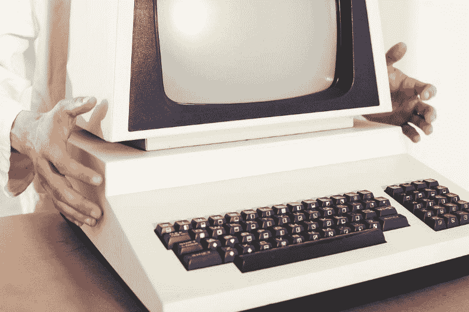
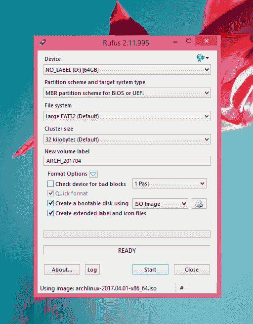
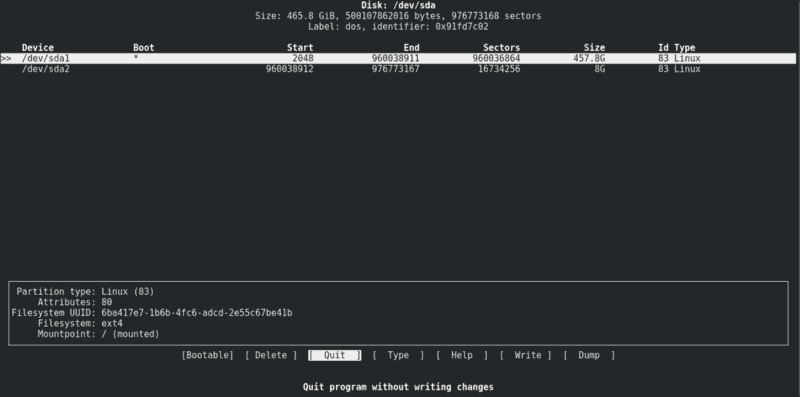
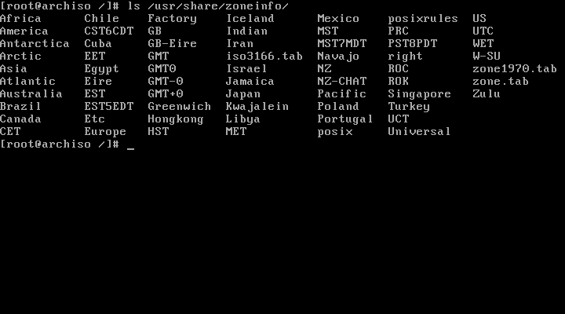
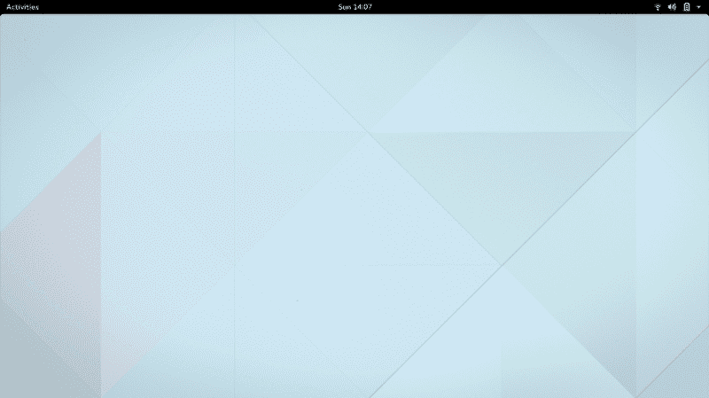

# 安装 Arch Linux 如何让我的旧笔记本电脑起死回生

> 原文：<https://www.freecodecamp.org/news/how-installing-arch-linux-brought-my-old-laptop-back-to-life-1c1c76dd688e/>

乔纳森·巴尔迪

# 安装 Arch Linux 如何让我的旧笔记本电脑起死回生



有一台运行 Windows 太慢的旧电脑吗？不要扔掉或卖掉它。在上面安装 Linux。

没用过 Linux？这很有趣，只要你愿意学习和尝试。

注意，如果你不喜欢修补，桌面 Linux 可能不是你的最佳操作系统。

随着时间的推移，Windows 和 macOS 操作系统会使系统运行速度变慢。应用程序变得越来越复杂，因为它们适应了对更用户友好的功能的需求。

Windows 10 在这方面做得更好。微软的目标是在台式机、平板电脑和移动设备上拥有通用的操作系统，这鼓励了他们迎合更低规格的机器。

但我不确定苹果是否有同样的目标。新款 MacBook Pros 比许多价格只有三分之一的机器都要慢。许多用户抱怨说，El Capitan 和 Sierra 在升级了 Mac 的操作系统后消耗了更多的资源。

这本身并不是一件坏事。我喜欢为提高 Mac 的可用性而采取的措施。我喜欢我的 Windows 10 操作系统的速度，我从七岁起就开始使用 Windows。我认为自己是 Windows 超级用户。

当心粉丝少年时代。永远保持开放的心态。坚持使用这两种操作系统都是愚蠢的。生活不仅仅是你使用的电脑。

但是有计划的淘汰意味着人们不必要地扔掉旧的 MAC 和 Windows 机器。它们用起来太慢了，而且新软件也不能在上面安装。

几周前，我启动了我的 2008 MacBook，它拒绝安装 Chrome。连驳船长都不会碰它。不酷！

然而，我现在用的是 2009 年的宏基 Aspire 5735。它有一个 Core 2 Duo 处理器，两个内核的主频为 2.0GHz。它有 4GB 的 DDR2 内存和 500GB 的硬盘。我已经安装了一个全新的电池，但目前为止这是唯一的硬件升级。

我用的是最新版本的谷歌 Chrome。目前，我打开了六个标签页，到目前为止，我还没有经历过任何重大的减速。它还有最新版本的 PhpStorm 和 DataGrip。

在我爸爸给我买这台笔记本电脑的时候，它非常受欢迎。我喜欢它。这是一台高规格的机器，运行得非常好。我刚刚开始上大学，这台机器帮助我改变了学习习惯。在我空闲的时候，它很适合浏览和消费媒体。五年来，它一直是一台出色的便携式工作机。

它就这么死了对我来说没有任何意义。我没有在上面做任何高要求的游戏，我只是想在上面有所收获。

我想要电子邮件，我想要浏览，我想要我的笔记本电脑上的 PhpStorm 和 DataGrip。有了 Linux，我可以轻松地做所有这些事情。

更好的是，我的活动没有被公司监控。我的操作系统没有通过麦克风全天候监听，也没有将数据存储在国外的数据仓库中。

有了 Linux，我想有多少自由和隐私就有多少。

在笔记本电脑上安装 Linux 也非常简单。我马上会告诉你怎么做。

请记住，Linux 支持世界上最大的服务器、最流行的应用程序和最重要的服务。

但它也支持所有安卓智能手机。虽然手机每年都变得越来越强大，但它们还没有现代电脑强大。Android 在大多数现代手机上运行非常流畅。

那是因为 Linux 很简单。它使用更少的资源，并且有一个丰富的开发者社区，他们热衷于互相帮助。

如果 Linux 足以驱动世界上最重要的服务，那么用它来浏览你的脸书新闻就足够了。

### Arch Linux

对于我的安装，我选择了 Arch Linux。这不是给胆小的人的分配。

Arch 的准系统安装程序不是基于 GUI 的，甚至也不是基于文本的。它纯粹使用命令行。

不过，我喜欢这样。以这种方式安装操作系统有助于我理解其内部工作原理。

我的桌面上有 Ubuntu 16.10“yakke ty”，安装起来轻而易举。我下载了 ISO，把它刻录到一个 USB 上，把它插到我的电脑上，从 USB 启动，然后按照简单的说明操作。

Ubuntu 是迄今为止最软的 Linux 入门。我向没有 Windows 或 macOS 以外经验的人推荐它，因为它将是人们最熟悉的。

当您深入研究 Linux 时，尝试不同的东西，并习惯终端。你就会明白我为什么喜欢拱门安装工了。

我没有使用基于文本的 Arch“Anywhere”安装程序。我只是用了命令行。

虽然 Arch 经常被一些人称为“基于文本的恐怖游戏”，但事实是它安装起来非常简单。在本文的后面，您将了解到更多关于内部实际是如何工作的。

默认情况下，您不会获得桌面环境。纯粹是命令行。这是故意的。Arch 旨在成为一个简单的准系统 Linux 系统。

Arch 会上瘾。您可以从零开始，根据需要安装软件。

相比之下，Ubuntu 是减法。你从你可能需要的所有东西开始，然后削减直到你有一个更轻的系统。

两个都不“对”。每一种都适合不同的人和使用案例。唯一“正确”的操作系统是最能帮助您工作和娱乐的操作系统。

不过，安装一个桌面环境来构建 Arch 还是非常容易的。安装一个操作桌面只需要两个命令和一次重启。

因为我们想要一个可以使用的系统，所以我们肯定想要一个桌面环境。在我的安装中，我选择了 [Gnome 3](https://www.gnome.org/gnome-3/) 。我喜欢它的样子。虽然这是众所周知的资源繁重，我喜欢挑战。我想我的笔记本电脑可以胜任。

让我们开始吧。

### **我如何在笔记本电脑上安装 Arch Linux**

我现在将解释我如何在我的笔记本电脑上安装 Arch Linux。

如果你愿意，你可以跟着去。只是要小心，这将删除你电脑硬盘上的所有数据。只有在你完全确定要这样做的情况下才这样做，所以把你的重要数据备份到另一台机器上。绝对不要删除不属于你的机器上的数据！

#### **1。创建 USB 安装程序**

首先我从[他们的网站](https://www.archlinux.org/download/)下载了官方的 Arch Linux ISO。我决定使用 64 位版本。

在我的 Windows 8 平板电脑上，我使用了一个名为 [Rufus](https://rufus.akeo.ie/) 的程序。它允许我把 ISO 刻录到 u 盘上。

如果你想试试这个，你至少需要一个有足够内存的 u 盘来保存操作系统。你可以买一个 8GB 的 u 盘，空间绰绰有余，现在的价格很便宜。

而如果你在 Mac 上，你将无法使用 Rufus，但你可以使用评价很高的 [UNetbootin](https://unetbootin.github.io/) 。

进入 Rufus 后，我从驱动器列表中选择了 u 盘。我从我的下载文件夹中选择 ISO 镜像，并选择 **Start** 开始刻录过程。



**警告:** **如果你这样做，它会删除 u 盘上的所有东西。**

当这个过程结束时，我有了一个可启动的 u 盘。

#### **2。从 u 盘启动**

我重启笔记本电脑，插上 u 盘，进入 BIOS。我改变了启动优先级，使 USB 驱动器控制器在顶部。然后我退出 BIOS，电脑重新启动。

迎接我的是 GRUB 引导加载程序，它把我带到了 Arch Linux 终端。这是一个奇怪的，类似地狱的地方，你使用 u 盘作为操作系统和主文件系统。许多人实际上把 u 盘插到他们的电脑上就有了一个便携的操作系统。

#### **3。检查网络**

将以太网电缆插到我的路由器上，我就可以上网了。我用代码检查了互联网是否正常

```
ping google.com
```

这导致了返回响应的成功 pings。

互联网太棒了！

以太网是连接到您的互联网源提供商的最简单、最安全的方式。大多数老式笔记本电脑都有一个以太网端口。我选择在安装 Gnome 桌面环境之前不配置 Wi-Fi，因为这样会更容易。

#### **4。对硬盘进行分区**

那时候我还在笔记本电脑的主硬盘上安装了 Windows Vista。要安装 Linux，我必须格式化硬盘。

但是首先，我需要设置分区表。这告诉引导加载程序硬盘的哪一部分是可引导的。

要查看分区表，请键入

```
fdisk -l
```

我希望主硬盘上有两个分区:

*   `/dev/sda1`，457GB 空间的主引导
*   `/dev/sda2`，主交换空间用 8GB，或双倍 RAM

对于内存较少的老机器来说，分配两倍的内存来交换空间是个好主意。Linux 将把未使用的内存放入交换空间，以释放 RAM 用于更直接的任务。

我在终端中输入这个命令来激活分区:

```
cfdisk
```

这个程序提供了一个创建和管理分区的用户界面。

它应该是这样的:



我突出显示了现有的分区，并选择了`DELETE`。然后我选择了`NEW`并输入`457G`作为空格，将其标记为 primary。

接下来，我在那个分区上选择了`BOOTABLE`。

然后我选择了下面一行中的`FREE SPACE`，再次点击`NEW`，并创建了具有`8G`空间的交换分区。这是笔记本电脑内存的两倍，将其标记为主内存。Linux 应该会自动将这识别为交换空间。

然后我选择`WRITE`并键入 yes 确认。这将安装新的分区。

**警告:**如果你自己这样做，要小心。这可能会删除数据，并肯定会搞乱您现有的安装。所以只有当你致力于尝试 Arch Linux 的时候，才应该遵循这个方法。

要验证分区，请键入

```
fdisk -l
```

#### **5。格式化分区**

我创建了主分区，但它们还没有格式化。我使用这个命令将主分区格式化为 EXT4:

```
mkfs.ext4 /dev/sda1
```

然后格式化并激活交换分区:

```
mkswap /dev/sda2swapon /dev/sda2
```

硬盘已完全格式化，交换分区已激活。

#### **6。安装基础 Arch Linux 系统**

为了安装 Arch Linux 基本系统，我将笔记本电脑的新主分区安装到我的 USB 文件系统上。

请记住，在这种情况下，USB 充当的是“计算机”。Unix 系统有一个文件系统树。不管是 u 盘、RPi 还是强大的服务器，所有的 Unix 系统都是如此。

将驱动器装入文件系统有点像将文件系统停靠在主文件系统上。我们暂时将硬盘主分区的文件系统插入 USB 的文件系统。

```
mount /dev/sda1 /mntpacstrap /mnt base base-devel
```

这并没有花太多时间，但我确实有时间给自己泡了一杯茶，并在平板电脑上查看了我的电子邮件。

完成后，我拍拍自己的背，运行下一个命令来创建 fstab。这是一个包含系统分区信息的文件。

```
genfstab /mnt >> /mnt/etc/fstab
```

可以读取该文件来验证:

```
cat /mnt/etc/fstab
```

#### **7。配置 Arch Linux**

我需要登录新的 Arch Linux 安装来配置一些东西。我需要设置 root 密码和时区，并创建我的用户帐户。

```
arch-chroot /mnt /bin/bash
```

然后我编辑了语言环境文件:

```
vi /etc/locale.gen
```

我找到了我的区域设置`en_GB.UTF-8`并取消了注释。然后我按下**退出**并键入`:x`写入并退出文件。

为了激活语言环境，我输入了:

```
locale-gen
```

接下来，我创建了另一个语言环境文件:

```
vi /etc/locale.conf
```

我添加了下面一行，并如上保存文件。

```
LANG=en_GB.UTF-8
```

然后我设置了正确的时区。

在英国，我们有可变的时区。在夏天，我们使用英国夏令时(BST ),它比 UTC 早一个小时。其余时间我们使用格林威治标准时间(GMT)，与 UTC 相同。如果你在世界的其他地方，对你来说可能会更简单。

为了找到正确的时区，我输入:

```
ls /usr/share/zoneinfo/
```



我看到 GB，知道那是正确的。必要时，系统会自动调整为 BST/GMT。因此，为了将这里设置为系统的时区，我输入了:

```
ln -s /usr/share/zoneinfo/GB /etc/localtime
```

#### **8。配置密码和用户账户**

系统让我以 root 用户身份登录。为了输入以后登录的 root 密码，我输入了:

```
passwd
```

然后它提示我输入密码并确认。

然后它提示我创建我的用户帐户:

```
useradd jonmkdir /home/jonchown -R jon:jon /home/jon
```

然后我输入:

```
passwd jon
```

我输入了我的帐户密码，就像我输入 root 一样。

我的帐户已创建，但我不能做太多。我没有权限。我必须创建“sudo”组并将我的用户添加到其中。

```
groupadd sudousermod -aG sudo jon
```

要确保 sudo-ers 组拥有正确的权限:

```
vi /etc/sudoers
```

然后我取消了这一行的注释并保存了文件:

```
# %sudo        ALL=(ALL)       ALL
```

现在，我可以作为我的用户使用`sudo`(发音为“soo-doo”，是“超级用户 do”的缩写)命令，这样我就可以安装新的包并访问文件系统的受限部分。

#### **9。配置网络**

现在我需要在两个文件中设置笔记本电脑的主机名:`/etc/hostname`和`/etc/hosts`。所以我运行了下一个命令，输入了**笔记本电脑**:

```
vi /etc/hostname
```

然后我进入了主机的文件:

```
vi /etc/hosts
```

在底部，我输入了下面一行:

```
127.0.0.1 laptop
```

这告诉我的系统将所有对主机名**膝上型电脑**的请求路由给它自己。

网络还是没有按计划运行，所以我需要激活它。我通过键入以下命令来完成此操作:

```
systemctl enable dhcpcd
```

#### 10。将 GRUB 引导程序安装到硬盘上

我们快完成了！现在我需要将 GRUB loader 安装到新的 Arch Linux 系统上，这样它就可以从硬盘启动了。

为此，我运行了以下命令:

```
pacman -S grub os-probergrub-install /dev/sdagrub-mkconfig -o /boot/grub/grub.cfg
```

如果第一个 pacman 命令不起作用，请尝试使用此命令来同步系统的核心数据库:

```
pacman -Ssy
```

然后，我退出硬盘系统，回到 USB:

```
exit
```

然后我从 USB 卸载了硬盘的文件系统:

```
umount /mnt
```

就是这样！

硬盘上有一个新的 Arch Linux 安装，随时可以使用。所以我重启了笔记本电脑，拔掉了 u 盘。

然后，这成功地引导到终端，但这一次，它是在硬盘的新拱系统，而不是在优盘。

#### **11。安装 Gnome 桌面环境**

我们有了新的操作系统，但它仍然是 100%的终端。我想要一个桌面环境来与我的笔记本电脑交互，这样我就可以浏览网页、阅读文档和使用现代应用程序。

Linux 有许多桌面环境。我选择 Gnome 是因为我喜欢它，但是如果我愿意，Linux 允许安装多个桌面环境。

幸运的是，安装 Gnome 桌面环境只需要一个命令:

```
pacman -S gnome
```

它几次提示我检查我想要的额外软件包的版本。我只是点击`ENTER`来选择默认值。

所以安装了 Gnome 桌面环境，但是系统不知道在引导时加载它。所以我输入了这个以确保它确实如此:

```
systemctl enable gdm.service
```

这就设置好了符号链接，我们准备将笔记本电脑重启到 Gnome！

```
reboot
```

然后当笔记本电脑启动时，它加载了 Gnome，我就可以用我的新用户帐户登录了。



Great success!

这个系统现在可供我使用了。不过这还远远没有完成，因为我想安装一些我最喜欢的程序:

*   [鱼壳](http://www.fishshell.com/)，它使终端更快更容易使用
*   htop，用于系统活动监控
*   [Git](http://git-scm.org) ，用于通过 AUR 安装包和工作
*   谷歌浏览器，这是我最喜欢的浏览器
*   Spotify ，这样我就可以听我最喜欢的音乐了！
*   PhpStorm ，这样我就可以工作了
*   DataGrip ，这样我就可以访问我的数据库

对于 Linux，尤其是 Arch，我们不能像在 Windows 或 macOS 上那样下载安装程序或. dmg 文件。我们需要使用 Arch 的两个安装程序来安装它们。所以让我们来学习如何做到这一点！

### 如何使用 pacman 和 AUR 在 Arch Linux 上安装程序

起初，在 Arch Linux 上安装程序似乎有些棘手。第一次对我来说也很棘手，尽管我有使用 Ubuntu Linux 的经验。

Arch 使用 pacman(软件包管理器的缩写)和 Arch 用户库(AUR)来安装程序。

通过 pacman 安装软件包非常简单。为了安装 fish shell、htop 和 Git，我只使用了:

```
sudo pacman -S fish htop git
```

通过 AUR 安装更棘手，尤其是如果你是类 Unix 系统的新手。

我们将安装谷歌 Chrome 浏览器和 Spotify，向您展示如何做到这一点。

首先，确保安装了构建软件包:

```
sudo pacman -S file base-devel abs
```

进入用户的下载文件夹:

```
cd ~/Downloads
```

转到[这里](https://aur.archlinux.org/packages/google-chrome/)并复制 Git 克隆 URL。

然后运行以下命令:

```
git clone [the Git Clone URL]
```

然后在刚刚创建的`google-chrome`目录中输入`cd`，并运行以下命令:

```
makepkg -Acs
```

这可能需要一段时间，取决于您的系统。

该再来杯茶了！

一旦完成，安装软件包。`makepkg`命令应该创建一个文件类型为`pkg.tar.xz`的文件。使用 pacman 的`-U`选项安装这个包。

```
sudo pacman -U x.pkg.tar.xz
```

用实际文件的名称替换`x.pkg.tar.xz`。这将是一个又长又吓人的文件名。只需复制并粘贴到上面的命令中。

就是这样！

现在在 Gnome 中，如果你按下`super`键(Windows 机器上的 Windows 键)，输入 **Chrome** ，Chrome 应用程序图标就会出现在屏幕上。超级容易！

我们可以对想要安装的其他 AUR 软件包使用相同的命令。我们当然可以通过使用 URL [在这里](https://aur.archlinux.org/packages/spotify/)为 Spotify 做同样的事情。

请记住，从 AUR 安装程序的步骤如下:

*   在这里找到包的 Git 克隆 [URL。](https://aur.archlinux.org/)
*   `git clone [the URL]`
*   `cd [package name]`
*   `makepkg -Acs`
*   `sudo pacman -U x.pkg.tar.xz`

### 雅乌尔

安装 AUR 软件包更简单的方法是使用 [Yaourt](https://archlinux.fr/yaourt-en) 。它允许你用一行代码从 AUR 自动安装，很像吃豆人。

打开`/etc/pacman.conf`，在底部添加以下代码行:

```
[archlinuxfr]SigLevel = NeverServer = http://repo.archlinux.fr/$arch
```

然后，在终端中运行以下命令:

```
sudo pacman -Sy yaourt
```

现在你可以使用 Yaourt 安装任何软件包。用法类似于吃豆人:

```
yaourt <operation> [options] [packages]yaourt <search pattern|package file>
```

```
yaourt -Syu # Updates the Arch systemyaourt -S <package> # Install a packageyaourt -U <package> # Upgrade a packageyaourt -R <package> # Remove a packageyaourt -P <directory> # Install from a PKGBUILD in the directoryyaourt --stats # Show stats on all your packages
```

我希望我已经展示了使用 AUR 比看起来容易。用 pacman 安装也超级简单。

我认为分享 Arch 的核心技能很重要，因为在 Arch 中，很少程序是预装的。所以如果你想安装你需要的程序，你需要大量使用这些核心技能。

这就是我喜欢 Arch Linux 的地方。你可以创造出你想要的计算机，而不是仅仅给你一个臃肿的系统，它的容量超过你可能想要或使用的。

这也是为什么 Arch Linux 非常适合老式笔记本电脑和个人电脑的原因。它是如此之轻，以至于在同时运行多个程序时，它只占用不到 5%的 CPU。这里是我的笔记本电脑桌面与 htop 的截图:

是的，我喜欢 90 年代的音乐。告我啊！这是音乐最好的十年之一！

我也选择了 Gnome 桌面环境，许多有经验的读者会注意到，就桌面环境而言，这是相当沉重的。

确实如此。我赌了一把，把它用在 XFCE4 这样的打火机上。

但是我习惯了 Ubuntu Unity 桌面环境，和 Gnome 差不多。我喜欢它的用户友好性。它确实附带了很多 XFCE 遗漏的东西。

正如你从上面的截图中看到的，它没有对我 2009 年的笔记本电脑造成影响。

我认为这个项目是成功的。

以上是我在笔记本电脑上安装 Arch Linux 的全部步骤。如果你正考虑在你的旧笔记本电脑或旧 PC 上安装一个新的操作系统，我希望它能有所帮助。

### 现在我有一个问题要问你。

你觉得这个帖子怎么样？我想听听你的想法。

你尝试过安装吗？太棒了。我很想听听你的经历。

点击下面的评论按钮，写下你的想法，这样我就可以看了。

我有另一个快速的问题要问你，因为如果你正在读这篇文章，你可能是一个开发者。

您是否正在犯大多数开发人员在 SQL 查询中最常犯的错误？想要我在完美索引上的两步算法吗？

下载我的免费报告， [MySQL 最差实践](https://marketing.subjectzero.co.uk/leadpage/8/mysql-worst-practices)。