# 那次我不得不破解自己的 Reddit 密码

> 原文：<https://www.freecodecamp.org/news/the-time-i-had-to-crack-my-own-reddit-password-a6077c0a13b4/>

作者 Haseeb Qureshi

# 那次我不得不破解自己的 Reddit 密码

#### (算是吧。)


Hack the planet, everybody.

我没有自制力。

幸运的是，我了解自己。这让我能够有意识地设计我的生活，这样尽管我有着海洛因成瘾的实验室老鼠的成熟情绪，我偶尔也能完成事情。

我在 Reddit 上浪费了很多时间。如果我想推迟做某件事，我通常会打开一个新的标签，潜入一个 Reddit-hole。但有时你需要打开百叶窗，减少干扰。2015 年就是其中之一——作为一名程序员，我异常专注于提高自己，而重新编辑正在成为一种负担。

我需要一个禁欲计划。

所以我想到:我把自己锁在账户外面怎么样？

**我是这样做的:**

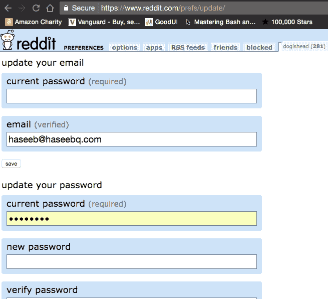

我在我的账户上设置了一个随机密码。然后我让一个朋友在某个日期把这个密码用电子邮件发给我。有了这个，我就有一个简单的方法把自己锁在 Reddit 之外。(还更改了密码恢复的电子邮件，以覆盖所有基地。)

这应该有用的。

不幸的是，朋友很容易受到社会工程的影响。这方面的技术术语是，他们“对你很好”，如果你“求他们”，他们会把密码还给你。

在这种失败模式的几个回合之后，我需要一个更健壮的解决方案。谷歌搜索了一下，我发现了这个:

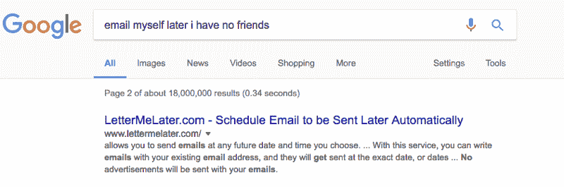

Looks legit.

完美—自动化、无朋友的解决方案！(到现在为止，我已经疏远了他们中的大多数人，所以这是一个很大的卖点。)

看起来有点粗糙，但嘿，暴风雨中的任何港口。

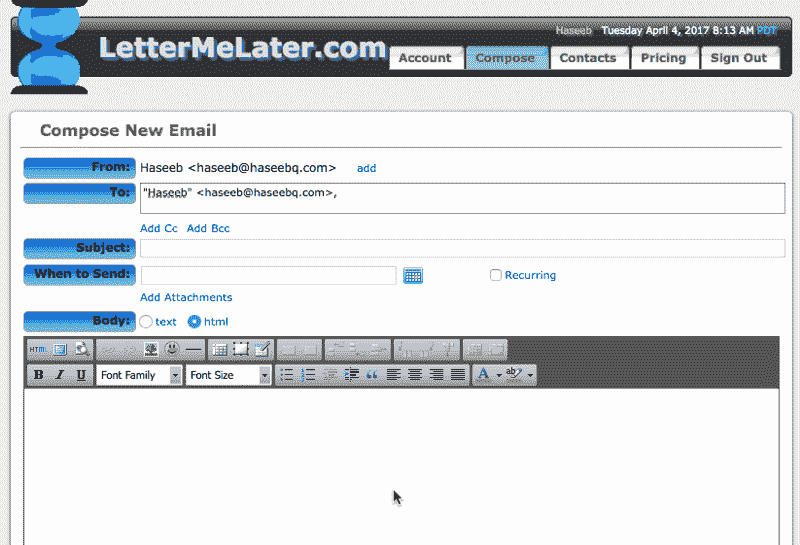

有一段时间，我设置了这样的例行程序——在工作日，我会用电子邮件给自己发送密码，周末，我会收到密码，在互联网上下载垃圾食品，然后在新的一周开始时再次将自己锁在门外。据我记忆所及，它运行得相当好。

最终我忙于编程，完全忘记了它。

### **切到两年后。**

我现在受雇于 Airbnb，收入颇丰。碰巧的是，Airbnb 有一个很大的测试套件。这意味着等待，而等待当然意味着互联网兔子洞。

我决定翻出我的旧帐户，找到我的 Reddit 密码。

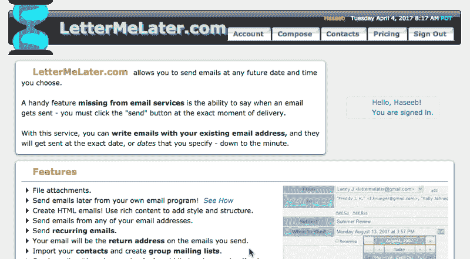

哦不那可不好。

我不记得我这么做了，但我一定是受够了自己，所以我把自己锁在外面，直到 2018 年。我还将它设置为“隐藏”，所以在邮件发出之前，我无法查看邮件的内容。

我该怎么办？我只需要创建一个新的 Reddit 帐户并从头开始吗？但是那有太多的工作。

我可以写信给莱特梅拉特，解释我不是有意这样做的。但他们可能需要一段时间才能回复我。我们已经确定了我非常不耐烦。而且这个网站看起来没有支持团队。更不用说这将是一个尴尬的电子邮件交流。我开始集思广益，详细解释我为什么需要访问这封电子邮件，包括死去的亲戚…

我所有的选择都很混乱。那天晚上，我正从办公室走回家，思考着我的困境，突然我想到了这个问题。

**搜索栏。**

我调出手机上的 app 试了一下:

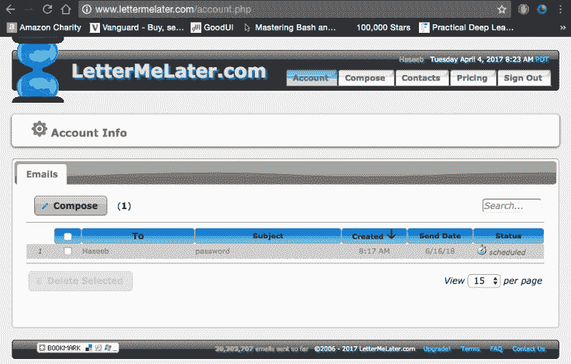

嗯。

好吧。所以它确实索引了主题。尸体呢？

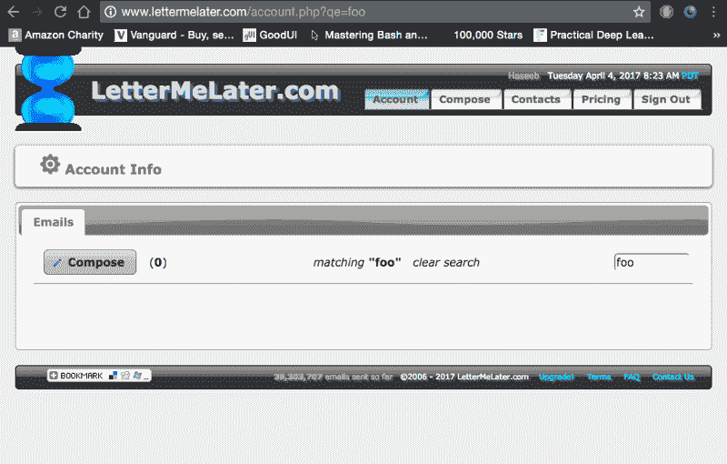

我试了几个字母，瞧。它肯定有身体索引。记住:正文完全由我的密码组成。

本质上，我已经得到了一个执行子串查询的接口。在搜索栏中输入一个字符串，搜索结果会确认我的密码是否包含这个子字符串。

我们在做生意。

我匆忙走进公寓，放下包，拿出笔记本电脑。

算法问题:给你一个函数`substring?(str)`，它根据密码是否包含任何给定的子串返回 true 或 false。*给定这个函数，写一个可以推导出隐藏密码的算法。*

### 该算法

所以让我们思考一下这个问题。关于我的密码，我知道一些事情:我知道它是一个包含一些随机字符的长字符串，可能类似于`asgoihej2409g`。我*可能*没有包含任何大写字符(Reddit 没有强制要求使用大写字符作为密码约束),所以现在让我们假设我没有包含任何大写字符——万一我包含了，如果初始算法失败，我们可以稍后扩展搜索空间。

我们也有一个主题行作为我们查询的字符串的一部分。我们知道主题是“密码”。

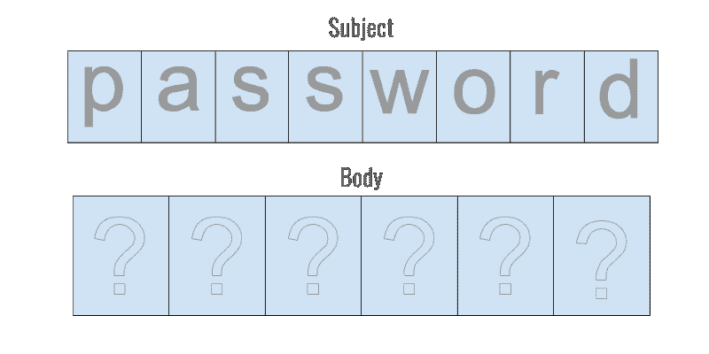

让我们假设正文有 6 个字符长。因此，我们有六个字符槽，其中一些可能会出现在主题行中，一些肯定不会。因此，如果我们使用所有不在主题中的字符，并尝试搜索每一个字符，我们肯定会找到密码中唯一的字母。像玩幸运轮盘游戏一样思考。


我们一个接一个地尝试字母，直到找到不在我们主题行中的匹配项。假设我们击中了它。


一旦我找到了我的第一个字母，我实际上不知道我在这个字符串中的位置。但是我知道我可以开始构建一个更大的子串，方法是在这个子串的末尾追加不同的字符，直到找到另一个匹配的子串。

我们可能需要遍历字母表中的每个字符来找到它。这些字符中的任何一个都可能是正确的，所以平均来说它会击中中间的某个地方，所以给定一个大小为`A`的字母表，它应该平均每个字母有`A/2`次猜测(让我们假设主题很小，并且没有 2+字符的重复模式)。

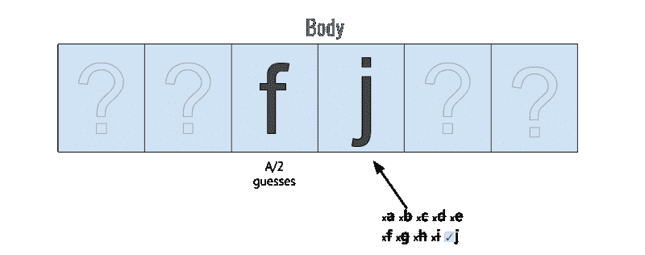

我将继续构建这个子串，直到它最终到达末尾，并且没有字符可以进一步扩展它。

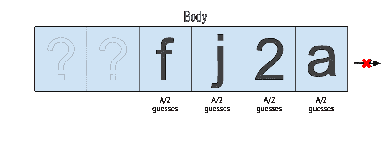

但这还不够——最有可能的是，我漏掉了字符串的前缀，因为我是从一个随机的地方开始的。很简单:我现在要做的就是重复这个过程，除了倒着做。


一旦程序终止，我应该能重建密码。总的来说，我需要算出`L`个字符(其中`L`是长度)，并且需要花费平均每个字符的`A/2`次猜测(其中`A`是字母大小)，所以总猜测数= `A/2 * L`。

准确地说，我还必须在猜测的次数上再加一个`2A`,以确定字符串在两端都终止了。所以总数是`A/2 * L + 2A`，我们可以将其分解为`A(L/2 + 2)`。

让我们假设我们的密码中有 20 个字符，一个由`a-z` (26)和`0–9` (10)组成的字母，因此总字母大小为 36。所以我们看到的是平均的`36 * (20/2 + 2) = 36 * 12 = 432`迭代。

该死的。

这实际上是可行的。

### 实施

首先:我需要编写一个客户端，可以编程查询搜索框。这将作为我的子串甲骨文。显然这个网站没有 API，所以我需要直接抓取网站。

看起来搜索的 URL 格式只是一个简单的查询字符串，`www.lettermelater.com/account.php?**qe=#{query_here}**`。这很简单。

我们开始写这个剧本吧。我将使用 Faraday gem 进行 web 请求，因为它有一个我非常熟悉的简单界面。

我先做一个 API 类。

当然，我们还不指望这能起作用，因为我们的脚本不会被任何帐户认证。正如我们所看到的，响应返回了一个 302 重定向，并在 cookie 中提供了一条错误消息。

```
[10] pry(main)> Api.get(“foo”)
```

```
=> #<Faraday::Response:0x007fc01a5716d8
```

```
...
```

```
{“date”=>”Tue, 04 Apr 2017 15:35:07 GMT”,
```

```
“server”=>”Apache”,
```

```
“x-powered-by”=>”PHP/5.2.17",
```

```
“set-cookie”=&gt;”msg_error=You+must+be+signed+in+to+see+this+page.”,
```

```
“location”=>”.?pg=account.php”,
```

```
“content-length”=>”0",
```

```
“connection”=>”close”,
```

```
“content-type”=>”text/html; charset=utf-8"},
```

```
status=302>
```

那我们怎么签到呢？当然，我们需要在头中发送我们的 cookies。使用 Chrome inspector，我们可以轻松地抓取它们。

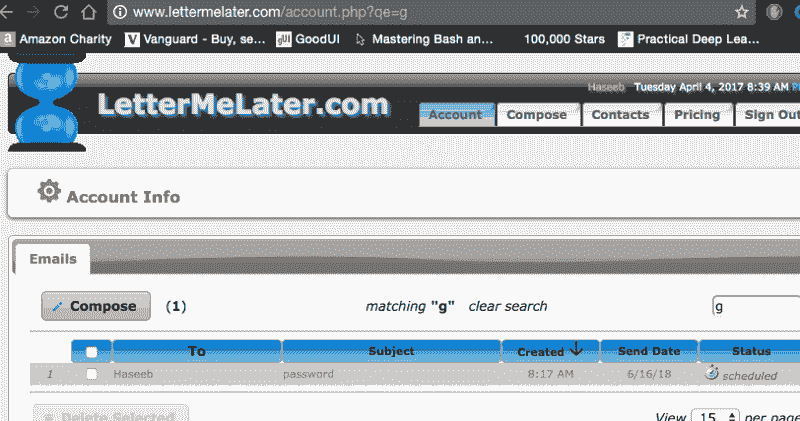

(显然，这里不会展示我真正的 cookie。有趣的是，看起来它正在客户端存储数据，这总是一个好现象。)

通过排除的过程，我意识到需要`code`和`user_id`两个人来认证我…唉。

所以我把这些加到剧本里。(这是假曲奇，仅供举例说明。)

```
[29] pry(main)> Api.get(“foo”)=> “\n<!DOCTYPE HTML PUBLIC \”-//W3C//DTD HTML 4.01//EN\” \”http://www.w3.org/TR/html4/strict.dtd\">\n<html>\n<head>\n\t<meta http-equiv=\”content-type\” content=\”text/html; charset=UTF-8\” />\n\t<meta name=\”Description\” content=\”LetterMeLater.com allows you to send emails to anyone, with the ability to have them sent at any future date and time you choose.\” />\n\t<meta name=\”keywords\” content=\”schedule email, recurring, repeating, delayed, text messaging, delivery, later, future, reminder, date, time, capsule\” />\n\t<title>LetterMeLater.com — Account Information</title>…
```

```
[30] pry(main)> _.include?(“Haseeb”)=> true
```

里面有我的名字，所以我们肯定登录了！

我们已经完成了抓取，现在我们只需要解析结果。幸运的是，这非常简单——我们知道如果电子邮件结果出现在页面上，它就是命中结果，所以我们只需要在结果出现时寻找任何唯一的字符串。字符串“password”不会在其他地方出现，所以这样做很好。

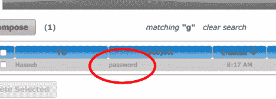

这就是我们的 API 类所需要的。我们现在可以完全用 Ruby 进行子串查询。

```
[31] pry(main)> Api.include?('password')
```

```
=> true
```

```
[32] pry(main)> Api.include?('f')
```

```
=> false
```

```
[33] pry(main)> Api.include?('g')
```

```
=> true
```

既然我们知道这是可行的，那么让我们在开发算法的时候把 API 关掉。发出 HTTP 请求将会非常慢，我们可能会在实验中触发一些速率限制。如果我们假设我们的 API 是正确的，一旦我们让算法的其余部分工作，一旦我们换回真正的 API，一切都应该工作。

这是一个存根 API，带有一个随机的秘密字符串:

我们将在测试时将存根 API 注入到类中。然后在最后一次运行时，我们将使用 real API 来查询真实的密码。

让我们从这门课开始吧。从高层次来看，回想一下我的算法图，它分为三个步骤:

1.  首先，找到不在主题中但存在于密码中的第一个字母。这是我们的出发点。
2.  把这些字母向前放，直到我们从绳子的末端掉下来。
3.  向后构建子串，直到到达字符串的开头。

那我们就完了！

让我们从初始化开始。我们将注入 API，除此之外，我们只需要将当前密码块初始化为空字符串。

现在让我们按照我们概述的步骤编写三个方法。

完美。现在，剩下的实现可以在私有方法中进行。

为了找到第一个字母，我们需要遍历字母表中不包含在主题中的每个字符。为了构建这个字母表，我们将使用`a-z`和`0–9`。Ruby 允许我们用范围很容易地做到这一点:

```
ALPHABET = ((‘a’..’z’).to_a + (‘0’..’9').to_a).shuffle
```

我更喜欢打乱顺序，以消除密码字母分布中的任何偏差。这将使我们的算法平均每个字符查询 A/2 次，即使密码是非随机分布的。

我们还希望将主题设置为常数:

```
SUBJECT = ‘password’
```

这就是我们需要的所有设置。现在是写`find_starting_letter`的时候了。这需要遍历每个候选字母(在字母表中，但不在主题中)，直到找到匹配。

在测试中，这看起来很完美:

```
PasswordCracker.new(ApiStub).send(:find_starting_letter!) # => 'f'
```

现在是举重的时候了。

我要递归地做这件事，因为它使结构非常优雅。

代码出奇的简单。让我们看看它是否能与我们的存根 API 一起工作。

```
[63] pry(main)> PasswordCracker.new(ApiStub).crack!
```

```
f
```

```
fj
```

```
fjp
```

```
fjpe
```

```
fjpef
```

```
fjpefo
```

```
fjpefoj
```

```
fjpefoj4
```

```
fjpefoj49
```

```
fjpefoj490
```

```
fjpefoj490r
```

```
fjpefoj490rj
```

```
fjpefoj490rjg
```

```
fjpefoj490rjgs
```

```
fjpefoj490rjgsd
```

```
=> “fjpefoj490rjgsd”
```

太棒了。我们已经有了一个后缀，现在只是向后构建并完成字符串。这应该看起来非常相似。

事实上，这里只有两行不同:我们如何构造`guess`，以及递归调用的名称。这里有一个明显的重构，让我们开始吧。

现在，这些其他调用简单地简化为:

让我们看看它是如何工作的:

```
Apps-MacBook:password-recovery haseeb$ ruby letter_me_now.rb
```

```
Current password: 9
```

```
Current password: 90
```

```
Current password: 90r
```

```
Current password: 90rj
```

```
Current password: 90rjg
```

```
Current password: 90rjgs
```

```
Current password: 90rjgsd
```

```
Current password: 90rjgsd
```

```
Current password: 490rjgsd
```

```
Current password: j490rjgsd
```

```
Current password: oj490rjgsd
```

```
Current password: foj490rjgsd
```

```
Current password: efoj490rjgsd
```

```
Current password: pefoj490rjgsd
```

```
Current password: jpefoj490rjgsd
```

```
Current password: fjpefoj490rjgsd
```

```
Current password: pfjpefoj490rjgsd
```

```
Current password: hpfjpefoj490rjgsd
```

```
Current password: 0hpfjpefoj490rjgsd
```

```
Current password: 20hpfjpefoj490rjgsd
```

```
Current password: 420hpfjpefoj490rjgsd
```

```
Current password: g420hpfjpefoj490rjgsd
```

```
g420hpfjpefoj490rjgsd
```

太美了。现在让我们再添加一些打印语句和一些额外的日志记录，我们就完成了`PasswordCracker`。

现在…神奇的时刻到了。让我们用真正的 API 交换存根，看看会发生什么。

### 关键时刻到了

交叉你的手指…

`PasswordCracker.new(Api).crack!`

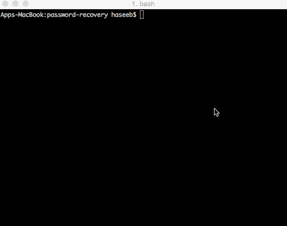

(Sped up 3x)

嘣。443 次迭代。

在 Reddit 上试了一下，登录成功。

哇哦。

它…真的起作用了。

回想一下我们最初的迭代次数公式:`A(N/2 + 2)`。真正的密码是 22 个字符，所以我们的公式将估计`36 * (22/2 + 2) = 36 * 13 = 468`次迭代。我们的真实密码需要 443 次迭代，所以我们的估计在观察到的运行时间的 5%以内。

**数学。**

它起作用了。

避免尴尬的支持邮件。Reddit 兔洞恢复。现在已经证实:编程的确是一种魔法。

(不利的一面是，我现在不得不寻找一种新的技术来将自己锁在账户之外。)

就这样，我要回到我的网络兔子洞了。感谢你的阅读，如果你喜欢，给它一个赞吧！

*—Haseeb*