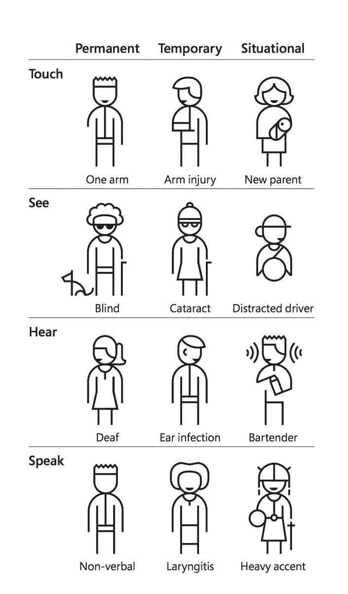
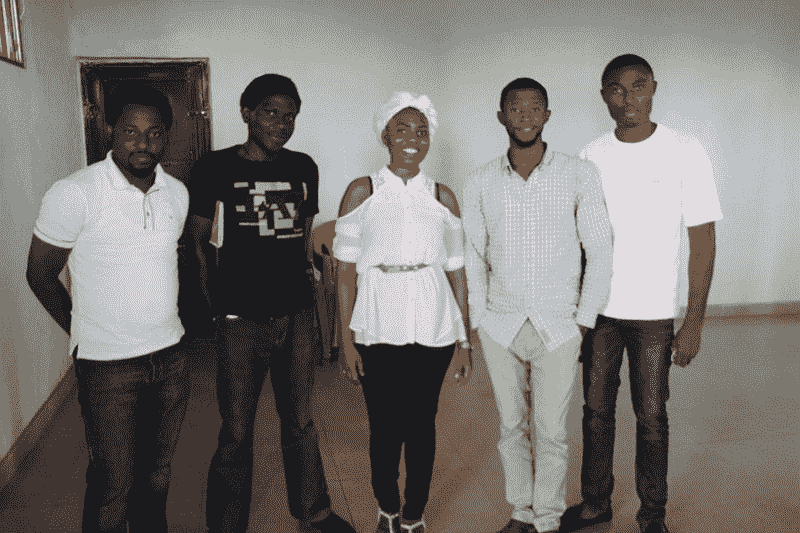

# 我和一个科技亿万富翁一起露营。他给我的建议是无价的。

> 原文：<https://www.freecodecamp.org/news/i-camped-out-with-a-tech-billionaire-the-advice-he-gave-me-was-priceless-700ad3f8b08b/>

这里有三个值得你花时间的链接:

1.  我和一个科技亿万富翁一起露营。他给我的建议是无价的。( [4 分钟读数](http://bit.ly/2oVyAMs))
2.  在你掌握设计之前，你必须先掌握基本原理( [6 分钟阅读](http://bit.ly/2nTwde3))
3.  2016 年图灵奖将授予…蒂姆·伯纳斯·李爵士，万维网的发明者

额外收获:在里德·哈维秀( [53 分钟收听](http://bit.ly/2nxkAIy))的播客采访中，我谈论了学习编码以及自动化是如何改变社会的

### 想到这一天:

> “任何一个在使用电脑时忘记时间的人都知道做梦的倾向、实现梦想的冲动和错过午餐的倾向。”—蒂姆·伯纳斯·李爵士

### 每日一图:

来自[微软包容性设计工具包](http://bit.ly/2n38v1P)的图表显示了可访问性问题的类型。

### 今日学习小组:

[阿布贾自由代码营](http://bit.ly/2ntYPss)

编码快乐！

–昆西·拉森，自由代码营的老师

如果你从这封邮件中获得了价值，考虑一下[支持我们的非营利组织](http://bit.ly/donate-to-fcc)。