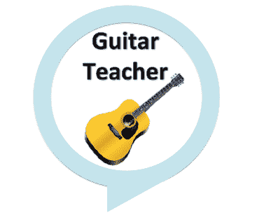
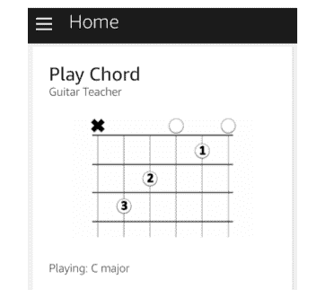
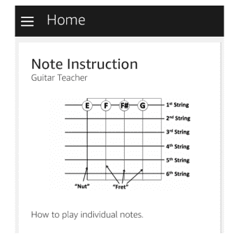

# 我需要一个吉他老师。所以我把我的 Alexa 变成了一个。

> 原文：<https://www.freecodecamp.org/news/who-can-teach-you-the-guitar-better-youtube-or-alexa-96e8cef77470/>

特伦·彼得森

# 我需要一个吉他老师。所以我把我的 Alexa 变成了一个。


学习如何弹吉他需要练习。大量的练习。我自我提升的目标之一是更好地弹吉他。

我现在正在研究的一个领域是手指在指板上的定位。这需要记忆不同的触弦方式。提高需要频繁的练习和指导，但这是非常值得的。

我在网上搜索了一下，发现很多音乐家都伸出了援手。他们分享的一个流行媒体是 YouTube。下面的视频有超过五百万的浏览量，展示了广泛的用途。讲师逐步讲解手指定位和音符的基础知识。

这些视频对于入门来说是很棒的，但迷失的是如何完全专注于音乐。将我的注意力集中在手指放置和音符识别上是我前进的方式。

我尝试了不同的 YouTube 艺术家，试图找到一个完美的教练。我继续遇到的限制不是艺术家或设备的音频质量。更确切地说，限制是在我的手机或笔记本电脑上播放视频的媒介本身。练习时，我从来没有在第一次尝试中做对任何练习。鉴于 YouTube 的界面，我的手放在吉他上，很难播放片段。

### **所以我建了 Alexa 吉他老师技能**

这凸显了交互式语音应用优于传统移动平台的地方。语音应用不需要用手。回放一段需要我的声音，我的手停留在吉他上。对于像我这样需要重复学习以确保正确的学习者来说，不用手是一笔巨大的财富。

我尝试了技能商店中可用的技能，但发现技能非常简单。有些甚至没有吉他的声音，而是单调的声音发出指令。所以我做了任何一个软件工程师都会做的事情，想出了一个我自己叫做“[吉他老师](https://www.amazon.com/Drawrz-com-Guitar-Teacher/dp/B01N805N3E/ref=sr_1_1?s=digital-skills&ie=UTF8&qid=1489286872&sr=1-1&keywords=guitar+teacher)”的人。



Alexa 平台能够只通过语音与人互动。这解放了手指，使其专注于弹奏琴弦。这里有一个带有一些核心特性的技能的快速演示。

### 它是如何工作的？

尽管你看到平台上的大多数技能，Alexa 可以做的不仅仅是说话。更复杂的语音应用程序使用一种称为 SSML 的语法。这会将机器声音与录制到 Mp3 文件中的声音混合在一起。

下面是使用 Alexa 解释如何放置手指来弹奏标准和弦所需的语法。这部分代码播放和弦的声音，以加强实际吉他的音色。

```
{“outputSpeech”: {“type”: “SSML”,“ssml”:“<speak>Okay, let’s get started on how to play the chord C Major.<audio src=\”https://s3.amazonaws.com/.../Chordcmajor.mp3\" /><break time=\”1s\”/>Here are the finger positions. Your index finger will be on string 2 pressing down on fret 1.<break time=\”2s\”/>Your middle finger will be on string 4 pressing down on fret 2.<break time=\”2s\”/>Finally, your ring finger will be on string 5 pressing down on fret 3.<break time=\”2s\”/>Now go ahead and play the chord C Major.<break time=\”1s\”/><audio src=\”https://s3.amazonaws.com/.../Chordcmajor.mp3\" />One more time.<break time=\”1s\”/><audio src=\”https://s3.amazonaws.com/.../Chordcmajor.mp3\" /><break time=\”2s\”/>If you’re ready for another chord to learn, please ask for it now.For example, say Teach me how to play A Major.</speak>”}}
```

### 使用视觉来补充听觉体验

一个写得好的技能通过将卡片推送到用户手机或平板电脑上的配套应用程序来分享视觉效果。这些视觉效果强化了所传递的音频，并补充了内容。

下面是一个卡片示例，展示了弹奏和弦时如何在吉他上放置每个手指。音频使用语音指令向用户提供明确的细节。视觉使用另一种媒介来强化信息。包含的图表是吉他弹奏者使用的标准符号。



也有卡片显示不同音符在指板上的位置。这再次强化了通过技能音频描述的内容。



这些卡片包含的内容类似于 YouTube 视频中嵌入的图形。

一个优点是这些卡片不用你的手就能显示重要的信息。用倒带技能来回放前一个环节也可以回放卡片。你的声音完全主导了叙述。没有按钮，手势，或鼠标点击点击返回按钮或类似的行动。手指专注于拨动和按下琴弦来创作音乐。

### Alexa 缺少什么功能？

语音平台的采用仍处于早期。我希望看到更多像我这样利用语音界面的应用程序。移动设备专用的应用程序更胜一筹。

Alexa 的一个功能是支持从麦克风到应用程序的原始声音数据。今天，Alexa 可以将每个声音直接翻译成文本。这限制了我演奏乐器时平台听音调的能力。有用的移动应用程序验证播放的声音，并让用户知道正确的音调。

### 欢迎反馈

如果你像我一样是一名有抱负的音乐家，并且有一台 Alexa 设备，请尝试一下这项技能。像所有 Alexa 技能一样，它是免费启用的。如果能得到一些有用的反馈和其他要添加的功能，那就太好了。我仍在学习乐器，所以我也欢迎任何关于技能缺失的建议。