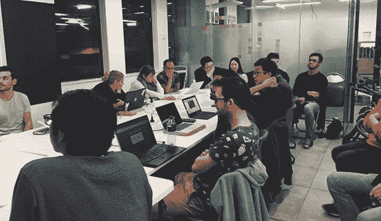

# 一步一步的指南来建立一个简单的国际象棋人工智能

> 原文：<https://www.freecodecamp.org/news/verizon-just-announced-that-it-will-install-spyware-on-all-of-their-android-phones-87ade7630fe2/>

这里有三个值得你花时间的链接:

1.  一步一步的建立一个简单的象棋人工智能的指南( [5 分钟阅读](http://bit.ly/2ojhyMi)
2.  我如何帮助我的伙伴学习编码( [7 分钟阅读](http://bit.ly/2nIONHg))
3.  《软件工程日报》就网络中立和开放互联网的重要性采访了我

### 想到这一天:

> “依靠政府来保护你的隐私就像让偷窥狂给你装百叶窗一样。”—约翰·佩里·巴洛

### (不那么)有趣的一天:

网络漫画作者[不要点击保存](http://bit.ly/2oH6HYH)

### 今日学习小组:

[墨尔本自由代码营](http://bit.ly/2kC9Kk4)

编码快乐！

–昆西·拉森，自由代码营的老师

如果你从这封邮件中获得了价值，考虑一下[支持我们的非营利组织](http://bit.ly/donate-to-fcc)。