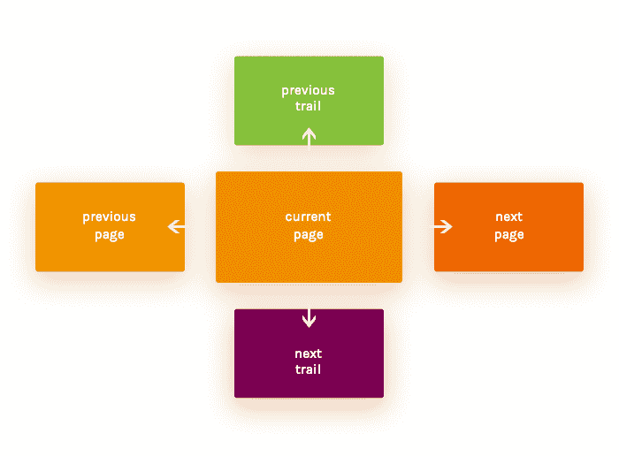
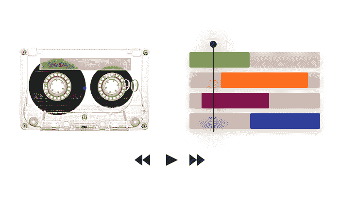
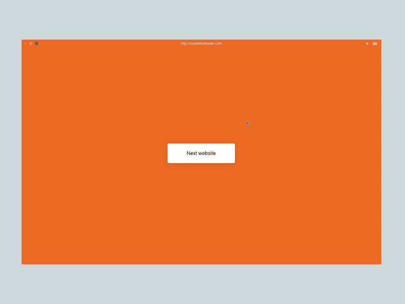
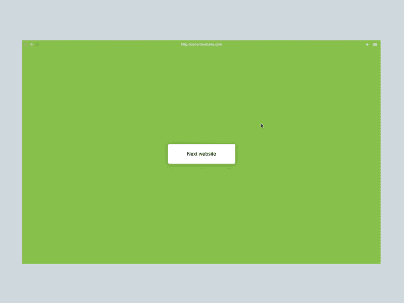

# 无损网络导航的特殊模型

> 原文：<https://www.freecodecamp.org/news/lossless-web-navigation-spatial-model-37f83438201d/>

一个小岛

# 无损网络导航的空间模型

在我的上一篇文章中，我将导航轨迹的概念描述为标准选项卡式浏览模式的演变。

作为 Browser.html 项目的一部分，我正在通过各种用户交互和动画制作一个空间模型。这将有助于用户更好地理解正在发生的事情，以及如何最有效地浏览网页。

用户已经形成了某些行为和期望，我们希望以此为基础。我们希望增强现有的工作流程，而不是替换它们。

### 水平移动—后退/前进

当您倒带或使用视频编辑工具时，一种常见的交互模式是沿时间轴水平移动。浏览器使用这种方法来允许用户返回他们的导航历史。但这仅允许一次后退一个历史条目。快捷方式是存在的，但是它们不允许*预览*过去的页面。

即使对于传统的有损耗的导航历史，有多个条目后退或前进也是很常见的。引入步道只会增加条目数量。

我们希望用户使用熟悉的交互方式选择时间轴中的任意一点。

[Youtube](https://youtu.be/reMbtUWeias)

在我们的设计中，从左侧轻拉(滑动)允许用户查看最后一个历史条目。拖动进一步展开完整的轨迹并揭示整个历史，允许用户通过在站点上释放来返回到任意点。

[Youtube](https://youtu.be/6e0cGYHJoDQ)

拉过去所有的条目切换到轨迹概述，因为我们假设用户想要切换到一个不同的网站。

[Youtube](https://youtu.be/uVRWfjceDDg)

我们希望在建造步道的最早阶段提供视觉线索。一个新的网站会把当前页面推到左边，成为排队的第一个。

### 垂直移动—切换轨迹

主流桌面浏览器最终会重载横轴作为切换标签的方式。相比之下，移动浏览器为此使用垂直空间。

这与目录中长期使用的垂直排序相一致，是安排待办事项的自然方式。

一般人倾向于打开少于八个标签，或者在没有组织的情况下添加标签，直到宣布“标签破产”并重新开始。

[Youtube](https://youtu.be/QH1sOQXvH-k)

打开背景中的链接会创建一个滑动到当前特色页面下方的轨迹，再次提供新轨迹在空间上结束的线索。

[Youtube](https://youtu.be/3NxlriMTNnY)

页面的底部是一个自然的位置，可以方便地访问下一条线索，通过滚动页面的末尾可以方便地访问下一条线索。

[Youtube](https://youtu.be/AWpbnV41zUE)

为了让心智模型发挥作用，它需要应用于所有视图。轨迹概览允许使用前面显示的相同水平手势在轨迹内导航，并使用垂直手势切换轨迹。它提供了一个导航地图，可以访问某个特定主题的所有路径。

### 加入我们吧！

我们目前正致力于建立我们的第一个工作原型。如果这听起来对你来说很有趣，请检查一下 Browser.html 项目！你可以在 GitHub 上找到我们的[未决问题列表](https://github.com/browserhtml/browserhtml/issues)，或者来我们的 [Slack](https://browserhtml-slackin.herokuapp.com/) 上和我们聊天。