# 我分析了网飞终极兽王每集的数据

> 原文：<https://www.freecodecamp.org/news/i-crunched-the-data-from-every-episode-of-netflixs-ultimate-beastmaster-71e91e471574/>

康迪·邦芬

# 我分析了网飞终极兽王每集的数据

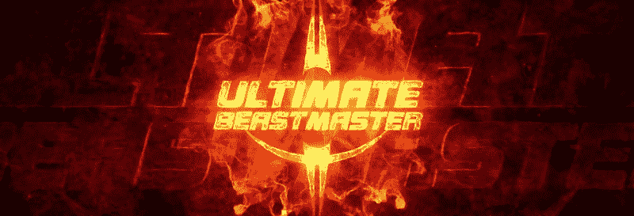

网飞有个新节目叫终极兽王。它基本上是美国忍者战士的克隆:强壮的人跑过疯狂的艰难障碍课程。

我决定一头扎进去，给这个节目一个完整的数据科学待遇。如果你还没有看这部剧，给你一个合理的警告——**这里有剧透**。

开始了。

### 参与者

有 **10 集**。其中 **9 位**介绍 **12 位新参与者各**。 **108 个人**疯狂跳跃，试图成为下一个**终极兽王**，而你却在吃一个家庭大小的奇多**。**

下图展示了该节目中发生的事情。我在这里不包括 final，因为我们将在本文后面单独讨论它。

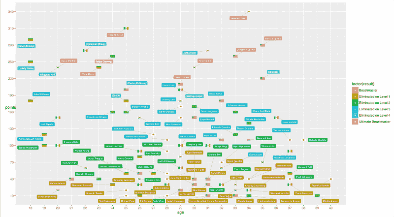

The Ultimate Scatterplot

现在让我们深入研究数据。

#### 性别

不幸的是，在*终极兽王*中，男女数量仍然存在巨大差异。只有**的 22 名女性**面对野兽。**这是竞争对手的 20.4%。**

更糟糕的是:所有的女性都在一级(81%)和二级(13%)被淘汰。唯一的例外是那个年轻的学生？？Si **lke Sollfrank (1** 8 岁)在 3 级被消灭。就是这样。没有**女子进入决赛。**？

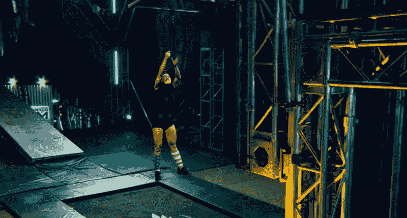

?? Mi**mi Bonny w**as one of the 5 **woman eliminated on Throat Erosion w**here competitors must use an industrial trampoline to jump and grab a lever releasing a climbing wall. Th**is obstacle eliminated just women.**

这让我想到，在这场比赛中，这部剧应该如何处理男性身体相对于女性的一些优势。**如果你比一般人矮，有些障碍太难克服**。

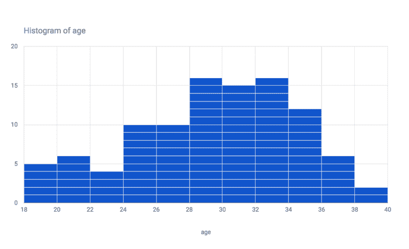

This is not a music wave. It's a histogram.

#### **年龄**

参与者的年龄从 18 岁到 40 岁不等(平均年龄为 29.1 岁)。).五个最小的是德国人(不知道为什么)。

**兽王们——每一集的获胜者——年龄在 **20 到 35 岁之间**(平均 28.1 岁)。太年轻或太老都没有帮助。**

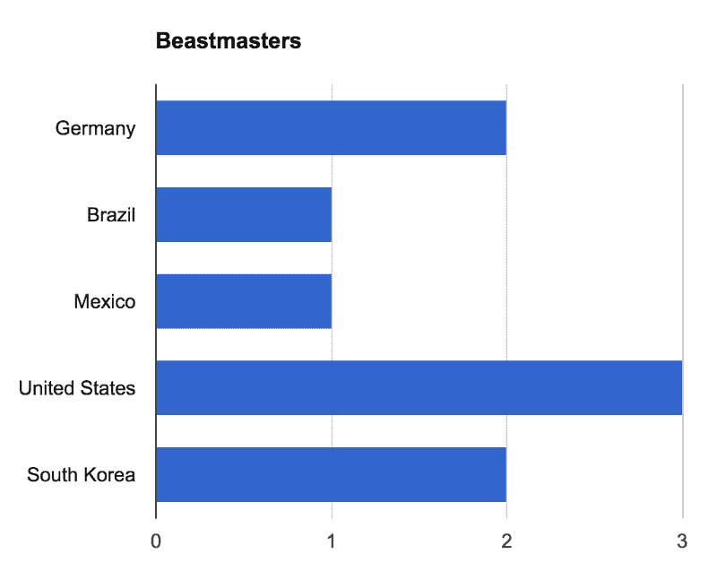

Yeah, no Japanese in the finals… ???

#### **总决赛**

**？？美国带来了 3 个兽王。？？德国和？？韩国，2。但只花了一个？？巴西人赢得终极兽王奖。**

是的，我也是巴西人，现在我对我们在世界杯上从德国拿走的 **7x1** 感觉好多了。

### **分**

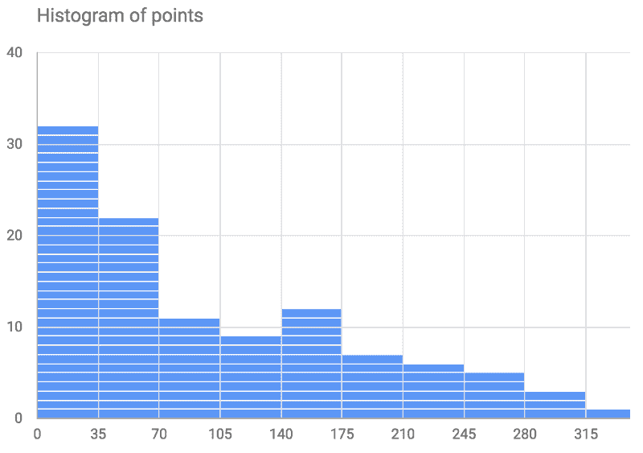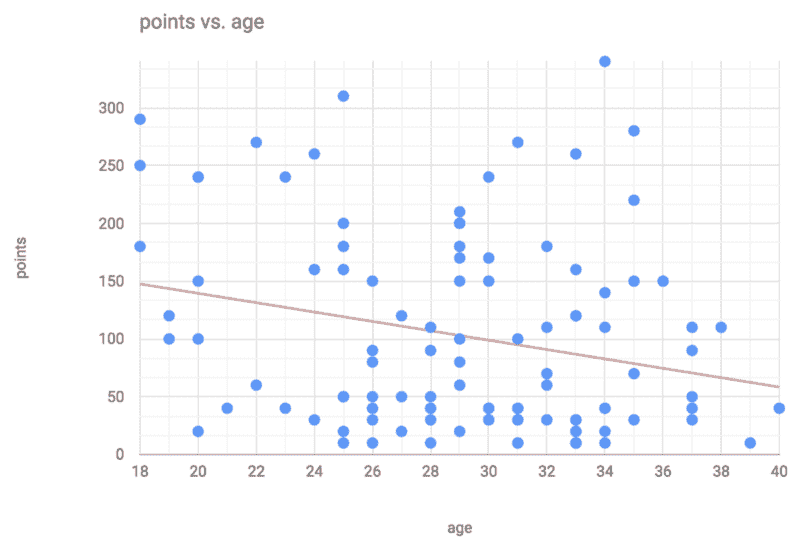

Points acquired by each competitor along the tv show.

**注意，随着年龄的增长**你的分数会有下降的趋势**。**

> **年龄与积分的相关性:**-0.24****

### ****竞争漏斗****

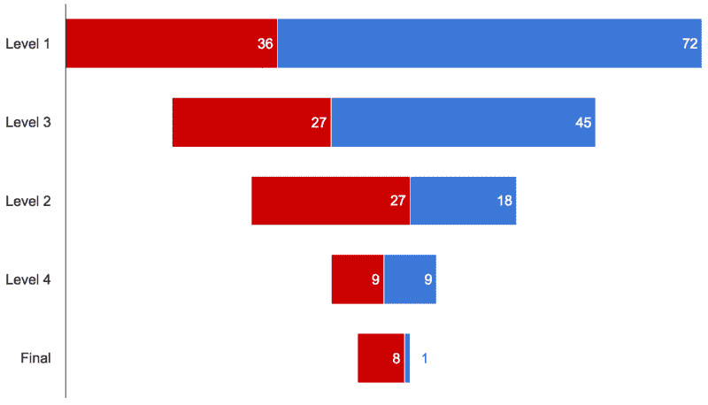

**? Eliminated — ?** Cl**assified**

### ****关卡****

****让我们更深入地了解一下每一级别的比赛及其失败的主要原因。****

### ****一级****

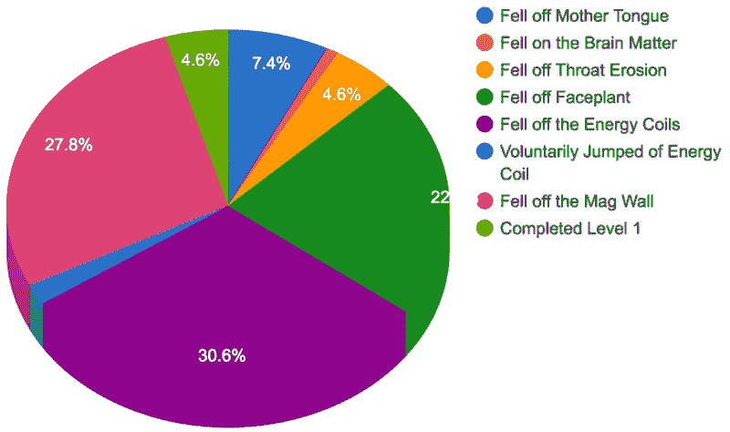

Main causes of failing ordered by position in level 1.

****只有 **5** **(4.6%)** 的参与者能够完成第一关。赛道最难的部分有:****

1.  ******能量线圈** 30.6%****
2.  ******磁壁** 27.8%****
3.  ******face plant**22.2%****

******布兰登·道格拉斯？？难道**是唯一一个在 Br *ain 事件中失败的吗。他是图表中的红线。*****

****在这条赛道上花费的平均时间是 **2'54** ，完成这条赛道的平均时间是 **5'29** 。？？Fe **lipe Camargo 是**最快完成的:5' **10？。最快失败的也是巴西的竞争对手:？？郭佳欣·亚伯拉罕在 0 分 18 秒失败。******

********39.3** 是这条赛道上每个人的平均积分，从 10 到 70** 分不等**。没有人在这一关得到全部 80 分。******

### ****二级****

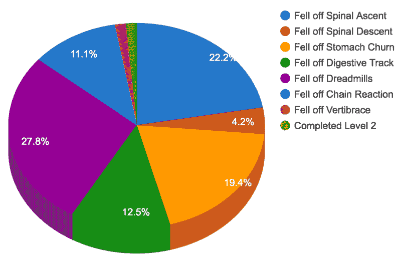

Main causes of failing ordered by position in level 2.

******？？Taeho Kwon wa** 是唯一一个完成第二关的人(他在 4' **28 年成功)。******

****失败主要原因:****

1.  ******27.8%******
2.  ********脊柱上升** 22.2%******
3.  ******19.4%******

********分**:从 **20 到 220** ( **平均 109.1**)。******

******时间:**从 **1'01 到 9'53** (平均**4 ' 08**)。****

### ******三级******

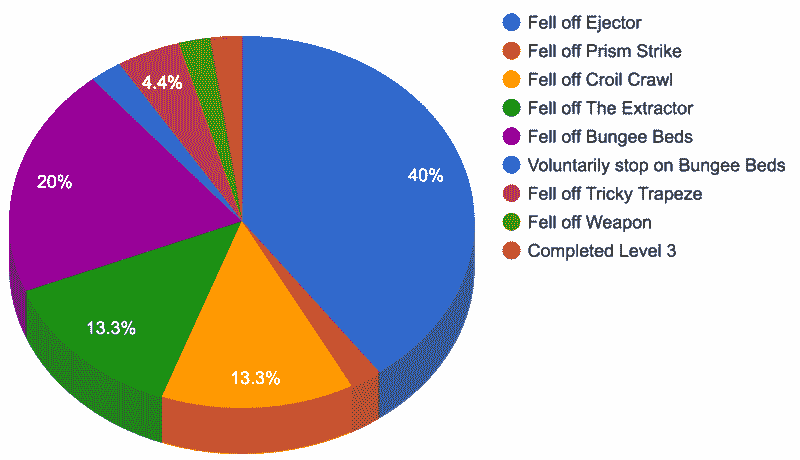

Main causes of failing ordered by position in level 3.

****？？他**鄂勇朴瓦**是唯一一个达到这个水平的人(他在 6' **19)。******

****失败主要原因:****

1.  ******【挤出机】**【40%****
2.  ******蹦极床** 20%****
3.  ******提取器**13.3%****

******分**:从 **90 分到 340 分** ( **平均 186.6 分**)。****

******时间:**从 **0'03 到 12'48** (平均**2 ' 17**)。****

### ****哪个国家赢了？****

****如果终极兽王是国与国之间的比赛而不是个人之间的比赛会怎样？哪个国家的成绩更好？****

****按国家取平均分，可以得到结果:？？所以 **uth 朝鲜赢得了终极兽王！******

******我们可以清楚的看到为什么入围者会得到兽王称号。他们的平均得分是 **265** 对其他选手的 **88.7** 。******

### ****数据集****

这篇文章是基于我收集的数据，如果你想要帮助或者只是尝试一些分析，它可以进一步扩展。此外，该数据集可在 [Kaggle](https://www.kaggle.com/kandebonfim/ultimate-beastmaster) 上获得。

******发现了什么新东西？**我的推特是 [@kandebonfim](https://twitter.com/kandebonfim) 。****