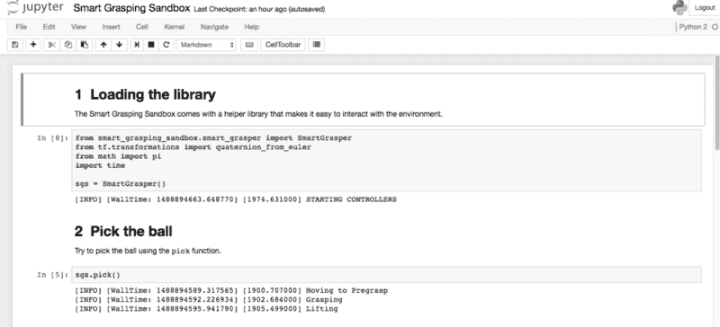
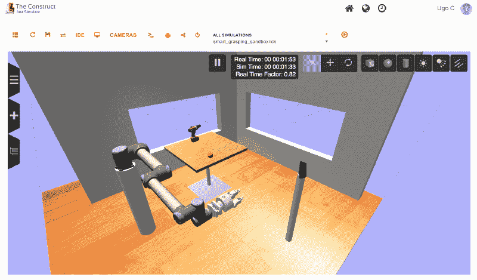

# 我们建造了一个开放的沙箱来训练机器手抓取东西

> 原文：<https://www.freecodecamp.org/news/an-open-sandbox-for-robot-grasping-cee467a3fabb/>

乌戈·库普契奇

# 我们建造了一个开放的沙箱来训练机器手抓取东西

Credit: [WallpaperSafari](http://wallpapersafari.com/w/j2PNXG/)

机器人入门可能比你想象的要容易得多。这是一个跨平台的模拟沙箱，提供了一个简单的高级 API。它应该可以帮助你开始尝试机器人抓取任务。

作为影子机器人公司的首席技术架构师，我花了很多时间研究不同的算法，看看它们如何适合我们的机器人。控制一个复杂的机器人，让它在复杂的环境中按照你想要的方式行动，这是……复杂！

我们路线图的一个重要部分依赖于**机器学习**。我不想必须详细说明一个问题的每一个方面——我宁愿系统自己学习处理一个给定问题的最佳方法。

设置环境以方便地尝试不同的机器学习算法——例如完善抓取——并不简单。以下是我的要求:

*   **一个** **好的模拟场景**开始:一个机器人，一个 3d 传感器，一些要交互的物体，一些要规划和使用的家具
*   **一个** **各种工具**和库快速上手玩机器人:机器人框架( [ROS](http://www.ros.org) )、模拟器( [Gazebo](http://gazebosim.org/) )、规划库( [MoveIt！](http://moveit.ros.org))
*   **运行 it 的方法** **无头**同时能够可视化数据
*   **轻松** **可部署**，有据可查……所有常用功能！

如果你不想通读细节，而只是想接触沙盒，你可以去 github 库看看，里面有快速入门的指导。为了在云中使用沙盒，你还可以访问部署它的 [ROS 开发工作室](http://rds.theconstructsim.com/)。

### 模拟

智能抓取沙箱将在[机器人操作系统](http://www.ros.org) — **ROS** 上运行。作为 ROS 的长期用户和贡献者，我非常倾向于使用这个框架。这是为机器人设计的*事实上的*开源框架。用模块化的方法来连接机器人系统的不同部件是很麻烦的。这使得可以轻松更换给定的组件。最重要的是，它是由一个繁荣的社区驱动的，所以你总能找到最新的算法或驱动程序。

为了教机器人，从模拟器开始是个好主意。在实际硬件上运行算法不仅更昂贵，而且通常也不方便:在现实生活中重置环境比在模拟中更难。通常也很难描述机器人在现场的影响:球被捡起来了吗？抓地力稳定吗？所有这些信息在模拟器中都是现成的。

我们要用的模拟器是 [**露台**](http://gazebosim.org)；这是一个机器人物理模拟器，也与 ROS 框架紧密集成。模拟器中提供了大量的机器人模型，从手臂和抓手到四轴飞行器！在智能抓取沙盒中，我提供的机器人是来自通用机器人的 [UR10，带有 Shadow 的](https://www.universal-robots.com/products/ur10-robot/?ads_cmpid=38441226&ads_adid=36523128894&ads_matchtype=b&ads_network=g&ads_creative=166486296408&utm_term=ur10&ads_targetid=kwd-951605358&utm_campaign=&utm_source=adwords&utm_medium=ppc&ttv=2&gclid=CNCC_p_c_dECFbcK0wodyCED_w)[智能抓取系统](https://www.shadowrobot.com/shadow-smart-grasping-system/)。该场景目前只包含两个有用的对象:一个板球和一个钻头。这只是一个起点。场景会随着时间而变化。模拟中的 3d 视觉传感器是一个[微软 Kinect](https://en.wikipedia.org/wiki/Kinect) ，因为它经常用于机器人领域(是的，就是你用来在 Xbox 上玩*的那个 Kinect，只是在你的 Xbox 上跳舞*)。

### 码头集装箱

设置不同的框架和库并不简单，而且需要时间。为了简化部署，我将自动构建一个 [Docker](https://www.docker.com/) 映像。如果您不熟悉 Docker，我就不详细介绍了，因为这超出了本文的讨论范围，但是假设它是一个超级轻量级的类似虚拟机的环境:您可以非常快速地生成映像，同时充分发挥计算机的潜力。

用 Docker 部署映像也使得它与操作系统无关——ROS 和 Gazebo 对 Linux 更加友好。这也是在你的笔记本电脑上测试东西的一个很好的方法，然后一旦你准备好开始一个更长的实验，简单地在云中产卵。因为我在模拟器中加入了一个网络界面，你甚至可以通过浏览器连接来可视化模拟中发生的事情。为了简化开发过程，我加入了一个 [Jupyter 笔记本](http://jupyter.org/)，你可以通过浏览器访问它。

### 库和工具

为了加速你的开发过程，我开发了一个简单的高级库——大胆地称之为 *SmartGrasper* 。这个库可以直接与模拟沙盒进行交互，发送命令，如捡球，打开手，在球上方移动…对于路径规划，它依赖于 ROS 的规划库: [MoveIt！](http://moveit.ros.org)，这样你就可以[安全地把机器人从 A 移动到 B，而不会撞到东西](https://medium.com/@ugocupcic/how-to-make-your-robot-go-from-a-to-b-without-hitting-things-1063a8890947)。

iPython notebook

沙盒附带了一个示例 iPython 笔记本，该笔记本展示了如何使用 SmartGrasper 库捡球。您可以使用这个示例作为自己开发的基础。

### 最后的话

所以我花了一些时间准备那个沙盒，现在它已经准备好了，[我要与你分享它](https://github.com/shadow-robot/smart_grasping_sandbox)！前往[影子机器人/智能抓取沙盒 github 库](https://github.com/shadow-robot/smart_grasping_sandbox)开始吧。随便玩吧，[提交问题](https://github.com/shadow-robot/smart_grasping_sandbox/issues)，拉请求...

还有很多工作要做:添加 [OpenRave](http://www.openrave.org) 用于抓取规划，为场景添加更多复杂性以能够学习不同的动作，添加一些视觉算法用于识别不同的对象……但这只是智能抓取沙盒的第一个版本！

The Smart Grasping Sandbox in the Construct

我还与 Construct 的惊人团队合作，让智能抓取沙盒在 [ROS 开发工作室](http://rds.theconstructsim.com)上可用，以更快的方式测试你的想法。

如果你正在用智能抓取沙盒做一些很酷的事情，或者有任何问题，让我们在 [Twitter](http://twitter.com/ugocupcic) 上联系吧！如果你喜欢这篇文章，喜欢并分享它怎么样？

