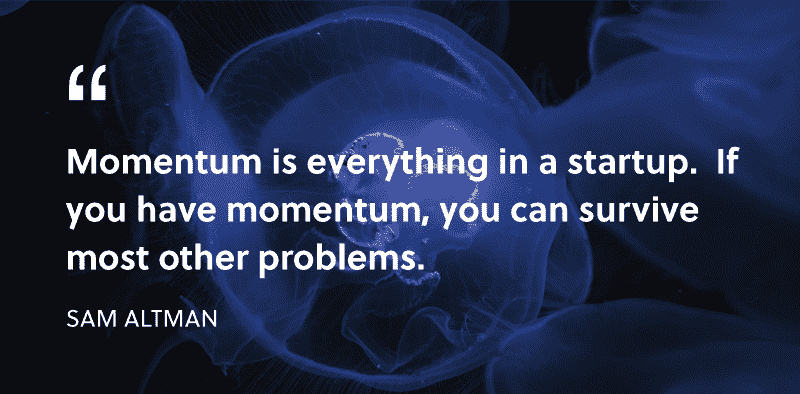
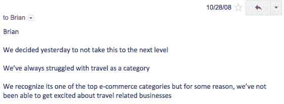

# 在你开始建设之前，什么都不会改变。

> 原文：<https://www.freecodecamp.org/news/nothing-will-change-until-you-start-building-2681e85e7bdc/>

过去的一周，我在 Lyft。我的司机告诉我她所有关于副业的想法。她想出了一本儿童书籍，一个帮助人们找到停车位的应用程序，以及一种更有效的包装礼物的方法。问题是她犹豫不决。她有想法，但不知道从哪里开始。

这是我告诉她的。**从建筑开始。选择一个项目，尽你所能来完成它。**如果你想写书，从每天写一页开始。如果你想建立一个应用程序，从一些草图开始。谁都可以做。

这个建议适用于所有创作者。一旦你开始构建和启动你的项目，你将无法停止。建筑将成为你身份的一部分。即使你的项目失败了，你也会坚持下去。

你今天采取的步骤会随着时间的推移而增加。看看伟大的产品制造商，比如德鲁·威尔森、T2、皮特·里维斯和 T4 的塞巴斯蒂安·多布林库。他们不会等待合适的机会。他们每周建造和运输。

在 [IndieHackers](https://www.indiehackers.com/podcast/006-josh-pigford-of-baremetrics) 的一次采访中，[的乔希·皮福德](https://twitter.com/Shpigford)透露，在他建立 Baremetrics 之前，他已经重复了*上百个*失败的想法。如今，Baremetrics 每月的经常性收入超过 6 万美元。

[Public dashboard for Baremetrics](https://demo.baremetrics.com/)

考虑到这一点，我从成功的产品制造商朋友和熟人那里收集了一些策略。

### 1.定义你的目标

在早期，找出你项目的主要目标。如果你想打破你通常的设计风格，专注于设计。如果你想为你的前端测试一个新的框架，把重点放在代码上。如果你想获得一百个用户，那就专注于销售。

尽早确定你的目标，这样你就不会分心，最终无法实现你设定的目标。也许你的项目不会成为下一个 Snapchat，但通过朝着你的目标努力，你将磨练你的产品制造工具。渐渐地，你将能够更快更有效地设计、编码和销售。

### 2.坚持；保持

有时产品制造商无法出货是因为他们失去了动力。**设定小目标；达到这些目标会帮助你建立动力。**小胜会复合。

[From Sam Altman’s essay “The Post YC Slump”](http://blog.samaltman.com/the-post-yc-slump)

你可以做的另一件事就是更加公开你的工作。在网上和你的同龄人分享你的进步。人们喜欢看到线框之类的东西，并且经常会提供有价值的输入。

我发现一个特别激励人的技巧是和朋友打赌。我告诉他们，如果我没有在截止日期前完成任务，我会给他们一百美元。例如，我可能把我的任务设定为在启动一个项目的两周内让 20 个人付钱给我。

### 3.解决问题

从解决一个问题开始。如果你自己经历过这个问题，那就更好了。问问你的朋友他们经历了什么样的问题。

例如，我建立了 [YC 职业](http://jonathanzwhite.github.io/yc-careers/)来满足我的一个朋友的需求，他在申请产品设计师的工作和面试时遇到了困难。一夜之间，YC 职业登上了 [ProductHunt](https://www.producthunt.com/posts/yc-careers) 的榜首，AtomSpace 在上线 6 小时内就从陌生人那里预订了 100 美元。

**你试图解决的痛点越大，就越容易找到用户。**

此外，从多个角度分析问题解决方案。一些成功的想法看起来像是没有问题的解决方案。比如 Instagram，似乎并不能解决任何眼前的问题。但确实如此。Instagram 解决了朋友之间保持相互更新的需求。如果这个需求得不到满足，那么它就成了一个问题。

为了进一步阅读，约翰·卡马克的《创意产生》和 T2 的《如何获得创业创意》是两篇让你起步的好文章。

### 4.抛弃“好主意/坏主意”的心态

一旦你发现了问题并提出了解决方案，你可能会问自己你的想法好不好。

许多看似糟糕的想法被证明是伟大的生意。比如没有人愿意投资 Airbnb。Airbnb 的联合创始人之一 Brian Chesky 在他的文章 [7 拒绝](https://medium.com/@bchesky/7-rejections-7d894cbaa084#.l8fdqlasz)中详细描述了他们的拒绝。

[Rejection email from a potential investor](https://medium.com/@bchesky/7-rejections-7d894cbaa084#.l8fdqlasz)

确定你的想法是否可行的唯一方法是制定一个产品假设，并进行实验来测试它。与人们交谈，询问他们是否对你的解决方案感兴趣。如果你能在建造任何东西之前让他们付钱给你，那就更好了。

### 5.请求帮助

在做一个项目时，向人们伸出手，寻求他们的帮助。你会惊讶地发现，有多少人愿意把钱转寄出去，帮助一个完全陌生的人。

我收到的一些最好的建议和反馈来自于通过电子邮件或 Twitter 上的 DM 联系人们。

此外，在寻求帮助时，要具体并准备好你的问题。如果你想要对设计的反馈，发送模型。如果你想得到关于你的营销策略的反馈，请详细说明你迄今为止所做的努力。背景是关键。如果你没有得到回应，礼貌地跟进。有时候你要联系的人可能真的错过了你的信息。

构建并启动你的副业项目。用这个过程来磨练你的技艺，这样当机会出现时，你就准备好充分利用它。运气总是青睐有准备的人。

所以下次你有了想法，就付诸行动。发现问题，明确目标，坚持下去，寻求帮助。

你现在在做什么？我怎么帮你？在这里给我留言或者在推特上给我发消息。

如果你喜欢这篇文章，你可能也会喜欢我的文章[CSS in Javascript with Aphrodite，Khan Academy 的库](https://medium.com/@JonathanZWhite/css-in-javascript-the-future-of-component-based-styling-70b161a79a32)。

[**Javascript 中的 CSS:基于组件的样式化的未来**](https://medium.com/@JonathanZWhite/css-in-javascript-the-future-of-component-based-styling-70b161a79a32)
[*本周，我想向大家介绍可汗学院的《阿芙罗狄蒂与 Javascript》中 CSS 的概念。阿芙罗狄蒂让……*medium.com](https://medium.com/@JonathanZWhite/css-in-javascript-the-future-of-component-based-styling-70b161a79a32)

你可以在我每周发表文章的媒体上找到我。或者你可以在 Twitter 上关注我，在那里我会发布一些关于设计、前端开发和虚拟现实的无聊言论。

如果你喜欢这篇文章，如果你点击？并与朋友分享。

