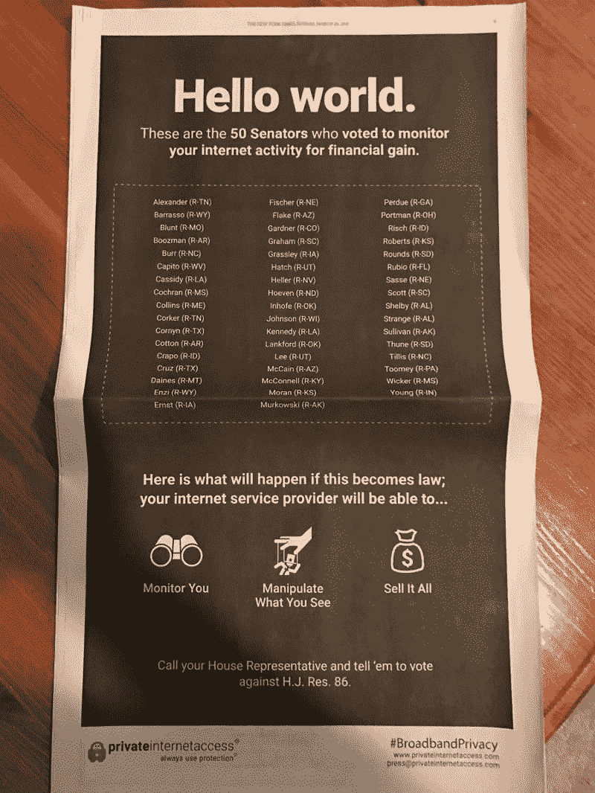
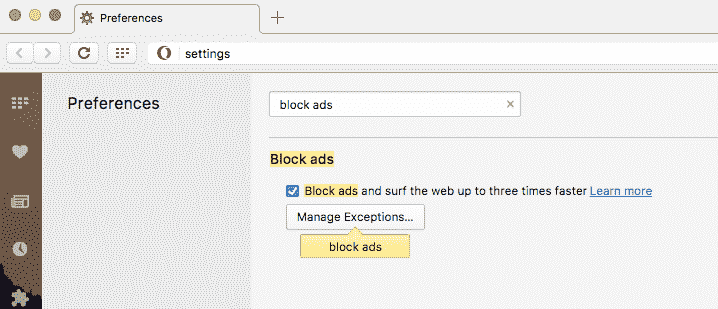
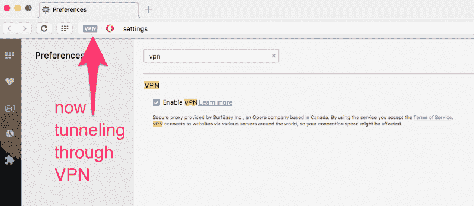
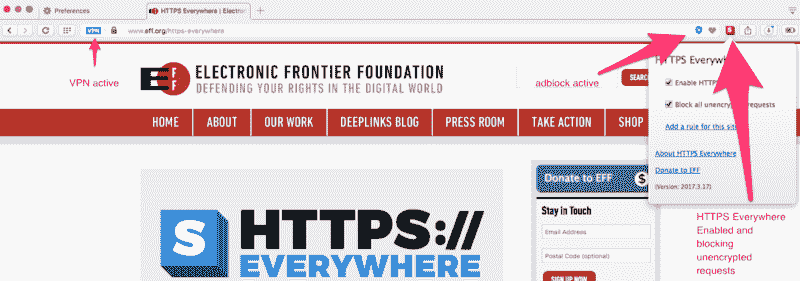
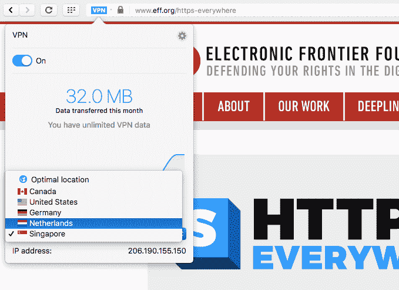
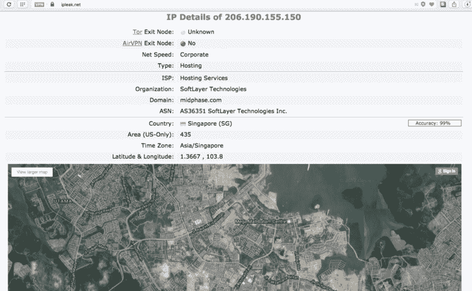

# 如何在 10 分钟内免费建立一个 VPN(以及为什么你迫切需要一个)

> 原文：<https://www.freecodecamp.org/news/how-to-set-up-a-vpn-in-5-minutes-for-free-and-why-you-urgently-need-one-d5cdba361907/>

> “除了手枪和龙舌兰酒之外，电脑让你比任何其他发明更快地犯更多的错误。”—米奇·拉特克利夫

很快，你在网上犯的每一个错误不仅会被你的互联网服务提供商(ISP)发现，而且会被任何想看到这些错误的公司或外国政府发现。

多亏了国会的一项决定，互联网服务提供商可以在未经你允许的情况下向任何人出售你的全部网络浏览记录。唯一阻止这一点的规则都被废除了，而且不会很快恢复(这需要国会通过一项法案)。

互联网服务提供商还可以向[出售他们想要的任何信息](https://www.washingtonpost.com/news/the-switch/wp/2017/03/28/republicans-are-poised-to-roll-back-landmark-fcc-privacy-rules-heres-what-you-need-to-know/)，包括你的在线活动和手机应用程序使用情况，比如财务信息、医疗信息、你孩子的信息、你的社会安全号码，甚至是你的电子邮件内容。

他们甚至可以出售你的地理位置信息。没错，ISP 可以随时获取您的确切物理位置，并将其出售给第三方。

你可能想知道:谁会从废除这些保护中受益？除了那些控制着美国互联网电缆和手机信号塔“最后一英里”的四大垄断互联网服务提供商？

没有人。其他任何人都不会从中受益。我们的隐私——以及我们国家的安全——被削弱了，只是为了让一些大公司赚点外快。

换句话说，这些政客——几十年来从互联网服务提供商那里接受了数百万美元的竞选捐款——出卖了我们。

### 这是怎么发生的？

国会审查法案(CRA)于 1996 年通过，允许国会否决政府机构制定的法规。

2017 年之前，国会只成功使用过一次 CRA。但是自从一月份新政府接管以来，它已经成功地使用了三次——比如推翻讨厌的环境法规。

代表亚利桑那州的共和党参议员杰夫·弗莱克(Jeff Flake)带头推翻了 FCC 的隐私规定。他已经是美国最不受欢迎的参议员。现在他可能成为美国历史上最不受欢迎的参议员。

Senator Flake

然而，我们不要仅仅责怪弗雷克，我们要记住，每一位投票赞成推翻这些隐私规定的参议员都是共和党人。每一个民主党人和独立参议员都投票反对这项 CRA 决议。最终投票结果是 50 票对 48 票，两名共和党人弃权。

你可能会认为参议院会认真讨论这一历史性决定的后果。事实上，他们只花了 10 分钟来辩论这件事。

> “依靠政府来保护你的隐私就像让偷窥狂给你装百叶窗一样。”—约翰·佩里·巴洛

VPN company [Private Internet Access](https://www.privateinternetaccess.com/) paid $600,000 to run this full-page ad in Sunday’s New York Times — even though they would make a ton of money if these rules were repealed. That’s how bad things have gotten with this CRA — even the VPN companies are campaigning against it.

CRA 决议也在众议院通过，231 名共和党人投票赞成取消隐私保护，189 名民主党人投票反对。(同样，没有一个非共和党人投票取消这些隐私保护。)

剩下的就是共和党总统签署决议，他已经说过他计划这么做。

### 那么，互联网服务提供商现在可以合法地对我们的数据做哪些乱七八糟的事情呢？

根据电子前沿基金会的说法，至少有五种令人毛骨悚然的事情会被联邦通信委员会规定为非法。但是多亏了参议院，互联网服务提供商现在可以继续做他们想做的事情，可能要过几年我们才能阻止他们。

1.  将你的浏览历史卖给任何想要购买的公司或政府
2.  劫持你的搜索并与第三方分享
3.  通过向您访问的网站注入他们自己的恶意软件填充广告来监控您的所有流量
4.  将无法检测、无法删除的跟踪 cookies 填充到所有未加密的流量中
5.  在手机上预装软件，在加密之前监控所有的流量，甚至是 HTTPS 的流量。美国电话电报公司、Sprint 和 T-Mobile 已经在一些安卓手机上做到了这一点。

### 那么，我们现在还有什么希望保护我们的隐私呢？

根据皮尤研究中心(Pew Research Center)的一项研究，91%的成年人同意或非常同意“消费者已经失去了对公司如何收集和使用个人信息的控制。”

但是我们不应该绝望。但是，正如告诫我们“抱最好的希望，做最坏的准备”的同一位英国首相所说:

> “绝望是傻瓜的结论。”—1883 年的本杰明·迪斯雷利

我们不是傻瓜。我们将采取必要的行动来保护我们家庭的隐私，反对鲁莽的垄断行为和他们的政治傀儡。

我们将使用最有效的工具来确保在线通信的安全:加密和 VPN。

### 步骤 1:在任何地方启用 HTTPS

正如我提到的，如果互联网服务提供商能够在你的手机操作系统上安装间谍软件，他们可以在 HTTPS 到处工作。只要你能避免购买这些型号的手机，HTTPS 会给你一个巨大的额外保护。

HTTPS 的工作原理是使用安全 TLS 协议加密目的网站和您的设备之间的流量。

问题是，截至 2017 年，只有大约 10%的网站启用了 HTTPS，甚至许多网站都没有正确配置他们的系统，以禁止不安全的非 HTTPS 流量(尽管使用 [LetsEncrypt](https://letsencrypt.org/) 可以免费且轻松地做到这一点)。

这就是 EFF 的 HTTPS Everywhere 扩展派上用场的地方。它会让这些网站默认为 HTTPS，如果你试图访问一个不是 HTTPS 的网站，它会提醒你。它是免费的，你可以在这里安装它。

我们可以确定的一件事是——多亏了最近[维基解密发布的中情局黑客武器库](https://medium.freecodecamp.com/the-cia-just-lost-control-of-its-hacking-arsenal-heres-what-you-need-to-know-ea69fc1ce38c)——T2 加密仍然有效。只要你使用的是尚未被破解的安全加密形式——据我们所知，HTTPS 的 TLS 加密尚未被破解——你的数据就将保持私密。

> “这个国家一般忙碌的专业人士早上醒来，去上班，回家，处理个人和家庭义务，然后睡觉，不知道他或她当天可能犯了几项联邦罪行。”—哈维·西尔弗格拉特

顺便说一句，如果你还没有读过，我强烈推荐你读一读我写的关于如何在不到一个小时内加密你的整个生活的文章。

但是，即使启用了 HTTPS，互联网服务提供商仍然会知道你在访问什么网站，即使他们不知道你在那里做什么，这要归功于他们实际上将你连接到网站本身的角色。

仅仅知道你要去哪里——你的网络活动的“元数据”——就给了 ISP 很多他们可以出售的信息。

例如，去 Cars.com 的人可能想买辆新车，去 BabyCenter.com 的人可能怀孕了。

这就是使用 VPN 的原因。

### VPN 如何保护您

VPN 代表虚拟专用网络。

*   **虚拟**因为你没有创建与目的地的新物理连接，你的数据只是通过你和目的地之间的现有线路传输。
*   **Private** 因为它会在发送之前对你的活动进行加密，然后在目的地解密。

人们传统上使用 VPN 作为绕过在他们国家被屏蔽的网站(例如，在马来西亚 Medium 被屏蔽)或观看在某些国家不可用的电影的方式。但是 VPN 对隐私也非常有用。

有几种类型的 VPN 选项，具有不同程度的便利性和安全性。

专家估计[多达 90%的虚拟专用网络是“不可救药的不安全”](https://www.theregister.co.uk/2016/02/26/ssl_vpns_survey/)并且这种情况随时都在变化。因此，即使你使用我在这里推荐的工具，我还是建议你花时间[做你的功课](https://thatoneprivacysite.net/simple-vpn-comparison-chart/)。

### 基于浏览器的 VPN

大多数 VPN 都是要花钱的服务。但是我要告诉你的第一个 VPN 选项是方便且完全免费的。

Opera 是一款流行的网络浏览器，具有一些出色的隐私功能，如免费的内置 VPN 和免费的广告拦截器(你可能知道，广告可以监视你)。

如果你只是想要一个安全的方式浏览网页，而没有互联网服务提供商能够轻易窥探你和出售你的数据，Opera 是一个很好的开始。让我们快速安装和配置它。这需要不到 5 分钟。

在您开始之前，请注意这只会匿名化您在 Opera 浏览器中所做的事情。此外，我有义务指出，尽管 Opera 的母公司是欧洲公司，但它最近被一个由中国科技公司组成的财团收购，而且它有被中国政府收购的非零风险。

说到这里，下面是如何用 Opera 安全浏览:

步骤#1: [下载 Opera 浏览器](http://www.opera.com/download)

第二步:打开广告拦截器

第三步:打开它的 VPN

步骤 4:到处安装 HTTPS

完成后，Opera 应该是这样的:

很快——你现在可以满怀信心地浏览网页了，你的 ISP——或者其他任何人——都不知道你是谁或者你在做什么。

您甚至可以将您的 VPN 设置为不同的国家。在这里，我把我的设置为新加坡，所以网站会认为我在新加坡。为了验证这一点，我去了 ipleak.net，他们真的以为我在新加坡。

由于互联网是复杂的，数据通过一个对等和交易流量的系统在数百个提供商之间传递，当我的流量从新加坡流出时，美国的互联网服务提供商应该无法监控我的流量。

如果你想更进一步，你可以尝试 Tor，这是一种非常隐私、非常难以去匿名化的技术(尽管这是可以做到的，就像电视节目《机器人先生》中描述的那样——尽管这需要惊人的资源)。

Tor 的设置和使用要多一点工作，而且比使用 VPN 慢。如果你想了解更多，我这里有一本 Tor [入门指南](https://medium.freecodecamp.com/tor-signal-and-beyond-a-law-abiding-citizens-guide-to-privacy-1a593f2104c3#.rouhl2kbf)。

### VPN 服务

人们获得 VPN 最常见的方式是通过包月服务。有很多这样的东西。最终，你必须信任运行 VPN 的公司，因为没有办法知道他们在用你的数据做什么。

正如我所说的，一些 VPN 配置不当，可能会泄露个人识别数据。

在你购买 VPN 之前，阅读一下它与其他产品的比较[这里](https://thatoneprivacysite.net/vpn-comparison-chart/)。一旦你买了一个虚拟专用网，再次检查它是否正常工作的最好方法就是在使用虚拟专用网的时候访问 ipleak.net 的 T2。

即使 VPN 的大多数用户是拥有远程员工的公司，如果你购买了 VPN，NSA 仍然会将你列入名单。所以我建议使用匿名的方式，比如预装的 Visa 卡。(顺便说一句，[比特币不是匿名的](https://bitcoin.org/en/you-need-to-know)。)

有几十种 VPN 服务，没有明确的“赢家”我使用私人互联网接入，每年大约花费 40 美元，在我家人的电脑和电话上运行。

我还在 Twitter 上询问人们他们使用的是哪种 VPN，得到了各种各样的答案:

### 内置 VPN 的路由器

您可以购买支持 VPN 的路由器。请注意，这些并不是专为保护您免受 ISP 窥探而设计的。相反，它们的设计是为了让公司的分支办公室可以和总部办公室共享同一个网络。我以前没有用过，所以我不能证明它们的功效。

如果你碰巧在美国以外的某个县有第二处住所，你可以直接通过那个家庭的网络。否则，您需要配置您的路由器，以便与我前面提到的 VPN 服务之一一起工作。

一些路由器被设计为以比其他路由器更高的速度与 VPN 一起工作。如果您想在路由器级别使用 VPN，并且您的互联网连接小于 100 mps，[这个路由器](http://amzn.to/2nPUsMU)可能就足够了。否则，你需要多付一点钱买一个像这样的路由器。

如果不信任路由器公司，可以用[番茄 USB](https://en.wikipedia.org/wiki/Tomato_(firmware)) 改装一个路由器。它是一种替代的基于开源 Linux 的路由器固件，与一些现成的路由器兼容。

### 隐私很难。但是值得。

隐私是一项基本人权，联合国也宣布了这一点。

尽管如此，许多人认为我们生活在一个“后隐私”时代。例如，马克·扎克伯格声称隐私不再那么重要了。但是看看他的行动。他花了 3000 万美元买下了他在帕洛阿尔托家附近的 4 栋房子，这样他就可以有更多的隐私。

其他人只是对我们周围所有的数据泄露感到厌倦和震惊，不相信隐私仍然值得斗争。

但是大多数说他们不再关心自己隐私的人只是没有真正考虑过。

> “争辩说你不在乎隐私权是因为你没什么好隐瞒的，这和说你不在乎言论自由是因为你无话可说没什么区别。”—爱德华·斯诺登

上周美国参议院的投票只是一系列事件中的最新一起，这些事件表明，在涉及消费者隐私时，我们无法相信政府会以消费者利益为重。

我们需要法律赋予更强有力的隐私保护。

与此同时，我们只能自己照顾自己，并教育其他人也这样做。

我鼓励你读一读计算机安全专家 Bruce Schneier 的书《数据和歌利亚:收集你的数据和控制你的世界的隐藏战斗》我从中学到了很多，现在正在听第二遍。

[**数据和歌利亚:夺取你的数据和控制你的世界的隐藏战斗**](http://amzn.to/2mjheuO)
[*编辑描述* amzn.to](http://amzn.to/2mjheuO)

感谢您的阅读，感谢您对隐私的重视。

如果你喜欢这个，请在社交媒体上分享。