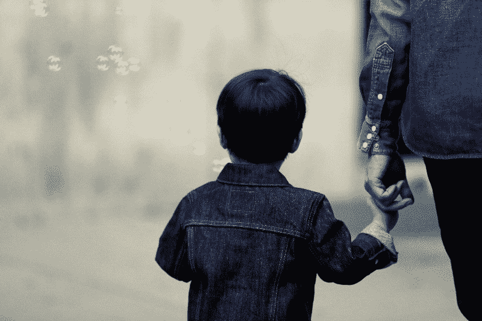
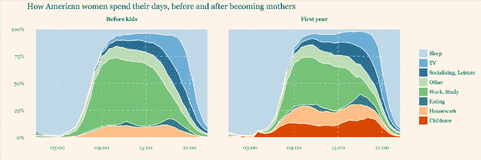
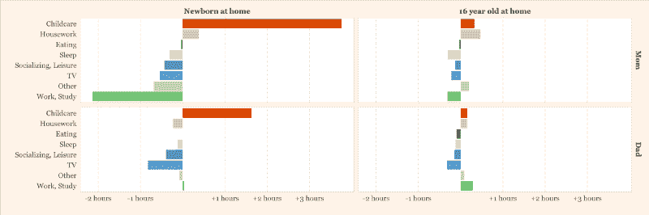
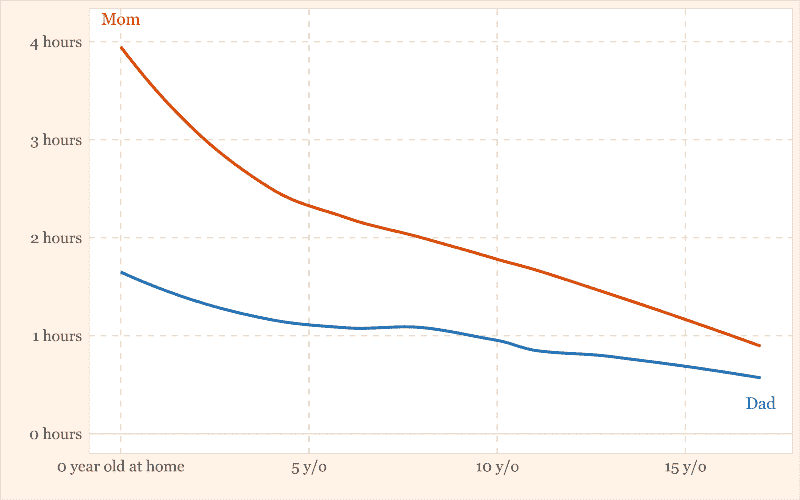
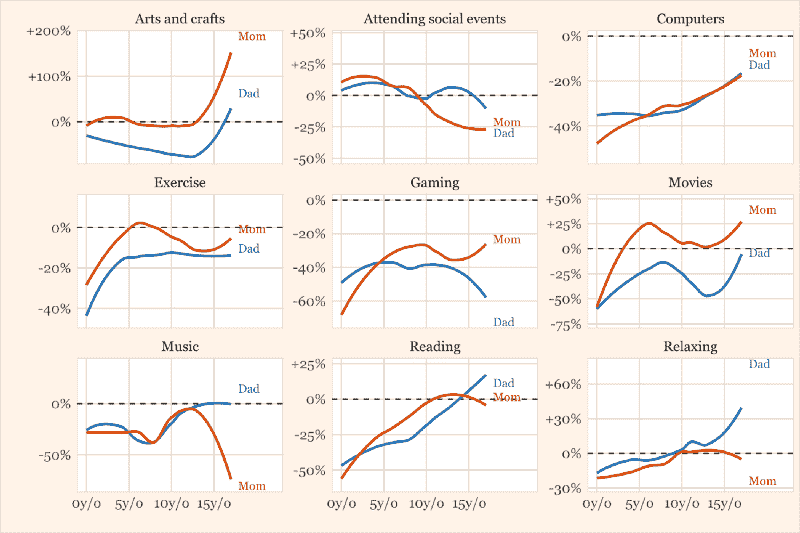

# 当你不再期待时，期待什么:可视化育儿数据

> 原文：<https://www.freecodecamp.org/news/what-to-expect-when-youre-done-expecting-25fb0c00393/>

亨里克·林德伯格

# 当你不再期待时，期待什么:可视化育儿数据

在孩子出生后的前 18 年里，一位新妈妈将和孩子一起度过大约 40，000 个小时。这相当于平均每天六小时。爸爸可以花大约 30000 小时。如果你正在考虑成为一名家长，享受孩子当然是有益的。你会花很多时间和他们在一起。但是你也有足够的时间去适应它，如果你还没有习惯的话。

有了孩子会改变你的生活。你突然开始对这个看似无助的生物负责(不知何故，它似乎仍然确保被正确地喂养、抱抱和保持清洁……)。爱情、挫折、骄傲、内疚和疲惫之间的情绪波动。以及空闲时间的突然减少。

有了孩子不仅象征性地改变了你的生活，也改变了你如何度过每一天。世界各地的变化情况。例如，瑞典父母每个孩子有 480 天带薪育儿假。妈妈在家呆一年，爸爸再呆六个月、八个月、十个月，这种情况并不少见。或者留出父母的日子来度过漫长的暑假。

然而在这里，我们将留在美国。我们将通过[美国时间使用调查](https://www.bls.gov/tus/)来看看美国父母的生活是如何变化的。

你带回家的新生活带来的变化是立竿见影的。对母亲来说，他们无疑是最伟大的。我们的调查只给出了家庭中最小的孩子的年龄数据，所以为了了解一个孩子带来的不同，我们必须立刻查看第一年的情况。

Percent of American women who do each activity by time of day. This graph — and all graphs in this article — were created by me.

一大片红色的田野出现了，遍布一整天。在第一年，照顾一个孩子平均要花费妈妈将近四个小时的时间，外加爸爸两个小时的时间。(我很想看到前几周的数据；我怀疑我们的图表会很红。)

照顾孩子也不是一件容易安排的事情——婴儿有全天需要照顾的倾向，有时不一定在父母方便的时候。为了给所有这些腾出空间，妈妈的工作和休闲都要让位。

另一方面，爸爸通常呆在工作岗位上，做其他实际的事情。不过，就像妈妈一样，这不是假期:他回家后同样减少闲暇时间来照顾小家伙。

Difference in time spent daily between parents and non-parents

为人父母的头几个月，除了你自己，还会围绕着其他事情。从被用来做自己想做的事情，到自己想做的时候，似乎再也没有什么是关于自己的了。它也可以感觉相当疏远。你似乎过着和你那些没有孩子的朋友完全不同的生活。

Number of hours spent differently than non-parents

在第一年，妈妈每天花四个小时做不同于她的朋友的事情，爸爸花两个小时。随着时间的流逝，生活逐渐恢复到过去的样子——或者至少进入一种新的平衡，在这种平衡中，为人父母、为人伴侣和为人都有空间。

当最小的孩子到八岁时，母亲和非母亲之间的差距缩小到每天两个小时，而在十六岁时只有一个小时。爸爸恢复正常的速度相似，尽管始终只有一半的差异。

16 岁时，儿童保育每天只需要 15 分钟。妈妈在家的时间仍然比没有孩子的朋友多一点，做的家务也相对多一些。爸爸妈妈看电视的时间还是少。

似乎有一个关于为人父母的流行神话，那就是你不再有时间从事爱好、文化或会见朋友。然而，我们的数据表明，你不会为了孤独地坐在沙发上而放弃没有孩子的光鲜生活。

当然，当孩子们还小的时候，许多爱好都被搁置了，但是没有孩子的朋友们似乎把时间花在看电视或电脑上，而不是去参加聚会或追求他们的艺术抱负。因此，事实可能是，我们很少有人不顾孩子而过着光鲜亮丽的生活。或者，更有可能的是，如果某件事对你很重要，你会想出办法的。

Time spent on hobbies relative to people with no children

重要的不仅仅是我们做什么，和谁一起做同样重要。抚养孩子可能感觉像是一项孤独的努力，尤其是当你减少了工作和其他社交活动的时候。

数据证实父母花更多的时间和家人在一起。在孩子们到来之前，男人和女人每天花大约 6 个小时和家人在一起。家里有个婴儿，妈妈花整整 10 个小时和家人在一起，其中 9 个小时包括婴儿。

Daily time spent by company

给初为人父母者的一个普遍建议是不要忘记伴侣。抚养孩子是困难的，但是如果你和你相处融洽的人一起分担，会更容易和快乐。在这里，好的一面是有了孩子并不一定会改变你和配偶在一起的时间。你还是会遇到和以前一样多的。然而，更糟糕的是，你和配偶独处的时间发生了巨大的变化，从每天四小时变成了一小时。我们被告知要留出时间在一起，并充分利用我们能够找到的时间，这可能是有充分理由的。

拥有属于自己的时间也是如此。我的时间立刻减少了一半。我们花在做事情上的时间可能会成为负罪感的来源:花宝贵的时间为自己做事似乎很自私。再说一次，我们明智地采纳了前人的建议:你不能给予你没有的东西，所以一定要挤出时间来恢复平衡。

为人父母有时很难。我们花费时间构建的生活在许多方面一夜之间变得天翻地覆，我们几乎没有能够与之相关的指导。从其他方面来说，成为父母是很容易的。我们别无选择，只能适应。我们最大的希望是有一个相爱的伴侣，和他一起解决所有的问题。除此之外，我们能做的就是做好不做准备的准备。要知道生活会突然变得不同，在一个新的常态——不一样，但也没那么不同——取而代之之前。

这里的所有数据都来自 2003-2015 年美国时间使用调查，对象是 25-50 岁有配偶的人。所有的图表都是我创作的。