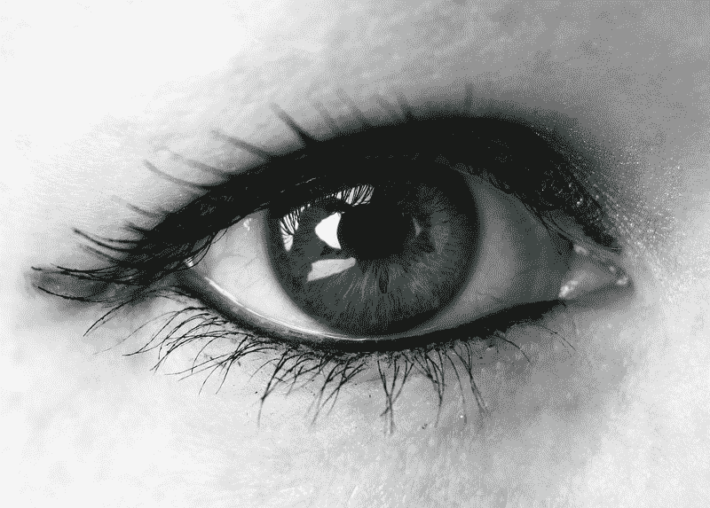
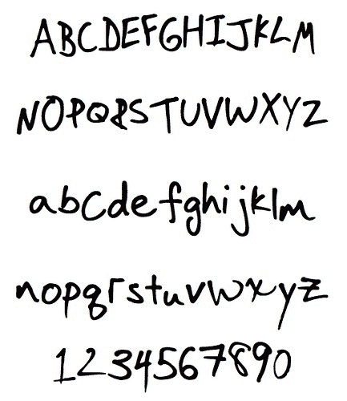
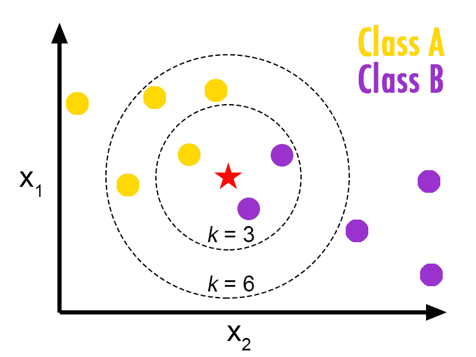
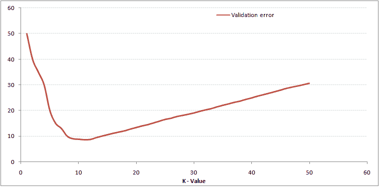
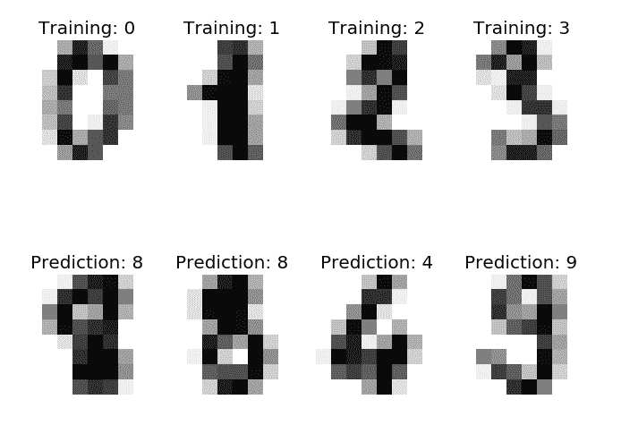
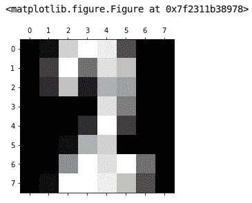
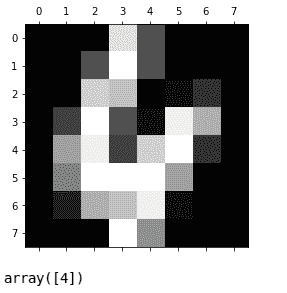
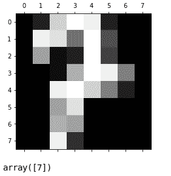
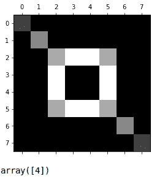

# 图像识别去神秘化

> 原文：<https://www.freecodecamp.org/news/image-recognition-demystified-fc9c89b894ce/>

由 gk_

# 图像识别去神秘化



在机器学习中，没有什么比识别图像的能力更能吸引想象力了。识别意象必然意味着“智力”，对吗？我们来揭秘一下。

就软件而言，“看”的能力始于分类的能力。分类就是用数据进行模式匹配。图像是二维矩阵形式的数据。

图像识别是将数据分类到许多桶中的一个桶中。这是一项有用的工作:你可以对整个图像或者图像中的事物进行分类。



图像分类的一个经典且非常有用的应用是光学字符识别( [OCR](https://en.wikipedia.org/wiki/Optical_character_recognition) ): *从书面语言的图像到结构化文本*。

对于任何字母表和各种各样的书写风格都可以这样做。

### 流程中的步骤

我们将构建代码来识别图像中的数字，并展示这是如何工作的。这需要 3 个步骤:

1.  收集和组织**数据**进行工作(85%的工作量)
2.  构建并测试一个**预测模型** (10%的工作量)
3.  使用模型来**识别**图像(5%的工作量)

准备数据是我们工作中最大的部分，*这是大多数数据科学工作的真实情况*。之所以叫数据科学是有原因的！

我们的预测模型的建立及其在预测值中的使用*都是数学*。我们使用软件来迭代数据，[在数学方程](https://medium.com/p/how-neural-networks-work-ff4c7ad371f7)中反复锻造“权重”，并处理数据结构。该软件并不“智能”，它使用数学方程来完成狭义的知识工作，在这种情况下:识别数字图像。

实际上，大多数被人们贴上“人工智能”标签的东西实际上只是执行知识工作的软件。

### 我们的预测模型和数据

我们将使用最简单的预测模型之一:“k-最近邻”或“kNN”回归，由 E. Fix，J.L. Hodges 于 1952 年首次发表。

这个算法的简单解释是[这里](https://www.analyticsvidhya.com/blog/2014/10/introduction-k-neighbours-algorithm-clustering/)和它的数学视频[这里](https://www.youtube.com/watch?v=4ObVzTuFivY)。这里还有给那些想从头开始构建算法的人。

它是这样工作的:想象一个由数据点和捕捉 k 个点的圆圈组成的图表，每个 k 值都根据您的数据进行验证。



credit: [http://bdewilde.github.io](http://bdewilde.github.io/about-me/)

数据中 k 的验证误差有一个可以确定的最小值。



credit: [https://www.analyticsvidhya.com](https://www.analyticsvidhya.com)

给定 k 的“最佳”值，您可以以某种精确度对其他点进行分类。

我们将使用 [scikit learn 的 kNN 算法](http://scikit-learn.org/stable/modules/neighbors.html)来避免我们自己构建数学。方便的是，这个图书馆也将为我们提供我们的[图像数据](http://scikit-learn.org/stable/auto_examples/classification/plot_digits_classification.html#sphx-glr-auto-examples-classification-plot-digits-classification-py)。



credit: [http://scikit-learn.org](http://scikit-learn.org)

我们开始吧。

这里的代码是，我们使用的是 [iPython 笔记本](https://ipython.org/notebook.html)，这是一种高效的数据科学项目工作方式。代码语法是 Python，我们的例子是从 sk-learn 借来的[。](http://scikit-learn.org/stable/auto_examples/classification/plot_digits_classification.html)

首先导入必要的库:

接下来，我们整理数据:

```
training images: 1527, test images: 269
```

你可以操纵分数，或多或少的测试数据，我们很快就会看到这是如何影响我们的模型的准确性。

现在你可能在想:数字图像是如何组织的？它们是值的数组，8×8 图像中的每个像素一个值。让我们检查一个。

```
# one-dimension[  0\.   1\.  13\.  16\.  15\.   5\.   0\.   0\.   0\.   4\.  16\.   7\.  14\.  12\.   0\.   0\.   0\.   3\.  12\.   2\.  11\.  10\.   0\.   0\.   0\.   0\.   0\.   0\.  14\.   8\.   0\.   0\.   0\.   0\.   0\.   3\.  16\.   4\.   0\.   0\.   0\.   0\.   1\.  11\.  13\.   0\.   0\.   0\.   0\.   0\.   9\.  16\.  14\.  16\.   7\.   0\.   0\.   1\.  16\.  16\.  15\.  12\.   5\.   0.]
```

```
# two-dimensions[[  0\.   1\.  13\.  16\.  15\.   5\.   0\.   0.] [  0\.   4\.  16\.   7\.  14\.  12\.   0\.   0.] [  0\.   3\.  12\.   2\.  11\.  10\.   0\.   0.] [  0\.   0\.   0\.   0\.  14\.   8\.   0\.   0.] [  0\.   0\.   0\.   3\.  16\.   4\.   0\.   0.] [  0\.   0\.   1\.  11\.  13\.   0\.   0\.   0.] [  0\.   0\.   9\.  16\.  14\.  16\.   7\.   0.] [  0\.   1\.  16\.  16\.  15\.  12\.   5\.   0.]]
```

相同的图像数据显示为平面(一维)阵列，并再次显示为阵列中的 8×8 阵列(二维)。把图像的每一行想象成一个 8 像素的数组，有 8 行。我们可以忽略灰度(值)并处理 0 和 1，这将稍微简化数学。

我们可以“绘制”它，以“像素化”的形式查看这个数组。



这是什么数字？先问一下我们的模型，但是首先我们需要建立它。

```
KNN score: 0.951852
```

根据我们的测试数据，我们的最近邻模型有 95%的准确率，还不错。返回并更改“分数”值，看看这如何影响分数。

```
array([2])
```

模型预测上面显示的数组是一个' **2 【T1 '，看起来是正确的。**

让我们再尝试几个，记住*这些是来自我们测试数据*的数字，我们没有使用这些图像来构建我们的模型(非常重要)。



还不错。

我们可以创建一个虚构的数字，看看我们的模型是怎么想的。



如果我们有一个无意义的数字图像集合，我们可以用一个非数字标签将它们添加到我们的训练中——这只是另一种分类。

### 那么图像识别是如何工作的呢？

*   **图像数据被组织**:训练和测试，带有标签(X，y)

训练数据与测试数据是分开的，这也意味着我们删除了它们之间的重复(或近似重复)。

*   **使用几个数学模型中的一个建立模型**([、kNN](https://en.wikipedia.org/wiki/K-nearest_neighbors_algorithm) 、[逻辑回归](https://en.wikipedia.org/wiki/Logistic_regression)、[卷积神经网络](https://en.wikipedia.org/wiki/Convolutional_neural_network)等。)

选择哪种类型的模型取决于您的数据以及分类工作的类型和复杂性。

*   新数据被放入模型中以**生成预测**

这就是闪电般的速度:一次数学计算的结果。


如果你有一个有*和没有*猫的图片集，你可以建立一个模型来分类一张图片是否包含一只猫。请注意，您需要没有任何猫的训练图像才能工作。

当然，你可以将多个模型应用到一张图片上，并识别几个事物。

### 大数据

所有这些中的一个重大挑战是每个图像的大小，因为 8x8 对于除了小数字之外的任何东西来说都不是一个合理的图像大小，所以处理 500x500 像素或更大的图像并不罕见。每幅图像有 250，000 个像素，所以 10，000 幅图像的训练意味着*对 25 亿个值进行数学运算*来建立一个模型。数学不仅仅是加法或乘法:我们乘矩阵，乘浮点权重，计算导数。这就是为什么处理能力(和内存)在某些机器学习应用中至关重要。

有一些策略可以解决这个图像大小问题:

*   使用硬件图形处理器单元([GPU](https://en.wikipedia.org/wiki/Graphics_processing_unit))来加速计算
*   将图像缩小到更小的尺寸，而不损失清晰度
*   将颜色减少到灰度和渐变(你仍然可以*看到*那只猫)


*   查看图像的各个部分，找到您想要的内容

好消息是，一旦模型建立起来，不管有多费力，预测都很快。图像处理应用广泛，从面部识别到 OCR，再到无人驾驶汽车。

现在，您已经了解了它的基本工作原理。