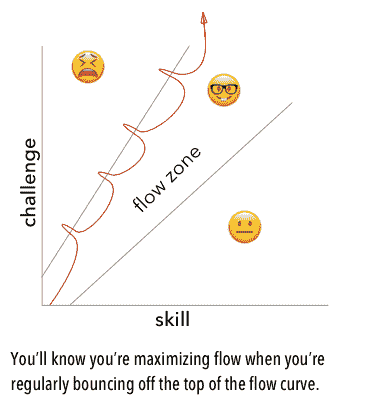
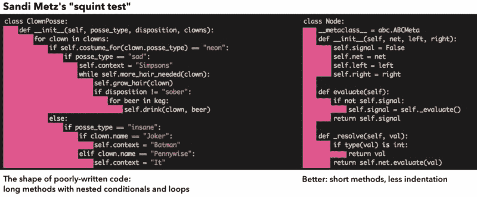

# 我如何帮助我的伙伴学习编码

> 原文：<https://www.freecodecamp.org/news/how-i-helped-my-partner-learn-to-code-6e1d1953812f/>

卡尔·塔西安

# 我如何帮助我的伙伴学习编码

Breadth-first search of an apartment. Illustration by [Siobhán K Cronin](https://www.freecodecamp.org/news/how-i-helped-my-partner-learn-to-code-6e1d1953812f/undefined)

去年春天，当我的合伙人 Siobhán 决定将职业生涯转向数据科学时，我知道这将是我亲眼目睹当今人们如何学习编程的一个机会。

我从小就开始编程，作为一名开发人员和工程经理，我总是和那些至少已经编码一年的人一起工作。而是从头开始？不管怎样，从哪里开始呢？

对于 Siobhán 来说，她的起点是 Udacity 的数据分析师 Nanodegree，她从去年夏天开始，到今年 2 月结束。这个项目要求你学习 CS 入门课程，但是当她去年夏天开始学习的时候，她之前没有做过任何编程。所以，起初我作为她的教练的角色是提供来自其他来源的材料(比如哈佛大学优秀的 [CS50 课程](https://cs50.harvard.edu/))来补充她从 Udacity 学到的东西。

她有很多问题，从使用文本编辑器和命令行的实践，到挑战她关于计算机如何工作的模型的概念性问题。她之前问的一个很好的问题是，“为什么我需要使用 Chrome 来访问 Jupyter，而它已经在我的电脑上了？Chrome 不就是用来连接网站的吗？”这引发了对客户机/服务器体系结构、TCP/IP、HTTP 和本地主机环回网络的大讨论。

Siobhán 工作非常努力，大多数时候都是早上 6 点起床，学习到很晚。最大的挑战之一是帮助她呆在心流区，而不被她学习的大量材料所淹没。我们是这样处理的:

偶尔不知所措似乎是我们能确保她最大化流量的唯一方法。但显然我们不想在那里呆太久。当你手头有太多挑战性的事情时，这种焦虑状态是非常不舒服的，它会耗尽你的整体信心和兴奋。所以，每当我们到达那一点，我们就后退并重新评估。

去年秋天的某个时候，她列出了 Udacity 计划的覆盖范围，大概是这样的:

*   Python / Jupyter
*   R / R 工作室
*   精力
*   git / GitHub
*   命令行
*   统计数字
*   机器学习
*   matplotlib / pandas / NumPy / SciPi
*   JavaScript / D3
*   核心 CS 原则和算法
*   数据清理/ JSON / XML /等等。
*   SQL / PostgreSQL
*   NoSQL /蒙古 b

Udacity 的项目是所有这些世界的一个很好的调查课程，但它涵盖了很多材料，并且每次 Siobhán 完成一个项目时都会有令人眼花缭乱的上下文切换。例如，在学习了几个星期的 JavaScript 和 D3 并构建了一个可视化之后，她不得不转向 R 和 RStudio 的完全不同的世界，将 JavaScript 及其所有语法完全抛在脑后。

在 Udacity 项目中，她建立了十几个班级项目，学到了很多东西。但是当她在二月份完成这个项目时，她的信心一落千丈。有些时候，她觉得自己什么也没学到，因为她对每种语言或每套工具都有过短暂的体验。

所以她决定做几个星期的简单练习。实践阶段的目标是习惯于仅使用 Python、SQL 和数据分析库来交付完整的项目，同时继续构建核心 CS 和统计知识。每周如此，她的信心都有了显著的提高。她已经看到了她已经知道的东西，并且她能够把注意力集中在她想要补充理解和流畅的地方。通过每天回到办公桌前全职研究 Python，她很快成为了一名专家。

我们将在四月中旬结束实习期，此时她的求职活动正在升温。以下是我作为她的教练学到的一些东西:

#### 将算法表达为一种思想

一个算法可能最容易表达为一个想法。如果你在解决一个编码问题上有困难，首先用你的母语，而不是伪代码来讨论。通常有几种方法来伪代码化一个解决方案(迭代的、递归的、面向对象的、函数的、过程的)，但是开发一个解决方案的核心方法要少得多。

让我们假设你试图找到一个给定字符串中最长的回文子串。所以，比如字符串是`aabbdcaacd`，最长的回文子串是`dcaacd`。

用英语来说，我们可以这样处理这个问题:

*   让我们试着找到回文！因为它们是对称的，我们可以从寻找一个字符串中回文的中心或“种子”开始。
*   当我们找到一颗种子时，我们可以尝试向外扩展它，直到左右两边不再相等。
*   稍微摆弄一下就会发现有二字和三字的种子。比如`aa`和`aba`都是种子。
*   回文可能会重叠。如果字符串是`rrgrrgra`，我们不想仅仅因为在开始搜索时碰巧发现了重叠的`rrgrr`就忽略`rgrrgr`。

一旦你用简单的语言表达了你要做的事情，找到伪代码(和解决方案)就变得容易多了。这个过程也给了你更好的语言，当你开始在你的程序中命名事物时，你可以使用它。

#### 学会看代码

学习编码不仅仅是写代码，而是学习如何扫描程序的整体结构、功能和危险信号。不像我们学英语那样需要大量阅读。它在找。

首先，当你在头脑中建立程序的模型时，你只是试图理解所有的语法。一旦语法变得更容易看，你会很快注意到语法错误。最终，当您查看代码时，有些东西看起来“不合适”。缺少括号或引号会在视觉上突出。(您的文本编辑器如何处理语法突出显示在这个阶段变得有意义。)

[Sandi Metz](https://www.freecodecamp.org/news/how-i-helped-my-partner-learn-to-code-6e1d1953812f/undefined)’s “squint test,” covered in her [2014 RailsConf talk](http://confreaks.tv/videos/railsconf2014-all-the-little-things)

面向对象设计大师 Sandi Metz 谈到了她有时用来看代码的“斜视测试”:斜视代码，看缩进的形状和颜色。如果形状看起来像一组参差不齐的楼梯，或者颜色是拼凑的，那么它可能是重构的一个很好的候选对象。

#### 从掌握 50 行程序开始…

我认为在学习编码时，有一个你应该达到的初始平台:50 行的过程化程序。在此期间，当您学习数据类型、循环和条件的构建块时，保持程序简短是有意义的。

如果你成为这些小程序的大师，你将有一个很好的基础来建立。任何关于 Leetcode 的编码挑战或者破解编码面试的解决方案都可以写成一个小程序，所以这些都是很好的练习。

在一个 20-50 行的小程序中，使用几个全局变量或者不写测试可能完全没问题。但是最终你会想要到达第二个平台…

#### …然后学会让更大的程序保持简单

一旦你确定了简单的过程化编程，理论上你可以编写任何程序。你甚至可能开始相信编程很容易。

但是随着你的项目的发展，标准也会提高。你需要开发更多的方法来管理复杂性，还有第二座陡峭的山要爬。你想让你的程序简单，所以你学习抽象和封装的微妙之处，让代码简单。你学会更严肃地思考测试和如何命名事物。

当你最初对到达第一个平台的自大被谦逊的意识所取代时，你将知道你正在走向第二个平台，虽然编程很简单，但并不总是容易的。

> "简单是可靠的先决条件."埃德格·w·迪杰斯特拉

#### 养成写测试的习惯

写好测试是它本身的技能，但是很容易上手。测试驱动开发将帮助你建立良好测试的原则，因为它鼓励非常高的测试覆盖率。而且会上瘾。

一种方法是开始编写测试和代码来覆盖明显的基础案例，然后通过提供边缘案例来尝试打破程序。要达到极限情况，请将程序或函数的一个参数更改为极值。有时候，“极值”只是一个边界值，比如`0`或`1`或者一个空字符串。围绕该值进行测试，以确保您的程序在每种情况下都在做正确的事情。

有时，对函数的极端输入的解决方法是引发异常，而这通常不需要编写任何额外的代码行。

#### 工作时记笔记

每个开发人员身边都应该有一个小记事本(物理的或虚拟的),用来记录笔记和问题。当你工作的时候，会出现很多你不想马上处理的事情。以下是昨天的一些笔记:

*   当我把 Python 代码粘贴到 vim 时，它总是出错！呃。
*   为什么我们总是写`if __name__ == '__main__':`？那是什么意思？
*   为什么我的`unittest` suite 总是要定义成一个类？

当有疑问时，就把它写下来，看看它是否是你以后想跟进的事情。

Siobhán 现在做的最重要的事情就是每天编码。在她进入全职求职模式之前，我们还有几周的时间，但这种练习将是一件持续的事情。每天她都在强化概念，建立理解。这看起来很令人满意，它帮助我重新点燃了对编程有多么有趣的兴奋之情。

#### 如果你做到了这一步，你应该[加入我的邮件列表](http://tashian.com/superstack)，我会像 1995 年一样给你发邮件(每月最多 2 封)