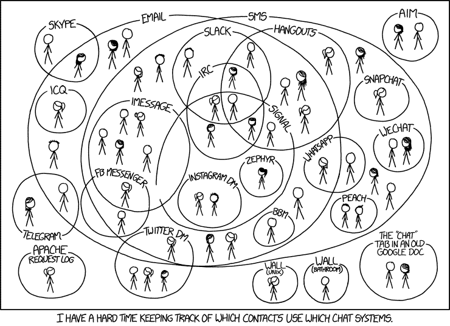
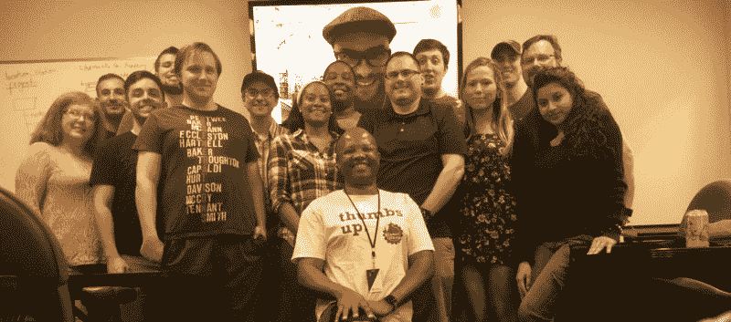

# GitHub 如何适应谷歌新发现的 SHA-1 碰撞漏洞

> 原文：<https://www.freecodecamp.org/news/how-github-adapted-to-googles-newly-discovered-sha-1-collision-vulnerability-c12120dc69ff/>

这里有三个值得你花时间的链接:

1.  GitHub 如何适应谷歌新发现的 SHA-1 碰撞漏洞( [4 分钟阅读](http://bit.ly/2mMh100))
2.  为什么我离开了谷歌，开发了一个向孩子们教授个人理财的应用程序( [6 分钟阅读](http://bit.ly/2nxorsl))一个关于垃圾收集算法如何工作的动画指南
3.  Node.js 中需要的模块:你需要知道的一切( [16 分钟阅读](http://bit.ly/2nOwsXn)

额外收获:我们正在建立一个关于过去 5 年开始编程的人的大型公共数据集( [2 分钟阅读](http://bit.ly/2mKKGuv))

### 想到这一天:

> “铁不用会生锈；死水失去了纯净，在寒冷的天气里会结冰；即使如此，无为也会削弱头脑的活力。所以我们必须将自己的潜能发挥到极致。做不到这一点就是对上帝和人类的犯罪。”—莱昂纳多·达芬奇

### 今日趣事:

网络漫画作者 [XKCD](http://bit.ly/2n9UFcm) 。

### 今日学习小组:

自由代码营盖恩斯维尔(我是显示器上的巨脸)

编码快乐！

–昆西·拉森，自由代码营的老师