# 用 React 构建特斯拉的电池续航里程计算器(第 1 部分)

> 原文：<https://www.freecodecamp.org/news/building-teslas-battery-range-calculator-with-react-part-1-2cb7abd8c1ee/>

马修·崔

# 用 React 构建特斯拉的电池续航里程计算器(第 1 部分)


在这一系列文章中，我将带您了解使用 React 构建特斯拉电池续航里程计算器的过程。

在本教程中，我们将使用 Angular 2 反应形式构建 Todd Motto 的[React 版本的特斯拉电池续航里程计算器。](https://toddmotto.com/building-tesla-range-calculator-angular-2-reactive-forms)

所以这篇文章会重复使用一些材料(数据、图片和 css 样式)。我们将专注于以**反应方式**重建它。

这是我们应用程序的最终 GIF 图像。


？在我们开始之前，先看看第五版。

？您也可以查看 s [源代码。](https://github.com/gyver98/part1-react-tesla-battery-range-calculator-tutorial)

现在让我们一步一步地创建应用程序。

请注意，您可能需要一些基本的 React 知识来学习本教程。请参阅以下资源:

*   [React 官方文档](https://facebook.github.io/react/docs/hello-world.html)
*   [反应:入门和概念](https://scotch.io/tutorials/learning-react-getting-started-and-concepts)

### 1.项目设置和创建-反应-应用程序

### 1.1 要求

我在实现该应用时使用的工具和版本:

```
node v7.3.0npm v3.10.10
```

### 1.2 创建-反应-应用程序

[**creat-react-app**](https://github.com/facebookincubator/create-react-app) 是脸书开源的一款快速 react 应用开发的新工具，可以让你轻松启动 react 应用，无需复杂设置。您可以使用以下命令轻松安装我们的项目`react-tesla-range-calculator`并立即启动应用程序:

*   npm 安装-g 创建-反应-应用程序
*   创建-反应-应用反应-特斯拉-里程-计算器
*   反应特斯拉距离计算器
*   npm 开始

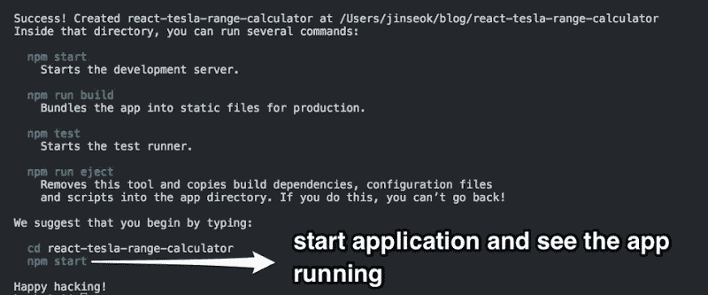

通过`creat-react-app`创建一个新的应用，打开`http://localhost:3000/`查看生成的应用。

如果您看到下面的屏幕，则项目已经成功设置。


在我们开始项目之前，我们需要接触项目源结构。只留下项目需要的文件，删除其余的。(删除 App.test.js，logo.svg)

现在，我们的 src 目录应该如下所示:

```
src - App.css - App.js - index.css - index.js
```

下面是项目源结构:


### 1.3 项目切入点

首先，我们需要设置启动 Tesla 应用程序的入口点。谢天谢地，它已经由`create-react-app`创建了。

`src/App.js`是我们应用的切入点。

首先，把你的`App.js`改成这样:

```
import React, { Component } from 'react';import './App.css';
```

```
class App extends Component {  render() {    return (      <div>        <h2>Let's get started</h2>      &lt;/div>    );  }}
```

```
export default App;
```

当您保存文件时，它将被自动编译，您可以看到更新的屏幕。

### 1.4 项目形象/资产

本项目所需的所有图像可从以下网站下载:

*   图片[下载](https://toddmotto.com/static/assets.zip)
*   favicon.ico [下载](https://toddmotto.com/static/favicon.ico)

解压`assets.zip`并将所有图片放在`src/assets`目录下，将下载的`favicon.ico`放在源根目录下。

```
react-tesla-range-calculator/src/assets
```

> 任何时候你觉得自己错过了什么或者不确定自己做得对不对，你都可以参考[源代码](https://github.com/gyver98/part1-react-tesla-battery-range-calculator-tutorial)作为参考。

### 1.5 数据服务

你可以从特斯拉网站获得的数据是硬编码的，非常大，所以我们将使用托德的新版本的数据，使其更容易使用。[链接](https://github.com/toddmotto/angular-tesla-range-calculator/blob/master/src/app/tesla-battery/tesla-battery.service.ts)

我们不使用 Angular2 中使用的`Injectable decorator`，所以我们将只复制`export`部分，暂时保存在`src/services/BatteryService.js`中。稍后，我们将在`TeslaBattery`容器中使用`import`。

我们稍后将再次讨论这个数据服务。

### 2.分解用户界面

几乎所有 React 应用程序 ui 都由组件组成。例如，一个天气应用程序包含一个显示本地名称的组件、一个显示当前温度的组件和一个表示五天预报的图形组件。出于这个原因，在开发 React 应用程序之前将 UI 分解成组件单元是一个好主意。

> 参见[思考 React](https://facebook.github.io/react/docs/thinking-in-react.html) 了解将应用程序视为组件组合的方法。

该应用程序的布局如下所示

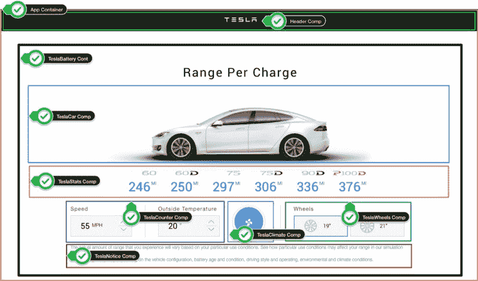

UI 由组件树表示，如下所示。

```
<App> -- Application entry point <Header></Header>  <TeslaBattery> -- Container 	<TeslaCar />     -- Presentational Component 	<TeslaStats />   -- Presentational Component  	<TeslaCounter /> -- Presentational Component 	<TeslaClimate /> -- Presentational Component 	<TeslaWheels />  -- Presentational Component 	<TeslaNotice />  -- Presentational Component  </TeslaBattery></App>
```

### 2.1 容器和表示组件

在上面提到的组件树中，我们可以看到它被分类为`Container Component` 和`Presentational Component`。

这是一个有用的模式，可以在使用 React 开发应用程序时使用。将组件分成两类更容易重用。

```
* Container Component (stateful component): - Are concerned with how things work. - In general, except for some wrapping divs, they do not have their   own DOM markup and have no style. - Provide data and actions to presentational or other container components. - Are often stateful, as they tend to serve as data sources.
```

```
* Presentational Component (stateless component): - Are concerned with how things look. - Usually have some DOM markup and styles of their own. - Receive data and callbacks exclusively via props. - Rarely have their own state (when they do, it’s UI state rather than data).
```

使用这些模式有什么好处？

*   更好地分离关注点
*   更好的可重用性
*   提取布局组件以防止重复

> 有关更多详细信息，请参见[表示和容器组件](https://medium.com/@dan_abramov/smart-and-dumb-components-7ca2f9a7c7d0#.mbwo09sds)

### 3.标题组件

让我们创建我们的第一个 React 组件，`Header`。`Header`组件只是一个带有 Tesla 标志和文本的黑条。

创建`src/components/Header`目录，在其中创建一个`Header.js`文件，输入以下代码:

```
import React from 'react';import './Header.css';import logoUrl from '../../assets/logo.svg';
```

```
const Header = () => (  <div className="header">      </div>)
```

```
export default Header;
```

> 这里，组件是函数的形式(`ES6 Arrow Function`)。以这种形式声明的组件称为`functional component`。如果没有`state`并且不需要 `lifecycle`方法，那么将其声明为函数类型是一个很好的模式。功能组件适用于`Presentational Component`，因为它们没有状态，并且仅依赖于从更高组件接收的`props`。

### 3.1 标题组件样式

在`src/components/Header`目录中创建一个`Header.css`文件，并键入以下样式:

```
.header {  padding: 25px 0;  text-align: center;  background: #222;}
```

```
.header img {  width: 100px;  height: 13px;}
```

> 有许多方法可以将样式应用于组件，但是这里我们将在`src/components`目录中创建每个组件目录，并且在每次创建组件时将`js`和`css`文件配对。

### 3.2 在应用程序容器中导入标题组件

现在您已经创建了`Header`组件，让我们在入口点`App.js`中使用`import`。

```
import React, { Component } from 'react';import './App.css';import Header from './components/Header/Header';
```

```
class App extends Component {  render() {    return (      <div className="App">        <Header />          </div>    );  }}
```

```
export default App;
```

当您保存所有修改的文件时，它们将自动更新，您应该会看到如下所示的 Tesla 徽标:


### 4.特斯拉电池容器

在我们的应用中，`TeslaBattery`组件负责创建和管理作为`Container Component`的数据和状态，将其传递给其他`Presentational Components`，执行回调函数并更改其状态。

通过继承`React.Component` , `TeslaBattery`必须有一个`render`方法，可选地，它可以通过`constructor`初始化其状态，并实现其他方法，如[生命周期](https://facebook.github.io/react/docs/react-component.html)回调。

当您想要呈现或更新组件，或者在`lifecycle`的不同阶段接收通知时，`lifecycle callbacks`非常有用。

创建`src/containers`目录，在其中创建一个`TeslaBattery.js`文件，输入以下代码:

```
import React from 'react';import './TeslaBattery.css';
```

```
class TeslaBattery extends React.Component {  render() {    return (      <form className="tesla-battery">        <h1>Range Per Charge</h1>      &lt;/form>    )  }}
```

```
export default TeslaBattery;
```

### 4.1 特斯拉电池容器样式

仅保留极简风格。

```
.tesla-battery {  width: 1050px;  margin: 0 auto;}
```

```
.tesla-battery h1 {  font-family: 'RobotoNormal';  font-weight: 100;  font-size: 38px;  text-align: center;  letter-spacing: 3px;}
```

将来要创建的组件将依次在`TeslaBattery`容器中进行配置。

### 5.TeslaNotice 组件

让我们用一个`TeslaNotice`组件创建一个静态文本部件。

创建`src/components/TeslaNotice`目录，在其中创建一个`TeslaNotice.js`文件，输入以下代码:

```
import React from 'react';import './TeslaNotice.css';
```

```
const TeslaNotice = () => (  <div className="tesla-battery__notice">    <p>      The actual amount of range that you experience will vary based      on your particular use conditions. See how particular use conditions      may affect your range in our simulation model.    </p>    <p>      Vehicle range may vary depending on the vehicle configuration,      battery age and condition, driving style and operating, environmental      and climate conditions.    </p>  </div>)
```

```
export default TeslaNotice;
```

### 5.1 TeslaNotice 组件样式

接下来，创建`src/components/TeslaNotice`目录，在其中创建`TeslaNotice.css`并将这些样式添加到您的`TeslaNotice.css`文件中:

```
.tesla-battery__notice {    margin: 20px 0;    font-size: 15px;    color: #666;    line-height: 20px;}
```

### 5.2 在 TeslaBattery 容器中导入 TeslaNotice 组件

接下来，在`TeslaBattery.js`中导入`TeslaNotice`组件:

```
...import TeslaNotice from '../components/TeslaNotice/TeslaNotice';
```

```
class TeslaBattery extends React.Component {  render() {    return (      <form className="tesla-battery">        <h1>Range Per Charge</h1>        <TeslaNotice />      </form>    )  }}...
```

> 我们将继续以这种方式创建组件，并从`TeslaBattery`容器中导入。

### 6.特斯拉分量

现在让我们用轮子动画渲染一个漂亮的特斯拉汽车图像。

创建`src/components/TeslaCar`目录，在其中创建一个`TeslaCar.js`文件，在你的`TeslaCar.js`文件中:

```
import React from 'react';import './TeslaCar.css';
```

```
const TeslaCar = (props) => (  <div className="tesla-car">    <div className="tesla-wheels">      <div className={`tesla-wheel tesla-wheel--front tesla-wheel--${props.wheelsize}`}></div>      <div className={`tesla-wheel tesla-wheel--rear tesla-wheel--${props.wheelsize}`}></div>    </div>  </div>);
```

```
TeslaCar.propTypes = {  wheelsize: React.PropTypes.number}
```

```
export default TeslaCar;
```

这里我们使用 React 内置类型检查来指定`propTypes`。在开发模式下，React 检查传递给组件的`props`。(出于性能原因，仅在开发模式下)

对于每个`props`属性，React 试图在组件的`propType`对象中找到它，以确定(1) prop 是否是预期的(2) prop 是否是正确的类型。在这种情况下，`TeslaCar`组件期望得到`props`属性`wheelsize`，并指定它是一个`number`类型。如果提供了错误的值，JavaScript 控制台中会出现一个警告，这对于在早期修复潜在的错误非常有用。

> 更多关于`React.PropTypes`的信息可以在[这里](https://facebook.github.io/react/docs/typechecking-with-proptypes.html)找到

> 更新:React 15.5 中新的弃用警告

> 在 15.5 中，不是从主`React`对象访问`PropTypes`，而是安装`prop-types`包并从那里导入它们:

https://facebook.github.io/react/blog/2017/04/07/react-v15.5.0.html#migrating-from-react.proptypes

```
// Before (15.4 and below) import React from 'react';
```

```
import React from 'react';import './TeslaCar.css';
```

```
.........................
```

```
TeslaCar.propTypes = {  wheelsize: React.PropTypes.number}
```

```
export default TeslaCar;
```

```
// After (15.5) import React from 'react'; import PropTypes from 'prop-types';import './TeslaCar.css';
```

```
...........................
```

```
TeslaCar.propTypes = {   wheelsize: PropTypes.number} export default TeslaCar;
```

### 6.1 特斯拉汽车组件风格

接下来，在`src/components/TeslaCar`目录中创建一个`TeslaCar.css`文件，并将其命名为下面的样式。由于代码较长，此处省略，我们来查看一下[源代码](https://github.com/gyver98/part1-react-tesla-battery-range-calculator-tutorial/blob/master/src/components/TeslaCar/TeslaCar.css)。

```
.tesla-car {  width: 100%;  min-height: 350px;  background: #fff url(../../assets/tesla.jpg) no-repeat top center;  background-size: contain; }
```

```
.tesla-wheels {  height: 247px;  width: 555px;  position: relative;  margin: 0 auto; }
```

```
...
```

这给了我们汽车的动画和组件库，显示为背景图像。

### 6.2 在 TeslaBattery 容器中导入 TeslaCar 组件

接下来，我们需要再次将这个组件添加到容器中。在`TeslaBattery.js`中导入`TeslaNotice`组件:

```
...import TeslaCar from '../components/TeslaCar/TeslaCar';
```

```
class TeslaBattery extends React.Component {  render() {    return (      <form className="tesla-battery">        <h1>Range Per Charge</h1>        <TeslaCar />        <TeslaNotice />      </form>    )  }}...
```

以下是您应该看到的内容:

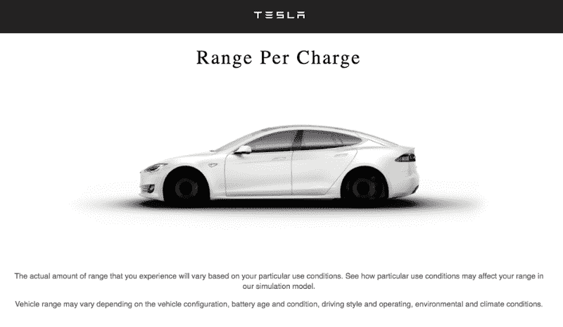

### 7.Props 和 React 开发工具

哇！很好，但是缺少了一些东西。车轮未示出。我们来找找原因。根据源代码，应该将`TeslaCar`传递给`props`，并根据`props.wheelsize`更改类名。

换句话说，您需要从父组件接收一些数据(在本例中是 wheelsize)并正确地呈现它，并且必须有一个可以接收数据的通信方法。

React 由一个组件树组成，组件树由一个传递数据和状态的容器和一个被动地从容器接收数据和状态的组件组成。将这种状态传递给子组件的工具是一个单独的对象，`props`。

通过使用 Chrome 中的 [React 开发者工具](https://www.google.com.au/url?sa=t&rct=j&q=&esrc=s&source=web&cd=1&cad=rja&uact=8&ved=0ahUKEwi10rn7soTSAhVJp5QKHYPcC5YQFggbMAA&url=https%3A%2F%2Fchrome.google.com%2Fwebstore%2Fdetail%2Freact-developer-tools%2Ffmkadmapgofadopljbjfkapdkoienihi%3Fhl%3Den&usg=AFQjCNEv0udXgBoaukzJa59I_vufhScUbQ&sig2=wTA5bB3JG2ZQ6wbSiDgq8g)检查组件树，你可以很容易地理解这一点。


`props`是一个 JavaScript 单个对象，在本例中是一个空对象。这是因为我们没有通过父组件`TeslaBattery`中的`props`。

### 8.应用状态

我们需要考虑在我们的应用程序中需要管理哪些`state`。如果您查看本文顶部的最终应用程序 GIF 图像，则状态值为:

*   **carstats(对象数组)**:根据当前选择的条件值(速度、温度、气候、车轮)，按车型排列的电池数值对象数组
*   **配置(对象)**:当前选择的条件对象(速度:55，温度:20，气候:空调开，车轮:19)

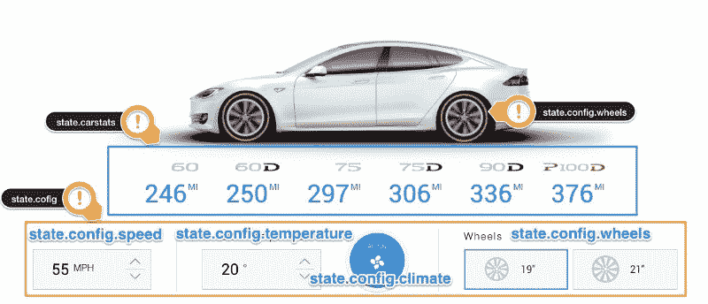

state of application

这是我们应用程序的唯一真实来源。现在我们将把构造器方法添加到`TeslaBattery`容器中，并设置初始值，这样我们就可以管理这个状态值，并把它传递给子组件。`TeslaCar`组件通过`props`接受`wheelsize`输入，并渲染特斯拉汽车图像和旋转车轮。

> 父组件和子组件都不知道特定的组件是有状态的还是无状态的，也不关心它是被定义为`function`还是`class`。这就是为什么状态通常被称为局部的或封装的。除了拥有和设置该状态的组件之外，其他组件不能访问该状态。所以这个状态值可以作为`props`传递给子组件。这通常被称为“自上而下”或“单向”数据流。每个状态总是由一个特定的组件拥有，从该状态派生的任何数据或 UI 只影响树的“向下”组件。

```
...class TeslaBattery extends React.Component {  constructor(props) {    super(props);
```

```
 this.state = {      carstats: [],      config: {        speed: 55,        temperature: 20,        climate: true,        wheels: 19      }    }  }    render() {    // ES6 Object destructuring Syntax,    // takes out required values and create references to them    const { config } = this.state;    return (      <form className="tesla-battery">        <h1>Range Per Charge</h1>        <TeslaCar wheelsize={config.wheels}/>        <TeslaNotice />      </form>    )  }}...
```

在`render()`中，`const {a, b} = c`表格中的代码为`ES6 Object Destructuring`。它从对象中取出所需的值，并对其进行引用。

> 从概念上讲，React 组件就像一个 JavaScript 函数，接收一个名为**‘props’**的任意输入，并返回一个描述应该显示什么的 React 元素。

总之，这个概念可以用下面的公式来表达。

> **fn(d) = V**

接收数据作为输入并返回视图的函数。

如果您保存文件，您可以看到渲染的特斯拉汽车和车轮动画在更新的屏幕上工作良好。你也可以看到`props`在组件树中被很好的传递了。

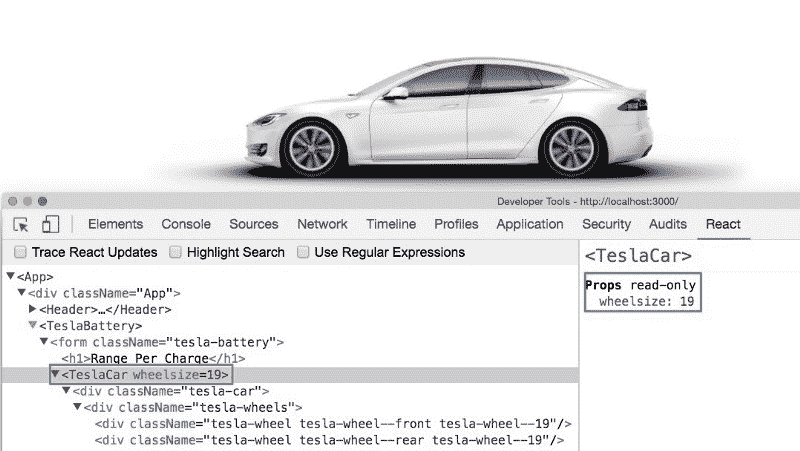

TeslaCar props

> 有些函数之所以被称为“纯”函数，是因为如果它们有相同的输入值而不改变输入值，它们总是返回相同的输出值。(`Pure function`)这里一个重要的 React 严格规则是，所有 React 组件的行为应该像关于 props 的纯函数一样。`props`必须是只读的。

### 9.TeslaStats 组件

现在我们将构建`TeslaStats`组件。创建`src/components/TeslaStats`目录，在其中创建一个`TeslaStats.js`文件，输入以下代码:

```
import React from 'react';import './TeslaStats.css';
```

```
const TeslaStats = (props) => {  const listItems = props.carstats.map((stat) => (    <li key={stat.model}>      <div className={`tesla-stats-icon tesla-stats-icon--${stat.model.toLowerCase()}`}></div>      <p>{stat.miles}</p>    </li>  ));  return (    <div className="tesla-stats">    &lt;ul>      {listItems}      </ul>  </div>  )};
```

```
TeslaStats.propTypes = {  carstats: React.PropTypes.array}
```

```
export default TeslaStats;
```

`TeslaStats`也是一个接收状态的`presentational component`，它通过`props`获取包含模型值的数组列表并呈现它们。

首先，让我们考虑如何在 JavaScript 中转换列表。下面的代码使用`map()`函数获取一个`numbers`数组并返回一个 double 值。

这段代码将`[2, 4, 6, 8, 10]`打印到控制台。

```
const numbers = [1, 2, 3, 4, 5];const doubled = numbers.map((number) => number * 2);console.log(doubled);
```

在 React 中将数组转换为列表几乎是一样的。这里我们使用 JavaScript `map`函数来遍历`props.carstats`数组。

对于每一次迭代，它都返回一个包含模型的元素。

最后，它返回`<` ul >元素中的`listItems`数组。

### 9.1 TeslaStats 组件样式

接下来，在`src/components/TeslaStats`目录中创建一个`TeslaStats.css`文件，并键入以下样式。由于代码较长，此处省略，我们来查看一下[源代码](https://github.com/gyver98/part1-react-tesla-battery-range-calculator-tutorial/blob/master/src/components/TeslaStats/TeslaStats.css)

```
....tesla-stats {  margin: -70px 0 30px; }.tesla-stats ul {  text-align: center; }...
```

该组件执行的任务是遍历`props.carstats`数组，并基于`stat.model`将特定的类绑定到元素。然后，您可以替换背景图像来显示 Tesla 模型。

### 9.2 在 TeslaBattery 容器中导入 TeslaStats 组件

然后添加下面的`import`来使用`TeslaBattery.js`中的 `TeslaStats`组件。

```
...import TeslaStats from '../components/TeslaStats/TeslaStats';...render() {  const { config, carstats } = this.state;  return (    <form className="tesla-battery">      <h1>Range Per Charge</h1>      <TeslaCar wheelsize={config.wheels}/>      <TeslaStats carstats={carstats}/>      <TeslaNotice />    </form>  )}...
```

我们需要将`carstats`数组传递给`props`，所以让我们使用已经实现的`BatteryService`来设置值。

### 9.3 计算状态和设置状态

先添加导入`getModelData`。

组件通过`componentDidMount()`挂载后，调用`statsUpdate()`函数。当执行接收`carModels`和当前状态值作为输入的`calculateStats()`函数时，返回具有匹配`model`和`miles`值的对象，返回值通过`setState()`传递，然后更新状态对象。

```
...import { getModelData } from '../services/BatteryService';...
```

```
calculateStats = (models, value) => {  const dataModels = getModelData();  return models.map(model => {    // ES6 Object destructuring Syntax,    // takes out required values and create references to them    const { speed, temperature, climate, wheels } = value;    const miles = dataModels[model][wheels][climate ? 'on' : 'off'].speed[speed][temperature];    return {      model,      miles    };  });}  statsUpdate() {  const carModels = ['60', '60D', '75', '75D', '90D', 'P100D'];  // Fetch model info from BatteryService and calculate then update state  this.setState({    carstats: this.calculateStats(carModels, this.state.config)  })  }  componentDidMount() {  this.statsUpdate(); }...
```

需要注意的是，访问类中的`this`需要在`TeslaBattery`构造函数中进行显式绑定。

```
...this.calculateStats = this.calculateStats.bind(this);this.statsUpdate = this.statsUpdate.bind(this);...
```

### 9.4 添加附加样式

这里的漂亮布局需要额外的样式。

首先打开`src/index.css`文件，删除所有现有代码，并添加以下内容:

```
@font-face {  font-family: 'RobotoNormal';  src: url('./assets/fonts/Roboto-Regular-webfont.eot');  src: url('./assets/fonts/Roboto-Regular-webfont.eot?#iefix') format('embedded-opentype'),       url('./assets/fonts/Roboto-Regular-webfont.woff') format('woff'),       url('./assets/fonts/Roboto-Regular-webfont.ttf') format('truetype'),       url('./assets/fonts/Roboto-Regular-webfont.svg#RobotoRegular') format('svg');  font-weight: normal;  font-style: normal;}
```

```
*, *:before, *:after {  box-sizing: border-box;  margin: 0;  padding: 0;  font: 300 14px/1.4 'Helvetica Neue', Helvetica, Arial, sans-serif;  -webkit-font-smoothing: antialiased;}
```

```
.cf:before,.cf:after {    content: '';    display: table;}.cf:after {    clear: both;}.cf {  *zoom: 1;}
```

接下来，打开`src/App.css`文件，删除所有现有代码，并添加以下内容:

```
.wrapper {  margin: 100px 0 150px;}
```

到目前为止，工作结果屏幕如下。


### 10.可重用 TeslaCounter 组件

Tesla 的速度和外部温度控制应该是可重用的组件，所以我将使它们成为一个通用的计数器组件，允许其他元数据，如步长、最小值、最大值、标题和单位(mph / degrees)。

此外，与我们到目前为止创建的组件不同，我们需要一个动作来更改状态值以响应用户输入(按钮点击、复选框选择等)。).让我们看看如何处理子组件中发生的事件。

像前面一样创建`src/components/TeslaCounter`目录，在其中创建一个`TeslaCounter.js`文件，并输入以下代码:

```
import React from 'react';import './TeslaCounter.css';
```

```
const TeslaCounter = (props) => (  <div className="tesla-counter">    <p className="tesla-counter__title">{props.initValues.title}</p>    <div className="tesla-counter__container cf">      <div className="tesla-counter__item">        <p className="tesla-counter__number">          { props.currentValue }          <span>{ props.initValues.unit }</span>        </p>        <div className="tesla-counter__controls">          <button             onClick={(e) => props.increment(e, props.initValues.title)}             disabled={props.currentValue >= props.initValues.max}           >          </button>          <button             onClick={(e) => props.decrement(e, props.initValues.title)}             disabled={props.currentValue <= props.initValues.min}           >          </button>        </div>      </div>    </div>  </div>  );
```

```
TeslaCounter.propTypes = {  currentValue: React.PropTypes.number,  increment: React.PropTypes.func,  decrement: React.PropTypes.func,  initValues: React.PropTypes.object}
```

```
export default TeslaCounter;
```

让我们想想我们在这里想要什么。每次单击并更改速度和温度时，都必须更新状态，以便该值反映在最大值和最小值之间。

因为组件只需要更新它自己的状态，所以每当它需要更新它的状态时，`TeslaBattery`将回调(`increment`，`decrement`)传递给`TeslaCounter`。你可以使用按钮上的`onClick`事件来通知事件。`TeslaBattery`传递的回调调用`setState()`，app 更新。

我们将实现一个回调，稍后将由`TeslaBattery`传递。

### 10.1 TeslaCounter 组件样式

先实现风格吧。在`src/components/TeslaCounter`目录下创建一个`TeslaCounter.css`文件，并指定以下样式。由于代码较长，此处省略，我们来查看一下[源代码](https://github.com/gyver98/part1-react-tesla-battery-range-calculator-tutorial/blob/master/src/components/TeslaCounter/TeslaCounter.css)

```
.tesla-counter {  float: left;  width: 230px; }.tesla-counter__title {  letter-spacing: 2px;  font-size: 16px; }...
```

### 10.2 在 TeslaBattery 容器中导入 TeslaCounter 组件

现在，我们将在`TeslaBattery`中实现`callback`，并将其传递给`TeslaCounter`组件。

首先，添加`import`来使用`TeslaBattery.js`中的 `TeslaCounter`组件。

我们还实现了回调函数`increment()`和`decrement()`，以及内部函数`updateCounterState()`，并将其绑定在`constructor`中。然后用`props`将`callback`函数传递给`TeslaCounter`组件。

```
...constructor(props) {    super(props);
```

```
 this.calculateStats = this.calculateStats.bind(this);    this.statsUpdate = this.statsUpdate.bind(this);    this.increment = this.increment.bind(this);    this.decrement = this.decrement.bind(this);    this.updateCounterState = this.updateCounterState.bind(this);
```

```
 this.state = {      carstats: [],      config: {        speed: 55,        temperature: 20,        climate: true,        wheels: 19      }    }  }...updateCounterState(title, newValue) {    const config = { ...this.state.config };    // update config state with new value    title === 'Speed' ? config['speed'] = newValue : config['temperature'] = newValue;    // update our state    this.setState({ config });  }
```

```
 increment(e, title) {    e.preventDefault();    let currentValue, maxValue, step;    const { speed, temperature } = this.props.counterDefaultVal;    if (title === 'Speed') {      currentValue = this.state.config.speed;      maxValue = speed.max;      step = speed.step;    } else {      currentValue = this.state.config.temperature;      maxValue = temperature.max;      step = temperature.step;    }
```

```
 if (currentValue < maxValue) {      const newValue = currentValue + step;      this.updateCounterState(title, newValue);    }  }
```

```
 decrement(e, title) {    e.preventDefault();    let currentValue, minValue, step;    const { speed, temperature } = this.props.counterDefaultVal;    if (title === 'Speed') {      currentValue = this.state.config.speed;      minValue = speed.min;      step = speed.step;    } else {      currentValue = this.state.config.temperature;      minValue = temperature.min;      step = temperature.step;    }
```

```
 if (currentValue > minValue) {      const newValue = currentValue - step;      this.updateCounterState(title, newValue);    }  }  ...render() {		return (      <form className="tesla-battery">        <h1>Range Per Charge</h1>        <TeslaCar wheelsize={config.wheels} />        <TeslaStats carstats={carstats} />        <div className="tesla-controls cf">          <TeslaCounter            currentValue={this.state.config.speed}            initValues={this.props.counterDefaultVal.speed}            increment={this.increment}            decrement={this.decrement}          />          <div className="tesla-climate-container cf">            <TeslaCounter              currentValue={this.state.config.temperature}              initValues={this.props.counterDefaultVal.temperature}              increment={this.increment}              decrement={this.decrement}            />          </div>        </div>        <TeslaNotice />    </form>  )}
```

### 10.3 特斯拉电池容器样式

一旦添加了`TeslaCounter`组件，就需要为`TeslaBattery`添加一个额外的样式。打开`TeslaBattery.css`文件，添加以下内容:

```
.tesla-climate-container {  float: left;  width: 420px;  padding: 0 40px;  margin: 0 40px 0 0;  border-left: 1px solid #ccc;  border-right: 1px solid #ccc;}.tesla-controls {  display: block;  width: 100%;}
```

### 10.4 默认值属性

这里，`initValues`传递给`TeslaCounter`的是一个常量值，从`TeslaBattery`的父组件`App`传递过来。

打开`App.js`并将`counterDefaultVal`对象传递给`TeslaBattery`组件，如下所示:

```
import React, { Component } from 'react';import './App.css';import Header from './components/Header/Header';import TeslaBattery from './containers/TeslaBattery';
```

```
const counterDefaultVal = {  speed: {    title: "Speed",    unit: "mph",    step: 5,    min: 45,    max: 70  },  temperature: {    title: "Outside Temperature",    unit: "°",    step: 10,    min: -10,    max: 40  }};
```

```
class App extends Component {  render() {    return (      <div className="App">        <Header />        <TeslaBattery counterDefaultVal={counterDefaultVal}/>      &lt;/div>    );  }}
```

```
export default App;
```

现在，当您单击速度和温度时，您可以看到更改后的值通过`React Developer Tool`更新并重新呈现在状态对象中。

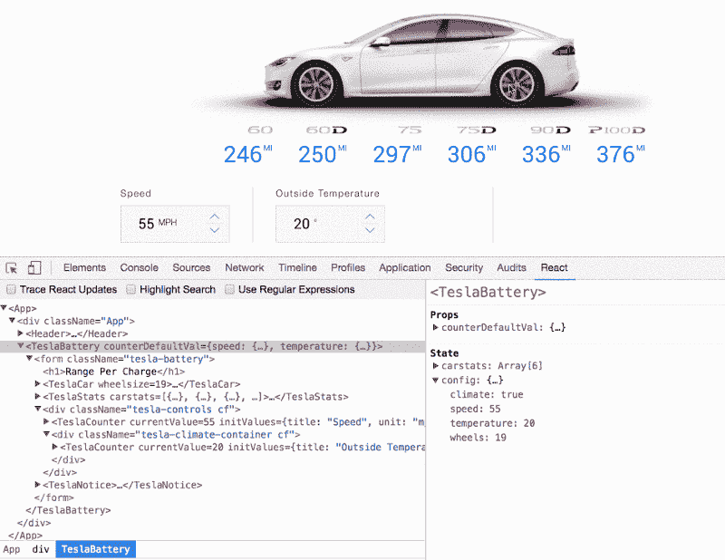

### 10.5 虚拟 DOM

单页应用能给我们的是无缝的用户体验和流畅的交互。

在我们的应用程序中，汽车模型值会更新，而不必在用户每次改变速度或温度时重新加载整个页面。即使你需要连接到服务器来获取数据。为了提供这种用户体验，您需要知道当发生变化或交互时，您需要更新`DOM`的哪个部分。

每个 JavaScript 框架使用不同的策略:`Ember`使用`data-binding` , `Angular1`使用[脏检查](https://docs.angularjs.org/guide/scope),`React`使用[虚拟 DOM](https://facebook.github.io/react/docs/rendering-elements.html) 。

在 React 中，第一次调用组件的呈现方法时，它打印一个`virtual DOM`模型，而不是实际的`DOM`元素本身。`virtual DOM`是表示`DOM`外观的 JavaScript 数据结构。然后 React 采用这个模型并创建实际的`DOM`元素。

然后，每当组件的状态改变时(例如，`setState`被调用)，组件的渲染方法被调用，一个新的`virtual DOM`被创建，这个新的`virtual DOM`与之前的`virtual DOM`进行比较。这种比较的结果是显示实际的`DOM`变化，并且`DOM`将被这些变化“修补”,屏幕将会改变。

> 汽车型号信息不会随着速度和温度的变化而变化。这个最终会在后面实现。

### 11.空调和加热控制

我们监控温度，当温度超过 20 度时，将`heating`改变为`aircon`，当温度低于 20 度时，将`heating`改变。

首先创建一个目录`src/components/TeslaClimate`，在其中创建一个`TeslaClimate.js`文件，输入如下代码:

```
import React from 'react';import './TeslaClimate.css';
```

```
const TeslaClimate = (props) => (  <div className="tesla-climate">    <label      className={`tesla-climate__item ${props.value ? 'tesla-climate__item--active' : '' }  ${!props.limit ? 'tesla-heat':''}`}    >      <p>{props.limit ? 'ac' : 'heat'} {props.value ? 'on' : 'off'}</p>      <i className="tesla-climate__icon"></i>      <input        type="checkbox"        name="climate"        checked={props.value}        onChange={() => {props.handleChangeClimate()}}      />    </label>  </div>);
```

```
TeslaClimate.propTypes = {  value: React.PropTypes.bool,  limit: React.PropTypes.bool,  handleChangeClimate: React.PropTypes.func}
```

```
export default TeslaClimate;
```

这个组件根据传入的`props.value`改变样式类，根据`props.limit`改变文本。

`TeslaBattery`将回调(本例中为`handleChangeClimate`)传递给`TeslaClimate`,每当需要更新状态时，就会执行回调。`onChange`事件可以用来通知事件。由`TeslaBattery`传递的`callback`被`setState()`调用以更新其状态并重新渲染。

### 11.1 特斯拉气候组件样式

在`src/components/TeslaClimate`目录下创建一个`TeslaClimate.css`文件，并指定以下样式。由于代码较长，此处省略，我们来查看一下[源代码](https://github.com/gyver98/part1-react-tesla-battery-range-calculator-tutorial/blob/master/src/components/TeslaClimate/TeslaClimate.css)。

```
.tesla-climate {	  float: left;   }  .tesla-climate__item {    cursor: pointer;    display: block;    width: 100px;    height: 100px;    border: 6px solid #f7f7f7;    border-radius: 50%;    box-shadow: 0px 1px 3px rgba(0, 0, 0, 0.3);    color: #666;    background: #fff;   }  ...
```

### 11.2 将 TeslaClimate 组件导入 TeslaBattery 容器

现在我们将在`TeslaBattery`中实现`callback`，并将其传递给`TeslaClimate`组件。

首先，添加`import`来使用`TeslaBattery.js`中的 `TeslaClimate`组件。我们实现了回调函数`handleChangeClimate()`，并将其绑定在`constructor()`中。然后将回调函数作为`props`传递给`TeslaClimate`组件。

```
...import TeslaClimate from '../components/TeslaClimate/TeslaClimate';...constructor(props) {  super(props);  ...  this.handleChangeClimate = this.handleChangeClimate.bind(this);  ...}// handle aircon & heating click event handlerhandleChangeClimate() {  const config = {...this.state.config};  config['climate'] = !this.state.config.climate;  this.setState({ config });}
```

```
...<TeslaClimate  value={this.state.config.climate}  limit={this.state.config.temperature > 10}  handleChangeClimate={this.handleChangeClimate}/&gt;  ...
```

现在状态值根据温度变化而变化，当变化后的值传递给`TeslaClimate`组件时，样式类和文本也根据该值而变化。

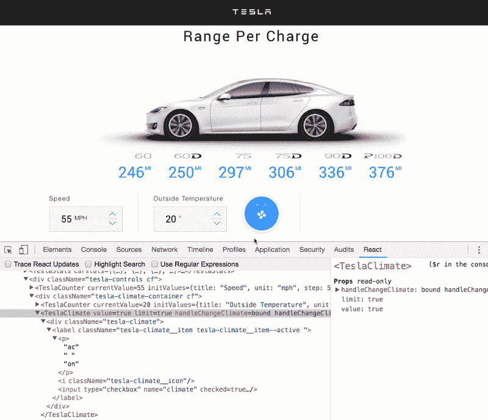

### 12.特斯拉 Wheels 组件

最后，我们来制作最后一个组件`TeslaWheels`。像往常一样，创建一个目录`src/components/TeslaWheels`，在其中创建一个`TeslaWheels`文件，并输入以下代码。

```
import React from 'react';import './TeslaWheels.css';
```

```
const LabelLists = (props) => {  const value = props.wheels.value;  const changeHandler = props.wheels.handleChangeWheels;  const sizes = [19, 21];  const LabelItems = sizes.map(size => (    <label key={size} className={`tesla-wheels__item tesla-wheels__item--${size} ${value === size ? 'tesla-wheels__item--active' : '' }`}>      <input        type="radio"        name="wheelsize"        value={size}        checked={value === size}         onChange={() => {changeHandler(size)}} />      <p>        {size}"      </p>    </label>     )  );  return (    <div>      {LabelItems}    </div>  );}const TeslaWheels = (props) => (  <div className="tesla-wheels__component">    <p className="tesla-wheels__title">Wheels</p>    <div className="tesla-wheels__container cf">      <LabelLists wheels={props}/>    </div>  </div>);TeslaWheels.propTypes = {  value: React.PropTypes.number,  handleChangeWheels: React.PropTypes.func}export default TeslaWheels;
```

我们在这里的实现类似于将`props`数组对象转换成`TeslaStats`组件中的列表。使用`javascript map()`功能重复`props.sizes`阵列。

对于每次迭代，它返回包含 g 大小的`<lab` el >元素。最后`, the Labe`列表被构建到`o the Tesla`轮子组件中并被渲染。

在`<lab` el >元素中，通过根据传输的车轮尺寸改变类来显示车轮动画的效果。

### 12.1 TeslaWheels 组件样式

在`src/components/TeslaWheels`目录下创建一个`TeslaWheels.css`文件，并指定以下样式。由于代码较长，此处省略，我们来查看一下[源代码](https://github.com/gyver98/part1-react-tesla-battery-range-calculator-tutorial/blob/master/src/components/TeslaWheels/TeslaWheels.css)。

```
.tesla-wheels__component {  float: left;  width: 355px;}.tesla-wheels__title {  letter-spacing: 2px;  font-size: 16px;}...
```

### 12.2 在 TeslaBattery 容器中导入 TeslaWheels 组件

最后，在`TeslaBattery`中实现`callback`，并将其传递给`TeslaWheels`组件。

添加`import`以使用`TeslaBattery.js`中的`TeslaWheels`组件。然后我们实现回调函数`handleChangeWheels()`，并将其绑定在`constructor`中。然后将回调函数作为`props`传递给`TeslaWheels`组件。

```
...import TeslaWheels from '../components/TeslaWheels';...constructor(props) {    super(props);    this.calculateStats = this.calculateStats.bind(this);    this.increment = this.increment.bind(this);    this.decrement = this.decrement.bind(this);    this.handleChangeClimate = this.handleChangeClimate.bind(this);    this.handleChangeWheels = this.handleChangeWheels.bind(this);    this.statsUpdate = this.statsUpdate.bind(this);...handleChangeWheels(size) {  const config = {...this.state.config};  config['wheels'] = size;  this.setState({ config });}...<TeslaWheels  value={this.state.config.wheels}  handleChangeWheels={this.handleChangeWheels}/&gt;...
```

轮子动画完成的结果如下。

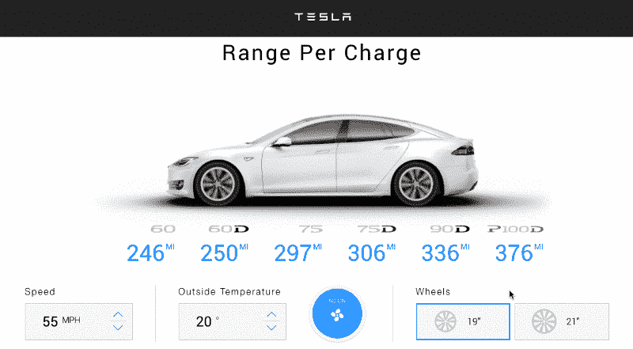

### 13.状态更新

我们终于结束了吗？即使用户改变几个条件值，车辆模型的差值也不会适当改变。

到目前为止，每次事件发生时，我们只更新了应用状态的一部分。

```
this.setState({ config });
```

现在，每当配置状态值改变时，让我们改变`carstats`状态。

```
statsUpdate() {  const carModels = ['60', '60D', '75', '75D', '90D', 'P100D'];  // Fetch model info from BatteryService and calculate then update state  this.setState({  carstats: this.calculateStats(carModels, this.state.config)  })}
```

现在我们创建一个函数，将`carModels`和当前状态值作为输入，反映应用程序状态中的变化`carStats`，并将其作为回调传递给`this.setState`。

通过这样做，可以首先在`setState()`中更新`config`对象，它运行异步方法，并以此为基础在屏幕上渲染改变后的`stats`。

```
this.setState({ config }, () => {this.statsUpdate()});
```

这就完成了所有的谜题。TeslaBattery 的完整代码是:

```
import React from 'react';import './TeslaBattery.css';import TeslaNotice from '../components/TeslaNotice/TeslaNotice';import TeslaCar from '../components/TeslaCar/TeslaCar';import TeslaStats from '../components/TeslaStats/TeslaStats';import TeslaCounter from '../components/TeslaCounter/TeslaCounter';import TeslaClimate from '../components/TeslaClimate/TeslaClimate';import TeslaWheels from '../components/TeslaWheels/TeslaWheels';import { getModelData } from '../services/BatteryService';
```

```
class TeslaBattery extends React.Component {  constructor(props) {    super(props);
```

```
 this.calculateStats = this.calculateStats.bind(this);    this.statsUpdate = this.statsUpdate.bind(this);    this.increment = this.increment.bind(this);    this.decrement = this.decrement.bind(this);    this.updateCounterState = this.updateCounterState.bind(this);    this.handleChangeClimate = this.handleChangeClimate.bind(this);    this.handleChangeWheels = this.handleChangeWheels.bind(this);
```

```
 this.state = {      carstats: [],      config: {        speed: 55,        temperature: 20,        climate: true,        wheels: 19      }    }  }
```

```
 calculateStats = (models, value) => {    const dataModels = getModelData();    return models.map(model => {      const { speed, temperature, climate, wheels } = value;      const miles = dataModels[model][wheels][climate ? 'on' : 'off'].speed[speed][temperature];      return {        model,        miles      };    });  }
```

```
 statsUpdate() {    const carModels = ['60', '60D', '75', '75D', '90D', 'P100D'];    // Fetch model info from BatteryService and calculate then update state    this.setState({      carstats: this.calculateStats(carModels, this.state.config)    })  }
```

```
 componentDidMount() {    this.statsUpdate();  }
```

```
 updateCounterState(title, newValue) {    const config = { ...this.state.config };    // update config state with new value    title === 'Speed' ? config['speed'] = newValue : config['temperature'] = newValue;    // update our state    this.setState({ config }, () => {this.statsUpdate()});  }
```

```
 increment(e, title) {    e.preventDefault();    let currentValue, maxValue, step;    const { speed, temperature } = this.props.counterDefaultVal;    if (title === 'Speed') {      currentValue = this.state.config.speed;      maxValue = speed.max;      step = speed.step;    } else {      currentValue = this.state.config.temperature;      maxValue = temperature.max;      step = temperature.step;    }
```

```
 if (currentValue < maxValue) {      const newValue = currentValue + step;      this.updateCounterState(title, newValue);    }  }
```

```
 decrement(e, title) {    e.preventDefault();    let currentValue, minValue, step;    const { speed, temperature } = this.props.counterDefaultVal;    if (title === 'Speed') {      currentValue = this.state.config.speed;      minValue = speed.min;      step = speed.step;    } else {      currentValue = this.state.config.temperature;      minValue = temperature.min;      step = temperature.step;    }
```

```
 if (currentValue > minValue) {      const newValue = currentValue - step;      this.updateCounterState(title, newValue);    }  }
```

```
 // handle aircon & heating click event handler  handleChangeClimate() {    const config = {...this.state.config};    config['climate'] = !this.state.config.climate;    this.setState({ config }, () => {this.statsUpdate()});  }
```

```
 // handle Wheels click event handler  handleChangeWheels(size) {    const config = {...this.state.config};    config['wheels'] = size;    this.setState({ config }, () => {this.statsUpdate()});  } 
```

```
 render() {        const { config, carstats } = this.state;    return (      <form className="tesla-battery">        <h1>Range Per Charge</h1>        <TeslaCar wheelsize={config.wheels} />        <TeslaStats carstats={carstats} />        <div className="tesla-controls cf">          <TeslaCounter            currentValue={this.state.config.speed}            initValues={this.props.counterDefaultVal.speed}            increment={this.increment}            decrement={this.decrement}          />          <div className="tesla-climate-container cf">            <TeslaCounter              currentValue={this.state.config.temperature}              initValues={this.props.counterDefaultVal.temperature}              increment={this.increment}              decrement={this.decrement}            />            <TeslaClimate              value={this.state.config.climate}              limit={this.state.config.temperature > 10}              handleChangeClimate={this.handleChangeClimate}            />          </div>          <TeslaWheels            value={this.state.config.wheels}            handleChangeWheels={this.handleChangeWheels}          />        </div>        <TeslaNotice />      </form>    )  }}
```

```
export default TeslaBattery;
```

> 检查[最终项目代码](https://github.com/gyver98/part1-react-tesla-battery-range-calculator-tutorial)

### 14.建设

是时候构建我们的应用程序了。

```
npm run build
```

如果构建成功，将在我们的项目目录中创建构建文件夹，并显示以下消息。

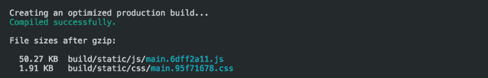

现在我们的构建已经可以部署了。

### 15.部署

有了像 [Surge](http://surge.sh/) 这样的工具，我们可以真正轻松地部署我们构建的应用。

`Surge`是简单的单命令网络发布。它免费发布 HTML、CSS 和 JS，无需离开命令行。

首先，安装带有`npm`的工具，运行`build`目录下的`surge`命令。

```
$ npm install -global surge$ cd build$ surge
```

如果这是您第一次跑步，您需要输入您的电子邮件和密码来注册新帐户。

部署瞬间完成。

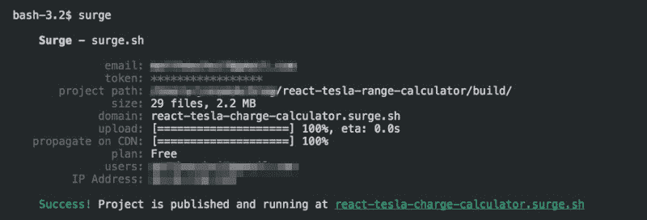

让我们连接到已部署的项目。

> [react-Tesla-charge-calculator . surge . sh](http://react-tesla-charge-calculator.surge.sh/)

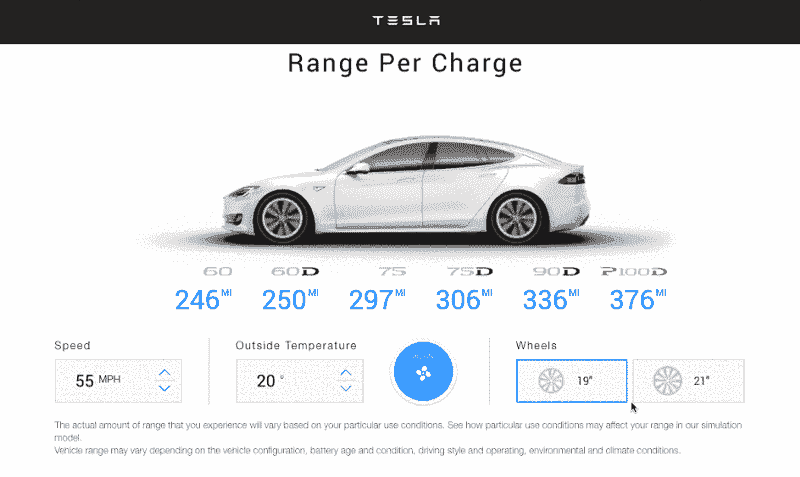

### 结论

在这篇文章中，我们学习了一些通过重建`Tesla's Battery Range Calculator`来创建 React 组件并组合它们以创建前端应用程序的要点。如果你一直在跟进，那么恭喜你获得了一个 React 应用程序并开始运行。

在下一期文章中，我们将探索如何使用`Redux`库来改进我们的状态管理。同时，如果你有任何意见、建议或更正，请在评论区发表。

提前感谢您的反馈。