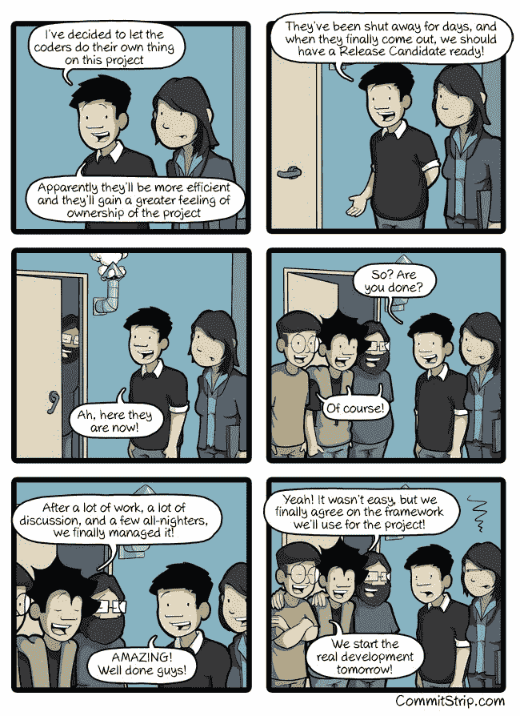

# 垃圾收集算法如何工作的动画指南

> 原文：<https://www.freecodecamp.org/news/an-animated-guide-to-how-garbage-collection-algorithms-work-46ccdba2b216/>

垃圾收集是通过清除程序不再需要的数据来清理计算机内存的过程。有几种算法可以做到这一点。(黑色方块代表空闲内存。)

这里有一个“引用计数器”垃圾收集器:

这是一个“标记清扫”垃圾收集器:

这里有一个“复制”垃圾收集器:

如果在完成之前不进行垃圾收集，会发生以下情况:

你可以在这里阅读所有这些内容( [5 分钟阅读](http://bit.ly/2n0Ogyv))

这里有三个值得你花时间的链接:

1.  网络中立、围墙花园和开放互联网的未来
2.  什么是坚实的原则，它们如何使你的代码更整洁？( [12 分钟手表](http://bit.ly/2nWqJOm))
3.  你可以做的 12 件免费的事情来启动你的 UX 设计生涯( [9 分钟阅读](http://bit.ly/2mIuTbC))

### 想到这一天:

> 保护计算机系统传统上是一场智慧的战斗:入侵者试图找到漏洞，而设计者试图堵住它们。—戈瑟

### 今日趣事:

网络漫画作者 [CommitStrip](http://bit.ly/2nDCeOH) 。

### 今日学习小组:

[华盛顿特区自由代码营](http://bit.ly/2mIyyWK)

编码快乐！

–昆西·拉森，自由代码营的老师