# 我们如何建立一个应用程序，使用工人的位置历史来打击工资盗窃

> 原文：<https://www.freecodecamp.org/news/i-built-an-app-that-uses-workers-location-history-to-combat-wage-theft-dedca8380ce3/>

2008 年，城市经济发展中心调查了芝加哥、洛杉矶和纽约市的 4387 名低薪工人。他们想确定美国经济核心部门违反劳动法的程度。

他们发现:

*   76%工作超过 40 小时的人没有得到法定的加班费。
*   68%的样本在之前的工作周中至少经历过一次与薪酬相关的违规行为。
*   由于工资被盗，普通工人每周 339 美元的收入中损失了 51 美元。这一损失相当于一年损失超过 2，652 美元(总平均工资为 17，616 美元)。

此外，这项研究估计，全国各地的工人每年因工资盗窃而损失 500 亿美元。

尽管这项研究是在八年前进行的，但研究结果仍然适用:大多数低薪工人是工资盗窃的受害者。如果他们想追回损失的工资，他们必须诉诸法律。由于如此多的低工资工人在受剥削的情况下工作，他们的雇主未能保持必要的记录，以显示工人可能工作的小时数或工人每周收到的工资。没有这些记录，工人们必须依靠他们的证据来证明他们的工作时间和工资。

通常情况下，律师必须依靠客户的记忆，然后建立一个他们几个月的行踪表，这使得一个较弱的案件。这就是这个故事的开始。

在过去的一个学期里，我和我在 [Hack4Impact](http://hack4impact.org) 的团队有机会与费城 (CLS)的[社区法律服务合作，这是一个公益法律诊所，自 1966 年成立以来，已经为 100 多万低收入费城人提供了服务。](http://clsphila.org)

我们的任务是创建一个网站来分析客户的谷歌位置历史，并为客户进入和退出用户输入的工作场所的所有时间创建一个时间表。其目的是使用员工的谷歌位置历史来补充他们自己的证词，以提供一个更可靠的案例，说明客户欠了多少钱。由于大多数潜在客户携带低成本手机(通常为 Android ),并且不进行定位历史跟踪，因此该解决方案将被证明是非常有用的，可以作为重建客户案件的法庭可接受时间表的起点，为 CLS 律师+律师助理提供来自可靠来源的全新证据来源。


Community Legal Services Offices

#### 项目用户流程:

我们的最佳用户流计算如下(请注意，我将从我们的实时产品中放入图片，以便您更好地了解这些需求):

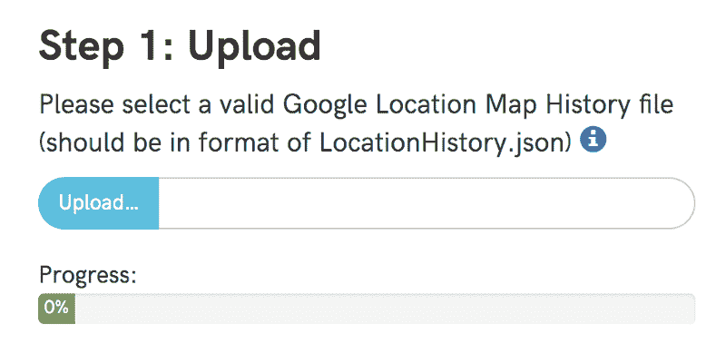

*   用户应该能够添加他们的 LocationHistory.json 文件(从 Google Takeout 下载)。

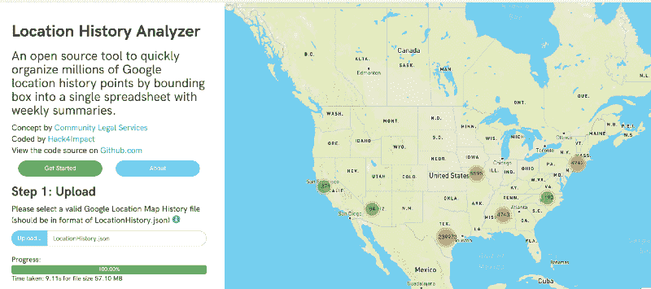

*   用户应该能够处理他们的位置数据并显示在地图上

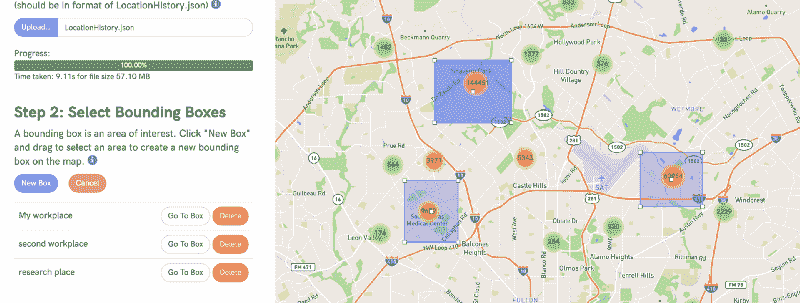

*   然后，用户应该能够选择包含其工作场所的粗略区域的边界框区域。

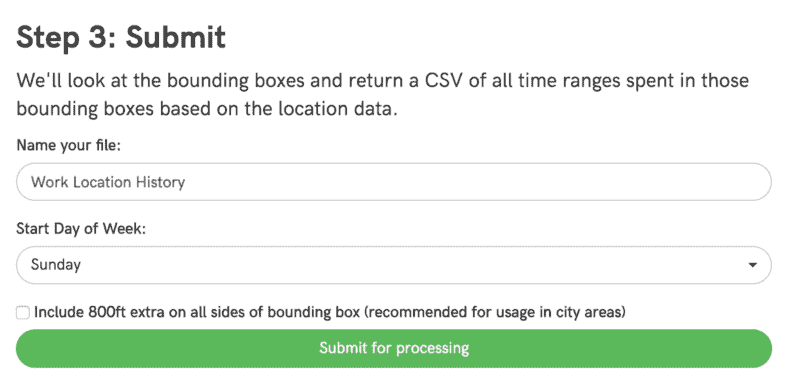

*   然后，用户应该能够选择一周的开始日期，并提交文件进行处理。

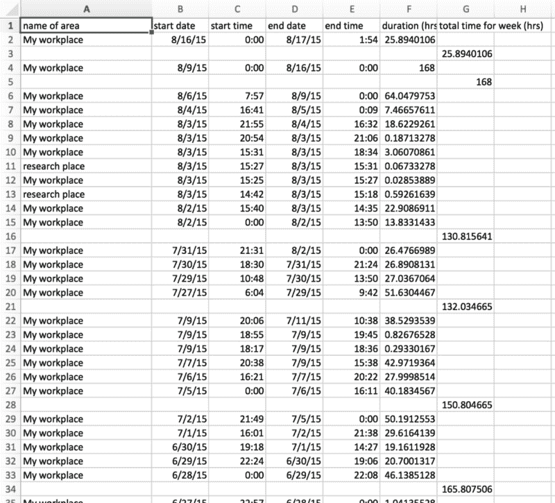

*   然后，位置历史应该被处理成一个. csv 文件。这个文件应该有包含用户在一个工作区的边界框内花费的时间(以及开始和结束时间)的行。
*   如果用户离开然后进入工作场所，这些应该显示为单独的行。在一周结束时，总的小时数应该制成表格并显示在单独的一栏中。

最重要的是，所有这些都必须在前端完成，以避免在我们的服务器上存储位置数据的隐私问题。这些要求本身似乎相对容易做到。我没有意识到解析和显示 LocationHistory.json 文件可能是最具挑战性的任务。

### Google LocationHistory.json 结构&首次尝试加载:

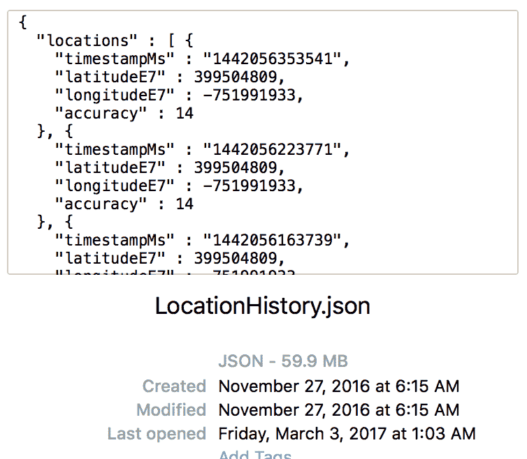

如果你不知道的话，谷歌会密切关注你的一举一动。更具体地说，如果你有一部安卓手机，并且到现在还没有关机，它们会记录你的位置历史。如果你愿意，你可以去[takeout.google.com/settings/takeout](http://takeout.google.com/settings/takeout)下载你迄今为止的历史记录，并以 JSON 格式下载你的文件(注意…它可能会很大)。

仅我的 LocationHistory.json 就有大约 59.9 MB 的大小(我使用 Android 手机大约两年了)，但是一些使用我们系统的客户可能有几百兆大小的位置历史记录。试图将整个 JSON 文件加载到内存中会导致浏览器挂起大约 30 秒，然后触发 chrome 上的经典“Aw Snap”错误(通常表示内存不足错误)。

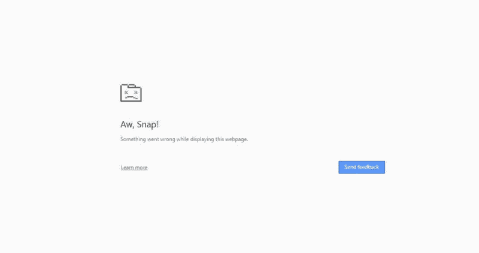

事实上，当在一个更强大的机器上运行这个程序时，我们可以获取一个内存快照，并尝试看看发生了什么。作为参考，我使用了一个加载到内存中的 59.9 MB 的文件。

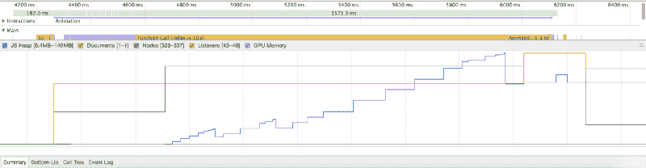

在这里，我们看到产生的 JS 堆大小几乎是实际文件大小的三倍。但实际上，我们不需要将整个数组存储在内存中，解析它以获得位置数据点，然后将这些点输入到一个函数中，在地图上显示它们。我们可以在飞行中完成这一切…然而，说起来容易做起来难。

### 组块和双簧管:

我想到的第一个解决方案是尝试将文件分割成更易于管理的 512 千字节的块。然而，这有一些固有的缺陷，主要是我试图加载的文件包含一个大的“字符串”，它具有 JSON 对象的格式(但还不是对象)。因此，当我决定将文件分割成 512 KB 长的连续片段并进行处理时，我很容易遇到将“对象”切成两半的情况。

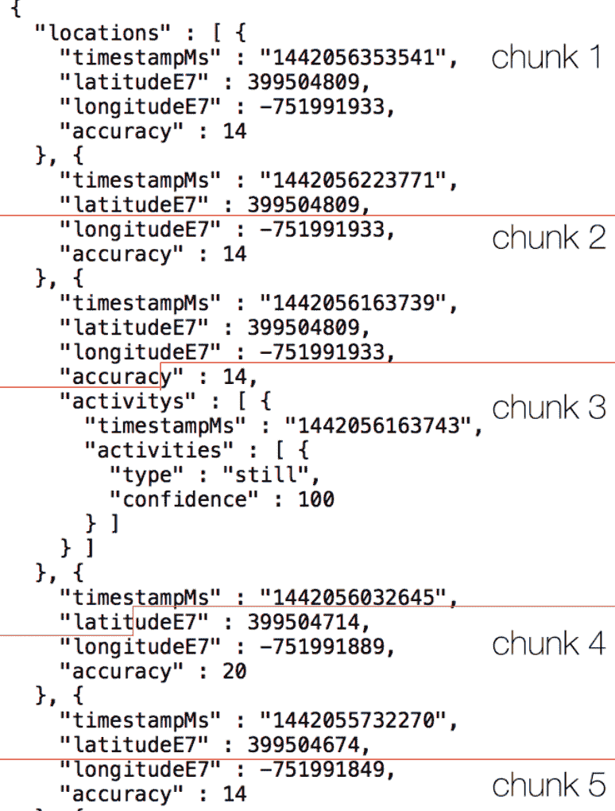

Exaggerated example of how chunking can split structured text

因此，现在我需要一种方法来跟踪半完成的对象/被截掉的对象，并相应地将它们预先计划/附加到后面的块中，以确保一切都能正确解析。尽管 Google LocationHistory.json 文件相对统一，但是块的分割方式却不统一。幸运的是，有一个现有的库来帮助处理所有可能出现的边缘情况。输入 Oboe.js。


Origin 1 and 2 are streaming JSON sources and the Aggregator is Oboe which sends complete constructed JSON objects

Oboe.js 是为处理来自流媒体的 JSON 而构建的。此外，它可以加载比客户机上可用内存更大的 JSON 树，因为它一次只处理一个 JSON 节点，然后从内存树中删除该节点。然而，我没有数据流来源。幸运的是，在查看了 oboe 代码库之后，我发现 Oboe 可以被实例化，并通过 emit 事件传递数据。

双簧管代码本身相对容易设置。我们正在查看的 JSON 文件具有如下的一般形式。

```
{   "locations": [ {    "timeStampMs": ...,    "latitudeE7": ...,    "longitudeE7": ...,    "accuracy": ...  }, {    "timeStampMs": ...,    "latitudeE7": ...,    "longitudeE7": ...,    "accuracy": ...  },  ...  ]}
```

根据 Oboe 文档，`locations`节点应该是目标，它的任何子对象都将被传递到回调函数中，如下面的代码示例所示。

接下来，我们需要想出一种方法将块传递给这个函数。分块功能本身稍微复杂一点，但是主要功能是一次处理 512 KB 的文件。该函数接收文件本身(来自输入)和 oboe.js 的实例(在我们的例子中是`os`变量)。

请注意第 11 行的以下内容:

```
oboeInstance.emit('data', chunk);
```

这一行包含了双簧管处理的关键。数据块将作为准数据流发送到我们的 oboe 实例的`os`变量中。

### 显示点:

最后要注意的是显示数据。我们选择使用 leaflet.js，因为它的设置相当简单，而且它拥有比谷歌地图(或我所知的任何其他地图库)更多样化的第三方图书馆生态系统。

用`id='mapid'`初始化 div 上的地图相当简单:

然而，显示超过 100 万个位置数据点所需要的远远超过了基础 fleet . js 库所能处理的。幸运的是，许多开源解决方案利用分层贪婪聚类在低缩放级别对点进行聚类，并随着缩放级别的增加对它们进行去聚类。Mapbox 的 Vladimir Agafonkin 写了一篇关于这个过程如何工作的算法方面的优秀博客，我强烈建议你[去看看](https://www.mapbox.com/blog/supercluster/)。

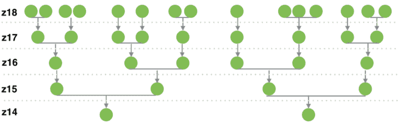

src: [https://www.mapbox.com/blog/supercluster/](https://www.mapbox.com/blog/supercluster/)

小叶标记聚类的现有实现已经存在于 [PruneCluster 库](https://github.com/SINTEF-9012/PruneCluster)中。这个库将自己与其他库区分开来，因为它对于能够处理多少点没有真正的上限(它只受到客户机计算能力的限制)。最终的渲染和更新时间是惊人的。

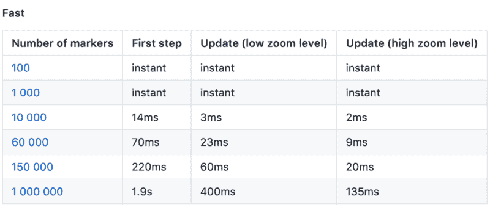

PruneCluster update times. src: [https://github.com/SINTEF-9012/PruneCluster](https://github.com/SINTEF-9012/PruneCluster)

回到我们的 oboe.js 实例代码，我们可以稍微编辑它，以说明添加的 PruneCluster 库:

### 结果:

在做了上面所有的改变之后，我终于能够做一些基本的测试，看看所有这些优化是否值得。下面是结果(每个文件大小做了五次试验，时间是平均值)。

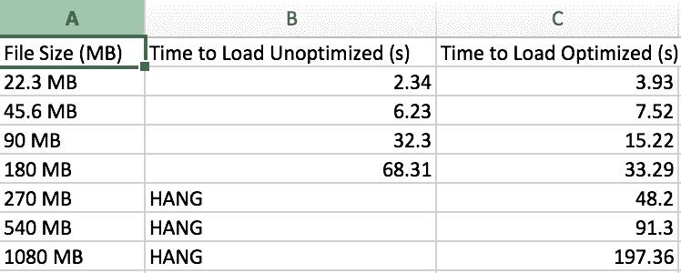

结果令人震惊。尽管直接将文件加载到内存中对于较小的文件来说速度更快，但是 oboe 流的分块最终得到了回报，并且在加载时间和文件大小之间给出了一个近乎线性的关系！最后，我们在分析器上附加了一个加载栏，给用户一种进度感，并附加了一些加载时间统计数据。

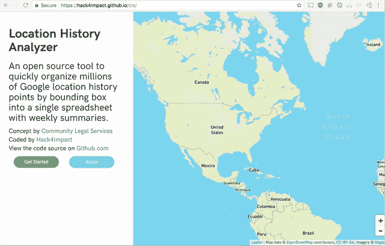

现在你知道了。在前端解析 Google 位置历史。不需要服务器。事实上，我现在在 hack4impact.github.io/cls 的**托管 github 页面上的网站。**

总的来说，这个项目取得了巨大的成功。在学期中，我与社区法律服务的一些了不起的人互动，创造了这个产品，它将在未来几年帮助许多法律工作者。我强烈鼓励那些知道如何编程的人自愿贡献他们的技能来帮助社区组织更好地完成他们的使命。这对双方来说都是一次令人难以置信的有益经历，它将挑战你如何运用你的技能来创造可持续和功能性的产品。

您可以在我们的资源库中找到该项目的源代码。

我的完整团队是:产品经理: [Krishna Bharathala](https://www.freecodecamp.org/news/i-built-an-app-that-uses-workers-location-history-to-combat-wage-theft-dedca8380ce3/undefined) ，团队成员: [Katie Jiang](https://www.freecodecamp.org/news/i-built-an-app-that-uses-workers-location-history-to-combat-wage-theft-dedca8380ce3/undefined) 、 [Daniel Zhang](https://www.freecodecamp.org/news/i-built-an-app-that-uses-workers-location-history-to-combat-wage-theft-dedca8380ce3/undefined) 、 [Santi Buenahora](https://www.freecodecamp.org/news/i-built-an-app-that-uses-workers-location-history-to-combat-wage-theft-dedca8380ce3/undefined) 和 [Rachel H](https://www.freecodecamp.org/news/i-built-an-app-that-uses-workers-location-history-to-combat-wage-theft-dedca8380ce3/undefined) 。