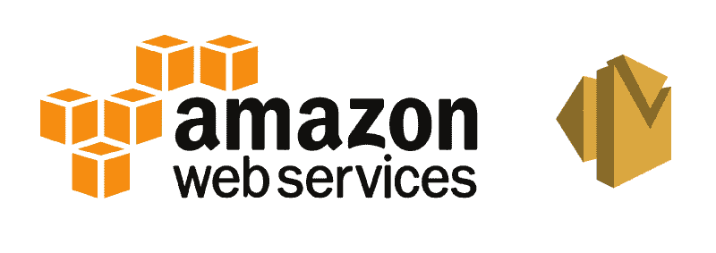
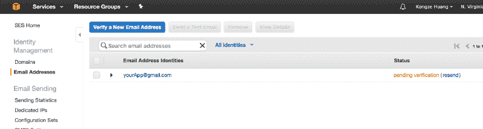
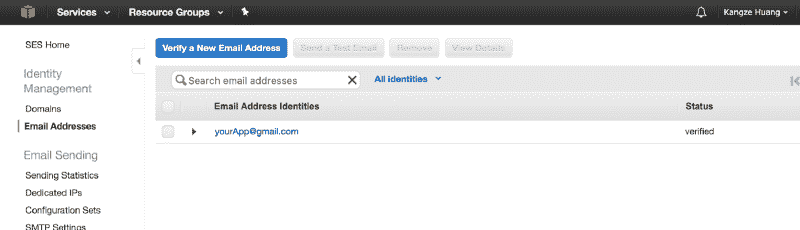
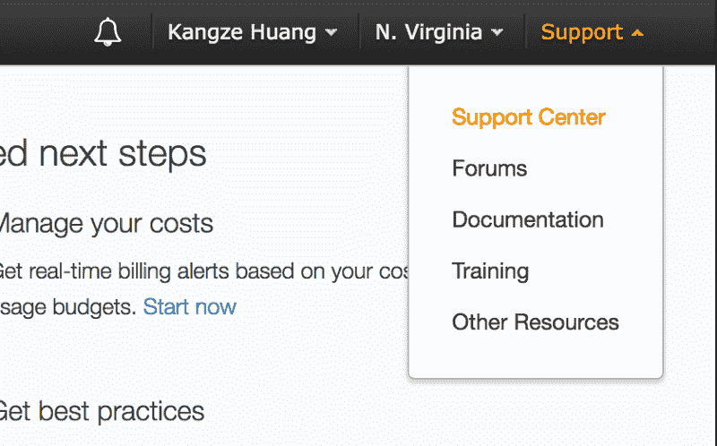
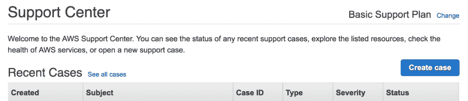
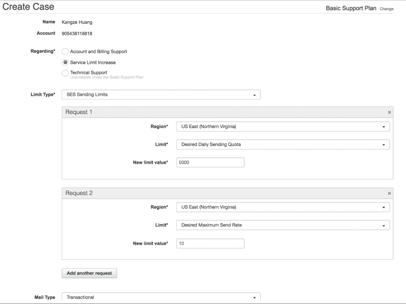
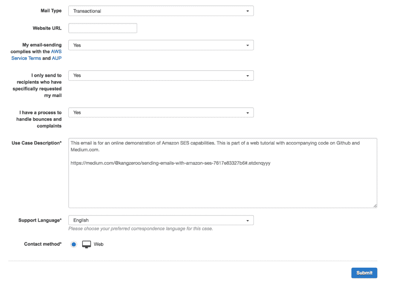

# 用 Amazon SES 发送电子邮件

> 原文：<https://www.freecodecamp.org/news/sending-emails-with-amazon-ses-7617e83327b6/>

作者:黄

# 用 Amazon SES 发送电子邮件

#### 完整的 AWS Web 样板文件—教程 3



### 目录

> **第 0 部分:** [介绍完整的 AWS Web 样板文件](https://medium.com/@kangzeroo/the-complete-aws-web-boilerplate-d0ca89d1691f#.3eqpvcjsy)

> **第 1 部分:** [用 AWS 认知进行用户认证](https://medium.com/@kangzeroo/user-management-with-aws-cognito-1-3-initial-setup-a1a692a657b3#.cbkz7b2jp) (3 部分)

> **第二部分:** [用亚马逊 S3 节省文件存储成本](https://medium.com/@kangzeroo/amazon-s3-cloud-file-storage-for-performance-and-cost-savings-8f38d7769619#.l9so2hk00) (1 部分)

> **第三部分:** [用亚马逊 SES 发送邮件](https://medium.com/@kangzeroo/sending-emails-with-amazon-ses-7617e83327b6#.5nhcrr609) (1 部分)

> 第 4 部分:使用 AWS IAM 管理用户和权限**【即将推出】**

> 第 5 部分:使用 AWS EC2 和 ELB 的云服务器托管**【即将推出】**

> 第 6 部分:MongoDB 黑仔:AWS DynamoDB **【即将推出】**

> 第 7 部分:使用 AWS RDS 的无痛 SQL 伸缩**【即将推出】**

> 第 8 部分:使用 Amazon Lambda 的无服务器架构**【即将推出】**

点击下载 Github [。](https://github.com/kangzeroo/Kangzeroos-Complete-AWS-Web-Boilerplate/tree/SES)

### 设置

用亚马逊 SES 发邮件真的很简单。让我们从设置开始。进入亚马逊 SES，点击侧边栏中的**电子邮件地址**。然后点击**验证新的电子邮件地址**，并在应用程序中输入您想要用于发送信息的电子邮件。



现在转到您的电子邮件提供商并单击验证链接。验证后，返回亚马逊 SES **电子邮件地址**标签。现在，您应该看到您的电子邮件已通过验证。



这是必要的，原因有二。首先是我们需要一个电子邮件来发送信息，其次是因为我们在一个沙盒环境中。沙盒环境意味着你只能发送和接收来自验证地址的电子邮件，并防止你向人们发送垃圾邮件。这就是我们需要的样板文件的所有设置。



如果你希望能够向任何电子邮件地址发送电子邮件，你需要向亚马逊提出书面请求，以便从沙盒环境中毕业。为此，导航到右上角的**支持**&**gt；支持中心。**



在下一个屏幕上，点击`Create case`。

这是一种简单的形式，但是我们将简要地解释一下。选择**服务限制增加**，将**限制类型**设置为 **SES 发送限制**。现在创建 2 个请求，其中一个**限制**是**期望的每日发送配额**(一天可以发送多少封电子邮件)，另一个**限制**是**期望的最大发送速率**。将**新极限值**设置为您需要的数值。最后，可选地设置邮件类型，因为它会增加您获得批准的几率。如果您的电子邮件是作为用户活动的请求而生成的，请使用事务性。对于其他用例，还有其他可用的。



剩下的请求就简单了。确保你同意遵守服务条款，并且你有一个处理[退信和投诉](http://docs.aws.amazon.com/ses/latest/DeveloperGuide/best-practices-bounces-complaints.html)的流程(当用户将你的邮件标记为垃圾邮件时)。最后，简单解释一下你的用例。



提交您的代码，您应该会从 Amazon 收到一封电子邮件，告知您服务增加请求的结果。一旦获得批准，您的应用程序就可以向任何电子邮件发送消息。

### 代码

我们已经准备好深入研究代码了！转到大部分代码所在的`App/src/api/aws/aws_ses.js`。我们来看看主要功能`sendAWSEmail()`:

```
export function sendAWSEmail(email, message){ const ses = new AWS.SES({  region: 'us-east-1' }) const p = new Promise((res, rej)=>{  if(!email|| message){   rej('Missing user email or message content')  }else{   const params = createInquiryParamsConfig(email, message)   // console.log('Sending email with attached params!')   AWS.config.credentials.refresh(function(){    // console.log(AWS.config.credentials)    ses.sendEmail(params, function(err, data) {      if(err){        // console.log(err, err.stack); // an error occurred        rej(err)      }else{       // console.log(data);           // successful response     res('Success! Email sent')      }    })   })  } }) return p}
```

这非常简单。我们收到两个参数，一个要发送的电子邮件和一个要发送的消息。我们在这个函数中做的第一件事是实例化 AWS SES 对象，通过简单地传入区域来与 AWS 交互。接下来，我们检查是否有收件人电子邮件和消息。如果两者都提供了，那么我们实际上可以发送电子邮件。

假设我们有一个收件人电子邮件和消息，我们将为 AWS SES 创建一个`params`对象来读取所有必要的信息&选项。这个`params`对象是用`createInquiryParamsConfig()`创建的。在我们深入那个兔子洞之前，让我们快速解释一下`sendAWSEmail()`的其余部分。我们刷新 AWS Cognito 用户的凭证(我们用 AWS Cognito 设置的，在我的[其他教程](https://medium.com/@kangzeroo/user-management-with-aws-cognito-1-3-initial-setup-a1a692a657b3#.ykdx6xqx2)中有解释)，用`params`调用`ses.sendEmail`，并传入一个响应回调。有错误就拒绝承诺，没有错误就用成功消息解决。`ses.sendEmail`是我们将使用的唯一 AWS 功能，我们需要的其他功能在`params`中确定。

现在我们来看看如何用`createInquiryParamsConfig()`制作`params`。

```
function createInquiryParamsConfig(email, message){ const params = {   Destination: {      BccAddresses: [],     CcAddresses: [],     ToAddresses: [ email ]   },   Message: {      Body: {        Html: {         Data: generateHTMLInquiryEmail(landlordEmail, message),         Charset: 'UTF-8'       }     },     Subject: {        Data: 'Kangzeroos Boilerplate says hi ' + email,       Charset: 'UTF-8'     }   },   Source: 'yourApp@gmail.com',    ReplyToAddresses: [ 'yourApp@gmail.com' ],   ReturnPath: 'yourApp@gmail.com' } return params}
```

非常简单，我们传入`email`和`message`，并返回一个大的 javascript 对象。您在这里看到的所有值都是必需的，但是您也可以添加大量其他可选配置。我们必须注意的功能是`generateHTMLInquiryEmail()`。让我们看看那个。

```
function generateHTMLInquiryEmail(email, message){ return `  <!DOCTYPE html>  <html>    <head>      <meta charset='UTF-8' />      <title>title</title>    </head>    <body>     <table border='0' cellpadding='0' cellspacing='0' height='100%' width='100%' id='bodyTable'>      <tr>          <td align='center' valign='top'>              <table border='0' cellpadding='20' cellspacing='0' width='600' id='emailContainer'>                  <tr style='background-color:#99ccff;'>                      <td align='center' valign='top'>                          <table border='0' cellpadding='20' cellspacing='0' width='100%' id='emailBody'>                              <tr>                                  <td align='center' valign='top' style='color:#337ab7;'>                                      <h3>${message}</h3>                                  </td>                              </tr>                          </table>                      </td>                  </tr>                  <tr style='background-color:#74a9d8;'>                      <td align='center' valign='top'>                          <table border='0' cellpadding='20' cellspacing='0' width='100%' id='emailReply'>                              <tr style='font-size: 1.2rem'>                                  <td align='center' valign='top'>                                      <span style='color:#286090; font-weight:bold;'>Send From:</span> <br/> ${email}                                  </td>                              </tr>                          </table>                      </td>                  </tr>              </table>          </td>      </tr>      </table>    </body>  </html> `}
```

我们在这里所做的就是创建一个 HTML 文件并传入`email`和`message`来创建一个定制的电子邮件。我们使用 ES6 字符串文字添加带有`${ }`的字符串变量，比如:`<h3>${message` } < /h3 >。

就是这样！您可以使用任何您想要的前端代码，只需将一个`email`和`message`传递给`sendAWSEmail()`。请记住`sendAWSEmail()`会返回一个承诺，因此您必须相应地处理它。如果你不知道如何处理承诺，看看我的[其他教程这里](https://medium.com/@kangzeroo/quick-story-about-javascript-promises-31b4e76ed0cd#.sty9l0ncx)。

下次见！

### 目录

> **第 0 部分:** [介绍完整的 AWS Web 样板文件](https://medium.com/@kangzeroo/the-complete-aws-web-boilerplate-d0ca89d1691f#.3eqpvcjsy)

> **第 1 部分:** [用 AWS 认知进行用户认证](https://medium.com/@kangzeroo/user-management-with-aws-cognito-1-3-initial-setup-a1a692a657b3#.cbkz7b2jp) (3 部分)

> **第二部分:** [用亚马逊 S3 节省文件存储成本](https://medium.com/@kangzeroo/amazon-s3-cloud-file-storage-for-performance-and-cost-savings-8f38d7769619#.l9so2hk00) (1 部分)

> **第三部分:** [用亚马逊 SES 发送邮件](https://medium.com/@kangzeroo/sending-emails-with-amazon-ses-7617e83327b6#.5nhcrr609) (1 部分)

> 第 4 部分:使用 AWS IAM 管理用户和权限**【即将推出】**

> 第 5 部分:使用 AWS EC2 和 ELB 的云服务器托管**【即将推出】**

> 第 6 部分:MongoDB 黑仔:AWS DynamoDB **【即将推出】**

> 第 7 部分:使用 AWS RDS 的无痛 SQL 伸缩**【即将推出】**

> 第 8 部分:使用 Amazon Lambda 的无服务器架构**【即将推出】**

该方法在 [renthero.ca](http://renthero.ca) 的部署中得到了部分应用