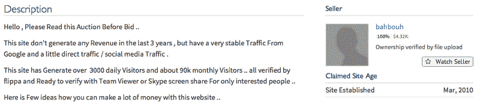
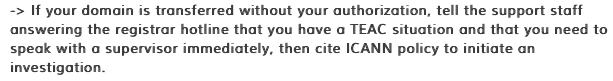
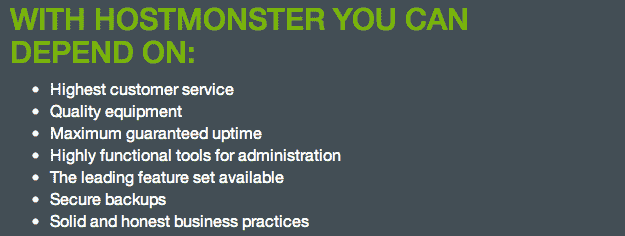

# 黑客偷了我的网站…我花了 30，000 美元把它拿了回来

> 原文：<https://www.freecodecamp.org/news/hackers-stole-my-website-and-i-pulled-off-a-30-000-sting-operation-to-get-it-back-143d43ee3742/>

乔丹·里德

#### 真实的故事。

不久前的几天，[RamshackleGlam.com](http://www.ramshackleglam.com/)——我从 2010 年 3 月开始拥有并运营的域名——不属于我。

相反，它属于一个在名为 Flippa 的拍卖网站上名叫“bahbouh”的人，他试图将网站卖给出价最高的人(现在购买价格为 30，000.00 美元)。

他向获胜者承诺我的流量、我的文件和我的数据，并建议我可以“受雇”继续写帖子(或者，他愿意向获胜者提供“高质量的文章”和“SEO 建议”，以维持网站的售后流量)。

我得知我的网站在一个星期六被盗了。三天后，我把它拿了回来，但这是在六家不同公司的大约 50 名员工的参与、半夜与律师的会议、联邦调查局的干预，以及相当于一次可能应该由桑德拉·布洛克而不是……嗯……我主演的诱捕行动之后。

当然，我听说过身份盗窃和网络黑客，但老实说，我对这些事情的态度非常“它永远不会发生在我身上。”

即使是这样……我也不明白这有什么大不了的。你就不能向人们解释发生了什么，证明你是谁，然后解决所有的问题吗？我们生活在这样一个高度文件化的世界里，对我来说，除了几个电话和一些恼怒之外，似乎完全不可能有人真的可以假装成另一个人而逍遥法外。

这比我想象的要糟糕得多——更具威胁性，更令人不安，也更难(如果不是不可能的话)解决。

我从我父亲那里知道了窃听的事。他的朋友安东尼(经营着一家名为 [ThoughtBox](http://thoughtbox.net/) 的网络开发和咨询公司)在 Flippa 上冲浪，非常巧合地注意到我的网站正在拍卖，上面有一个非常可疑的列表。

突然，我想起了前一天收到的一封邮件——一封我认为是垃圾邮件的邮件——来自一个“有兴趣购买”我的“博客”的人。我想起了 YouTube 上的通知，有人从不同的位置访问了我的账户——我忽略了这个通知，以为我是在移动设备上登录的，或者我丈夫意外登录了我的账户，而不是他自己的账户。

但即使在我看到清单后，我也没有惊慌:这似乎是可以通过几封电子邮件解决的事情。除了拍卖网站位于澳大利亚，似乎没有电话号码，当我发送一封带有扫描 ID 和所有权证明的电子邮件时，我得到的是一封套用信函。当我打电话给我付费运营网站的 HostMonster 时，我发现我不再是我网站的所有者:有人使用他们的电子邮件确认系统授权将我的域名转移到 GoDaddy(另一家网络注册服务公司，我也是其客户)的私人账户中。

The auction listing for my website.

### 为什么这是一件大事？

如果你的业务依赖于 URL，你就会明白为什么这是如此令人不安的消息:通过控制我网站的域名，黑客将能够关闭网站，或将其重定向到其他地方。此外，后来证实黑客也控制了网站的所有内容；他可以把我写的所有东西都转到他想去的任何地方。

《摇摇欲坠的魅力》可能“仅仅”是一个关于育儿、时尚和装饰之类的生活方式博客……但它也是我花了五年时间建立的一个网站，想到它落入心怀恶意的人手中，令人心碎。我可以切换到一个新的 URL 并导出我的内容的副本(我会备份)，但这将导致大量流量的损失。网站是我的主要收入来源，有了[一栋房子](http://www.ramshackleglam.com/2012/08/13/jordan-in-the-house-moving-day/)，[两个孩子](http://www.ramshackleglam.com/2011/10/22/this-is-the-first-day/)，一本[的书](http://www.amazon.com/Ramshackle-Glam-Haphazard-Almost-Having/dp/0762453044/ref=sr_1_1?s=books&ie=UTF8&qid=1396361642&sr=1-1&keywords=ramshackle+glam)即将出版，还有一个在商学院读书的[丈夫](http://www.ramshackleglam.com/2013/08/06/developments-and-exciting-things/)，这可不是闹着玩的。我的网址丢失有可能对我的生意和我的家庭造成毁灭性的打击。

### 那么我做了什么？

接下来几天发生的事情很复杂，所以我不会按时间顺序讲述它们，而是解释我走的每一条路是如何结束的(我会详细讲述，以便尽可能地帮助那些经历过这些的人)。

**1。我试图直接与 GoDaddy 和 HostMonster 解决这个问题。这不起作用。**

从周日到周二，我花了一天的大部分时间(和晚上的大部分时间)与 GoDaddy、HostMonster 或两者同时通话，几乎每个与我交谈的人都给了我同样的回应:“抱歉，帮不了你。”

HostMonster 坚持认为，因为他们不再控制域名，所以他们无能为力。GoDaddy 坚持认为，由于该帐户是私人的，该人通过 HostMonster 的转让获得了该域名的所有权，他们无能为力。

最终有所不同的是:我引用了 ICANN 关于域名争议解决的政策。*这使我的案例得到了升级，但并没有导致行动。

原因如下:HostMonster 的法律部门告诉我，为了让他们发起转让纠纷，导致 GoDaddy 将域名归还给我，他们的“内部调查”必须找到证据，证明他们在发布网站时做了一些错误的事情。换句话说，他们将不得不承认他们搞砸了…这反过来会让他们面临诉讼。

不用说，我再也没有法律部门的消息了。尽管每个人似乎都清楚我拥有我的网站，而且它未经我的授权就被转让了，但除非我发起一场耗时且昂贵的诉讼，否则什么也做不了，无论如何，诉讼都不会迅速到足以挽救我的域名不被出售的程度。

所以这条路走到了尽头。

**2。我给联邦调查局打了电话。这是朝着正确方向迈出的重要一步。**

在我发现未经授权转移的第二天早上，我也打电话给联邦调查局。我觉得打这个电话既愚蠢又夸张，但事实是这是一个国际网络犯罪问题，属于联邦调查局的管辖范围。这是我的事。这是我养家糊口的方式，在大局中可能是“小事”，但对我来说却不是小事。

让我告诉你:在过去一周左右的时间里，在我所有的惊喜中，最令人惊讶的是联邦调查局。他们立即作出了回应，包括后续的电话和电子邮件、24 小时内在我家与两名特工的面谈，以及昨天两名特工的后续访问。除此之外，在过去的一周里，我接触过的每一个特工都毫无例外地富有同情心、考虑周到、投入、尊重并致力于行动……除此之外，他们不把我当成一个案件编号，而是把我当成一个*人*。

我所期望的是用一个普通邮箱留言，在某个时候收到一封套用信函；我当然不希望看到一个积极的调查立即开始。我不打算写更多关于调查的内容，因为调查仍在进行中(尽管我确实要求并获得了写此事的许可)，但我认为重要的是要说我对联邦调查局的回应感到非常震惊。

**3。我试图通过直接与“卖家”打交道来重获控制权。这种做法奏效了，但也有相当大的戏剧性。**

在上述所有事情进行的同时，我也在努力从试图出售网站的个人手中直接夺回对网站的控制权。

我不想直接与“卖家”联系，因为我觉得如果他认为网站的“真正”所有者知道这笔买卖，他会试图勒索更多的钱。因此，我向 DM“bahbouh”询问 Anthony——发现原始列表的人，他在 Flippa 上有一个活跃的帐户，历史记录良好——看他是否对“私人出售”感兴趣。几经周折后，我们达成了协议，并决定通过第三方转账网站([Escrow.com](https://www.escrow.com/))进行销售:只有在确认域名已转让后，资金才会发放给卖家。

这似乎进行得很顺利，直到周二晚上，卖家突然要求立即释放资金(在收到网站之前)。当我们推回去的时候，他宣布要卖给别人:“对不起，再见。”

所以我的想法是这样的:如果我们不把钱给卖家，我们肯定得不到这个网站。如果我们*真的*把钱给他，他有可能拿了钱就跑，也有可能他会按照承诺交付场地。这不是我想冒的险…但我看不到任何选择。所以我批准了电汇。

我花了 20 分钟坐在我创建的虚拟 GoDaddy 帐户前，从卖家那里接收域名，等着看我是否损失了几千美元和一个域名，或者只是几千美元。

然后它就出现了。

我立即将该域名转移到另一个账户，并将其(以及我所有的其他域名)锁定。然后我打电话给电汇公司，停止付款。

### 最终结果

RamshackleGlam.com 又回到了我的手中，这要感谢许多人贡献出他们生命中的几个小时(有时是几天)来尽他们所能帮助我。我的其他账户——银行账户等等——已经得到保护。我还没有拿回我的钱，但是从我这里偷走我的网站的人也没有，而且永远也不会得到。

这是一个让我非常激动的结局。

### 那我为什么还生气呢？

当然，我对窃取网站的人很生气，但这不是我能控制的。我写这篇文章的原因是让人们知道这种事情真的会发生在任何人身上，并提供一些建议来减少这种事情发生在你身上的可能性(如下)，但除此之外，我写这篇文章是因为这件事让我对 GoDaddy 和 HostMonster 非常非常愤怒。我想让你知道为什么。

两家公司都没有人质疑我的声明(有书面证据支持)，即该网站属于我。没有人怀疑它是在没有我的授权下被转让的。然而，我不得不花几天时间——在这几天里，黑客几乎可以做他想做的任何事情——试图找到一个能够做任何事情的人，因为我与之交谈的支持人员和主管(他们必须有 50 人或更多)完全不知道如何处理这种情况，只能说:“哎呀，真糟糕。帮不了你。”

HostMonster and GoDaddy screengrabs

一旦我联系到那些能够帮助我的人——那些可以打一个电话或者按一个按钮就能把我的财产还给我的人(或者干脆把它冻结起来，这样它就不能被出售或销毁)——他们不会。他们躲在他们的法律部门后面，拒绝做任何事情，他们非常清楚，他们的不作为将迫使我要么与罪犯打交道并向其行贿，要么失去我业务的一个重要组成部分。

而黑客*知道*这些公司会这么做。

他们依赖它。

当犯罪企业不仅“无视”公司的政策而存在，而且实际上由于该公司将其自身利益置于其声称“保护”的客户的安全之上而蓬勃发展时，就会出现严重的问题。我是否理解为什么像 HostMonster 和 GoDaddy 这样的公司专注于保护自己免受诉讼？我当然知道。但事实是，他们不仅没有“帮助”他们的客户，反而积极*促成*威胁小企业和他们所支持的家庭的局面。

这些公司知道，当他们阻止那些财产明显被盗的客户时，这些客户除了付钱给罪犯或看着他们的业务——有时他们的生活崩溃——之外别无选择。他们知道，通过阻碍立即采取行动，他们创造了这些罪犯赖以延续其商业模式的环境。他们什么都不做。

这必须改变。

### 我的观点，不管它值不值得

托管公司的支持人员应该非常熟悉 ICANN 涉及域名争议的规定，并且应该能够在客户第一次让他们了解情况时就启动行动计划，而不是在几个小时又几个小时的重复呼叫之后。

此外，TEAC**的建立应导致争议账户的立即冻结，直到问题得到解决。这不应要求任何一方承认有罪；简单地承认存在争议，并意识到当争议存在时，必须保护域名不被出售或转让。

### **你能做些什么来减少这种事情发生在你身上的几率:**

1.  有一个非常非常好的密码，并经常更换。您的密码不应该包含“真实”单词(绝对不要超过一个真实单词，如“whitecat”或“angrybird”)，应该包含大写字母、数字和符号。所有密码中最好的看起来完全是胡说八道。
2.  如果可能的话，使用一台单独的电脑(旧的或为此购买的便宜的电脑)来处理银行业务；如果你的家庭电脑和你用于银行交易的是同一台电脑，你就有让你的孩子点击一个导致黑客攻击的坏链接的风险。
3.  不使用电脑和个人设备时，请将其关闭。
4.  在你的电脑上安装杀毒软件(但是记住病毒扫描只能捕捉 30-40%的病毒，所以不幸的是“干净”的检查并不一定意味着你是安全的)。
5.  购买网络风险保险(它基本上保护企业免受网络攻击和数据泄露)。

### 但是如果这真的发生在你身上，你可以这么做:

1.  立即开始认真做笔记(和截图)。不要删除任何邮件或其他信息；这对以后都很重要。
2.  根据以下规定，立即更改您的所有密码(包括但不限于域名注册商、网站托管、网站登录信息、电子邮件、银行账户、无线家用电子产品和 Apple ID)。我每隔几个小时就换一次，而这种情况仍然悬而未决，目前我继续每隔几天就换一次。
3.  联系注册服务商，引用下面的 ICANN 政策，看看你们是否能一起达成一个快速的解决方案。如果你发现自己走进了死胡同，不要感到惊讶。
4.  确保询问你的电子邮件中可能设置的“过滤器”和“规则”(基本上，黑客可能设置的转发电子邮件的任何类型的设备，等等)。
5.  联系适当的执法部门(我联系了联邦调查局，因为这似乎是一个国际问题，至少是一个州际问题，因为 Escrow.com 位于加利福尼亚州，而我在纽约州)。

*注意*:每种情况都是不同的，我不能全心全意地推荐我所采取的步骤，这些步骤最终导致我重新控制了我的域名，主要是因为它们涉及到与犯罪分子的互动。显然，这并不理想，而且会产生不可预知的后果。(尽管我丈夫说他想让大家知道他认为我是个大坏蛋。虽然这通常与事实相差甚远，但在这种特殊情况下……我会接受。)

结束了。(那很久了。感谢阅读。)

*** *** ***

*因特网指定名称号码管理公司。Org 是互联网名称与数字地址分配机构(ICANN)负责管理和协调[域名系统(DNS)](https://www.icann.org/en/node/1145082#dns) 。 [ICANN 关于域名争议解决的政策](https://www.icann.org/en/resources/registrars/transfers/policy)规定，在域名争议的情况下，败诉的注册服务商(在域名转让前仍拥有该域名的注册服务商，而不是在域名转让后仍拥有该域名的“胜诉注册服务商”)。必须立即建立一个转移紧急行动联系人(“ [TEAC](https://www.icann.org/en/resources/registrars/transfers/policy) ”)，以使事态朝着解决问题的方向发展)。一旦我有了这个信息，我的案子马上就升级了。

**TEAC:由 ICANN 建立的联系人，如果需要快速解决两个注册服务商之间的域名转让问题，其他注册服务商和 ICANN 可以使用该联系人。联系人必须在四小时内回复查询，尽管最终解决可能需要更长时间。