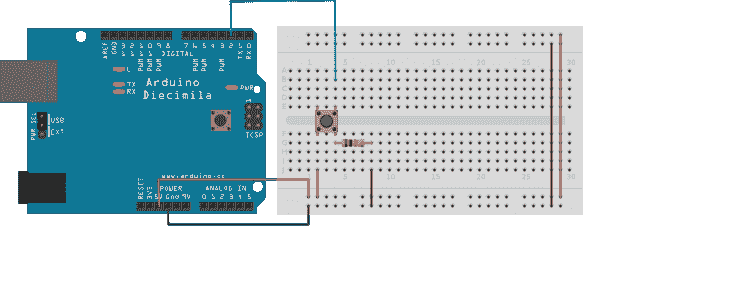
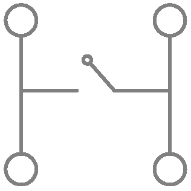
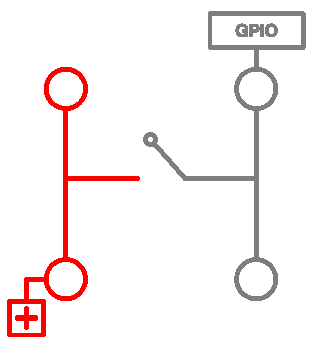
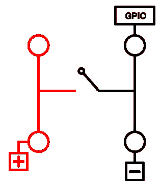
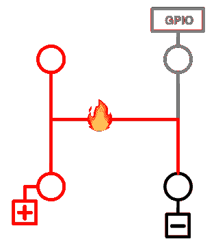
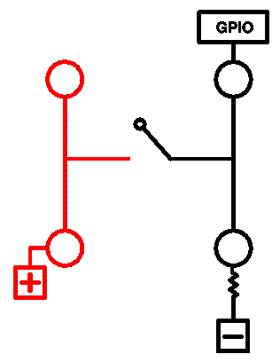
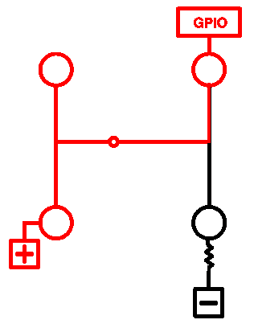
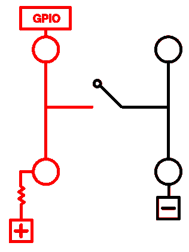
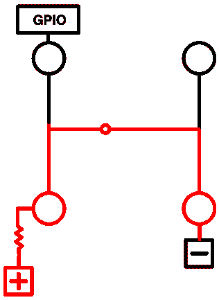

# 硬件基础:下拉和上拉电阻的工作原理

> 原文：<https://www.freecodecamp.org/news/a-simple-explanation-of-pull-down-and-pull-up-resistors-660b308f116a/>

作者 Taron Foxworth

# 硬件基础:下拉和上拉电阻的工作原理

An axial-lead resistor

如果你曾经将一个按钮连接到 Arduino，你会看到这个图表:

起初，这可能会令人困惑。我的第一个想法是:“为什么我需要一个电阻？我只是想让它告诉我按钮是否被按下了。”

看了很多之后，没有一个简单的解释。

### 这是怎么回事

Diagram 1

在那个按钮——也就是开关——里，电线的形状是“H”形。但是中间没有接通——或者说电路没有接通——直到我们按下按钮。

实际上，我们希望在没有连接时从 Arduino 读取 a `0`，在按钮被按下时读取 a `1`。

在 Arduino 上，这被称为通用输入输出( [GPIO](https://en.wikipedia.org/wiki/General-purpose_input/output) )。

所以，我们可以这样做:

Diagram 2

我们将正极(5v、3.3V 或 VCC)连接到电路的左侧。

现在，当按下按钮时，GPIO 将读取一个`1`，一切正常。

Diagram 3

不，让我们再看一下图表 2:

Diagram 2

当什么都不连接时，我们想要一个`0`,但是你如何保证这一点？目前没有办法保证 GPIO 是`0`。

空气中的电磁频率也会将你的 GPIO 吸引到`0`或`1`。它甚至可以在两者之间波动！这样，我们不能肯定这是一个`0`(我不擅长双关语)。这也被称为逻辑`0`。

获得逻辑`0`的一种方法是将引脚接地:

耶！所以，现在它是一个保证的逻辑 0。按下按钮时，现在是`1`了。对吗？

嗯，没有。

你刚刚造成了[短路](https://en.wikipedia.org/wiki/Short_circuit)。？

这就是电阻的用武之地。为了避免短路，我们需要在电路中增加电阻。电阻器使事情处于控制之下。

电将走阻力最小的路径。当按钮被按下时，您的 GPIO 现在会记录一个`1`。像这样:

吼吼！现在我们在研究一些东西。

现在我们来看看相反的情况:上拉电阻。这是同样的事情，但方向相反。当按钮未按下时，GPIO 将记录一个`1`。当您按下按钮时，GPIO 将为`0`。

虽然没有按下，我们有 GPIO 连接到正极(VCC)。因此，那里的任何电流都将被上拉，以便 GPIO 记录一个逻辑`1`。

这里需要注意的是，电总是要接地的。所以，当我们按下按钮，电流就会流向地面。因此，任何流向 GPIO 的电流都会随之流走，使 GPIO 处于逻辑`0`。

？结束了。

#### 我为什么要写这个？

我是 2016 年 9 月加入 [Losant](https://losant.com) 的，没有硬件经验。每一个硬件初学者工具包都给你一个按钮，没有这个概念的解释。希望这也能让你的灯泡熄灭。？

这仅仅触及了表面。如果您想深入了解，请查看以下资源:

[**上拉电阻——learn.sparkfun.com**](https://learn.sparkfun.com/tutorials/pull-up-resistors)
[*另外需要指出的是，上拉电阻越大，引脚响应越慢……*learn.sparkfun.com](https://learn.sparkfun.com/tutorials/pull-up-resistors)

我喜欢反馈。所以，请让我知道这是否可以改善。**如果我完全错过了这个球，[让我知道](http://twitter.com/anaptfox)！我很乐意为他人做得更好。**