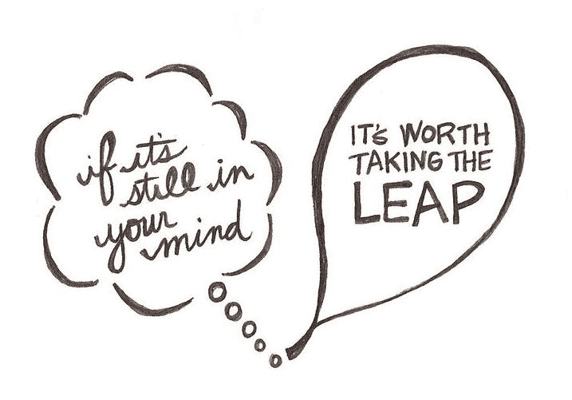

# 谁说工程师不能成为企业家？

> 原文：<https://www.freecodecamp.org/news/who-says-engineers-cant-be-entrepreneurs-8c7f7a6834da/>

作者:Preethi Kasireddy

# 谁说工程师不能成为企业家？

很多人警告我不要离开我在安德森·霍洛维茨公司的好职位去追求软件工程。

…现在，我要离开我梦寐以求的比特币基地工程工作，去联合创办一家初创公司，你可以打赌“很多人”一直在提醒我有多少初创公司失败了。

然而，让我难以忘怀的是我妈妈的反应:

> “你为什么要再次离开世界上最好的工作呢？”

这是一个很好的问题——我写这篇文章来回答这个问题。

正如那些一直关注的人所知，过去的一年半对我来说是疯狂的一年，从热情地爱上编程，到离开一份令人惊叹的工作来追求这种热情，到忍受 Hack Reactor 的密集编码程序，到在一家大型加密货币初创公司担任工程师来解决复杂的问题。

长话短说，这是一次令人振奋的旅程，有无数个深夜、清晨和自我怀疑的时刻。

今天，我将从我离开的地方继续[，分享我在比特币基地做工程师时的一些起起落落……并透露一些我现在正在投入的令人兴奋的项目！](https://medium.com/swlh/what-happened-after-i-left-the-best-job-in-the-world-to-become-an-engineer-ee06caca7db2#.kxlberhb2)

### 我作为全职软件工程师的经历

2016 年 4 月，比特币基地在他们的经纪团队中给了我一个软件工程师的职位。这个团队很优秀，这个行业很前沿。不用说，我马上接受了！

开始前的那几天很伤脑筋。(如果你以前曾等待过开始一份新工作，你就会知道恐惧和焦虑会让你对一切都产生怀疑。)从初一开始，我就没有这么紧张过走进一栋楼。？

当我乘电梯登上他们位于旧金山金融区的高耸办公楼时，我的内心独白是这样的:“我以前从未在一家公司做过全职软件工程师。我知道我在做什么吗？如果我被要求在 48 小时内建立一个微服务怎么办？还是在一周内重建整个网站？我肯定完了…

我走出电梯，深吸了一口气——站在那里呆了两分钟，试图鼓起足够的勇气按门铃。

很自然地，我的紧张放错了地方。接待员热情友好。招聘协调员更担心的是我是否喜欢我的工作空间，而不是我会在那里做什么。我刚放下背包，首席执行官布莱恩·阿姆斯特朗就走过来说“欢迎光临！很高兴有你在船上！”

“唷，还没有微服务呢，”我想。到那时，我的紧张变成了兴奋——我等不及要被黑了。也许我还没有准备好在我的第一天建立一个微服务，但是我确定我已经准备好建立*东西*！

接下来的几周是责任和熟悉度的稳步建立——熟悉代码库，合并我最初的几个拉请求，并与工作流、团队和文化融合。潜入一个全新的代码库，在修复错误和实现功能方面获得动力，以及与新朋友建立关系，这些挑战让我保持专注和兴奋。快进几个月后，我已经安定下来了。那时，我已经有了两个主要的项目——一个是测试和实现一个新的费用结构，另一个是构建一个新的 React/Redux 前端来支持以太坊的购买和销售。我准备开始我的第三个也是最大的项目，在 React 中重写现有的 monolith Rails 前端。四个月后，我们发布了大规模重写的 v1。唷！那时已经过去六个月了，在比特币基地工作的许多事情我都很享受:

#### 组

我对这个团队的直觉是对的。我再也找不到比他更聪明的工程师每天一起工作了。

从基础设施、数据科学、欺诈、支付、网络和移动，我有无限的机会向不同工程领域的工程师学习和成长。

除了他们强大的技术能力，我还钦佩他们的全面发展。(更不用说成熟有思想有主见的思想家了。)

#### 所有权

我喜欢比特币基地给工程师们高度的自主权和对他们构建的特性的实现细节的所有权，而不是一个自上而下的严格控制的系统。

作为一名工程师，对项目的投入和独立解决问题帮助我更快地学习和成长。

#### 成长心态

我欣赏的另一件事是公司非常关心持续的反馈和学习。我们做的事情没有一件是完美的——事实上，混乱是常态。

无论如何，团队会确保在每个项目后都进行回顾，讨论哪些进展顺利，哪些进展不顺利。

…让我告诉你，我们没有退缩。我们批评和嘲笑自己，然后仔细思考下次如何避免这些错误。个人和团队的进步是艰难但重要的工作。

#### 哦，这么多额外津贴

我真的没有必要解释这个——谁能抗拒库存充足的厨房、可爱的办公室工作人员、装饰宜人的浴室和餐饮——所有这些都可以 360 度观看美丽的旧金山？

### 不利之处

和所有事情一样，每个人都有缺点。以下是我个人不喜欢插入公司工程结构的几件事:

#### **在铁轨上工作**

虽然我一半的时间花在了新的 JavaScript 和 React 前端，但另一半时间不可避免地涉及到修复 bug 和实现我们的 monolithic Rails 应用程序的功能。出于许多原因，Rails 是一个非凡的框架，但就个人而言，我很难爱上它。这最终成为我工作中最不喜欢的部分。正如普通读者所知，JavaScript 社区和生态系统对我来说是一个*巨大的*激情领域。所以很自然地，我想贡献我的时间和精力来掌握 JavaScript、函数式编程和 web。相反，我在修复无趣的错误，并在*看来*像是错误的框架中实现不性感的特性。

不幸的是，现实是，当我们在大型工程组织中工作时，维护旧的整体软件是我们作为软件工程师必须做的核心部分。这些就是生活的事实！

#### 开放式办公空间

开放式办公室在科技界非常受欢迎——尽管许多研究表明它们会扼杀创造力，使人无法集中注意力。

不断的人流和频繁的干扰让我感觉像是在电视直播中编码。我发现很难有效率，最终我发现自己越来越频繁地在家工作——这是我唯一能集中精力完成深层工作的地方。

#### **我不感兴趣的产品和项目**

好了，抱怨够了，Preethi！是时候坦白为什么我感到不安了——事实是，我的不快乐与比特币基地这个组织没有任何关系。

说到底，是因为*我对比特币基地提供的产品*不感冒。

首先，这不是让我早上起床的原因。当金融产品和服务对我个人来说不是一个热情的领域时，很难深入关心我们正在构建的功能。第二，我意识到，在一家产品管理、项目管理、工程管理、设计和工程都有不同角色的公司，不可避免地意味着我的角色是纯粹的工程——实施和设计解决方案并修复漏洞。

你们当中了解我的人可能会想象，忽视我头脑中的创业部分会让我多么不满足。我想做一切事情，从确定商业目的，到构建产品，到维护和推进代码库。

我需要既是企业家*又是程序员*。

### 怀疑企业工程的轨迹

在这一点上，我知道我的职业轨迹需要改变。也许不会像离开金融业去从事工程那样彻底，但作为一名工程师和企业家，我需要做一些事情。很快。晚上和周末成了我的“企业家-程序员”时间，我精心计划我的时间表，这样我每天就有 1-2 个小时去探索、学习、破解、写作和娱乐。很快，一天 1-2 小时变成了 2-4 小时。在某一点上，像写作和破解应用程序想法这样的副业开始看起来比我的朝九晚五更“真实”。我会因为想要离开一个完美的团队去做另一个疯狂的梦而感到内疚吗？*当然。*

与其一时冲动做出决定，我决定休息一段时间来反思我的感受。很难弄清楚是什么真正让你兴奋。但我需要弄清楚，这样我才能回答这个迫切的问题:我能在这里以最有意义的方式为这个世界做些什么？

我把这段时间当作一次“试驾”,看看每天早上醒来做自己想做的事情是什么感觉。这只是一个阶段，还是我可以把我的想法变成一个全职的现实？

两周变成了一个月。然后三个月。直到此刻，我写下了这篇文章:我坚信我已经准备好离开比特币基地，去追求新的、更个人化的编程挑战和创业努力。

### 这是跳槽的“恰当时机”吗？

作为企业家，我们面临的最大问题之一是知道什么时候是“正确的时间”——追求激情的正确时间，以实现梦想为名逃避理性的正确时间。

但是我开始意识到没有一本规则书能给我们答案。“正确的时间”永远不会到来——你可以用一生的时间来理顺你的制衡，但永远不会觉得“刚刚好”你总是可以做更多的准备，获得更多的经验，并最小化风险。

…但这并不意味着我们*应该*。我们的大脑总是会把对未知的恐惧合理化。

那么现在是我离开比特币基地的时候了吗？我真的不确定。事实上，我的一些密友和导师说，等到我有了“两年的经验”似乎更合适。或者在小公司工作来“试水”是更好的适应方式。

真的是这样吗？或者这只是一个逃避恐惧和不确定性的借口。这是我的结论:

我不相信再过六个月或两年，答案会更清楚。

我知道的是，作为一名软件工程师，我对自己的技能比以往任何时候都更有信心。感谢比特币基地，我为我所学到的一切感到骄傲，并提高了我的技能，例如:

*   版本控制
*   部署(Docker，circleCI)
*   监控(新遗迹)
*   错误报告(Bugsnag)
*   如何将遗留代码重构到新框架中(Rails → React)
*   如何从一个状态管理库重构到另一个状态管理库(jQuery → Redux → Mobx)
*   如何给出深思熟虑的、建设性的代码评审
*   如何在从想法→实体模型→线框图→代码的过程中高效和有效地与设计师合作
*   如何使用单元测试和集成测试来测试代码
*   知道何时在“正确而周到”的解决方案(需要更长的实施时间，但更健壮、更可扩展)和快速“完成工作”但不健壮、不可扩展的解决方案之间做出选择
*   如何处理这样的情况:在大型产品发布过程中，您部署了一个非常糟糕的错误，导致整个应用程序崩溃？
*   如何与工程师团队协作，构建可扩展到数百万用户的生产级应用程序
*   …还有更多

当然，还有很多东西我还没有学会——所有关于编程的诱人的东西我可能永远也不会学。

最终，这没什么，因为在过去的两年中，我学到的最重要的技能是如何学习，这是学习和征服任何我需要的工具、框架或语言的万能钥匙。

当我开始“学习编码”的时候，这就是我想要的，现在我已经唾手可得了。为什么我不会全职使用这些技能来开发自己的产品？答案很简单:*“为什么不。”*

人生苦短，不能不去尝试——现在是时候看看我能通过这些实验创造什么价值了，因为我还年轻，有动力，最糟糕的情况也没那么糟糕。

正如列夫·托尔斯泰所言:

> “一旦我们抛弃了我们的习惯路径，我们认为一切都失去了；但只有在这里，新的美好才会开始。”

### 那么下一步是什么？

#### **黑客攻击**

在软件世界中，我一直在探索和钻研的东西太多了——我对一些我想解决的问题特别感兴趣。带着企业家的帽子，我有机会更深入地研究这些问题，这让我无比兴奋。

#### 教学和写作

除了继续写作，我还会继续花一部分时间写作、教学、演讲和宣传 JavaScript、web 和函数式编程。

如果提升你的函数式 JavaScript 知识是你要做的事情，你可以注册我的免费电子邮件课程[函数式编程基础](https://preethikasireddy.typeform.com/to/yC9qQr)。今年晚些时候，我还将创建一个名为“[掌握函数式 JavaScript](https://preethikasireddy.typeform.com/to/scykJM) ”的长篇视频课程。

### 有什么风险？

任何实验都伴随着失败的风险——尤其是创业公司，因为毕竟十有八九的创业公司都会失败。

也就是说，我相信花时间建立一个创业想法的个人和职业“风险”比我们被引导去相信的要低得多。

特别是作为一名没有重大家庭责任的工程师，对我来说最糟糕的情况是，我崩溃了，几个月后就接受了一份新的工程工作。起薪比大多数其他行业都高，而且工程职位总是比合格的候选人多。

所以，是的，我的创业想法可能会彻底失败。或者我可能最终对我的激情失去兴趣。或者明天我可能会被公共汽车撞。不胜枚举。

我能控制这些事件的发生吗？如果我尽了最大努力，有谁是我的错吗？大概不会。

如果说我从人生的重大转变中学到了什么的话——从跨越大洲、国家和城市，到 18 岁获得经济独立，到努力进入硅谷，再到实现成为程序员的梦想——那就是不确定性激励我走向成功。在某种程度上，这几乎是舒适的。

在我看来，唯一真正的失败是一开始就没有开始。

### 展望未来

我花了两年时间建立了一个强大的工程师基础，更重要的是，我找到了自己——我的激情、兴趣、优势和劣势。我成长的下一个阶段就是利用这段经历，并从中为这个世界创造一些有意义的东西。

我喜欢西德尼·a·弗里德曼的这句话:

> 如果你有勇气去梦想，有智慧去制定一个现实的计划，并且有决心将这个计划进行到底，你就可以实现生活中任何你想要的东西

我梦想过它，勾画出一个现实的计划，现在是我把它看到底的时候了。

现在轮到你了:*说说你的旅程*。

你曾经对你的日常生活感到不开心吗？是什么阻碍了你追逐梦想——或者你采取了什么措施来克服它们？

你的故事和我的一样重要。我等不及要听了！

想了解我的旅程和工作的最新情况吗？只需在[媒体](https://medium.com/@preethikasireddy)、推特( [@iam_preethi](https://twitter.com/iam_preethi) )或[我的网站](http://preethikasireddy.me)上点击“关注”即可。