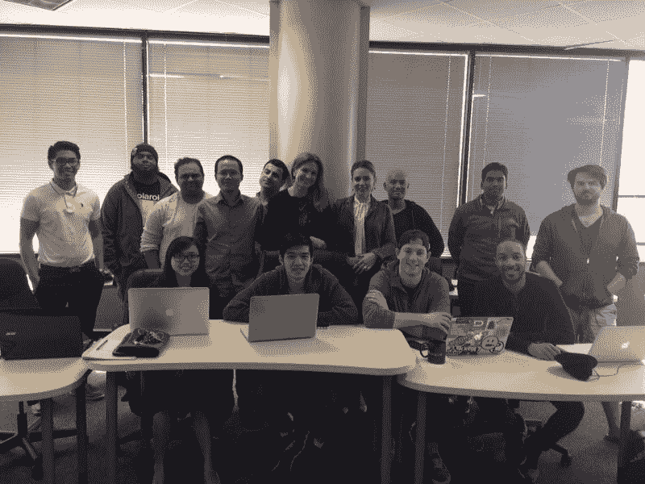

# 一名设计师只用 CSS 绘制了 8 个标志性的 x 战警

> 原文：<https://www.freecodecamp.org/news/a-designer-drew-8-iconic-x-men-using-nothing-but-css-d3d289eec21e/>

这里有三个值得你花时间的链接:

1.  一名设计师只用 CSS 绘制了 8 个标志性的 x 战警( [1 分钟互动](http://bit.ly/2npANQr)
2.  树莓派刚满 5 岁。这是世界上最小的业余爱好者电脑的简史。( [5 分钟读数](http://bit.ly/2nkmYpE))
3.  一个聊天机器人推翻了 16 万英镑的停车罚款，现在正在帮助难民申请庇护

### 想到这一天:

> “历史显示了信息技术的典型发展，从某人的爱好到某人的产业；从临时拼凑的装置到巧妙制作的奇迹；从自由进入的渠道到由单一公司或卡特尔严格控制的渠道——从开放系统到封闭系统。”—蒂姆·吴

### 今日趣事:

### 今日学习小组:

[达拉斯自由代码营](http://bit.ly/2nBE1ja)

编码快乐！

–昆西·拉森，自由代码营的老师