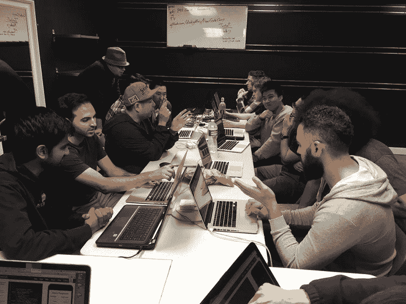

# 谷歌联合创始人谢尔盖·布林谈论人工智能和自动化

> 原文：<https://www.freecodecamp.org/news/google-cofounder-sergey-brin-talks-about-ai-and-automation-afd4075fada/>

这里有三个值得你花时间的链接:

1.  谷歌联合创始人谢尔盖·布林谈论人工智能、自动化和教育的未来
2.  随机数简史( [8 分钟读取](http://bit.ly/2mjxZCw))
3.  Willis 牧师就自由代码营和教育的未来采访了我

### 想到这一天:

> “每个人都应该有受教育的机会。初等教育，中等教育，大学教育，还有研究生教育。这些东西在今天非常昂贵，但那是基础设施的产物。我们认为我们需要大的建筑和漂亮的教室之类的东西。我不认为那些是必要的。对某些人来说有这些是很好的。但是教育应该普及。”——谢尔盖·布林

### 今日趣事:

[XKCD 的网络漫画](http://bit.ly/2n1jxDG)

### 今日学习小组:

[橘郡自由营](http://bit.ly/2ng6cYQ)

编码快乐！

–昆西·拉森，自由代码营的老师