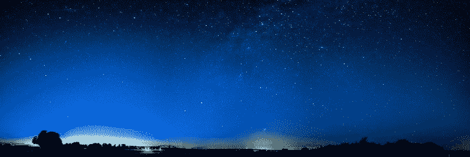
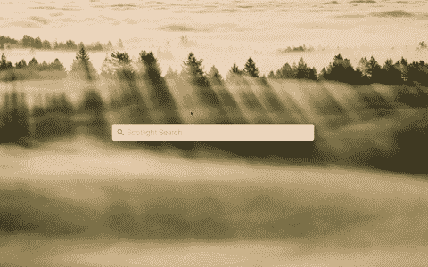
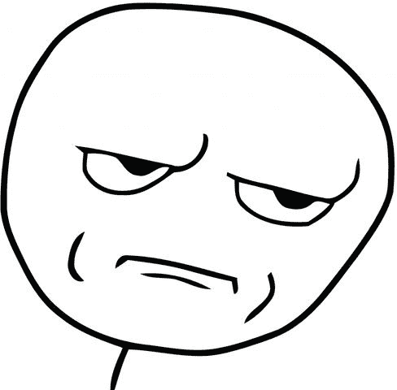
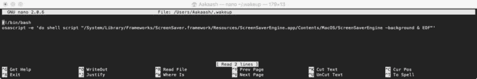
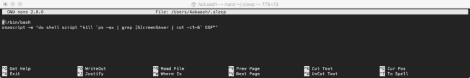
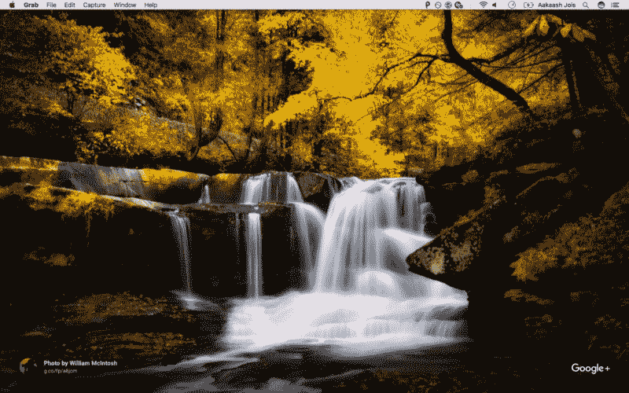

# 如何黑掉你的苹果电脑，给它配得上漂亮的壁纸

> 原文：<https://www.freecodecamp.org/news/this-is-the-wallpaper-your-mac-truly-deserves-with-a-bit-of-coding-f3149bbeb51/>

让 kaaakas 喝酒

# 如何黑掉你的苹果电脑，给它配得上漂亮的壁纸



让我们面对现实吧。Mac 上的默认壁纸几周后就变得无趣了。手动设置新壁纸很烦人。嗯，如果我告诉你，每次我翻开我的 Mac 电脑，它都会用一个全新的高分辨率壁纸来迎接我，会怎么样？

如果你是 Chromecast 用户，你可能会对 [Chromecast 背景](https://www.google.com/chromecast/backdrop/)很熟悉。background 允许 Chromecast 在空闲时显示美丽照片的幻灯片。

虽然大多数用户默认使用脸书来发布照片，但是很多摄影师使用 Google+来发布他们的作品。谷歌选择了一些最好的照片来制作精彩的幻灯片。

很长一段时间，这是 ChromeCast 用户的专属。但是几个月前，谷歌为 Mac 发布了一款叫做[谷歌特色照片](https://plus.google.com/featuredphotos)的漂亮应用。

你可能想知道为什么我的标题是“壁纸”，但却链接到一个“屏保”应用程序。嗯，有个小技巧。在 Mac 上，任何屏幕保护程序都可以作为壁纸运行，只需一行代码。

首先，你要下载并安装[谷歌特色照片屏保](https://plus.google.com/featuredphotos)。接下来，进入*系统偏好* → *桌面&屏保*，将*谷歌特色照片*设置为活动屏保。现在是运行神奇代码的时候了。



Set Google Featured Photos as Screen Saver

#### 编码时间！

启动终端并粘贴下面一行代码。它会将你的屏幕保护设置为你的壁纸。

```
/System/Library/Frameworks/ScreenSaver.framework/Resources/ScreenSaverEngine.app/Contents/MacOS/ScreenSaverEngine -background &
```

#### 编辑:苹果决定在 High Sierra 进行一点重组。



如果您使用的是 High Sierra(或更高版本)，`ScreenSaverEngine.app`已被移动到不同的位置。用下面的代码代替上面的代码。

```
/System/Library/CoreServices/ScreenSaverEngine.app/Contents/MacOS/ScreenSaverEngine -background &
```

只要将所有出现的`Frameworks/ScreenSaver.framework/Resources` 替换为`CoreServices`就可以了！

很酷，对吧？

运行这一行代码的问题是，如果你关闭终端窗口，或者如果你的 Mac 进入睡眠状态，屏幕保护程序关闭，你的壁纸回到默认状态。为了解决这个问题，我们需要更深入一点。

为了检测 Mac 何时睡眠和醒来，我们需要一个名为“睡眠观察者”的小软件。你可以在这里下载[。只要打开文件，你的 Mac 就会提取下载的文件(有时可能要提取两次)。解压后，你会得到一个“sleepwatcher_2.2”文件夹。只需将该文件夹移动到桌面，并在终端中运行下面几行代码。](http://www.bernhard-baehr.de/sleepwatcher_2.2.tgz)

```
sudo mkdir -p /usr/local/sbin /usr/local/share/man/man8
```

粘贴此行后，您可能需要输入密码。接下来，运行:

```
sudo cp ~/Desktop/sleepwatcher_2.2/sleepwatcher /usr/local/sbin
```

然后运行:

```
sudo cp ~/Desktop/sleepwatcher_2.2/sleepwatcher.8 /usr/local/share/man/man8
```

厉害！您已经成功安装了睡眠监视器。

现在，让我们添加一些代码，让 Sleepwatcher 在您的 Mac 唤醒时运行屏幕保护程序，并在您的 Mac 进入睡眠状态时终止屏幕保护程序。

Sleepwatcher 搜索并运行两个文件，Mac 睡眠时的`.sleep`，Mac 醒来时的`.wakeup`。我们只需要在用户的主目录中创建这两个文件。

在终端中，键入`nano ~/.wakeup`，然后粘贴下面的代码。

```
#!/bin/bashosascript -e 'do shell script "/System/Library/Frameworks/ScreenSaver.framework/Resources/ScreenSaverEngine.app/Contents/MacOS/ScreenSaverEngine -background & EOF"'
```

现在按下**控制键+ X** 退出。当它询问您是否要保存文件时，按下 **Y** 然后按回车键确认文件名。这将创建`.wakeup`文件。现在创建`.sleep`文件。



The .wakeup file

就像上面一样，键入`nano ~/.sleep`并粘贴下面的代码。

```
#!/bin/bash
```

```
osascript -e 'do shell script "kill `ps -ax | grep [S]creenSaver | cut -c1-6` EOF"'
```

再次按 **Control + X** 退出， **Y** 保存，然后回车键确认文件名。现在将创建`.sleep`文件。



The .sleep file

在终端中，运行下面一行代码。

```
chmod 700 ~/.sleep ~/.wakeup
```

它更改新创建文件的权限，以便它可以由 Sleepwatcher 运行。

现在您已经创建了脚本，您只需要将 Sleepwatcher 添加到`launchd`中，这样它就可以在系统启动时启动，然后继续在后台运行。将以下代码粘贴到您的终端中。

```
cp ~/Desktop/sleepwatcher_2.2/config/de.bernhard-baehr.sleepwatcher-20compatibility-localuser.plist ~/Library/LaunchAgents
```

这将复制 Sleepwatcher 属性列表文件，以便将其添加到`launchd`。现在只需将下面的代码粘贴到终端，将 Sleepwatcher 添加到`launchd`。

```
launchctl load ~/Library/LaunchAgents/de.bernhard-baehr.sleepwatcher-20compatibility-localuser.plist
```

厉害！你现在可以重启你的 Mac 了，`launchd`会在启动时运行睡眠监视器脚本。只需让您的 Mac 进入睡眠状态并唤醒它。然后你会收到一张漂亮的壁纸。



Example of the newly installed Wallpaper

如果你想卸载一切，回到默认状态，请点击下面的链接。

[**要卸载，在终端中逐个运行下面几行。**](https://medium.com/@aakaashjois/to-uninstall-run-the-following-lines-in-terminal-one-by-one-299916c8ff3b)
[*运行完这些，就可以卸载谷歌屏保，重启 Mac 了。应该去掉。让我知道……*medium.com](https://medium.com/@aakaashjois/to-uninstall-run-the-following-lines-in-terminal-one-by-one-299916c8ff3b)

我希望你喜欢这个简短的教程，并喜欢这些美丽的壁纸照片。如果你喜欢这个，点击❤️，继续关注更多。