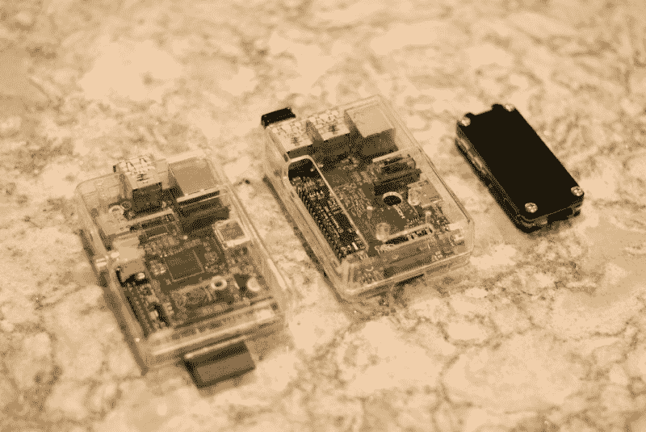
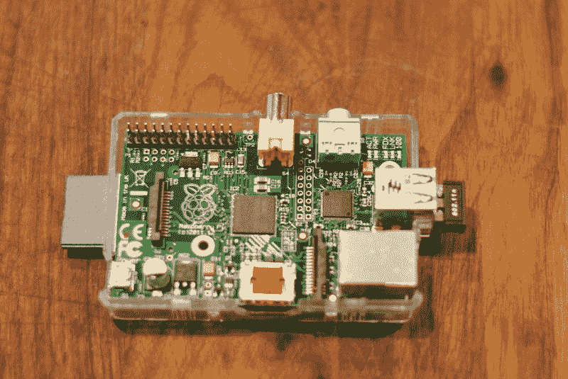
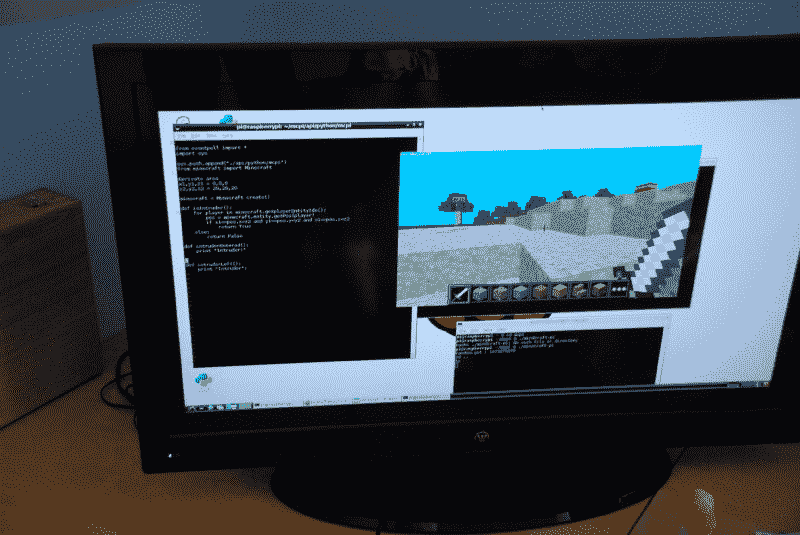
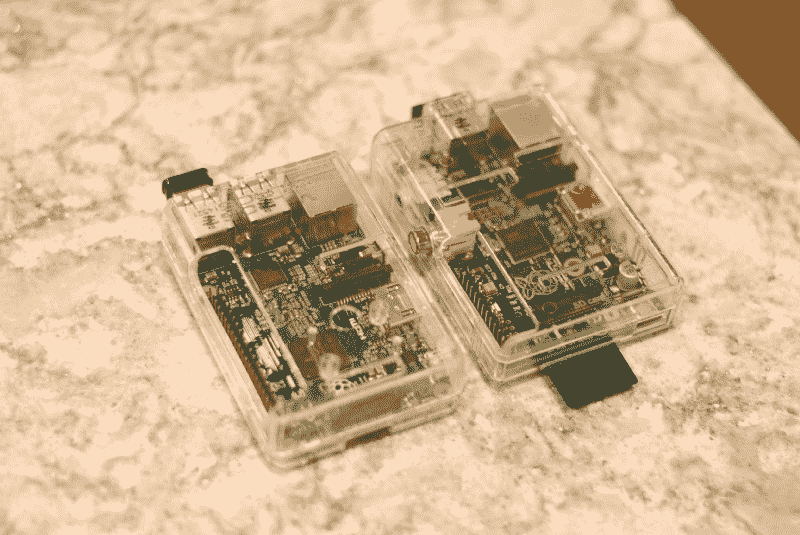
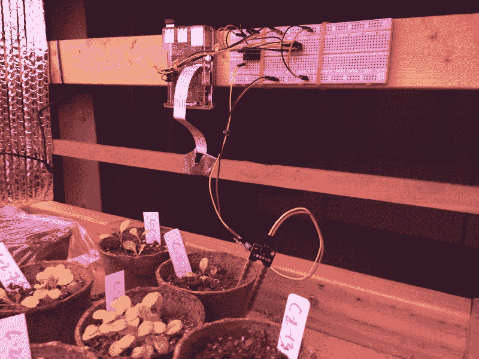
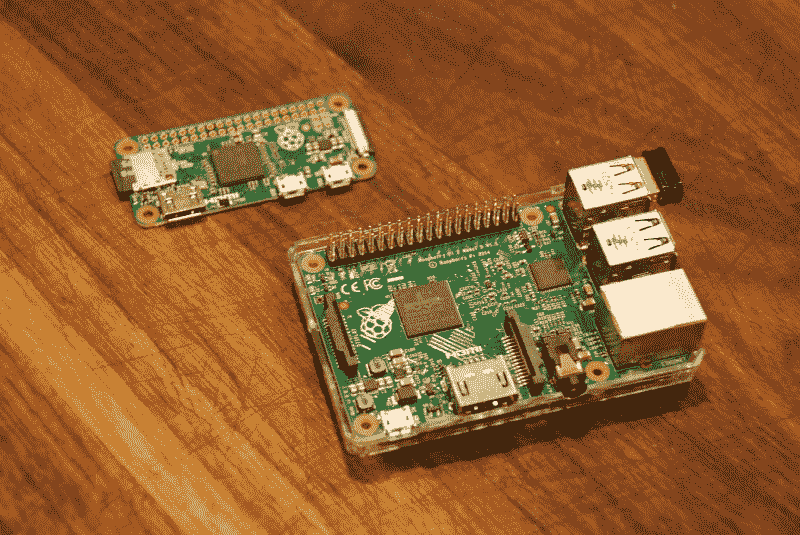
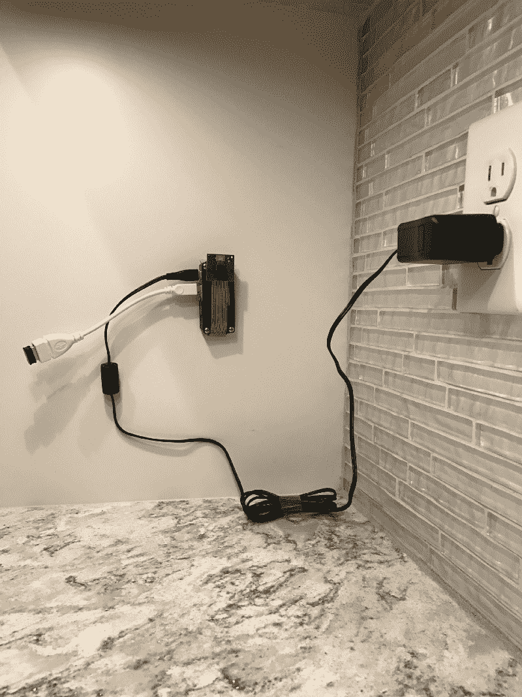

# 树莓派刚满 5 岁。这是世界上最小的业余爱好者电脑的简史。

> 原文：<https://www.freecodecamp.org/news/raspberry-pi-just-turned-5-d4210cc29230/>

特伦·彼得森

# 树莓派刚满 5 岁。这是世界上最小的业余爱好者电脑的简史。

Three generations of devices — Gen 1, Gen 2, and Zero

树莓派刚满五岁。在这么短的时间内，这些设备已经售出 1200 万台，在世界各地促成了无数的创客项目。

让我们回顾一下这些设备的演变，并探索它们如何用于项目。

### 开始的时候…

第一代 Raspberry Pi 设备于 2012 年问世。你可以在一张 3 英寸 x 2 英寸的卡上安装一个(不包括附件的突出部分)。他们使用标准 SD 卡作为本地驱动器，并配备了两个 USB 端口。

Hardware for first generation Raspberry Pi

价格点非常低(最初的目标是 35 美元和 25 美元的 Pi)。像我这样的爱好者很快就抢购了它们，并开始了物联网项目。

像我这样的用户很快意识到，在将设备接入无线网络之前，或者甚至在将它连接到键盘和鼠标之前，你需要一些硬件扩展。你还想把它装在一个耐用的盒子里，以防止主板磨损。

我们在 2013 年圣诞节买了第一台。我女儿和我用它来做她的科学项目，其中包括创建一个 LED 警报器，当入侵者冒险靠近她的《我的世界》城堡时，它可以探测到。该设备支持 Python 脚本，以及使用《我的世界》SDK 进行远程 HTTP/S 调用的所有相关扩展。

### 第二代

Raspberry Pi 对他们的第二代产品进行了重大改进，并于 2015 年初发布。这包括 USB 端口数量翻倍。这消除了对 USB 集线器的需要。相反，您可以同时将无线适配器、键盘和鼠标直接插入设备。

为了给 GPIO 引脚的扩展让路，他们移除了很少使用的 RCA 和 3.5 毫米端口，并为本地驱动器添加了一个更小的 microSD 卡。他们将板载 CPU 从单核升级到四核，扩展了设备的处理能力。

虽然该设备的视觉变化很小，但这些重大升级都是基于社区的使用和反馈。

Side-by-side Gen 2 and Gen 1 Devices

在试验这款下一代设备时，我发现 GPIO 引脚非常适合运行传感器。尺寸和功率也非常适合室内园艺项目。

我可以使用安装在我的实验中的单个单元来记录湿度、温度和土壤水分含量。我还可以通过添加一个摄像头来捕捉延时照片，然后将所有数据上传到云端进行处理，并发布到网站上。

我也可以使用 GPIO 引脚来控制继电器，指示电机关闭和打开。这在构建类似下面视频中的[语音启动投球机](https://www.hackster.io/terren/roxie-the-voice-activated-pitching-machine-94e4f2)时非常有用。

### 缩小到零

树莓派在 2015 年末发布了第二个系列:树莓派 Zero。目标价也下降了，5 美元是新的标准(尽管很难找到一家零售商有库存。)

虽然 Zero 没有相同数量的端口——只有一个微型 USB——但它在尺寸和功耗方面确实有巨大的优势。它的重量只有 9 克，主板只有它的三分之一大。它继续支持添加摄像头，操作系统与较大型号的相同。

Zero 的功耗不到 1 瓦，这使得它可以从直接 USB 电源或本地电池中获得最少的电力。虽然型号 B 变得更强大，但它也消耗了高达 4 瓦的功率——是最初型号的两倍多。当在没有稳定电源的情况下进行远程数据收集时，这可能是一个限制因素。

Raspberry Pi Zero vs. 2nd Generation Model B

尺寸的减小使得该设备更容易隐藏在物联网项目中，包括我为[监控我的咖啡豆供应](https://medium.freecodecamp.com/how-i-built-a-fully-automated-system-that-restocks-my-kitchens-coffee-from-amazon-87072b65efd0)而构建的这个图像识别系统。

JavaWatch based on a Raspberry Pi Zero

### 下一步是什么？

作为他们五周年纪念的一部分，Raspberry Pi [刚刚宣布了](https://www.raspberrypi.org/blog/#raspberry-pi-zero-w-joins-family)一个新的无线版本 Zero，价格仅为 10 美元！看上面的照片，很容易看出它的好处。鉴于无线连接器需要一个 USB 端口，你需要一个足够大的适配器，以至于它可以让这个小设备看起来很笨拙。

最新版本将 WiFi 连接放在主板上，不需要加密狗和单独的 WiFi 适配器的额外费用。

我猜测，下一个版本将升级到多核 CPU，以处理更大的处理能力。与大型模型的大多数其他功能相当，因此您可能不需要添加许多其他附件。

这些设备的用途是无限的。它们肯定会保持旺盛的需求。

感谢阅读。我希望你能很快体验到树莓派。