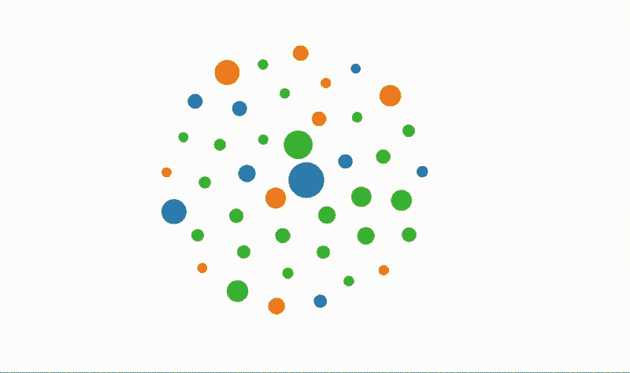
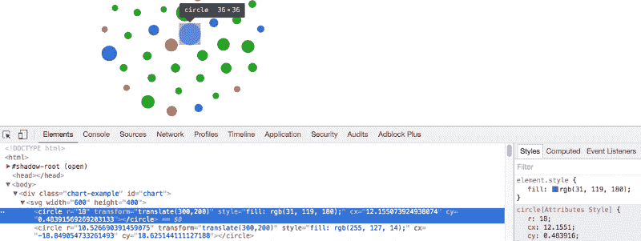
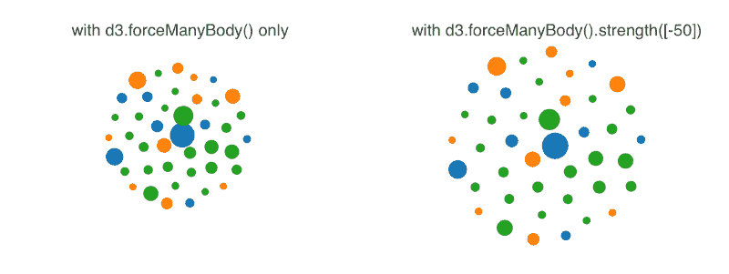

# D3 简介:如何构建一个可重用的气泡图

> 原文：<https://www.freecodecamp.org/news/a-gentle-introduction-to-d3-how-to-build-a-reusable-bubble-chart-9106dc4f6c46/>

作者德博拉·梅斯基塔

# D3 简介:如何构建一个可重用的气泡图

#### D3 入门


当我开始学习 D3 的时候，没有什么对我有意义。当我开始了解可重用图表时，事情变得更加清晰。

在本文中，我将向您展示如何创建一个可重用的气泡图，并一路向您介绍 D3。我们将使用的数据集由 2017 年 1 月发布在 freeCodeCamp 的[个故事组成](https://github.com/dmesquita/reusable_bubble_chart/blob/master/medium_january.csv)。



This is the chart you’re going to build

### 关于 D3

[D3](https://d3js.org/) 是一个用于数据可视化的 JavaScript 库。它使用 HTML、SVG 和 CSS 赋予数据生命。

我们经常需要在另一个项目中重用一个图表，或者与其他人共享该图表。为此，Mike bo stock(D3 的创造者)提出了一个叫做[可重用图表](https://bost.ocks.org/mike/chart/)的模型。我们将使用 Pablo Navarro Castillo 在《掌握 D3 . js[一书中介绍的方法，并做一些小的修改。](http://pnavarrc.github.io/book/)

我们这里用的是 D3 版本 **4.6.0** 。

### ？可重复使用的图表

遵循可重用图表模式的图形有两个特征:

*   **可配置。**我们想要修改图形的外观和行为，而不必修改代码本身。
*   以独立的方式建立的能力。我们希望每个图形元素独立地与数据集的一个数据点相关联。这与 D3 将数据实例与 DOM 元素相关联的方式有关。这一点马上会变得更加清楚。

> "总而言之:用 getter-setter 方法将图表实现为**闭包."——**[迈克·博斯托克](https://bost.ocks.org/mike/chart/)

### 气泡图

您首先需要定义图表的哪些元素可以定制:

*   图表的大小
*   输入数据集

#### 定义图表的大小

让我们首先创建一个函数来封装图形的所有变量并设置默认值。这种结构被称为闭包。

```
// bubble_graph.js
```

```
var bubbleChart = function () {    var width = 600,    height = 400;    function chart(selection){        // you gonna get here    }    return chart;}
```

您希望创建不同大小的图表，而不必更改代码。为此，您将创建如下图表:

```
// bubble_graph.html
```

```
var chart = bubbleChart().width(300).height(200);
```

为此，现在您将为 width 和 height 变量定义访问器。

```
// bubble_graph.js
```

```
var bubbleChart = function () {    var width = 600    height = 400;
```

```
 function chart(selection){        // we gonna get here    }    chart.width = function(value) {        if (!arguments.length) { return width; }        width = value;        return chart;    }
```

```
 chart.height = function(value) {        if (!arguments.length) { return height; }        height = value;        return chart;    }    return chart;}
```

如果您调用`bubbleChart()`(没有宽度或高度属性),那么这个图是用您在闭包内定义的默认宽度和高度值创建的。如果不带参数调用，该方法将返回变量值。

```
// bubble_graph.html
```

```
var chart = bubbleChart();bubbleChart().width(); // returns 600
```

您可能想知道为什么这些方法返回 chart 函数。这是一个用于简化代码的 JavaScript 模式。这叫做方法链接。使用此模式，您可以创建如下新对象:

```
// bubble_graph.html
```

```
var chart = bubbleChart().width(600).height(400);
```

而不是:

```
// bubble_graph.html
```

```
var chart = bubbleChart(); chart.setWidth(600); chart.setHeight(400);
```

#### 将数据加入图表

现在让我们学习如何将数据与图表元素连接起来。图表的结构如下:带有图表的 div 有一个 SVG 元素，每个数据点对应于图表中的一个圆。



```
// bubble_graph.html, after the bubbleChart() function is called
```

```
<svg width="600" height="400">;    <circle></circle> // a story from data    <circle></circle&gt; // another story from data    ...</svg>
```

#### ？d3.data()

`d3.selection.**data**([data[,key]])`函数返回一个新的选择，代表一个成功绑定到数据的元素。为此，首先需要从。csv 文件。您将使用`d3.**csv**(*url*[[, *row*], *callback*])`功能。

```
// bubble_graph.html
```

```
d3.csv('file.csv', function(error, our_data) {    var data = our_data; //here you can do what you want with the data}
```

```
// medium_january.csv|                title                 |   category   | hearts ||--------------------------------------|--------------|--------|| Nobody wants to use software         | Development  |  2700  |  | Lossless Web Navigation with Trails  |    Design    |  688   |   | The Rise of the Data Engineer        | Data Science |  862   |
```

#### ？D3-选择

您将使用 **d3-select()** 和 **data()** 函数将我们的数据传递给图表。

> 选择允许文档对象模型(DOM)的强大数据驱动转换:设置[属性](https://github.com/d3/d3-selection/blob/master/README.md#selection_attr)、[样式](https://github.com/d3/d3-selection/blob/master/README.md#selection_style)、[属性](https://github.com/d3/d3-selection/blob/master/README.md#selection_property)、 [HTML](https://github.com/d3/d3-selection/blob/master/README.md#selection_html) 或[文本](https://github.com/d3/d3-selection/blob/master/README.md#selection_text)内容，等等。— [D3 文档](https://github.com/d3/d3-selection/)

```
// bubble_graph.html
```

```
<div class="chart-example" id="chart"><svg></svg></div>
```

```
d3.csv('medium_january.csv', function(error, our_data) {    if (error) {        console.error('Error getting or parsing the data.');        throw error;    }
```

```
 var chart = bubbleChart().width(600).height(400);    d3.select('#chart').data(our_data).call(chart);
```

```
 });
```

另一个重要的选择器是 **d3.selectAll()** 。假设您有以下结构:

```
<body>    <div></div>    <div></div>    <div></div></body>
```

为我们选择所有的 div。

#### ？？d3 .输入()

现在你将学习一个重要的 D3 函数: **d3.enter()** 。假设您有一个空的 body 标签和一个包含数据的数组。您希望遍历数组的每个元素，并为每个元素创建一个新的 div。您可以使用以下代码来实现这一点:

```
<!-- before --><body> //empty</body>
```

```
----// js script
```

```
var our_data = [1, 2, 3]var div = d3.select("body") .selectAll("div") .data(our_data) .enter() .append("div");---
```

```
<!-- after --><body>    <div></div>    <div></div>    <div></div></body>
```

如果 div 还不存在，你为什么还需要`selectAll("div")`？因为在 D3 中，我们不是告诉**如何**做某事，而是告诉**我们想要什么**。

在这种情况下，您希望将每个 div 与数组的一个元素相关联。这就是你用`selectAll("div")`说的话。

```
var div = d3.select("body") .selectAll("div") // here you are saying 'hey d3, each data element      of the array that comes next will be bound to a div' .data(our_data) .enter().append("div");
```

`enter()`返回包含绑定到数组元素的数据的选择。然后用`.append("div")`将这个选择添加到 DOM 中

#### ？d3.forceSimulation()

你需要一些东西来模拟圆圈的物理特性。为此，您将使用`d3.forceSimulation([nodes])`。你还需要知道什么样的力会改变节点的位置或速度。

在我们的例子中，我们将使用`d3.forceManyBody()`。

```
// bubble_chart.js
```

```
var simulation = d3.forceSimulation(data) .force("charge", d3.forceManyBody().strength([-50])) .force("x", d3.forceX()) .force("y", d3.forceY()) .on("tick", ticked);
```

正强度值会导致节点相互吸引，而负强度值会导致节点相互排斥。



The strength() effect

但是，我们不希望节点分散到整个 SVG 空间，所以我们使用`d3.forceX(0)`和`d3.forceY(0)`。这将圆“拖动”到 0 位置。继续尝试从代码中删除它，看看会发生什么。

当您刷新页面时，可以看到圆圈在调整，直到它们最终稳定下来。`ticked()`功能更新圆的位置。`d3.forceManyBody()`不断更新每个节点的 x 和 y 位置，`ticked()`函数用这些值(cx 和 cy 属性)更新 DOM。

```
// bubble_graph.js
```

```
function ticked(e) {    node.attr("cx", function(d) { return d.x; })        .attr("cy", function(d) { return d.y; });    // 'node' is each circle of the bubble chart
```

```
 }
```

以下是包含所有内容的代码:

```
var simulation = d3.forceSimulation(data)     .force("charge", d3.forceManyBody().strength([-50]))     .force("x", d3.forceX())     .force("y", d3.forceY())     .on("tick", ticked); 
```

```
function ticked(e) {     node.attr("cx", function(d) { return d.x; })         .attr("cy", function(d) { return d.y; }); }
```

总而言之，这个模拟所做的就是给每个圆一个 x 和 y 位置。

#### ？d3 .秤

最激动人心的部分来了:实际上增加了圆圈。还记得 **enter()** 函数吗？你现在要用它了。在我们的图表中，每个圆圈的半径与每个故事的推荐数量成正比。为此，您将使用一个线性标尺: **d3.scaleLinear()**

要使用秤，您需要定义两件事:

*   **域**:输入数据的最小值和最大值(在我们的例子中是推荐的最小和最大数量)。为了获得最小值和最大值，您将使用 **d3.min()** 和 **d3.max()** 函数。
*   **范围**:刻度的最小和最大输出值。在我们的例子中，我们希望最小半径为 5，最大半径为 18。

```
// bubble_graph.js
```

```
var scaleRadius = d3.scaleLinear()            .domain([d3.min(data, function(d) { return +d.views; }),                     d3.max(data, function(d) { return +d.views; })])            .range([5,18]);
```

然后你最终创造了这些圆圈:

```
// bubble_graph.js
```

```
var node = svg.selectAll("circle")   .data(data)   .enter()   .append("circle")   .attr('r', function(d) { return scaleRadius(d.views)})});
```

为了给圆圈着色，您将使用分类标度: **d3.scaleOrdinal()** 。该刻度返回离散值。

我们的数据集有 3 个类别:设计、开发和数据科学。您将把每个类别映射到一种颜色。`d3.schemeCategory10`给了我们 10 种颜色的列表，对我们来说足够了。

```
// bubble_graph.js
```

```
var colorCircles = d3.scaleOrdinal(d3.schemeCategory10);var node = svg.selectAll("circle")    .data(data)    .enter()    .append("circle")    .attr('r', function(d) { return scaleRadius(d.views)})    .style("fill", function(d) { return colorCircles(d.category)});
```

您希望在 SVG 的中间画圆，所以您将把每个圆移到中间(一半宽，一半高)。继续从代码中删除它，看看会发生什么。

```
// bubble_graph.js
```

```
var node = svg.selectAll("circle") .data(data) .enter() .append("circle") .attr('r', function(d) { return scaleRadius(d.views)}) .style("fill", function(d) {return colorCircles(d.category)}) .attr('transform', 'translate(' + [width / 2, height / 2] + ')');
```

现在，您将向图表添加工具提示。每当我们将鼠标放在圆圈上时，它们就需要出现。

```
var tooltip = selection .append("div") .style("position", "absolute") .style("visibility", "hidden") .style("color", "white") .style("padding", "8px") .style("background-color", "#626D71") .style("border-radius", "6px") .style("text-align", "center") .style("font-family", "monospace") .style("width", "400px") .text("");
```

```
var node = svg.selectAll("circle") .data(data) .enter() .append("circle") .attr('r', function(d) { return scaleRadius(d.views)}) .style("fill", function(d) {return colorCircles(d.category)}) .attr('transform', 'translate(' + [width / 2, height / 2] + ')') .on("mouseover", function(d){     tooltip.html(d.category +"<br>"+ d.title+"<br>"+d.views);      return tooltip.style("visibility", "visible");}) .on("mousemove", function(){   return tooltip.style("top", (d3.event.pageY-       10)+"px").style("left",(d3.event.pageX+10)+"px");}) .on("mouseout", function(){return tooltip.style("visibility", "hidden");});
```

当鼠标移动时,`mousemove`跟随光标。`d3.event.pageX`和`d3.event.pageY`返回鼠标坐标。

就是这样！你可以在这里看到最终代码[。](https://github.com/dmesquita/reusable_bubble_chart)

这里可以玩泡泡图[。](https://bl.ocks.org/dmesquita/37d8efdb3d854db8469af4679b8f984a)

你觉得这篇文章有帮助吗？我尽力每个月写一篇深度文章，当我发表一篇新的文章时，你可以收到一封电子邮件。

有什么问题或建议吗？把它们留在评论里吧。感谢阅读！？

*特别感谢[约翰·卡迈克尔](https://www.freecodecamp.org/news/a-gentle-introduction-to-d3-how-to-build-a-reusable-bubble-chart-9106dc4f6c46/undefined)和[亚历山大·西斯内罗斯](https://www.freecodecamp.org/news/a-gentle-introduction-to-d3-how-to-build-a-reusable-bubble-chart-9106dc4f6c46/undefined)。*