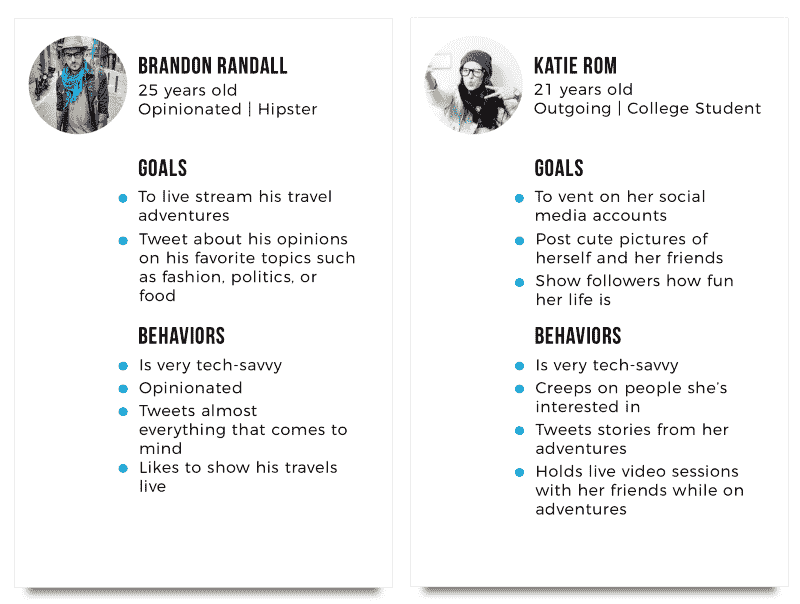
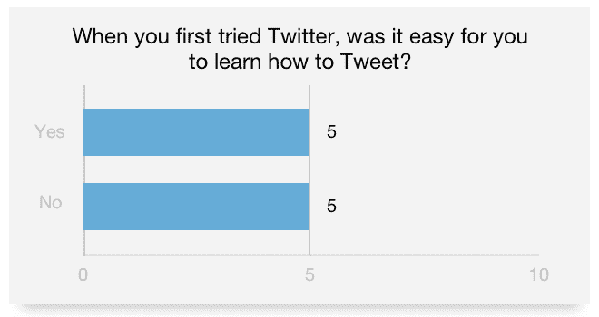
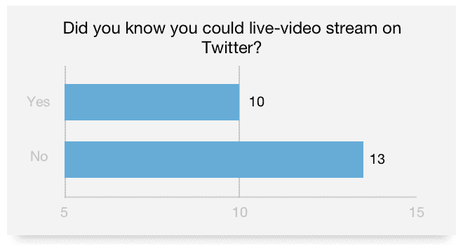
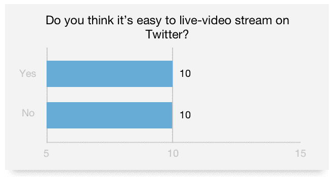
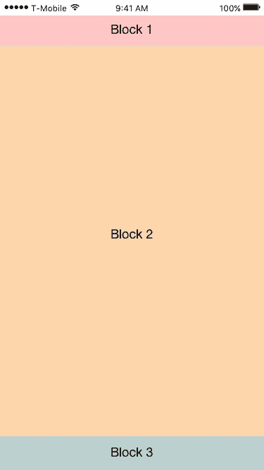
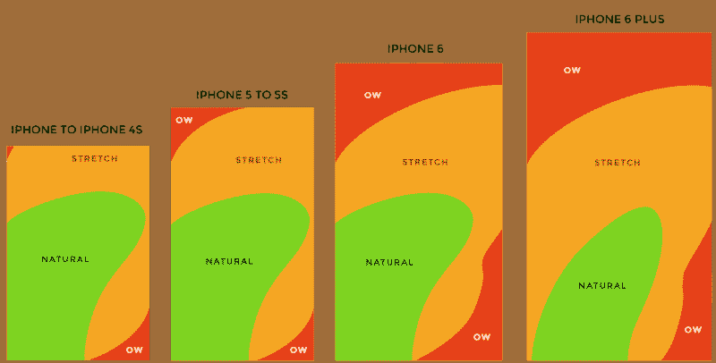
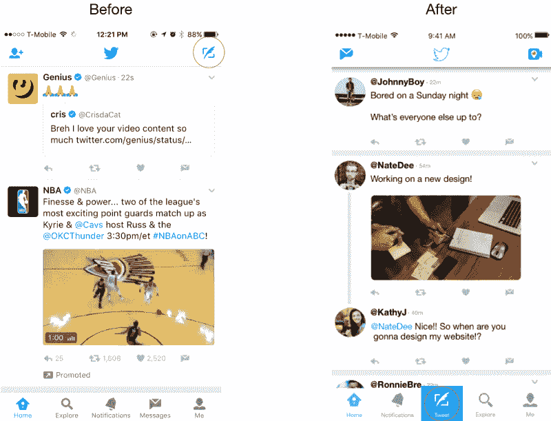
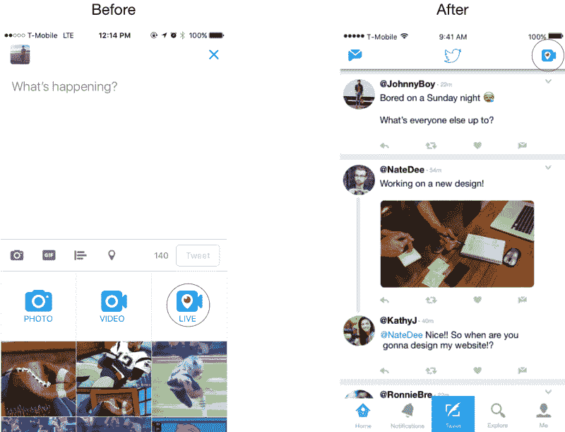
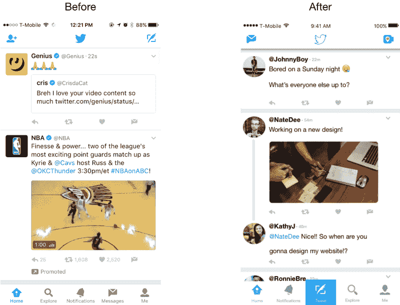

# 那么我们如何修复 Twitter 呢？用户界面改造将是一个良好的开端。

> 原文：<https://www.freecodecamp.org/news/this-ui-revamp-could-make-twitter-successful-again-d4c551b353b3/>

作者:达里尔·桑托斯

# 那么我们如何修复 Twitter 呢？用户界面改造将是一个良好的开端。

众所周知，Twitter 一直在努力扩大用户群。为了解决这个问题，他们制定了一个长期战略，通过[专注于五个领域](http://www.reuters.com/article/us-twitter-results-idUSKCN1062JW)来扭转其业务:

1.  它的核心服务
2.  直播视频
3.  网站的“创建者和影响者”
4.  安全
5.  开发商

这句话中让我印象深刻的两点是:1)专注于其核心服务(tweeting)和 2)直播视频(Periscope)。

这些让我印象深刻，因为就在最近，我说服了一个朋友加入 Twitter。当他登陆 feed 时，他的第一个问题是“我如何发微博？”和“我如何去生活？”

鉴于这些是 Twitter 的关键特性，我认为这些应该是最直观的事情，即使对新用户来说也是如此。

### 目标

1.  **让推文变得直观:**推文是推文的驱动力；推动他们产品的主要因素。所以，当一个新用户完成注册过程时，用户应该马上知道如何发微博。
2.  **让直播更直观:** [Twitter 斥资 8660 万美元购买了 Periscope](http://www.recode.net/2015/5/11/11562534/twitter-paid-over-86-million-for-periscope-and-niche) ，为用户提供通过手机应用进行视频直播的能力。这也是一个[巨大的市场](https://medium.com/looklivecam/on-demand-livestreaming-960a492d69d1#.z9u58217s)，脸书如此积极地进攻也就不足为奇了。考虑到这一点，为什么这个功能不能更容易使用呢？例如，我记得有一次，我的朋友在一场音乐会上试图现场直播一位走上台的艺术家。他错过了这个时刻，因为他不能足够快地去现场直播。
3.  ***Bonus*更新 Twitter feed** :我一直觉得 Home Feed 有点太挤在一起了。一些小的改变会给它带来巨大的好处。这也是一段时间以来，他们已经更新了这一点，所以一个新鲜的面孔会很好！

### user persona(用户人员)

当然，了解你的用户总是很重要的。 [37%的 Twitter 用户年龄在 18-29 岁](http://sproutsocial.com/insights/new-social-media-demographics/#twitter)，这也是他们最大的用户群，这意味着 Twitter 的用户主要是精通技术、沉迷于社交媒体、直播视频的千禧一代。知道了这一点，让他们更容易使用 Twitter 的重要功能(Tweeting 和 Periscope)就势在必行了。

### 用户研究

为了确保我尽可能做出最好的设计选择，并验证我的目标，我进行了一项调查，以查明 Twitter 用户的想法。具体来说，我旨在发现:

1.  新用户使用推特的易用性
2.  Twitter 用户对直播能力的了解程度如何(Periscope)
3.  生活的易用性水平(潜望镜)

#### 1.新用户的易用性

我进行了一项调查，发现只有 5/10 的用户(50%)在第一次使用时觉得发推特很容易。他们的核心服务只对 5/10 的人来说很容易，这似乎有点令人担忧，因为没有它，就没有 Twitter。我绝对认为 UI 的改进会有所帮助。

#### 2./3.对潜望镜和易用性水平的认识

我惊讶地发现，在我询问的 Twitter 用户中，只有 43% (10/23)的人知道他们可以直播视频流！此外，这些不是普通的用户。这些人已经使用 Twitter 多年，年龄在 18-24 岁和 25-34 岁之间。

“Peri — what?”

### 技术分析

首先，理解 Twitter 目前的布局将告诉我们它是如何满足用户需求的。我已经设计好了用户界面，并把它分成了几个模块，因为每个模块都有一个用途，在每个模块中，我们将看到它可以改进的地方。让我们来看看:

*   块 1:这基本上是 Twitter 的面包和黄油，因为这是用户去推文。我相信它可以改进，因为 Tweet 按钮超出了拇指的自然半径范围(见下面的更改 1)。
*   块 2:这是 Twitter feed 所在的地方。没什么不好，但我相信稍加改进就能让它变得更好。
*   块 3:这是用户浏览不同 Twitter 视图的地方。这没什么不好，但是因为用户一直在关注这里，一个关键的附加功能可能会帮助他们达到他们的长期目标。

### 结果

#### 变化#1:改善核心服务:重新定位和改变推文按钮

The Thumb Zone

通过将 Tweet 按钮移动到底部中间，添加一个标签，增加其大小，并赋予其颜色，用户只需看一眼就能知道这个按钮是什么。此外，通过给它一个背景颜色，它就像一个行动号召，本质上是告诉用户“嘿！压我！”

最重要的是，它位于用户更容易按压的位置，因为它位于拇指舒适的位置(见上图)。

Now, Tweeting is “Natural” instead of “Ow”.

#### 变化#2:通过将 Periscope Live 移动到 Home feed 来改进直播视频流

在 Twitter 专注于直播(Periscope)的同时，这一改变的想法是在我看到我的朋友错过了他想现场录制的音乐会的那一刻，因为他花了太多时间来点击 Periscope。当他开始直播时，他想要捕捉的介绍已经错过了。是的，他可以早点激活它。但有时候生活的瞬间需要快速捕捉。

当前上线的三步流程如下:

1.  点击推特按钮
2.  等待推文视图向上滑动
3.  点击“直播”

为了速度，应该是:

1.  点击“直播”

就是这样。就一步。

为此，我必须从 Tweet 视图中移除 Live 按钮，并将其带到主视图。把它带到那里，只需一步就可以到达。

Live is for catching life’s moments, so it should be in a place you can get to it fast.

#### 变化 3:更新提要

Twitter 的 feed 相当不错，但我相信一些小的改变可以改善它。

*   我改变了 Twitter 图标，使其看起来不那么像它旁边的按钮(消息和直播)，因为它们的权重看起来太相似了。由于重量相差很大，用户不用按就能更容易知道这不是一个按钮。
*   我在每条推文之间增加了空间，这样它们就不那么拥挤了。这有助于人们更容易地识别他们订阅源上的对话，因为链现在与其他推文分开了。
*   我把 AVI 的框架从圆形改成了圆形。

### 结论

Twitter 是我最喜欢的应用之一，我每天都在使用它，所以参与这个项目对我来说很有趣。我也知道这是磨练我设计能力的好方法，因为 Twitter 已经是一个很棒的移动应用了。

我造了一个？我[在这里互动原型](https://invis.io/SWA9B1RX2)？使用草图和视觉。

如果你已经读到这里，我很感激你！希望我已经写了一些对你有帮助或有趣的东西。

> “设计不仅仅是它的外观和感觉。设计就是它的工作方式。”—史蒂夫·乔布斯

感谢阅读和快乐设计！