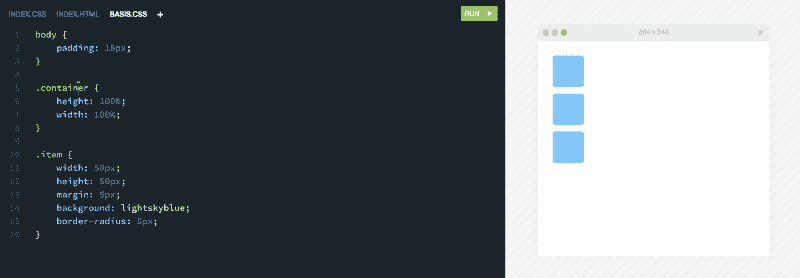
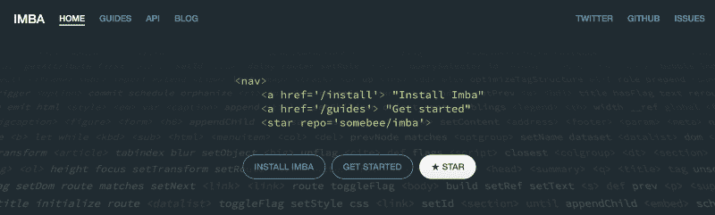

# 我们如何说服创始人天使投资我们的开发者工具创业公司

> 原文：<https://www.freecodecamp.org/news/how-we-convinced-founder-angels-to-invest-in-our-developer-tool-startup-f2e3bc59cbcc/>

> 产品+人脉+博客+运气=天使投资

上周获得了 20 万美元的天使投资。我们的支持者是 [StartupLab FoundersFund](http://startuplab.no/#fuel) (一家挪威早期基金)和一群来自 [Zendesk](http://zendesk.com/) 、 [Unity](https://unity3d.com/) 、 [TAT](https://www.crunchbase.com/organization/tat-the-astonishing-tribe) 、 [SiteCore](http://www.sitecore.net/) 、 [OnlinePizza](https://onlinepizza.se/) 和 [Just Eat](https://www.just-eat.no/) 的成功创始人和 CEO，他们都是通过[北欧创客组织的。](http://www.nordicmakers.vc/)

Our investors have been a part of building companies that have a market cap of $9 billion USD in total.

事实证明，拥有两组经验丰富、人脉广泛的投资者非常有帮助。

我们如何获得 Nordic Makers 的投资是一个有趣的故事，因为它涉及到以下所有因素:

*   做副业
*   打造一款出色的产品
*   在媒体上写博客
*   在 Twitter 上建立联系
*   意外的好运

在这篇文章中，我将解释它是如何发生的。

### 我们的产品:Scrimba

但首先你需要知道我们在建造什么。这款产品名为 [Scrimba](http://scrimba.com?utm_source=freecodecamp.org&utm_medium=referral&utm_campaign=founder_angels) ，是一种新的用于传送代码的视频格式。

可以把它想象成编码截屏，在这里你可以暂停一下，摆弄一下代码。查看[该演示截屏](https://scrimba.com/perborgen/279?utm_source=freecodecamp.org&utm_medium=referral&utm_campaign=founder_angels)以更好地掌握概念。请注意，所有这些仍处于测试阶段。

### 想法的诞生

为了弄清投资是如何发生的，我们必须回到 2016 年 2 月。

那时，我还不是斯克林巴的一员。这是辛德雷·阿萨瑟在业余时间玩的一个主意。他想改进他自己开发的网络编程语言 [Imba](http://startuplab.no/#fuel) 的文档。

他在尝试创建视频教程，并体验了使用这种格式创建高质量教育内容的所有麻烦后，产生了这个想法。因此，在几次令人沮丧的截屏尝试后，他开始破解 Scrimba 的第一个原型。

### 辅助项目和媒体博客

与此同时，我正在和一个朋友一起做一个兼职项目。该产品被称为 BugRex，它是为需要帮助的软件开发人员提供的按需聊天服务。我们在一个周末建立并发布了它，然后写了几篇关于这个实验的文章来增加曝光率——主要是为了好玩和练习发布产品。

如果我没有做这个副业项目——并写下它——Scrimba 不会在一年后获得北欧制造商的投资。

让我来解释一下。

### 在推特上走运

BugRex 之所以如此重要，是因为它让我能够与 Emil wall ner 进行交流。Emil 是一名设计师、开发人员和企业家，他一直在关注 BugRex 的故事。他喜欢我们正在做的事情，并希望建立联系。

我们在 Skype 上安排了一次聊天，相处得很好。虽然我们没有找到直接合作的方式，但我们决定保持联系。

正如你将在下面几段看到的，埃米尔联系到你是一个巨大的幸运。

> 吸取的教训:伸出你的脖子，你就可以和有趣的人交往。这总是一件好事。

### 快速启动

2016 年夏天，Sindre 问我是否想加入围绕 Scrimba 创办公司。他有一个运行的原型， [StartupLab FoundersFund](http://startuplab.no/#fuel) 的 Kjetil Holmefjord 有兴趣投资。长话短说，我同意了，辞去了工作，并在 11 月开始全职研究 Scrimba。

为了获得反馈，我们决定尽快推出测试版。因此，到 12 月初，我们向所有我们认为可能会喜欢的人发出了邀请。

### 至关重要的推特

这包括埃米尔。他试了一下，非常喜欢，于是他把它发到推特上，发给了一群他想让我们联系的相关人士。

这条推文打开了比我们想象的更多的门。

它让我们找到了北欧制造商和其他三家潜在投资者，也让我们找到了第一个付费客户。

### 伟大产品的重要性

让我们在这里停一会儿，看看发生了什么事。事实证明，埃米尔手中的贝塔机会产生巨大的回报。因此，有充分的理由向尽可能多的人展示你的产品，而不是遮遮掩掩。

但是这并不适用于任何产品。

通过给埃米尔留下深刻印象，**他愿意在 Twitter 上积极地让他的同龄人参与进来**。

所以最终归结为产品的质量。如果我们的测试版是一个登陆页面或一个虚拟模型，这个策略就不会奏效。

> **经验教训:**伟大的产品打开了大门。所以如果你有一个，尽可能多的分享。(永远不要试图强迫别人签署保密协议！)

此外，我不想淡化这样一个事实，即埃米尔本人正在学习编码，所以他是我们的目标市场。技术人员或试图教授或学习编码的人比那些没有技术洞察力的人更认同 Scrimba。

这也体现在我们的筹款中。

如果你想要一个开发工具产品的投资者，**寻找有技术背景的人**。

技术投资者几乎总是比非技术投资者对 Scrimba 更感兴趣。

### 埃米尔→乔尔→北欧制造商

总之，我通过 Emil 的推文联系的第一个人是 Joel Larsson，他是 T2 快速通道马尔默 T3 加速器的总经理。尽管我和 Sindre 搬到马尔默并有可能加入他们的加速器是行不通的，但他还是慷慨地提出尽其所能帮助我们。

他做的一件事是向我们介绍了北欧制造商的合伙人、TAT 的创始人汉普斯·雅各布松(以 1.5 亿美元的价格卖给了黑莓)。

我们安排了一次与 Hampus 的 Skype 通话，被他对产品的热情和体贴所打动。很明显，我们希望他作为投资者加入。

我们很快安排了与北欧制造商的其他一些合作伙伴的会议:[本杰明](https://www.freecodecamp.org/news/how-we-convinced-founder-angels-to-invest-in-our-developer-tool-startup-f2e3bc59cbcc/undefined)(负责 NM 的日常运营)[大卫](https://www.freecodecamp.org/news/how-we-convinced-founder-angels-to-invest-in-our-developer-tool-startup-f2e3bc59cbcc/undefined)(Unity)[亚历山大](https://www.freecodecamp.org/news/how-we-convinced-founder-angels-to-invest-in-our-developer-tool-startup-f2e3bc59cbcc/undefined) (Zendesk)和[拉尔斯](https://twitter.com/ln_sitecore) (SiteCore)。每次会面，我们都越来越确定我们希望这些人加入。到一月底，我们达成了协议。

### 获得热情的介绍

你可以声称，我们还不如直接给北欧制造商发电子邮件，但那样做可能不会有那么好的效果。他们在主页上声明最好通过他们认识的人介绍，T2·汉普斯也自己写了这个。

这其实是对很多投资者的考验。你应该能够和他们建立关系网。

这实际上是有道理的:作为一名创始人，你将面临更大的挑战，所以如果你不能与投资者建立关系网，你将如何克服你在启动业务时面临的所有障碍？

这对许多开发人员来说似乎是令人沮丧的，尤其是如果你更喜欢写代码而不是与潜在投资者的社交聚会。但是网络可以通过多种方式实现。不一定要每周都去参加创业活动。一个好的开始是在网上分享你的作品并写下来。通过这样做，你会自然而然地吸引有趣的人。对我们来说，Twitter 和 Medium 足以接触到北欧制造商。

最后，我们在个人层面上与汉普斯相处也很重要。换句话说，记得要友善。你更有可能从与你相处融洽的人那里获得投资。

总而言之，我认为这个故事的教训是:

*   做不保险的事
*   与有趣的人联系
*   做一个好人
*   打造一流的产品
*   尽可能多的传播

这样你就能给自己带来一点运气，这是每个人都不时需要的。

感谢阅读！Scrimba 团队本周在旧金山，如果你想和我们一起喝杯咖啡，请发邮件到 per@scrimba.com 找我！

干杯，

每个