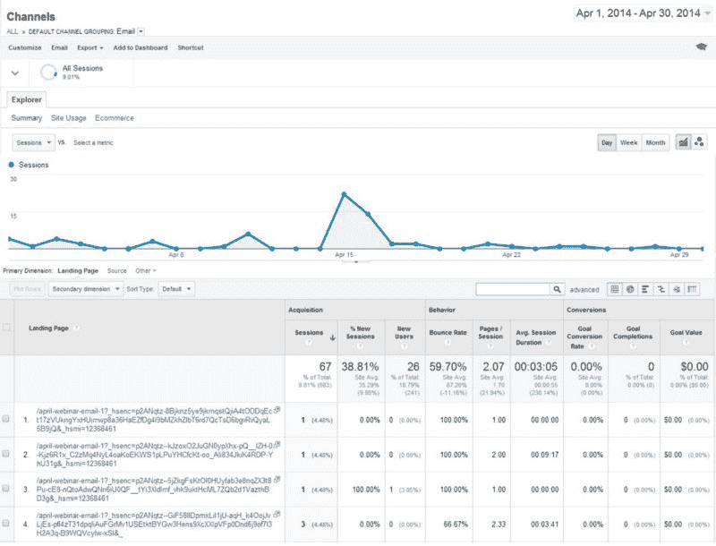
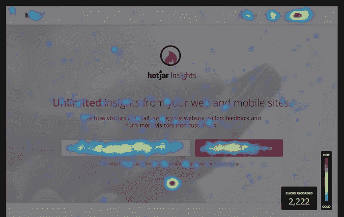
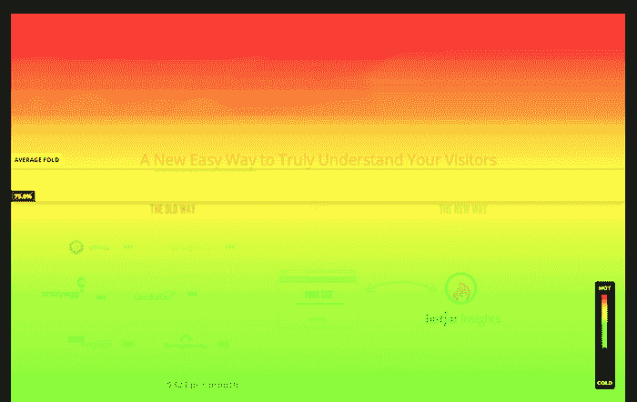
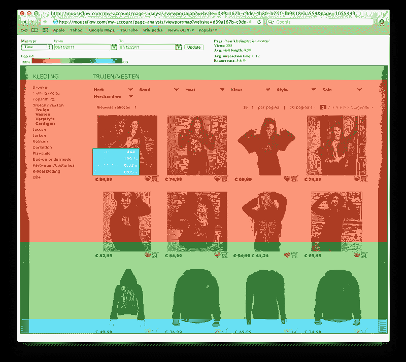
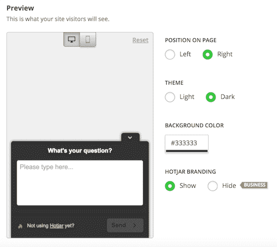
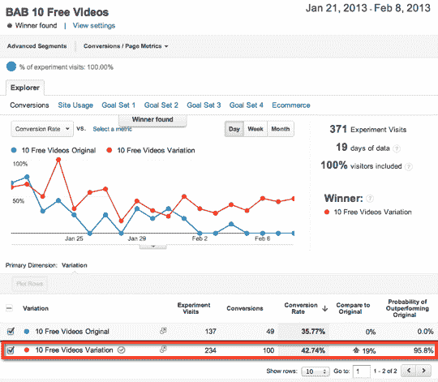
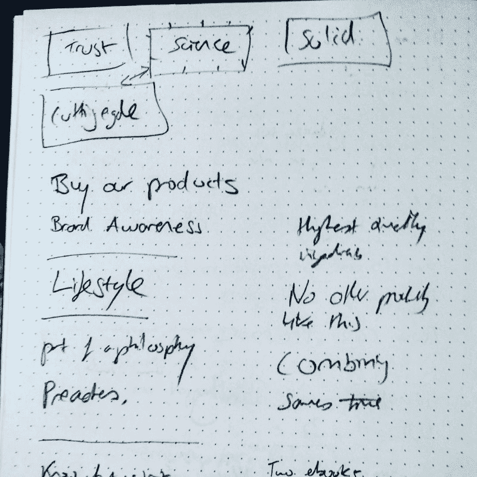
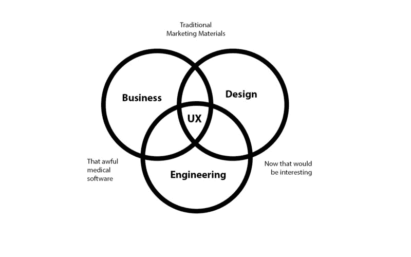

# 你可以做的 12 件免费的事情来开始你的 UX 设计生涯

> 原文：<https://www.freecodecamp.org/news/how-to-become-a-ux-designer-8f5c8567aefd/>

作者:米丽娅姆·艾萨克

好吧，首先。这本指南是给谁的？

*   网页设计师、视觉设计师、平面设计师，以及想打入用户体验设计(UXD)的学生。
*   已经熟悉[设计的六大原则](http://visual.ly/6-principles-design)的人(我不会在这里深入视觉设计)。
*   已经知道 Photoshop 或 Sketch 等设计工具的人。

现在不要担心——这里有一些不切实际的建议，本文不包含:

*   "订阅 x 时事通讯"
*   “这里有一大堆你永远不会读到的链接”
*   或者“找一个导师”——因为让我们面对它，如果你找到了一个罕见的 UX 导师独角兽，你就不会读这篇文章了。

开始了。

### 事情#1:学习编码

去做吧。你会没事的。尽可能多地学习 HTML / CSS 和 JavaScript。

在你激动之前，先听听我没说的。

我并不是说要学习所有不同类型的 JavaScript，也不是说要去建立大量的网站或应用程序。我说的是参加 **one** 网上课程。

**为什么？**这会让你对网页设计的规律有更深的理解。一旦你知道这些规则，你就会知道如何打破它们。另外，你将了解什么是可能的，什么是不可能的。这将使你立即获得开发团队的信任，并为你和你的公司省去一大堆麻烦。

我推荐 freeCodeCamp，当然是免费的！这很容易开始，课程被分解成易于消费的小块。HTML5 和 CSS 课程只需要五个小时就可以完成，并为您提供您需要了解的所有基础知识。继续，[潜入](https://www.freecodecamp.com)。

### 第二件事:打印出整个网站或应用程序

如果你在一家公司工作，打印出他们的整个网站/应用程序。是的，整件事。为此我曾经占了一整个房间。那就看看吧。在这些打印件上寻找不一致的地方。在此基础上，创建一个风格指南。一夜成名的 UXer。

如果你是一名自由职业者，为你的下一个客户免费赠送一本时尚指南。一定要把那块黄金放在你的投资组合里。更多关于风格指南的信息请点击。(不用担心，不一定要做一个互动的。那会很好，但是它可以只是一个 PDF。)

> [在 Instagram 上查看这篇文章](https://www.instagram.com/p/_exuLwIrmK/)

[a # pattern library # UX design # ui design # UX # ui 差点# flatdesign #电子商务# orange # green # call to action # buttons # web design # WIP](https://www.instagram.com/p/_exuLwIrmK/)

由[米里亚姆·艾萨克](https://www.instagram.com/misaac85/) (@misaac85)在太平洋标准时间 2015 年 12 月 19 日上午 8:56 分享的一篇文章

### 第三件事:制作用户流程图

现在你的整个网站都挂在墙上了。是时候批判性的看一下，做一个用户流程图了。

例如，对于一个电子商务网站，你最简单的用户地图应该是主页>类别>产品>购物篮>结账。

你会发现该产品是一个电子商务网站的巅峰页面。提高转化率的大部分机会就在那里。

如果你还不是一家公司的一员，请看下面的第四点。

> [在 Instagram 上查看这篇文章](https://www.instagram.com/p/BIhqxHmjJBA/)

[终于完成了 UX 测验流程图！# super happy # stickafokinmeimdone # UX flow # UX process # UX design # UX design #信息架构#线框# ui design # WIP # illustrator # instaux # insta ui 谢谢@uxkits！](https://www.instagram.com/p/BIhqxHmjJBA/)

由[米里亚姆·艾萨克](https://www.instagram.com/misaac85/) (@misaac85)于 2016 年 7 月 31 日太平洋时间早上 5:36 分享的一篇帖子

### 第四件事。对网站或应用程序进行反向工程

如果你不是公司的一员，学习 UX 的最好方法之一就是做一些好的逆向工程。

现在，不要随便找一个网站，用获奖的应用程序和网站来做这件事。

我最初学习网页设计的方法是下载整个网站来学习它们是如何制作的。你需要做的是拿一堆便利贴，对每次互动都写下来，如下所示。

> [在 Instagram 上查看这篇文章](https://www.instagram.com/p/BICcNcNjA6l/)

[今日逆向工程:)绘制 QuizUp 的 UX 流程图# UX process # UX design # UX # sprint # postit # digital design # app design # gaming # playing games forwork # the dream](https://www.instagram.com/p/BICcNcNjA6l/)

由[米里亚姆·艾萨克](https://www.instagram.com/misaac85/) (@misaac85)在太平洋时间 2016 年 7 月 19 日凌晨 2 点 32 分分享的帖子

### 第五件事:素描，素描，素描

…首先找出你的设计和用户流。这样会消除很多 Photoshop 中的头疼问题。

我的平面设计老师教我总是先画草图。这个建议是针对书的封面和海报的，但是我总是发现先画草图总是最好的。

直到你的铅笔碰到那张纸，一切才开始。在那之前，它只是一个抽象的概念。

> [在 Instagram 上查看这篇文章](https://www.instagram.com/p/BMvqs-JB-kR/)

[致力于今天创建群组的用户流---# user experience # UX # user interface # ui # user flow # digital design # app design # design work # workflow # create agroup # apparchitecture # design and build # paper prototyping # wire flow # wire frames # invite # startups # MVP # startup life # mobile design # mobile # formand function # designer life # dayin life # dotted paper # chat apps # insta ui # instaux # design thinking](https://www.instagram.com/p/BMvqs-JB-kR/)

太平洋标准时间 2016 年 11 月 13 日凌晨 1 点 10 分，[米里亚姆·艾萨克](https://www.instagram.com/misaac85/) (@misaac85)分享的帖子

### 事情#6:开始原型制作

当然，你需要学习一些原型工具。请记住，这实际上并不能让你成为一名优秀的 UX 设计师，它只是一个将你的模型连接在一起的工具。

原型的目的是向利益相关者展示你和你的开发人员可以想象，但他们不能的交互性。不要以为不止如此。这不是魔法。

Invision 的学习曲线很小，可以很好地使用 Sketch 和 Photoshop。前 3 个项目是免费的！它是迄今为止所有基于云的原型工具中最简单的。此外，协作功能也相当不错。[下面是链接](https://www.invisionapp.com/)。

### **第七件事:进入谷歌分析**

把脚本放在你的网站标题中，然后开始跟踪。寻求机会。如果你的公司有 Google Analytics，请求访问它的许可。

这很容易学，如果你想真正投入进去，还有在线课程。如果你是自由职业者，向你的一个客户提供这项服务。当然，一开始你不得不免费做，但你会成功的。

对您有价值的主要区域是页面区域。(在行为部分下)在这里你可以看到你的用户弹开或花费最长时间的页面。这些页面将突出你作为 UXer 的最高机会领域。

现在，转到您确定的页面，并执行以下操作:

1.  运行热图
2.  收集用户反馈
3.  进行用户测试

这三种策略只需要一个叫做 Hotjar 的工具

Hotjar 真是不可思议。超级便宜，超级有用。你的前三个网站实际上是免费的。它拥有**所有、**是的、**所有**你需要的 UX 工具来创造以用户为中心的体验。包括热图、客户反馈和用户测试，其他的都是 meh。[这里是链接](https://www.hotjar.com/?ads_cmpid=674965194&ads_adid=35466224398&ads_matchtype=e&ads_network=g&ads_creative=146775326356&utm_term=hotjar&ads_targetid=kwd-51733964086&utm_campaign=&utm_source=adwords&utm_medium=ppc&ttv=2&gclid=CjwKEAiApLDBBRC8oICb9NvKsg0SJAD9yOHs91K8pA20DMaVrKbivBTMUwAVK3L5ONEvJ1yIB0qA6xoCplDw_wcB)。

### 第八件事:运行热图

好的，你需要做的是运行几周的热图，这取决于你的网站流量。然后你可以寻找他们所说的“机会”

基本上你是在寻找破碎的模式。做得好的是很好的验证，所以要表扬设计它的设计师。

最有价值的热图是那些行动呼吁(CTA)不是红色的，这表明用户点击了错误的地方。

如果你想设计一篇吸引人的文章，你想要的是暖色和红色。如果这没有发生:机会！

Very healthy Heat Map, courtesy of Hotjar.com

Standard Scroll Map, courtesy of Hotjar.com

This is a very interesting scroll-map, as it shows users aren’t going below the first two rows. Recommendation here would be to put the highest profitable products in these two rows.

### 事情 9:使用客户反馈表

是的，Hotjar 也有一个，而且它会为你生成一个可爱的单词云。(大家都爱那些。)此外，还有一个定制问题的选项。利用这个特性。

分析客户反馈时，寻找模式。如果你有客户服务部，去和他们交谈，注意他们说话的模式。如果你有一个公司活动，寻找代表，听听他们怎么说，优势是非正式的环境。顺便说一下，CS 代表喜欢发泄，他们会喜欢你的！

收集所有这些反馈，现在您可以:

### 事情#10:进行用户测试

Hotjar 确实提供了这种功能，但是如果他们在你的目标市场，你也可以和办公室里的人进行用户测试。如果你是自由职业者，利用你非常好的朋友。

你要做的是，让他们坐下来看应用程序或网站，不要说一句话，看着他们使用它。写下他们在哪里遇到困难，或者他们在哪里很容易通过应用程序/网站。

#### 有了这三个数据点

…您现在可以为您的客户或经理制定 UX 计划。你需要做的是用这些关键数据点创建改进的模型。然后呈现它们，然后执行。

### 事情#11:不要害怕 A/B 测试

证明你作为 UXer 价值的最好方法是通过 A/B 测试来测试你的设计。

现在，已经没有多少免费的了，但是幸运的是你可以用谷歌分析，用他们的功能[内容实验](https://support.google.com/analytics/answer/1745152?hl=en)来做到这一点。尽管它有一个陡峭的学习曲线。

A/B test results shown in experiments, the conversion rate increases are the most important. Courtesy of becomeablogger.com

或者，快速的方法是，在 Google Analytics 中标记你的目标(转化率/平均订单价值/在页面上花费的平均时间)，然后发布你的改变。大约 4 周后(取决于你的流量)，做一个新的标记并进行比较。如果你做了功课，你应该会看到你想要的结果。

如果你在一家公司，并且你有预算，试着支持第三方供应商。[我确实推荐量子位](http://www.qubit.com/solutions/ab-mv-testing)。另外，他们有很棒的客户服务。

### 第 12 件事:掌握沟通的艺术

你需要学会如何让人们相信你的设计。我不想粉饰这件事，这很难。本质上，这是销售。

好吧，那你是怎么做到的呢？

#### 听，听，听，再听一些

理解客户是你工作的关键。在你的启动会议上，开始记下客户/经理/董事/首席执行官不断重复的词语，圈出它们，然后对你的新词汇问好。

Example of notes taken during a client meeting

现在轮到你演讲时，在你的演讲中使用这些词。但是不要只是使用它们，要确保你的设计融合了它们。这是[镜像](https://en.wikipedia.org/wiki/Mirroring_(psychology))的一种形式，表明你知道如何将业务目标整合到你的工作中。

他们希望人们买得更多？建议将 CTA 放大并使用强调色，你也可以谈谈在冷背景上使用暖色使其“流行”的艺术技巧(没错。我说过了。)

他们想让人们注册？建议给表单域更多的对比，并添加一个激励，思考，注册并获得 10%的折扣。

**客户不了解产品？**建议为信息部分设计图表或突出常见问题。

他们想要更多的品牌？你把这个标志放在任何地方:在聊天图标中思考，存储定位器地图图标，在页脚，创建一个自定义图标库！

但是说真的，

> **你必须一直思考设计的方法，才能解决商业问题。**

做 UXer 的关键是解决问题。如果顾客结账有困难，你可以解决。(嗯，如果是服务器问题就不会了。)如果你的客户不明白你的网站是做什么的，你可以解决。如果你的 CEO 想降低跳出率，那你就去吧。

你是一个问题解决者，而不是一个像素推进者。

在大公司里，你能做的最好的事情就是把客户反馈和管理层的愿望结合起来($$$)。这实际上比听起来要简单得多，因为大多数时候这是一个硬币的两面。你是那个把这些点连接起来的人。

Ending off with my version of a UX Venn Diagram, as we all love those.

感谢您的阅读，如果您有任何问题或反馈，请随时给我发邮件。

你也可以在这里找到我:

*   insta gram:[https://www.instagram.com/misaac85/](https://www.instagram.com/misaac85/)
*   推特:[https://twitter.com/MiriamIsaacDsgn](https://twitter.com/MiriamIsaacDsgn)
*   领英:[https://www.linkedin.com/in/miriam-isaac-1b4bb531/](https://www.linkedin.com/in/miriam-isaac-1b4bb531/)